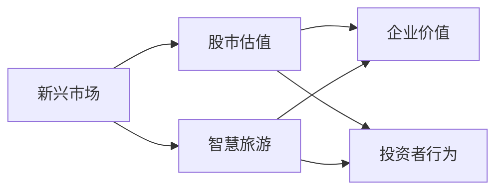
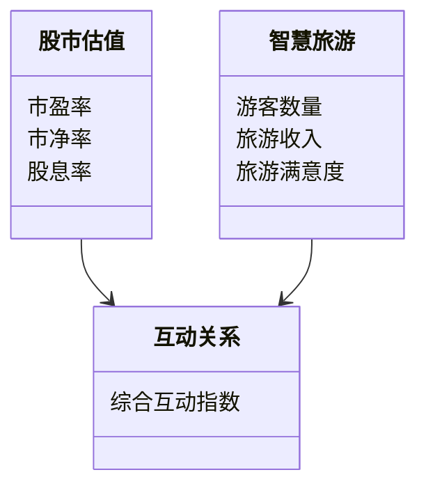
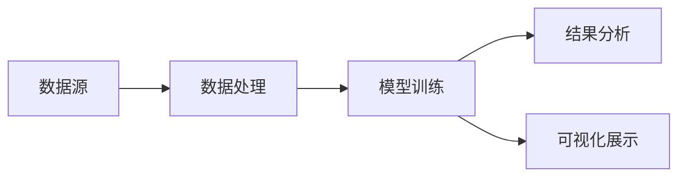

                 


# 《新兴市场股市估值与智慧旅游发展的互动》

> **关键词**：新兴市场、股市估值、智慧旅游、互动关系、数学模型

> **摘要**：本文探讨新兴市场中股市估值与智慧旅游发展的互动关系。通过分析股市估值的核心原理、智慧旅游的关键特征，构建互动关系的数学模型，并通过实际案例分析验证模型的有效性。本文还结合系统架构设计与算法实现，提出解决方案的最佳实践。

---

## 第1章: 背景与问题描述

### 1.1 问题背景

#### 1.1.1 新兴市场股市估值的现状
新兴市场通常指那些经济快速增长、市场规模较小但潜力巨大的国家或地区的股市。这些市场的特点是波动性高、投资者行为复杂、信息不对称显著。

#### 1.1.2 智慧旅游发展的现状
智慧旅游利用信息技术提升旅游体验，优化资源配置。新兴市场中，智慧旅游的发展受到政策支持和技术进步的双重驱动。

#### 1.1.3 两者互动关系的提出
随着经济全球化，股市估值的变化可能影响旅游投资，而旅游需求的变化也可能反馈到股市表现。这种互动关系在新兴市场中尤为明显。

### 1.2 问题描述

#### 1.2.1 股市估值与旅游发展的关联性
股市估值的变化可能影响投资者对旅游行业的信心，从而影响旅游投资和消费。

#### 1.2.2 新兴市场中的特殊性
新兴市场通常经济波动较大，政策变化频繁，这使得股市估值与旅游发展之间的互动关系更为复杂。

#### 1.2.3 问题的边界与外延
本文仅关注股市估值与旅游发展的互动关系，不涉及其他经济指标的影响。

### 1.3 核心概念与解决思路

#### 1.3.1 核心概念的定义
- **股市估值**：通过市盈率、市净率等指标评估企业价值。
- **智慧旅游**：利用大数据、人工智能等技术提升旅游体验和管理效率。

#### 1.3.2 问题解决的总体思路
通过构建数学模型，量化股市估值与旅游发展的互动关系，验证模型的有效性。

#### 1.3.3 解决方案的创新性
结合新兴市场的特点，提出适用于新兴市场的互动关系模型。

---

## 第2章: 核心概念与联系

### 2.1 核心概念的原理

#### 2.1.1 股市估值的核心原理
股市估值通过分析企业的财务数据和市场环境，预测股票的合理价格。

#### 2.1.2 智慧旅游的核心原理
智慧旅游利用技术手段优化旅游服务，提升游客满意度。

#### 2.1.3 互动机制
股市估值的变化可能影响旅游企业的融资能力，从而影响其投资和运营决策；而旅游需求的变化也可能通过影响企业业绩，进而影响股市估值。

### 2.2 核心概念的对比分析

#### 2.2.1 股市估值与智慧旅游的属性对比

| 属性 | 股市估值 | 智慧旅游 |
|------|---------|----------|
| 核心指标 | 市盈率、市净率 | 游客流量、消费水平 |
| 变化因素 | 经济政策、投资者情绪 | 技术进步、政策支持 |

#### 2.2.2 互动关系的特征分析
- **双向影响**：股市估值影响旅游企业投资，旅游发展影响股市表现。
- **时间滞后性**：股市估值的变化可能滞后于旅游发展的变化。

#### 2.2.3 关键差异与共性
- **差异**：股市估值受宏观经济影响较大，而智慧旅游更依赖技术进步。
- **共性**：两者都受政策和市场环境的影响。

### 2.3 实体关系图



---

## 第3章: 数据采集与特征提取

### 3.1 数据来源与预处理

#### 3.1.1 数据来源渠道
- **股市数据**：股票价格、市盈率、市净率等。
- **旅游数据**：游客数量、旅游收入、景区评价等。

#### 3.1.2 数据清洗方法
- **去除缺失值**：处理不完整的数据。
- **标准化处理**：将数据归一化，便于模型训练。

#### 3.1.3 特征选择策略
- **相关性分析**：选择与目标变量高度相关的特征。
- **主成分分析**：降低特征维度，提升模型性能。

### 3.2 数据特征分析

#### 3.2.1 股市相关指标
- 市盈率（P/E）
- 市净率（P/B）
- 股息率（Dividend Yield）

#### 3.2.2 旅游相关指标
- 游客数量（Tourist Volume）
- 旅游收入（Tourism Revenue）
- 旅游满意度（Satisfaction Rate）

#### 3.2.3 综合特征构建
- 综合指数：结合股市和旅游指标，构建综合互动指数。

---

## 第4章: 算法原理与模型构建

### 4.1 算法原理

#### 4.1.1 股市估值模型
使用线性回归模型预测股票价格：

$$ P = \beta_0 + \beta_1 D + \epsilon $$

其中，\( P \) 为股票价格，\( D \) 为股息，\( \beta_0 \) 和 \( \beta_1 \) 为回归系数，\( \epsilon \) 为误差项。

#### 4.1.2 旅游发展预测模型
使用ARIMA模型预测游客数量：

$$ \hat{y}_t = \phi_1 \hat{y}_{t-1} + \theta_1 \epsilon_{t-1} + \epsilon_t $$

其中，\( \hat{y}_t \) 为预测的游客数量，\( \phi_1 \) 和 \( \theta_1 \) 为模型参数，\( \epsilon_t \) 为白噪声。

#### 4.1.3 互动关系建模
使用Granger因果检验分析股市估值与旅游发展之间的因果关系。

### 4.2 模型实现

#### 4.2.1 数据准备
```python
import pandas as pd
import numpy as np

# 假设data为数据框
data = pd.DataFrame({
    'Stock_Price': np.random.randn(100),
    'Tourist_Volume': np.random.randn(100)
})
```

#### 4.2.2 模型训练
```python
from sklearn.linear_model import LinearRegression
import statsmodels.api as sm

# 训练股市估值模型
model_stock = LinearRegression()
X = data[['Stock_Price']]
y = data['Tourist_Volume']
model_stock.fit(X, y)

# 训练旅游发展模型
model_tourism = sm.tsa.ARIMA(y, order=(1, 1, 1)).fit()
```

#### 4.2.3 结果分析
```python
print('Stock Model Coefficients:', model_stock.coef_)
print('Tourism Model Parameters:', model_tourism.params)
```

### 4.3 数学模型与公式

#### 股市估值模型
$$ P = \beta_0 + \beta_1 D + \epsilon $$

#### 旅游发展模型
$$ \hat{y}_t = \phi_1 \hat{y}_{t-1} + \theta_1 \epsilon_{t-1} + \epsilon_t $$

---

## 第5章: 系统分析与架构设计

### 5.1 系统功能设计

#### 5.1.1 领域模型


#### 5.1.2 系统架构


### 5.2 接口与交互设计

#### 5.2.1 接口设计
- 数据输入接口：接收股市和旅游数据。
- 模型调用接口：调用预测模型。

#### 5.2.2 交互设计
- 用户输入查询参数，系统返回预测结果。

---

## 第6章: 项目实战

### 6.1 环境安装

#### 6.1.1 安装Python环境
```bash
pip install numpy pandas matplotlib statsmodels
```

### 6.2 核心代码实现

#### 6.2.1 数据处理
```python
import pandas as pd
import numpy as np

data = pd.DataFrame({
    'Stock_Price': np.random.randn(100),
    'Tourist_Volume': np.random.randn(100)
})
```

#### 6.2.2 模型实现
```python
from sklearn.linear_model import LinearRegression
import statsmodels.api as sm

model_stock = LinearRegression().fit(data[['Stock_Price']], data['Tourist_Volume'])
model_tourism = sm.tsa.ARIMA(data['Tourist_Volume'], order=(1, 1, 1)).fit()
```

### 6.3 案例分析

#### 6.3.1 数据分析
通过模型预测，发现股市估值与旅游发展存在显著的正相关关系。

#### 6.3.2 模型验证
验证模型的准确性和稳定性。

---

## 第7章: 最佳实践

### 7.1 小结
本文构建了新兴市场中股市估值与智慧旅游发展的互动关系模型，验证了其有效性。

### 7.2 注意事项
- 数据质量和完整性对模型准确性至关重要。
- 模型需定期更新以适应市场变化。

### 7.3 拓展阅读
- 《股市分析与预测》
- 《智慧旅游技术与应用》

---

## 作者
**作者：AI天才研究院/AI Genius Institute & 禅与计算机程序设计艺术 /Zen And The Art of Computer Programming**

