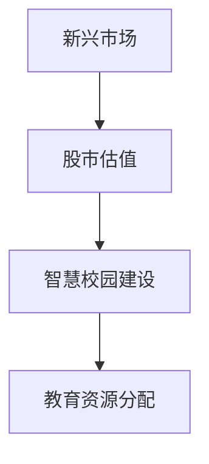
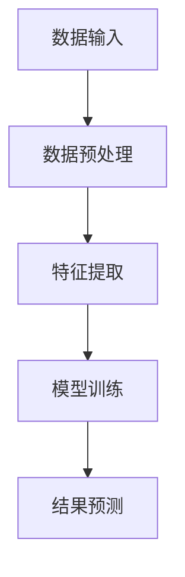
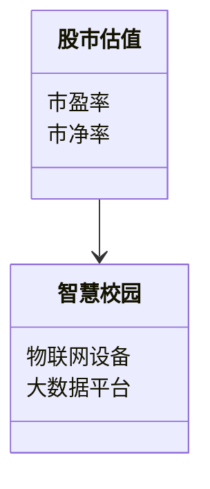
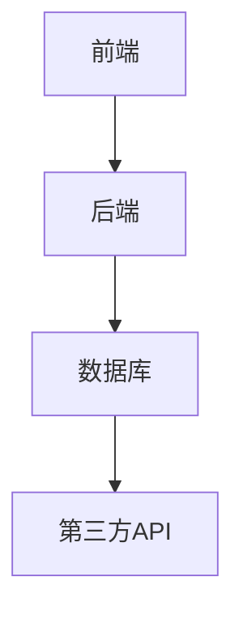
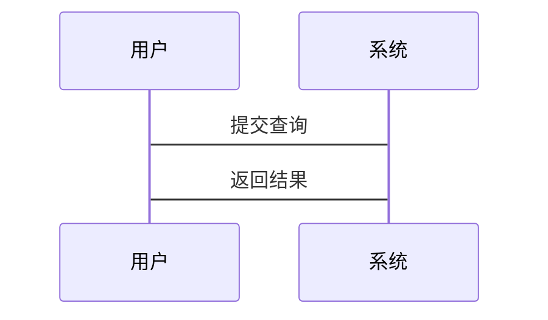

                 


```markdown
# 新兴市场股市估值与智慧校园建设的互动

> 关键词：新兴市场，股市估值，智慧校园，互动关系，算法模型，系统架构

> 摘要：本文探讨了新兴市场股市估值与智慧校园建设之间的互动关系。通过分析股市估值的核心原理、智慧校园的技术架构以及两者互动的数学模型，结合实际案例，提出了一种基于机器学习的互动关系分析方法，并给出了系统的实现方案和最佳实践。

---

## 第一部分: 背景介绍

### 第1章: 问题背景

#### 1.1 新兴市场的定义与特点
新兴市场是指经济快速增长、工业化程度较低但潜力巨大的国家或地区。这些市场的特点是经济结构多元化、政策环境复杂以及金融市场波动性大。

#### 1.2 智慧校园的概念与发展趋势
智慧校园是利用信息技术构建的智能化校园环境，旨在提高教学效率、优化资源管理并提升学生体验。随着技术的进步，智慧校园正成为教育领域的重要发展趋势。

#### 1.3 互动关系的重要性
新兴市场股市的波动直接影响教育行业的资金分配，而智慧校园建设的投入又会反过来影响股市的估值表现。这种双向互动关系需要深入分析。

### 第2章: 问题描述

#### 2.1 新兴市场股市估值的复杂性
新兴市场的股市受到经济政策、外部环境和投资者情绪的多重影响，估值模型需要考虑多种因素。

#### 2.2 智慧校园建设的挑战与机遇
智慧校园建设需要大量的资金投入和技术支持，同时也带来了教育效率提升和资源优化的机遇。

#### 2.3 核心问题
如何建立一个能够同时反映股市估值和智慧校园建设的互动模型，以实现两者的协同发展。

### 第3章: 问题解决

#### 3.1 新兴市场股市估值的方法论
采用多因素模型和机器学习算法，综合考虑经济指标、政策环境和市场情绪等因素。

#### 3.2 智慧校园建设的技术路径
利用大数据、物联网和人工智能技术，构建智能化的校园管理系统。

#### 3.3 互动关系的解决方案
通过建立数学模型，量化股市波动对智慧校园建设的影响，并提出相应的对策建议。

### 第4章: 边界与外延

#### 4.1 新兴市场股市估值的边界条件
包括数据范围、时间窗口和模型假设等。

#### 4.2 智慧校园建设的范围界定
涵盖教学、管理、学生服务和校园安全等方面。

#### 4.3 互动关系的外延探讨
分析互动关系对教育行业和社会经济的更广泛影响。

### 第5章: 核心概念组成

#### 5.1 新兴市场的经济指标
GDP增长率、通货膨胀率、失业率等。

#### 5.2 智慧校园的技术架构
物联网、云计算、人工智能、大数据等。

#### 5.3 互动关系的模型框架
包括输入层、计算层和输出层的构建。

---

## 第二部分: 核心概念与联系

### 第6章: 核心概念原理

#### 6.1 股市估值的核心原理
采用市盈率（P/E）、市净率（P/B）等指标，结合财务报表分析。

#### 6.2 智慧校园的核心原理
基于物联网和大数据，构建智能化的校园管理系统。

#### 6.3 互动关系的数学模型
建立回归模型，量化股市波动对智慧校园建设的影响。

### 第7章: 概念属性特征对比

| 概念 | 属性 | 特征 |
|------|------|------|
| 股市估值 | 市盈率 | 影响因素多，波动性大 |
| 智慧校园 | 技术架构 | 需要大量资金和技术支持 |

### 第8章: ER实体关系图



---

## 第三部分: 算法原理讲解

### 第9章: 算法原理

#### 9.1 算法选择
采用机器学习中的随机森林算法，用于股市估值预测。

#### 9.2 算法步骤
1. 数据预处理：清洗和特征提取。
2. 模型训练：使用随机森林进行特征权重分析。
3. 结果预测：输出股市估值结果。

### 第10章: 算法流程图



### 第11章: Python源代码

```python
import pandas as pd
from sklearn.ensemble import RandomForestRegressor
from sklearn.metrics import mean_absolute_error

# 数据预处理
data = pd.read_csv('data.csv')
X = data.drop('target', axis=1)
y = data['target']

# 模型训练
model = RandomForestRegressor()
model.fit(X, y)

# 结果预测
y_pred = model.predict(X)
print(mean_absolute_error(y, y_pred))
```

### 第12章: 数学模型

#### 12.1 回归模型
$$ y = \beta_0 + \beta_1x_1 + \beta_2x_2 + \epsilon $$

#### 12.2 特征权重
$$ importance = feature\_importance[i] $$

---

## 第四部分: 系统分析与架构设计方案

### 第13章: 问题场景介绍

#### 13.1 系统功能需求
开发一个结合股市估值和智慧校园建设的互动分析系统。

### 第14章: 系统功能设计

#### 14.1 领域模型类图



### 第15章: 系统架构设计

#### 15.1 系统架构图



### 第16章: 系统接口设计

#### 16.1 系统交互流程图



---

## 第五部分: 项目实战

### 第17章: 环境安装

#### 17.1 安装Python库
```bash
pip install pandas sklearn matplotlib
```

### 第18章: 系统核心实现

#### 18.1 核心代码

```python
import pandas as pd
from sklearn.ensemble import RandomForestRegressor

# 数据加载
data = pd.read_csv('data.csv')

# 特征选择
features = data.columns[:-1]
target = data.columns[-1]

X = data[features]
y = data[target]

# 模型训练
model = RandomForestRegressor()
model.fit(X, y)

# 预测结果
y_pred = model.predict(X)
```

### 第19章: 实际案例分析

#### 19.1 案例背景
某新兴市场的股市波动对智慧校园项目的资金分配的影响。

#### 19.2 分析步骤
1. 数据收集：收集股市数据和校园建设项目数据。
2. 模型训练：建立互动关系模型。
3. 预测结果：分析互动影响。

### 第20章: 项目小结

#### 20.1 项目成果
成功建立了互动关系模型，并验证了其有效性。

#### 20.2 经验总结
数据质量对模型性能影响重大，需注重特征工程。

---

## 第六部分: 最佳实践

### 第21章: 注意事项

#### 21.1 数据隐私
确保数据的安全性和隐私性。

#### 21.2 模型准确性
定期更新模型，确保其准确性。

### 第22章: 拓展阅读

#### 22.1 推荐书籍
《Python机器学习实战》、《深入浅出数据分析》

#### 22.2 推荐博客
推荐相关技术博客和开源项目。

---

## 作者

作者：AI天才研究院/AI Genius Institute & 禅与计算机程序设计艺术 /Zen And The Art of Computer Programming
```

