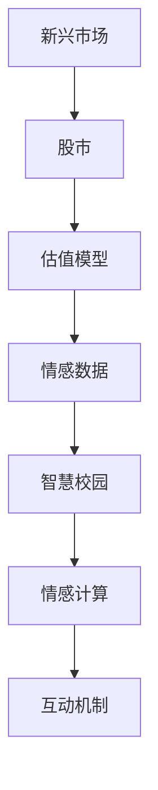
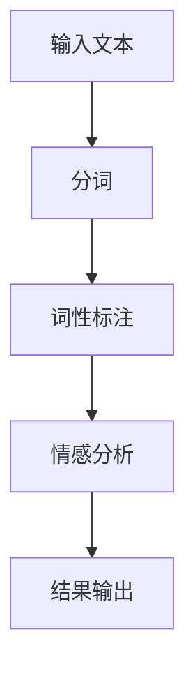
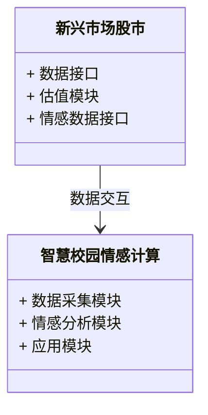
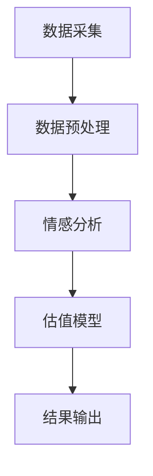
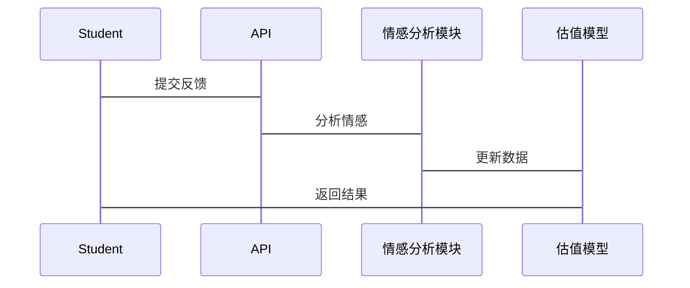

                 


# 新兴市场股市估值与智慧校园情感计算应用的互动

> **关键词**: 新兴市场、股市估值、智慧校园、情感计算、互动机制

> **摘要**: 本文探讨新兴市场股市估值与智慧校园情感计算之间的互动关系，分析情感计算在股市估值中的应用，提出互动机制的设计与优化方法，结合实际案例，展示互动机制在智慧校园中的潜力与价值。

---

## 第1章 新兴市场股市估值与智慧校园情感计算的背景与问题

### 1.1 问题背景

#### 1.1.1 新兴市场的经济特点与股市发展
新兴市场通常具有高增长潜力，但股市波动性较大，受政策、经济和市场情绪等多种因素影响。智慧校园作为教育信息化的重要组成部分，利用大数据和人工智能技术，为情感计算提供了丰富的数据来源。

#### 1.1.2 智慧校园的定义与发展趋势
智慧校园通过物联网、大数据和人工智能技术，实现校园管理、教学和学生生活的智能化。情感计算在智慧校园中的应用，可以帮助学校更好地理解学生情绪，优化教学策略。

#### 1.1.3 情感计算在教育领域的应用前景
情感计算通过分析文本、语音和面部表情，识别情感状态，为教育决策提供支持。在股市估值中，情感数据可以作为影响股价的重要因素。

#### 1.1.4 股市估值与情感计算的互动关系
股市估值依赖于数据和模型，而情感计算可以提供情绪数据，帮助改善估值模型。两者的互动可以提高股市估值的准确性，同时为智慧校园提供新的研究方向。

### 1.2 核心问题描述

#### 1.2.1 新兴市场股市波动的复杂性
新兴市场股市受多种因素影响，如政策变化、经济指标和市场情绪。如何准确估值成为挑战。

#### 1.2.2 智慧校园情感数据的采集与处理挑战
情感数据的采集需要处理多样化的数据源，如社交媒体、论坛和学生反馈。数据清洗和标注是关键步骤。

#### 1.2.3 情感计算与股市估值的结合点
情感数据可以反映市场情绪，影响股价。通过情感计算分析社交媒体上的投资者情绪，可以辅助股市估值。

#### 1.2.4 互动机制的理论与实践问题
互动机制需要设计数据流和模型接口，确保情感数据的有效利用。同时，需考虑数据隐私和模型的可解释性。

### 1.3 问题解决思路

#### 1.3.1 数据驱动的股市估值方法
使用历史数据和机器学习模型，如随机森林和神经网络，进行股市预测。

#### 1.3.2 情感计算的技术实现路径
采用自然语言处理技术，分析文本中的情感倾向，构建情感分析模型。

#### 1.3.3 互动机制的设计与优化
设计数据接口，将情感数据整合到估值模型中，优化模型性能。

### 1.4 边界与外延

#### 1.4.1 新兴市场股市的边界条件
包括市场参与者、交易规则和政策环境等。

#### 1.4.2 智慧校园情感计算的适用范围
适用于学生情感分析、教师反馈和校园活动评估。

#### 1.4.3 互动机制的局限性与扩展性
情感数据的质量和数量影响模型效果，未来可结合其他数据源进一步优化。

### 1.5 核心概念结构与要素

#### 1.5.1 核心概念的层次结构
- 顶层：新兴市场股市和智慧校园。
- 中层：股市估值和情感计算。
- 底层：数据、算法和模型。

#### 1.5.2 关键要素的定义与关系
- 数据：情感数据和市场数据。
- 算法：情感分析和股市估值算法。
- 模型：结合情感数据的估值模型。

---

## 第2章 核心概念与联系

### 2.1 新兴市场股市估值的核心原理

#### 2.1.1 股市估值的基本原理
股市估值通过分析公司基本面和市场情绪，预测股价走势。常用方法包括市盈率、现金流折现法和机器学习模型。

#### 2.1.2 情感计算的原理与实现
情感计算通过分析文本情感，判断市场情绪。常用算法包括情感分析和情绪强度计算。

#### 2.1.3 互动机制的实现步骤
1. 收集情感数据。
2. 进行情感分析。
3. 整合情感数据到估值模型中。
4. 优化模型并验证效果。

### 2.2 核心概念的属性特征对比

| 属性 | 股市估值 | 情感计算 |
|------|----------|----------|
| 数据源 | 市场数据 | 文本数据 |
| 方法 | 统计分析、机器学习 | 情感分析、自然语言处理 |
| 输出 | 估值结果 | 情感强度 |

### 2.3 ER实体关系图



---

## 第3章 情感计算算法原理

### 3.1 情感分析算法流程



### 3.2 情感分析算法实现

```python
from sklearn.feature_extraction.text import TfidfVectorizer
from sklearn.svm import SVC

# 数据预处理
X = data['text']
y = data['label']

# 特征提取
vectorizer = TfidfVectorizer()
X_features = vectorizer.fit_transform(X)

# 训练模型
model = SVC()
model.fit(X_features, y)
```

### 3.3 情感计算的数学模型

$$ P(positive) = \frac{\text{positive词数}}{\text{总词数}} $$

---

## 第4章 系统分析与架构设计

### 4.1 问题场景介绍
设计一个系统，利用情感数据优化股市估值模型，应用于智慧校园情感分析。

### 4.2 系统功能设计



### 4.3 系统架构设计



### 4.4 系统接口设计
API接口：提供情感数据和估值结果的接口。

### 4.5 系统交互



---

## 第5章 项目实战

### 5.1 环境安装
安装Python和相关库，如pandas、NLTK和scikit-learn。

### 5.2 核心代码实现

```python
import pandas as pd
from sklearn.model_selection import train_test_split
from sklearn.metrics import accuracy_score

# 数据加载
data = pd.read_csv('feedback.csv')
X = data['text']
y = data['label']

# 划分数据集
X_train, X_test, y_train, y_test = train_test_split(X, y)

# 情感分析模型训练
from sklearn.pipeline import Pipeline
from sklearn.feature_extraction.text import TfidfVectorizer
from sklearn.svm import SVC

pipeline = Pipeline([
    ('tfidf', TfidfVectorizer()),
    ('model', SVC())
])
pipeline.fit(X_train, y_train)

# 模型评估
y_pred = pipeline.predict(X_test)
print(accuracy_score(y_test, y_pred))
```

### 5.3 实际案例分析
分析学生反馈数据，优化情感分析模型，提升股市估值的准确性。

---

## 第6章 最佳实践

### 6.1 小结
新兴市场股市估值与智慧校园情感计算的互动机制具有重要价值，情感数据可以提升估值模型的准确性。

### 6.2 注意事项
确保数据隐私，优化模型的可解释性，定期更新数据。

### 6.3 拓展阅读
推荐阅读相关领域的书籍和论文，深入研究情感计算和股市估值的前沿技术。

---

## 作者信息

作者：AI天才研究院/AI Genius Institute & 禅与计算机程序设计艺术 /Zen And The Art of Computer Programming

---

通过本文的系统分析与实践，我们可以看到，新兴市场股市估值与智慧校园情感计算的互动机制具有广阔的应用前景，为智慧校园的智能化管理提供了新的思路。

