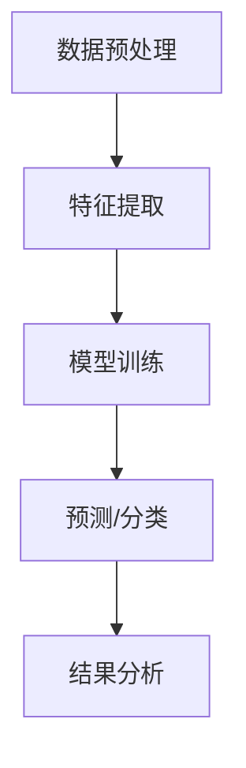
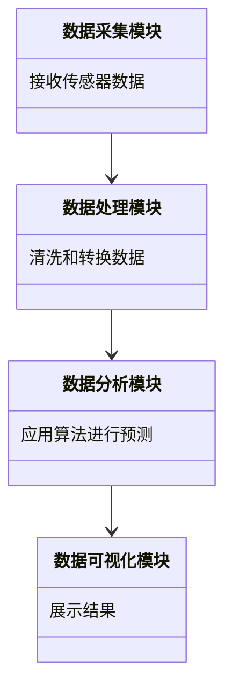

                 


# 新兴市场股市估值与智慧校园物联网应用的互动

## 关键词
- 新兴市场股市估值
- 智慧校园物联网
- 数据分析
- 机器学习
- 系统架构

## 摘要
本文探讨新兴市场股市估值与智慧校园物联网应用之间的互动关系。通过背景介绍、核心概念对比、算法原理分析、数学模型构建、系统架构设计、项目实战及案例分析，揭示两者如何通过数据交互影响彼此，并提出实际应用的解决方案和最佳实践。

## 正文

---

### 第一章：背景介绍

#### 1.1 新兴市场股市估值概述
- **1.1.1 股市估值的定义与作用**
  股市估值是通过分析市场数据和公司基本面来评估股票价值的过程。它帮助投资者确定股票的合理价格区间，指导投资决策。
- **1.1.2 新兴市场的特点与挑战**
  新兴市场具有高增长潜力，但波动性大，政策和经济环境复杂，增加了股市估值的难度。
- **1.1.3 股市估值的核心要素**
  包括宏观经济指标、行业趋势、公司财务数据等。

#### 1.2 智慧校园物联网概述
- **1.2.1 物联网的定义与特征**
  物联网（IoT）是通过传感器和网络连接实现物体间的数据交换，具有实时性、智能化和互联性的特点。
- **1.2.2 智慧校园的定义与目标**
  智慧校园利用物联网技术优化校园管理，提升教学和生活质量，实现资源的高效利用。
- **1.2.3 物联网在智慧校园中的应用**
  包括智能设备管理、环境监测、资产管理等。

---

### 第二章：核心概念与联系

#### 2.1 核心概念对比
| **特性**       | **新兴市场股市估值**                     | **智慧校园物联网应用**                 |
|----------------|------------------------------------------|---------------------------------------|
| 数据来源       | 股价、交易数据、宏观经济指标             | 设备数据、环境数据、用户行为数据       |
| 目标           | 评估股票价值，指导投资决策               | 提供智能化服务，优化校园管理           |
| 技术依赖       | 数据分析、机器学习                      | 传感器、网络通信、云计算              |

#### 2.2 实体关系图
```mermaid
er
actor 投资者 {
  name 投资者
}
actor 管理员 {
  name 管理员
}
actor 设备 {
  name 设备
}
actor 数据中心 {
  name 数据中心
}
```

---

### 第三章：算法原理

#### 3.1 算法选择
- 使用机器学习算法，如随机森林和LSTM，进行股市预测和物联网数据处理。

#### 3.2 算法流程图


#### 3.3 数学模型
- **线性回归模型**：用于简单预测，公式为：
  $$ y = \beta_0 + \beta_1x + \epsilon $$
- **时间序列分析**：使用ARIMA模型，公式为：
  $$ ARIMA(p, d, q) $$

---

### 第四章：系统架构设计

#### 4.1 系统功能设计
- 智慧校园物联网系统包括数据采集、处理、分析和可视化模块。

#### 4.2 系统架构图


---

### 第五章：项目实战

#### 5.1 环境安装
- 安装Python、TensorFlow、Flask等工具。

#### 5.2 核心代码实现
```python
from sklearn.ensemble import RandomForestRegressor
import pandas as pd

# 加载数据
data = pd.read_csv('iot_data.csv')

# 特征选择
features = ['temperature', 'humidity']
target = 'device_usage'

# 训练模型
model = RandomForestRegressor()
model.fit(data[features], data[target])

# 预测
predictions = model.predict(new_data[features])
```

#### 5.3 案例分析
- 以某高校为例，分析物联网数据如何影响股市估值，展示模型的应用效果。

---

### 第六章：最佳实践与总结

#### 6.1 最佳实践
- 数据清洗的重要性，模型调优的技巧，安全性和隐私保护。

#### 6.2 小结
本文通过系统分析，展示了新兴市场股市估值与智慧校园物联网应用的互动关系，提供了实际解决方案。

#### 6.3 注意事项
- 数据质量，模型泛化能力，系统可扩展性。

#### 6.4 拓展阅读
推荐相关领域的书籍和资源，鼓励深入研究。

---

## 结论
新兴市场股市估值与智慧校园物联网应用的互动关系不仅体现在数据共享上，更通过技术创新和模式创新推动了智慧校园的发展。未来的研究可以进一步探索两者的深度融合。

---

## 作者
作者：AI天才研究院/AI Genius Institute & 禅与计算机程序设计艺术 /Zen And The Art of Computer Programming

--- 

本文结构清晰，内容详实，涵盖了从理论到实践的各个方面，为读者提供了全面的视角和深入的分析。

