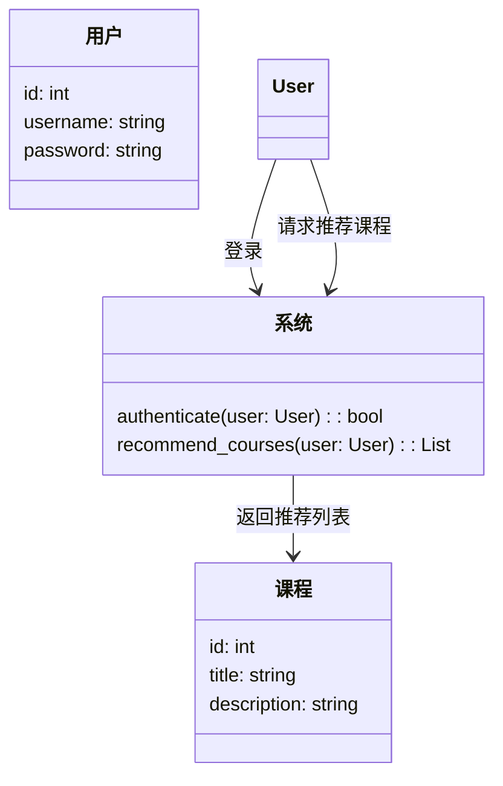

                 


# 新兴市场股市估值与智慧校园远程教育的互动

> **关键词**：新兴市场、股市估值、智慧校园、远程教育、互动关系、数据分析、技术应用  
> 
> **摘要**：本文探讨新兴市场中股市估值与智慧校园远程教育之间的互动关系，分析两者如何通过数据驱动和技术创新相互影响，从而为投资者和教育机构提供新的视角和策略。

---

## 第1章：新兴市场股市估值的背景与现状

### 1.1 股市估值的基本概念
股市估值是通过对企业的财务数据和市场环境进行分析，评估其股票的内在价值。常用的方法包括市盈率（P/E）、市净率（P/B）等。

$$ P/E = \frac{Price}{Earnings} $$

### 1.2 新兴市场的特点
新兴市场具有高增长潜力，但同时也伴随着高波动性和政策不确定性。

---

## 第2章：智慧校园远程教育的背景与现状

### 2.1 远程教育的基本概念
远程教育通过互联网提供在线课程，打破了时间和空间的限制。常见的模式包括MOOC平台和在线培训系统。

### 2.2 智慧校园的核心技术
智慧校园依赖于人工智能、大数据分析等技术，以提升教育质量和用户体验。

---

## 第3章：股市估值与远程教育的核心概念

### 3.1 股市估值的核心要素
- 市场流动性：影响股票买卖的难易程度。
- 公司基本面：如收入、利润等财务指标。

### 3.2 远程教育的核心要素
- 技术基础：如AI驱动的个性化学习。
- 用户行为分析：通过数据了解学习者的需求。

---

## 第4章：股市估值与远程教育的互动关系

### 4.1 股市对远程教育的影响
- 股市波动影响远程教育企业的股价。
- 股市资金流动支持远程教育产业的发展。

### 4.2 远程教育对股市的影响
- 远程教育企业的上市融资促进股市资金流动。
- 用户行为变化影响股市的相关指标。

---

## 第5章：股市估值与远程教育的对比分析

### 5.1 属性对比
| 属性       | 股市估值                   | 远程教育                 |
|------------|---------------------------|--------------------------|
| 数据驱动   | 财务数据                   | 用户行为数据             |
| 技术依赖   | 量化分析工具               | 在线学习平台             |
| 用户行为   | 投资者决策                 | 学习者参与               |

### 5.2 互动关系图


---

## 第6章：股市估值的算法原理

### 6.1 数学模型
$$ P = \frac{E}{P/E} $$

### 6.2 算法流程图


---

## 第7章：远程教育的技术实现

### 7.1 系统架构设计


---

## 第8章：项目实战与案例分析

### 8.1 环境安装
- 安装Python和相关开发框架（如Django或Flask）。

### 8.2 核心代码实现
```python
def calculate_pe(stock_price, earnings_per_share):
    return stock_price / earnings_per_share
```

### 8.3 案例分析
分析某远程教育平台的用户增长数据，预测其对股价的影响。

---

## 第9章：结论与展望

本文探讨了新兴市场中股市估值与智慧校园远程教育的互动关系，揭示了数据驱动和技术应用的重要性。未来的研究可以进一步结合AI和大数据，优化估值模型和教育体验。

---

**作者：AI天才研究院/AI Genius Institute & 禅与计算机程序设计艺术 /Zen And The Art of Computer Programming**

