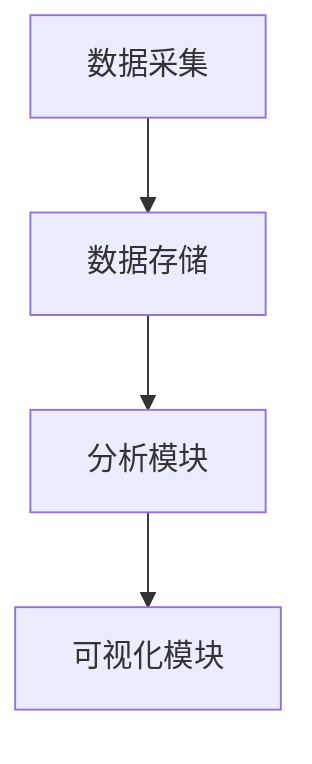
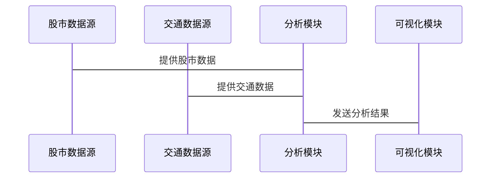

                 


# 新兴市场股市估值与智能交通车路协同技术的互动

## 关键词：新兴市场，股市估值，智能交通，车路协同，技术互动，数据共享，经济影响

## 摘要：本文探讨新兴市场股市估值与智能交通车路协同技术的互动关系，分析两者的技术原理和实际应用。通过时间序列分析和机器学习模型，量化分析股市波动与交通流量之间的联系，设计系统架构，实现数据共享和协同控制，为经济决策和交通管理提供支持。

---

## 第1章：背景介绍

### 1.1 股市估值的基本概念

股市估值是通过对公司财务数据和市场环境的分析，确定股票的合理价格。常用方法包括市盈率、市净率等。新兴市场由于市场波动大、信息不透明，估值更具挑战性。

### 1.2 车路协同技术的定义

车路协同是指通过车辆与道路基础设施之间的通信，实现信息共享和协同控制，提升交通安全和效率。关键技术包括V2X（车辆-一切）通信、边缘计算和人工智能。

---

## 第2章：新兴市场股市估值

### 2.1 传统估值方法

- **市盈率（P/E）**：股价与每股收益的比率，反映市场对公司的盈利预期。
- **市净率（P/B）**：股价与每股净资产的比率，适用于资产密集型行业。

### 2.2 现代估值方法

- **现金流折现模型（DCF）**：预测未来现金流，折现至现值，评估企业价值。
- **机器学习模型**：利用历史数据训练模型，预测股票价格波动。

### 2.3 新兴市场的特殊性

新兴市场信息不对称严重，市场波动大，传统估值方法可能失效，需结合大数据和人工智能进行分析。

---

## 第3章：智能交通车路协同技术

### 3.1 核心技术分析

- **V2X通信**：实现车辆与路侧设施、其他车辆的实时通信，提升交通效率。
- **边缘计算**：在路边单元（RSU）进行实时数据处理，减少延迟。

### 3.2 技术架构

#### 3.2.1 系统组成
- **数据采集层**：传感器、摄像头收集交通数据。
- **通信层**：5G、Wi-Fi等实现数据传输。
- **计算层**：边缘计算节点处理数据，生成控制指令。

#### 3.2.2 通信协议
- **LTE-V2X**：基于4G网络的车路通信技术。
- **5G-V2X**：低延迟、高带宽，支持实时协同控制。

---

## 第4章：互动关系与量化分析

### 4.1 数据共享

股市数据与交通流量数据的共享，可以通过大数据分析发现两者之间的关联。例如，股市波动可能影响交通投资，进而影响交通流量。

### 4.2 技术融合

通过车路协同技术，实时采集交通数据，结合股市数据，进行综合分析，优化交通管理策略。

---

## 第5章：算法原理

### 5.1 时间序列分析

#### 5.1.1 ARIMA模型

ARIMA（自回归积分滑动平均）模型用于预测时间序列数据。模型结构如下：

$$ ARIMA(p, d, q) $$

其中，p为自回归阶数，d为差分阶数，q为滑动平均阶数。

#### 5.1.2 模型训练

步骤如下：
1. 数据预处理：去除趋势和季节性。
2. 参数估计：使用最大似然估计确定模型参数。
3. 模型验证：检查残差是否符合白噪声假设。

---

### 5.2 机器学习模型

#### 5.2.1 神经网络模型

$$ y = f(x) $$

其中，$x$是输入数据，$y$是输出，$f$是神经网络模型。

#### 5.2.2 案例分析

以新兴市场为例，利用LSTM网络预测股票价格波动，同时结合交通流量数据，优化预测模型。

---

## 第6章：系统架构设计

### 6.1 系统功能设计

- **数据采集模块**：实时采集交通数据和股市数据。
- **分析模块**：使用算法模型进行预测和分析。
- **可视化模块**：展示分析结果，辅助决策。

### 6.2 系统架构图



---

## 第7章：项目实战

### 7.1 环境配置

- **开发工具**：Jupyter Notebook、PyCharm
- **数据集**：新兴市场股市数据和交通流量数据

### 7.2 核心代码实现

#### 7.2.1 时间序列分析代码

```python
from statsmodels.tsa.arima_model import ARIMA
import pandas as pd

# 加载数据
data = pd.read_csv('stock_data.csv')

# 训练模型
model = ARIMA(data, order=(5,1,0))
model_fit = model.fit()

# 预测
forecast = model_fit.forecast(steps=10)
```

#### 7.2.2 神经网络模型代码

```python
import tensorflow as tf
from tensorflow.keras import layers

model = tf.keras.Sequential([
    layers.LSTM(50, input_shape=(None, 1)),
    layers.Dense(1)
])

model.compile(optimizer='adam', loss='mean_squared_error')
model.fit(X_train, y_train, epochs=10, batch_size=32)
```

---

## 第8章：总结与展望

### 8.1 成果总结

通过分析，我们发现股市估值与车路协同技术在数据共享和协同控制方面存在互动关系。利用时间序列分析和机器学习模型，可以实现对股市和交通流量的预测和优化。

### 8.2 未来研究方向

- 结合区块链技术，确保数据安全和可信度。
- 研究更多新兴市场案例，验证模型的普适性。

---

## 附录：数学模型与公式

### 时间序列分析模型

$$ ARIMA(p, d, q) $$

### 机器学习模型

$$ y = f(x) $$

---

## 图表

### 核心概念对比表

| 概念       | 特性                     |
|------------|--------------------------|
| 股市估值   | 数据驱动，实时性高       |
| 车路协同   | 技术密集，依赖通信网络   |

### 系统交互图



---

## 作者：AI天才研究院 & 禅与计算机程序设计艺术

