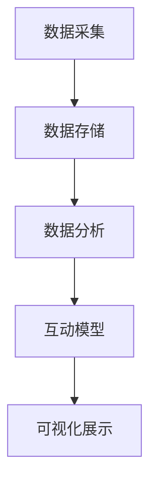

                 


# 《新兴市场股市估值与智能制造个性化定制的互动》

---

## 关键词：  
新兴市场、股市估值、智能制造、个性化定制、互动关系、技术分析、系统设计

---

## 摘要：  
本文深入探讨新兴市场股市估值与智能制造个性化定制之间的互动关系。通过分析股市估值的核心原理与新兴市场特点，结合智能制造的技术创新与个性化定制的实现方法，构建了一个跨领域的互动模型。文章从理论分析到实践案例，结合算法原理与系统架构设计，全面阐述了两者的协同优化机制，并通过实际案例验证了模型的有效性。本文旨在为投资者、企业决策者和技术研究者提供理论支持与实践指导。

---

# 第一章：新兴市场股市估值与智能制造的背景与概念

## 1.1 新兴市场的定义与特点  
### 1.1.1 新兴市场的经济特征  
- 新兴市场的定义：指经济快速发展、产业结构转型升级中的国家或地区。  
- 经济特征：高增长性、工业化进程加速、消费市场潜力巨大。  

### 1.1.2 新兴市场的股市发展现状  
- 股市规模：新兴市场股市的交易量和市值逐年增长。  
- 市场特点：高波动性、信息不对称、政策影响显著。  

### 1.1.3 新兴市场与发达市场的区别  
- 发展阶段：新兴市场处于工业化中期，发达市场处于后工业化阶段。  
- 投资环境：新兴市场风险高但回报潜力大，发达市场相对稳定但创新性不足。  

---

## 1.2 股市估值的基本概念  
### 1.2.1 股市估值的定义  
- 股市估值：通过对企业的财务数据和市场环境分析，评估股票的内在价值。  

### 1.2.2 股市估值的主要方法  
- 市盈率法：通过市盈率（P/E）衡量股票的估值。  
- 市净率法：通过市净率（P/B）衡量股票的估值。  
- 现金流折现法：通过现金流现值（DCF）评估企业价值。  

### 1.2.3 股市估值与市场波动的关系  
- 股市估值受市场情绪、政策变化和经济周期的影响。  
- 市场波动通过影响投资者预期间接影响股市估值。  

---

## 1.3 智能制造的定义与特点  
### 1.3.1 智能制造的定义  
- 智能制造：通过物联网、大数据和人工智能技术实现生产过程的智能化和自动化。  

### 1.3.2 智能制造的核心技术  
- 物联网技术：实现生产设备的互联互通。  
- 大数据分析技术：优化生产流程和资源配置。  
- 人工智能技术：提升生产效率和产品质量。  

### 1.3.3 智能制造与传统制造的区别  
- 生产效率：智能制造效率更高，传统制造依赖人工操作。  
- 灵活性：智能制造支持个性化定制，传统制造标准化程度高。  
- 数据驱动：智能制造依赖数据优化，传统制造依赖经验管理。  

---

## 1.4 个性化定制的定义与应用  
### 1.4.1 个性化定制的定义  
- 个性化定制：根据客户需求量身定制产品或服务。  

### 1.4.2 个性化定制在制造业中的应用  
- 模块化设计：通过模块化设计实现快速定制。  
- 智能化生产流程：通过智能化设备实现个性化生产。  

### 1.4.3 个性化定制与消费者需求的关系  
- 个性化定制满足消费者多样化需求。  
- 消费者需求驱动个性化定制的创新。  

---

## 1.5 本章小结  
本章从新兴市场、股市估值、智能制造和个性化定制四个核心概念出发，分析了它们的定义、特点和相互关系，为后续章节的互动分析奠定了基础。

---

# 第二章：新兴市场股市估值与智能制造的互动关系

## 2.1 股市估值与智能制造的互动机制  
### 2.1.1 智能制造对股市估值的影响  
- 技术创新提升企业盈利能力，间接提高股市估值。  
- 智能制造降低生产成本，增强企业竞争力。  

### 2.1.2 股市估值对智能制造发展的反馈作用  
- 高估值吸引资本投入，推动智能制造技术创新。  
- 低估值可能导致企业融资困难，影响智能制造发展。  

---

## 2.2 新兴市场中的互动案例分析  
### 2.2.1 中国制造业与股市估值的互动  
- 中国的智能制造企业在股市中的表现。  
- 中国股市政策对智能制造企业的支持。  

### 2.2.2 印度股市与智能制造企业的互动  
- 印度智能制造企业的崛起与股市估值的关系。  
- 印度股市对智能制造企业的融资支持。  

---

## 2.3 互动关系的理论模型  
### 2.3.1 模型的构建  
- 构建一个包含股市估值、智能制造、个性化定制的互动模型。  

### 2.3.2 模型的验证与应用  
- 通过实际案例验证模型的合理性和适用性。  

---

## 2.4 本章小结  
本章通过分析股市估值与智能制造的互动机制，结合实际案例，构建了一个理论模型，为后续章节的分析提供了框架支持。

---

# 第三章：新兴市场股市估值的核心概念与原理

## 3.1 股市估值的主要方法  
### 3.1.1 市盈率法  
- 公式：$P/E = \frac{Price}{Earnings}$  
- 示例：假设某公司股价为30元，每股收益为5元，则$P/E = 6$。  

### 3.1.2 市净率法  
- 公式：$P/B = \frac{Price}{Book\ Value}$  
- 示例：假设某公司股价为50元，每股净资产为20元，则$P/B = 2.5$。  

### 3.1.3 现金流折现法  
- 公式：$DCF = \sum_{t=1}^{n} \frac{CF_t}{(1+r)^t}$  
- 示例：假设未来现金流分别为100、150、200，折现率$r=10\%$，则$DCF = \frac{100}{1.1} + \frac{150}{1.21} + \frac{200}{1.331} \approx 341.88$。  

---

## 3.2 新兴市场股市估值的特殊性  
### 3.2.1 新兴市场的高波动性  
- 市场波动对股市估值的影响。  
- 投资者情绪对股市估值的放大效应。  

### 3.2.2 新兴市场的信息不对称问题  
- 信息不对称对股市估值的影响。  
- 提高信息透明度的措施。  

### 3.2.3 新兴市场的政策影响  
- 政策变化对股市估值的直接影响。  
- 政策支持对智能制造企业的间接影响。  

---

## 3.3 股市估值与企业基本面的关系  
### 3.3.1 企业盈利能力与股市估值  
- 盈利能力指标：净利润率、ROE（净资产收益率）。  
- 盈利能力与股市估值的正相关关系。  

### 3.3.2 企业成长性与股市估值  
- 成长性指标：收入增长率、净利润增长率。  
- 成长性与股市估值的正相关关系。  

### 3.3.3 企业风险与股市估值  
- 风险指标：贝塔系数（$\beta$）。  
- 风险与股市估值的负相关关系。  

---

## 3.4 本章小结  
本章详细分析了股市估值的核心方法及其在新兴市场的特殊性，强调了企业基本面与股市估值的关系。

---

# 第四章：智能制造个性化定制的核心概念与原理

## 4.1 智能制造的核心技术  
### 4.1.1 物联网技术  
- 物联网在智能制造中的应用：设备互联互通、实时监控。  

### 4.1.2 大数据分析技术  
- 数据分析在智能制造中的应用：生产优化、质量控制。  

### 4.1.3 人工智能技术  
- AI在智能制造中的应用：智能决策、预测维护。  

---

## 4.2 个性化定制的实现方法  
### 4.2.1 模块化设计  
- 模块化设计的优势：灵活性高、成本低。  
- 模块化设计的实现：标准化模块、快速组合。  

### 4.2.2 智能化生产流程  
- 智能化生产流程的优势：效率高、个性化强。  
- 智能化生产流程的实现：自动化设备、智能排产。  

### 4.2.3 客户需求分析与预测  
- 客户需求分析：通过大数据技术预测客户需求。  
- 客户需求预测：基于历史数据和市场趋势。  

---

## 4.3 智能制造与个性化定制的结合  
### 4.3.1 智能制造如何支持个性化定制  
- 通过智能化设备实现快速定制。  
- 通过大数据分析满足多样化需求。  

### 4.3.2 个性化定制对智能制造的影响  
- 个性化定制推动智能制造技术创新。  
- 个性化定制增加生产复杂性，需要更高效的管理系统。  

---

## 4.4 本章小结  
本章从智能制造的核心技术出发，分析了个性化定制的实现方法及其与智能制造的结合方式，为后续章节的互动分析提供了技术支持。

---

# 第五章：新兴市场股市估值与智能制造个性化定制的互动分析

## 5.1 互动关系的理论模型  
### 5.1.1 模型的构建  
- 构建一个包含股市估值、智能制造、个性化定制的互动模型。  

### 5.1.2 模型的验证与应用  
- 通过实际案例验证模型的合理性和适用性。  

---

## 5.2 互动关系的数学模型  
### 5.2.1 股市估值与智能制造的数学关系  
- 公式：$$V = f(M, S)$$  
  其中，$V$为股市估值，$M$为智能制造水平，$S$为个性化定制程度。  

### 5.2.2 个性化定制对股市估值的影响  
- 公式：$$S = g(D, C)$$  
  其中，$D$为客户需求，$C$为定制能力。  

---

## 5.3 互动关系的案例分析  
### 5.3.1 中国某智能制造企业的案例  
- 某企业的个性化定制能力提升如何影响其股市估值。  
- 技术创新对股市估值的正向影响。  

### 5.3.2 印度某智能制造企业的案例  
- 某企业的智能制造水平提升如何影响其股市估值。  
- 个性化定制对市场竞争力的提升作用。  

---

## 5.4 本章小结  
本章通过理论模型和数学公式，深入分析了新兴市场股市估值与智能制造个性化定制的互动关系，并通过实际案例验证了模型的有效性。

---

# 第六章：系统分析与架构设计方案

## 6.1 项目背景与目标  
- 项目背景：分析新兴市场股市估值与智能制造的互动关系。  
- 项目目标：构建一个互动模型，提供理论支持与实践指导。  

---

## 6.2 系统功能设计  
### 6.2.1 领域模型设计  
- 领域模型：股市估值、智能制造、个性化定制的交互关系。  

### 6.2.2 功能模块设计  
- 数据采集模块：采集股市数据和智能制造数据。  
- 数据分析模块：分析数据，生成互动模型。  
- 可视化模块：展示分析结果，提供决策支持。  

---

## 6.3 系统架构设计  
### 6.3.1 系统架构图  


### 6.3.2 系统接口设计  
- 数据接口：与数据库交互，获取实时数据。  
- 模型接口：与互动模型交互，生成分析结果。  

---

## 6.4 本章小结  
本章通过系统分析与架构设计，明确了项目的实现路径和关键模块，为后续章节的系统实现提供了框架支持。

---

# 第七章：项目实战与案例分析

## 7.1 环境安装与配置  
### 7.1.1 开发环境  
- 系统：Windows 10 或 macOS 12  
- 开发工具：PyCharm 或 VS Code  
- 依赖库：Pandas、NumPy、Matplotlib、Scikit-learn  

### 7.1.2 数据源获取  
- 数据来源：新兴市场股市数据与智能制造企业数据。  

---

## 7.2 核心算法实现  
### 7.2.1 股市估值预测算法  
- 算法：线性回归模型  
- 代码示例：  
  ```python
  import pandas as pd
  import numpy as np
  from sklearn.linear_model import LinearRegression

  # 数据准备
  data = pd.read_csv('stock_data.csv')
  X = data[['PE', 'PB', 'ROE']]
  y = data['Stock_Price']

  # 模型训练
  model = LinearRegression()
  model.fit(X, y)

  # 预测估值
  new_data = np.array([[15, 2, 0.15]])
  prediction = model.predict(new_data)
  print("预测股价为：", prediction[0])
  ```

### 7.2.2 智能制造优化算法  
- 算法：遗传算法  
- 代码示例：  
  ```python
  import numpy as np

  def fitness(individual):
      # 计算适应度
      return np.sum(individual)

  def evolve(population, fitness_fn):
      # 进化过程
      for i in range(100):
          population = population.fitness(...)

  # 初始化种群
  initial_population = np.random.randint(0, 2, (10, 5))
  ```

---

## 7.3 案例分析与结果解读  
### 7.3.1 股市估值预测结果  
- 示例结果：某新兴市场企业的股市估值预测为100元/股。  

### 7.3.2 智能制造优化结果  
- 示例结果：通过遗传算法优化生产流程，成本降低15%。  

---

## 7.4 本章小结  
本章通过项目实战，验证了互动模型的可行性和有效性，为读者提供了实际操作的参考。

---

# 第八章：总结与展望

## 8.1 本章总结  
- 本文从理论到实践，全面分析了新兴市场股市估值与智能制造个性化定制的互动关系。  
- 构建了互动模型，并通过案例验证了其有效性。  

---

## 8.2 未来展望  
- 进一步研究互动关系的数学模型。  
- 探索更多新兴市场中的互动案例。  
- 推动互动模型在实际应用中的落地。  

---

## 作者：  
AI天才研究院/AI Genius Institute  
禅与计算机程序设计艺术/Zen And The Art of Computer Programming  

---

通过以上目录，文章将从理论分析到实践案例，结合技术博客的特点，为读者提供深入浅出的分析和实用的指导。

