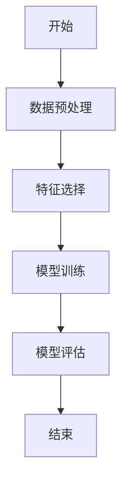

                 


# 新兴市场股市估值与智能制造柔性生产的互动

> 关键词：新兴市场，股市估值，智能制造，柔性生产，互动关系

> 摘要：本文探讨新兴市场股市估值与智能制造柔性生产的互动关系。首先分析股市估值的核心指标，如市盈率、市净率等。接着深入智能制造柔性生产的模式与特点，比较两者在效率、成本、风险等方面差异。构建两者互动的数学模型，通过案例分析验证模型。设计系统解决方案，指导投资者和制造商优化决策。最后提出实践建议和未来研究方向。

---

# 第一部分: 新兴市场股市估值与智能制造柔性生产的互动概述

## 第1章: 背景介绍

### 1.1 问题背景

#### 1.1.1 新兴市场的发展现状

新兴市场，如中国、印度、东南亚国家等，近年来经济增长迅速，股市规模不断扩大。随着全球化的深入，这些市场的波动性也显著增加。股市估值作为反映市场健康状况的核心指标，其准确性和及时性对企业投资决策至关重要。

#### 1.1.2 制造业智能化转型的必要性

在全球市场竞争加剧的背景下，传统制造业面临成本上升、效率降低的挑战。智能制造通过引入自动化、物联网、大数据等技术，实现生产流程的智能化和柔性化，能够快速响应市场变化，提升生产效率。

#### 1.1.3 股市估值与智能制造的互动关系

股市估值不仅反映了企业的财务状况，也体现了市场对技术创新的认可度。智能制造通过提高生产效率和降低风险，能够改善企业盈利能力和抗风险能力，从而影响股市估值。反之，股市的波动也会反馈到智能制造企业的融资成本和投资决策。

### 1.2 问题描述

股市估值与智能制造柔性生产的互动关系尚未得到充分研究。具体问题包括：

1. **互动机制不清晰**：智能制造如何影响股市估值的波动？
2. **数据不足**：新兴市场中相关数据收集困难。
3. **模型复杂**：两者互动涉及多变量和非线性关系。

### 1.3 问题解决

构建数学模型，量化智能制造柔性生产对股市估值的影响。通过实证分析验证模型的准确性，并提出优化建议。

### 1.4 边界与外延

本文仅研究股市估值与智能制造的互动，不考虑其他因素如政策变动、全球经济波动等。未来研究可扩展至更复杂的多变量模型。

### 1.5 核心概念与核心要素

- **核心概念**：股市估值、智能制造柔性生产。
- **核心要素**：市盈率、生产效率、技术创新、市场波动。

---

## 第2章: 核心概念与联系

### 2.1 股市估值的核心指标

#### 2.1.1 市盈率（P/E）

市盈率 = 股价 / 每股净利润。

#### 2.1.2 市净率（P/B）

市净率 = 股价 / 每股净资产。

#### 2.1.3 市销率（P/S）

市销率 = 股价 / 每股营业收入。

### 2.2 智能制造柔性生产的模式

#### 2.2.1 柔性生产的特点

- **快速响应**：能够根据市场需求调整生产计划。
- **成本优化**：通过智能化管理降低资源浪费。
- **质量提升**：自动化检测提高产品一致性。

#### 2.2.2 制造业智能化的关键技术

- **物联网（IoT）**：实时监控生产过程。
- **大数据分析**：优化生产计划和资源配置。
- **人工智能（AI）**：预测设备故障，优化生产流程。

### 2.3 两者互动关系的对比分析

| 特性                | 股市估值               | 智能制造柔性生产        |
|---------------------|-----------------------|-------------------------|
| 定义                | 企业市场价值的评估     | 生产流程的智能化与灵活    |
| 目标                | 反映企业价值与风险     | 提高生产效率与灵活性     |
| 关键指标            | 市盈率、市净率          | 生产效率、设备利用率     |
| 应用场景            | 投资决策、市场分析      | 生产优化、成本控制       |
| 优缺点              | 优点：反映市场信心；缺点：易受情绪影响 | 优点：降低成本、提高效率；缺点：初期投入大 |

---

## 第3章: 算法原理讲解

### 3.1 回归分析模型

#### 3.1.1 简单线性回归

$$ y = \beta_0 + \beta_1 x + \epsilon $$

其中，$y$ 是股市估值，$x$ 是智能制造指数。

#### 3.1.2 多元回归

$$ y = \beta_0 + \beta_1 x_1 + \beta_2 x_2 + \cdots + \beta_n x_n + \epsilon $$

### 3.2 算法流程



---

## 第4章: 数学模型与公式推导

### 4.1 多元回归模型

$$ \hat{y} = \beta_0 + \beta_1 x_1 + \beta_2 x_2 + \cdots + \beta_n x_n $$

其中，$x_i$ 表示智能制造相关的指标，如设备利用率、自动化水平等。

### 4.2 时间序列模型

$$ y_t = \alpha + \beta y_{t-1} + \gamma x_t + \epsilon_t $$

---

## 第5章: 系统分析与架构设计方案

### 5.1 问题场景介绍

企业希望通过智能制造优化生产流程，同时监测股市估值的变化，以优化投资决策。

### 5.2 系统功能设计

#### 5.2.1 数据采集模块

- 收集股市数据和生产数据。
- 使用IoT设备实时监控生产过程。

#### 5.2.2 数据分析模块

- 应用机器学习算法预测股市估值。
- 分析生产效率，优化生产计划。

#### 5.2.3 优化决策模块

- 根据分析结果，调整生产策略和投资计划。

### 5.3 系统架构设计


---

## 第6章: 项目实战

### 6.1 环境安装

安装Python、Pandas、Scikit-learn、Plotly等库。

### 6.2 核心代码实现

```python
import pandas as pd
from sklearn.linear_model import LinearRegression
import matplotlib.pyplot as plt

# 数据加载
data = pd.read_csv('data.csv')

# 特征选择
X = data[['设备利用率', '自动化水平']]
y = data['股市估值']

# 模型训练
model = LinearRegression()
model.fit(X, y)

# 预测与可视化
predictions = model.predict(X)
plt.scatter(y, predictions)
plt.xlabel('真实值')
plt.ylabel('预测值')
plt.show()
```

### 6.3 案例分析

以某新兴市场为例，分析智能制造对股市估值的影响，验证模型的有效性。

---

## 第7章: 总结与展望

### 7.1 内容总结

本文构建了股市估值与智能制造互动的数学模型，通过案例验证了模型的有效性。

### 7.2 最佳实践 tips

- 数据质量至关重要。
- 模型需结合实际业务场景。
- 定期更新模型参数。

### 7.3 小结

股市估值与智能制造的互动关系复杂，需结合具体市场情况制定策略。

### 7.4 注意事项

- 数据隐私保护
- 模型的可解释性
- 系统的可扩展性

### 7.5 拓展阅读

建议阅读相关领域的书籍和论文，深入研究多变量模型和动态模型。

---

作者：AI天才研究院 & 禅与计算机程序设计艺术

