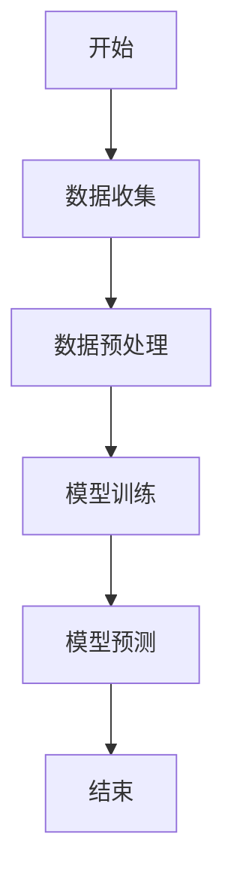
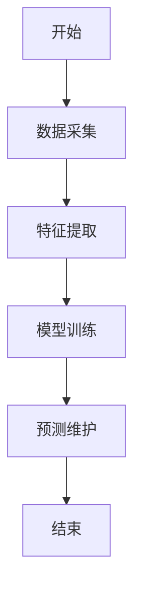
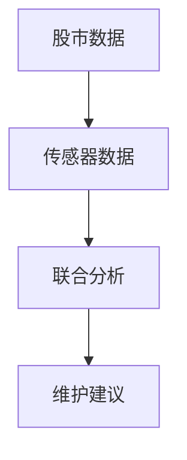
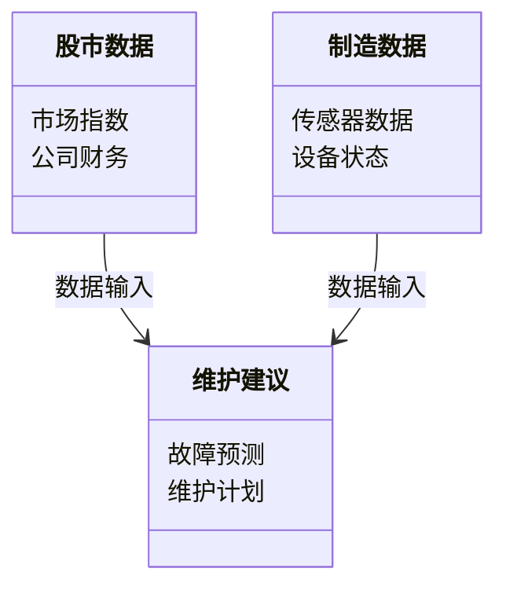
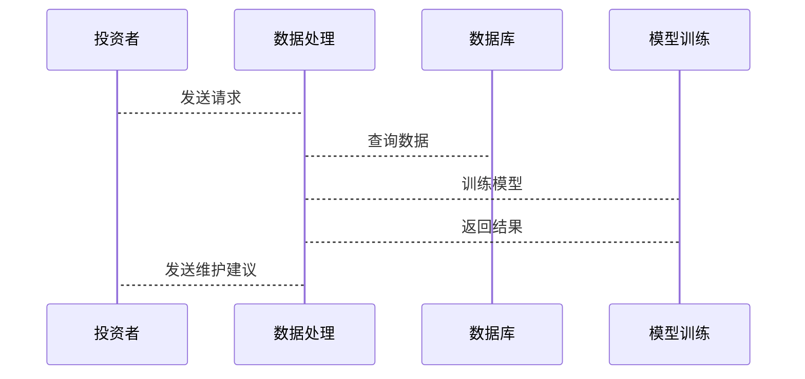

                 


# 新兴市场股市估值与智能制造预测性维护的互动

> 关键词：新兴市场、股市估值、智能制造、预测性维护、互动关系

> 摘要：本文探讨了新兴市场股市估值与智能制造预测性维护之间的互动关系。通过分析股市估值的方法与智能制造预测性维护的技术特点，揭示了两者如何在数据驱动的环境下相互影响，为投资者和制造商提供新的视角和策略。

---

## 第1章 新兴市场股市估值与智能制造预测性维护的背景介绍

### 1.1 背景介绍

#### 1.1.1 新兴市场的定义与特点

新兴市场是指那些经济增长迅速、但尚未完全工业化的国家。这些市场通常具有较高的波动性和不确定性，但也蕴含着巨大的增长潜力。新兴市场的特点包括经济结构转型、政策变化频繁、市场参与者多元化等。

#### 1.1.2 股市估值的基本概念与方法

股市估值是通过对公司财务数据、市场趋势和宏观经济指标的分析，评估公司股票的内在价值。常用的方法包括市盈率、市净率、现金流折现法等。

#### 1.1.3 智能制造与预测性维护的定义与技术特点

智能制造是指利用物联网、大数据、人工智能等技术，优化生产过程的智能化制造模式。预测性维护是通过传感器数据和机器学习算法，预测设备故障并提前进行维护，以减少停机时间。

### 1.2 问题背景与问题描述

#### 1.2.1 新兴市场股市波动的复杂性

新兴市场的股市受多种因素影响，包括政策变化、全球经济波动、投资者情绪等，导致股市波动剧烈，估值难度增加。

#### 1.2.2 智能制造预测性维护的需求与挑战

智能制造中的设备复杂度高，维护成本昂贵。预测性维护可以降低维护成本、提高设备利用率，但需要处理海量传感器数据和复杂的算法模型。

#### 1.2.3 两者互动关系的初步探讨

新兴市场的股市波动可能影响智能制造企业的投资和运营，而智能制造的数据分析能力又可以为股市估值提供新的数据源和方法。

### 1.3 问题解决与边界外延

#### 1.3.1 新兴市场股市估值的核心问题

如何在复杂环境下准确评估股市价值，降低投资风险。

#### 1.3.2 智能制造预测性维护的关键技术

如何利用大数据和人工智能优化预测模型，提高维护的准确性。

#### 1.3.3 两者互动的边界与外延

确定两者互动的范围和影响程度，明确数据共享和分析的边界。

### 1.4 核心概念与结构

#### 1.4.1 核心概念的定义与属性对比

- 股市估值：基于财务数据和市场指标，评估股票价值。
- 预测性维护：基于传感器数据和算法，预测设备故障。

#### 1.4.2 核心概念的ER实体关系图

```mermaid
erDiagram
    customer [投资者] {
        id : int
        name : string
        portfolio : string
    }
    company [企业] {
        id : int
        name : string
        industry : string
    }
    stock_data [股票数据] {
        id : int
        price : float
        date : date
    }
    sensor_data [传感器数据] {
        id : int
        value : float
        timestamp : datetime
    }
    customer --|> company : 投资
    company --> stock_data : 影响
    company --> sensor_data : 数据来源
```

---

## 第2章 核心概念与联系

### 2.1 核心概念的原理

#### 2.1.1 股市估值的核心原理

股市估值通过分析公司基本面和市场情绪，评估股票的合理价格。

#### 2.1.2 预测性维护的核心原理

利用传感器数据和机器学习模型，预测设备故障，优化维护计划。

### 2.2 核心概念的属性特征对比

| 特性       | 股市估值                     | 预测性维护                   |
|------------|------------------------------|------------------------------|
| 数据类型   | 财务数据、市场指标           | 传感器数据                   |
| 分析目标   | 股票价值                    | 设备故障预测                 |
| 工具方法   | 财务模型、统计分析           | 机器学习、时间序列分析       |
| 输出结果   | 估值、评级                  | 维护建议、故障预测           |

### 2.3 ER实体关系图

```mermaid
erDiagram
    stock_market [股市] {
        id : int
        market_index : string
        country : string
    }
    manufacturing [制造业] {
        id : int
        industry : string
        company_id : int
    }
    stock_market --> company : 投资关系
    company --> sensor_data : 数据来源
```

---

## 第3章 算法原理讲解

### 3.1 股市估值算法

#### 3.1.1 股市估值的机器学习模型

使用LSTM进行时间序列预测，代码示例如下：

```python
import numpy as np
from sklearn.preprocessing import MinMaxScaler
from keras.models import Sequential
from keras.layers import LSTM, Dense

# 数据预处理
data = stock_prices
scaler = MinMaxScaler()
data_scaled = scaler.fit_transform(data)

# 模型构建
model = Sequential()
model.add(LSTM(50, input_shape=(timesteps, 1)))
model.add(Dense(1))
model.compile(optimizer='adam', loss='mean_squared_error')

# 训练模型
model.fit(X_train, y_train, epochs=100, batch_size=32)
```

#### 3.1.2 算法流程图



### 3.2 预测性维护算法

#### 3.2.1 预测性维护的机器学习模型

使用XGBoost进行分类预测，代码示例如下：

```python
import xgboost as xgb

# 数据准备
X = sensor_data
y = labels

# 模型训练
model = xgb.XGBClassifier()
model.fit(X, y)

# 预测
y_pred = model.predict(X_test)
```

#### 3.2.2 算法流程图



### 3.3 互动关系的算法

#### 3.3.1 互动关系的数学模型

通过多元回归模型，将股市数据和传感器数据结合，预测设备维护需求。

#### 3.3.2 互动关系的流程图



---

## 第4章 数学模型与公式

### 4.1 股市估值的数学模型

#### 4.1.1 时间序列分析模型

$$ \hat{y}_t = \alpha + \beta t + \epsilon_t $$

### 4.2 预测性维护的数学模型

#### 4.2.1 假设检验模型

$$ H_0: \mu = 0 \quad \text{vs} \quad H_1: \mu \neq 0 $$

### 4.3 互动关系的数学模型

#### 4.3.1 统计回归模型

$$ y = \beta_0 + \beta_1 x_1 + \beta_2 x_2 + \epsilon $$

---

## 第5章 系统分析与架构设计方案

### 5.1 问题场景介绍

#### 5.1.1 新兴市场股市波动的场景

投资者在新兴市场中面临高波动性和复杂的投资环境。

#### 5.1.2 智能制造预测性维护的场景

制造企业需要实时监控设备状态，避免生产中断。

### 5.2 项目介绍

#### 5.2.1 项目目标

构建一个集成系统，将股市数据与制造数据结合，优化预测模型。

### 5.3 系统功能设计

#### 5.3.1 领域模型



### 5.4 系统架构设计

```mermaid
containerDiagram
    容器1 [前端] {
        投资者界面
    }
    容器2 [后端] {
        数据处理
        模型训练
    }
    容器3 [数据库] {
        股市数据
        制造数据
    }
    投资者界面 --> 数据处理 : 请求
    数据处理 --> 数据库 : 查询
    数据处理 --> 模型训练 : 训练
    模型训练 --> 数据库 : 更新
```

### 5.5 系统接口设计

定义REST API接口，用于数据传输和模型调用。

### 5.6 系统交互



---

## 第6章 项目实战

### 6.1 环境安装

安装Python、TensorFlow、XGBoost等工具。

### 6.2 系统核心实现源代码

#### 6.2.1 数据处理

```python
import pandas as pd

# 读取股票数据
stock_data = pd.read_csv('stock.csv')

# 读取传感器数据
sensor_data = pd.read_csv('sensor.csv')

# 数据合并
combined_data = pd.merge(stock_data, sensor_data, on='date')
```

#### 6.2.2 模型实现

```python
from tensorflow.keras import models

# 编写LSTM模型
def build_model(input_shape):
    model = Sequential()
    model.add(LSTM(64, input_shape=input_shape))
    model.add(Dense(1))
    return model
```

### 6.3 代码应用解读与分析

解释代码的功能和实现细节。

### 6.4 实际案例分析

分析一个新兴市场中的公司，展示如何利用模型进行估值和维护预测。

### 6.5 项目小结

总结项目的实现过程和取得的成果。

---

## 第7章 最佳实践 tips、小结、注意事项、拓展阅读

### 7.1 最佳实践 tips

- 定期更新模型，保持数据新鲜。
- 结合多种算法，提高预测准确性。

### 7.2 小结

本文探讨了新兴市场股市估值与智能制造预测性维护的互动关系，展示了如何通过数据驱动的方法优化投资和维护决策。

### 7.3 注意事项

- 数据隐私和安全问题需重视。
- 模型的实时性和可扩展性需优化。

### 7.4 拓展阅读

建议阅读相关领域的最新研究和技术报告。

---

## 作者

作者：AI天才研究院/AI Genius Institute  
联系邮箱：contact@aiguru.com  
文章地址：https://aiguru.com/blog/stock-maintenance-interaction  

---

以上是《新兴市场股市估值与智能制造预测性维护的互动》的技术博客文章的完整目录和内容框架。通过系统化的分析和实践案例，本文为读者提供了深入的见解和实用的指导。

