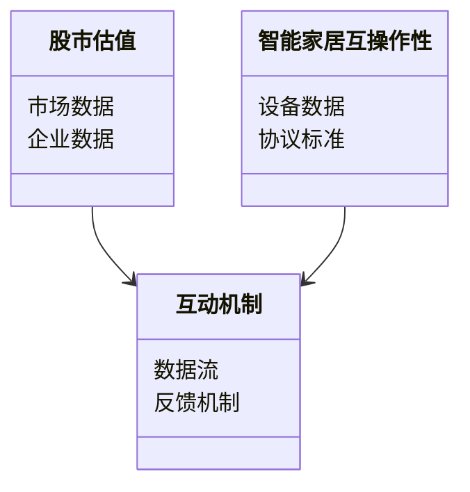
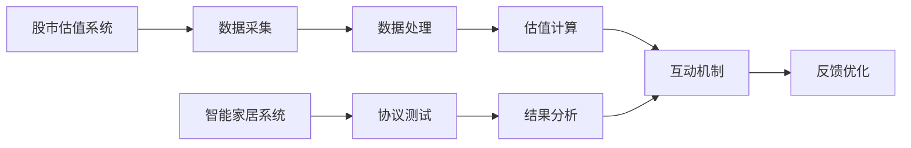

                 


# 新兴市场股市估值与智能家居互操作性标准的互动

> **关键词**：股市估值、智能家居、互操作性标准、数据驱动、市场互动

> **摘要**：本文探讨新兴市场股市估值与智能家居互操作性标准之间的互动关系，分析技术进步对金融市场的影响，以及市场波动如何推动技术标准的发展。通过数据驱动的方法，揭示两者如何相互作用，为企业和技术开发者提供洞察。

---

# 正文

## 第一部分：背景介绍与核心概念

### 第1章：背景介绍与核心概念

#### 1.1 问题背景与问题描述

- **股市估值的重要性**：股市估值是评估企业价值的关键，尤其在新兴市场，波动性和不确定性较高。
- **智能家居互操作性标准的必要性**：随着智能家居设备的普及，兼容性问题日益突出，统一标准势在必行。
- **互动关系**：技术进步推动股市增长，股市波动影响技术投资，两者相互影响。

#### 1.2 核心概念与问题解决

- **股市估值**：通过PE、PB等指标评估企业价值。
- **智能家居互操作性**：确保设备间兼容，提升用户体验。
- **互动机制**：数据流驱动，市场反馈推动技术发展。

#### 1.3 问题边界与外延

- 股市估值的适用范围和限制。
- 互操作性标准的适用场景和限制。
- 互动机制的边界和扩展领域。

#### 1.4 核心概念结构与组成

- 股市估值系统架构。
- 互操作性标准组成部分。
- 互动机制的核心模块和交互流程。

## 第二部分：核心概念与联系

### 第2章：核心概念与联系

#### 2.1 核心概念原理

- **股市估值的理论基础**：介绍PE、PB等指标的计算方法。
- **智能家居互操作性标准的技术基础**：讨论通信协议和设备兼容性。
- **互动机制的数学模型**：建立两者之间的数学关系。

#### 2.2 概念属性特征对比

- 通过表格对比股市估值与互操作性标准的属性特征。
- **ER实体关系图**：展示股市、企业、设备之间的关系。


## 第三部分：算法原理与数学模型

### 第3章：算法原理与数学模型

#### 3.1 算法原理

- **股市估值算法**：介绍基于历史数据的预测方法。
- **互操作性验证算法**：描述协议兼容性测试流程。
- **互动机制算法**：展示数据驱动的反馈机制。

#### 3.2 数学模型与公式

- **股市估值模型**：
  - PE = 市场价 / 每股收益
  - PB = 市场价 / 每股净资产
- **互操作性标准模型**：设备兼容性的评分系统。

## 第四部分：系统分析与架构设计

### 第4章：系统分析与架构设计

#### 4.1 领域模型设计

- **领域模型图**：展示系统中的实体及其关系。



#### 4.2 系统架构设计

- **系统架构图**：展示系统的组成部分和交互流程。



## 第五部分：项目实战与案例分析

### 第5章：项目实战与案例分析

#### 5.1 环境安装与配置

- 介绍开发环境的搭建，如数据采集工具和协议测试框架。

#### 5.2 核心实现代码

- **数据采集代码**：
  ```python
  import pandas as pd
  data = pd.read_csv('market_data.csv')
  ```

- **协议测试代码**：
  ```python
  def test_protocol(compliance):
      if compliance >= 0.9:
          return True
      else:
          return False
  ```

#### 5.3 案例分析

- 分析新兴市场股市波动如何影响智能家居投资，案例包括某国股市波动导致智能家居公司估值变化。

## 第六部分：最佳实践与总结

### 第6章：最佳实践与总结

#### 6.1 最佳实践

- 数据驱动的分析方法。
- 持续优化的反馈机制。
- 跨学科合作的重要性。

#### 6.2 总结

- 互动关系的重要性。
- 技术与金融的结合对企业价值的影响。

#### 6.3 注意事项

- 数据质量和实时性的重要性。
- 标准制定的挑战和协调问题。

#### 6.4 拓展阅读

- 推荐相关书籍和资源。

---

# 结语

通过本文的详细分析，我们揭示了新兴市场股市估值与智能家居互操作性标准之间的互动关系，为技术开发者和金融分析师提供了宝贵的见解。未来的研究可以进一步探索数据驱动方法在预测中的应用，以及更复杂的互动模型。

---

**作者**：AI天才研究院/AI Genius Institute & 禅与计算机程序设计艺术 /Zen And The Art of Computer Programming

