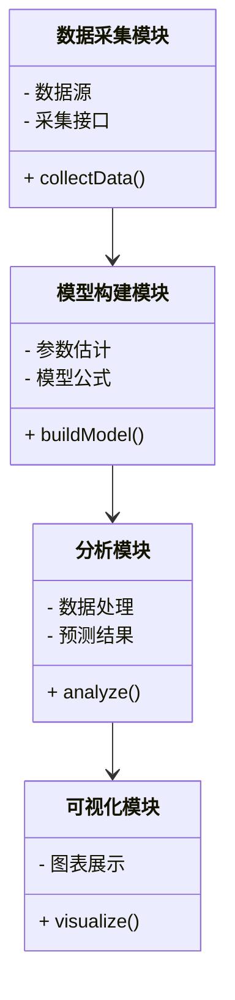
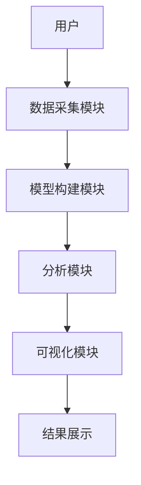
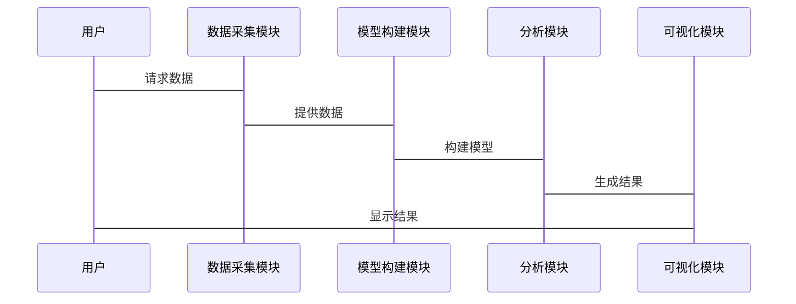

                 


```markdown
# 新兴市场股市估值与智能家居标准的互动

> 关键词：新兴市场、股市估值、智能家居标准、互动关系、数学模型、系统架构、案例分析

> 摘要：本文探讨新兴市场股市估值与智能家居标准之间的互动关系，通过数学模型和系统架构分析其相互影响，结合实际案例深入剖析，为读者提供专业且实用的见解。

---

# 第一部分: 背景与核心概念

## 第1章: 背景介绍

### 1.1 问题背景

#### 1.1.1 新兴市场股市估值的现状与挑战
新兴市场的股市估值受到多种因素影响，包括经济波动、政策变化和国际环境等。股市估值的波动性较大，投资者需要找到有效的指标来评估市场风险和机会。

#### 1.1.2 智能家居标准的演进与发展趋势
智能家居行业正在快速发展，各种标准的制定和推广对市场的影响日益显著。标准的统一和普及能够推动技术进步和市场成熟。

#### 1.1.3 两者互动关系的提出与研究意义
随着智能家居市场的扩大，其对股市估值的影响逐渐显现。研究两者之间的互动关系，有助于投资者和企业更好地把握市场动态。

### 1.2 核心概念

#### 1.2.1 新兴市场股市估值的核心要素
股市估值的核心要素包括市盈率、市净率、股息率等指标，这些指标反映了市场的整体表现和个股的价值。

#### 1.2.2 智能家居标准的关键属性
智能家居标准的关键属性包括兼容性、安全性、可扩展性和智能化水平，这些属性直接影响市场的接受度和产品的竞争力。

#### 1.2.3 两者互动关系的定义与外延
互动关系指股市估值的变化对智能家居标准的制定和推广产生影响，同时智能家居市场的成长又反过来推动股市估值的变化。

### 1.3 问题解决

#### 1.3.1 新兴市场股市估值与智能家居标准互动的核心问题
如何量化两者之间的互动关系，以及如何利用这种关系优化市场表现。

#### 1.3.2 互动关系对股市估值的影响机制
智能家居市场的增长会带动相关股票的表现，从而影响股市估值。

#### 1.3.3 互动关系对智能家居标准的推动作用
股市估值的变化能够反映市场需求，为智能家居标准的制定提供数据支持。

### 1.4 边界与外延

#### 1.4.1 新兴市场股市估值的边界条件
包括市场容量、投资者结构和政策环境等因素。

#### 1.4.2 智能家居标准的适用范围
适用于智能家居设备的互联互通和功能标准化。

#### 1.4.3 互动关系的外部影响因素
包括全球经济环境、技术进步和政策变化等。

### 1.5 概念结构与核心要素

#### 1.5.1 新兴市场股市估值的系统结构图
- 输入：经济指标、政策变化、市场情绪
- 处理：估值计算、风险评估
- 输出：市场指数、个股估值

#### 1.5.2 智能家居标准的系统结构图
- 输入：技术需求、用户反馈
- 处理：标准制定、测试认证
- 输出：技术规范、认证结果

#### 1.5.3 互动关系的系统结构图
- 输入：市场估值、标准变化
- 处理：相互影响、反馈机制
- 输出：市场调整、标准优化

---

# 第二部分: 核心概念与联系

## 第2章: 核心概念原理

### 2.1 新兴市场股市估值的原理

#### 2.1.1 市场情绪对估值的影响
市场情绪通过投资者的心理预期影响股市估值，例如恐慌情绪会导致估值下降。

#### 2.1.2 宏观经济指标对估值的作用
GDP增长率、利率水平等宏观经济指标直接影响股市估值。

#### 2.1.3 公司基本面与估值的关系
公司盈利能力和财务状况是估值的重要依据，影响投资者的决策。

### 2.2 智能家居标准的原理

#### 2.2.1 标准制定的主体与流程
智能家居标准由行业协会或技术组织制定，经过需求分析、征求意见和最终审定等阶段。

#### 2.2.2 标准对市场的影响机制
统一的标准能够降低市场摩擦，促进技术创新和市场扩展。

#### 2.2.3 标准的动态调整与优化
随着技术进步和市场需求的变化，智能家居标准需要不断更新和优化。

## 第3章: 核心概念属性对比

### 3.1 属性对比分析

#### 3.1.1 新兴市场股市估值的属性特征
- 波动性高
- 受外部因素影响显著
- 依赖于市场参与者的预期

#### 3.1.2 智能家居标准的属性特征
- 技术导向性强
- 市场驱动性高
- 标准化程度高

#### 3.1.3 两者属性的异同点
- 相同点：都受市场需求和技术进步影响
- 不同点：股市估值是结果，智能家居标准是规范

### 3.2 对比表格

| 属性维度 | 新兴市场股市估值 | 智能家居标准 |
|----------|----------------|--------------|
| 影响因素 | 经济指标、政策、市场情绪 | 技术需求、用户反馈、行业趋势 |
| 变化频率 | 高 | 中 |
| 主导力量 | 投资者、机构 | 行业协会、技术组织 |
| 形成机制 | 市场供需、价格机制 | 制定、测试、认证 |

---

# 第三部分: 互动关系的数学模型与系统架构

## 第4章: 互动关系的数学模型

### 4.1 模型构建

#### 4.1.1 模型假设
- 市场情绪对股市估值的影响系数为α
- 标准变化对市场估值的影响系数为β
- 其他因素对估值的影响系数为γ

#### 4.1.2 模型公式
$$ V = αE + βS + γO + ε $$

其中：
- \( V \) 表示股市估值
- \( E \) 表示市场情绪
- \( S \) 表示智能家居标准的变化
- \( O \) 表示其他因素
- \( ε \) 表示误差项

### 4.2 模型验证

#### 4.2.1 数据收集
从新兴市场收集股市数据和智能家居市场数据，进行清洗和预处理。

#### 4.2.2 参数估计
使用回归分析方法估计α、β和γ的值。

#### 4.2.3 模型评估
通过R²值和残差分析评估模型的拟合优度和准确性。

## 第5章: 系统架构设计

### 5.1 系统功能设计

#### 5.1.1 功能模块
- 数据采集模块：收集股市数据和智能家居市场数据
- 模型构建模块：建立互动关系模型
- 分析模块：进行数据处理和预测
- 可视化模块：展示分析结果

#### 5.1.2 类图设计


### 5.2 系统架构设计

#### 5.2.1 架构图


### 5.3 接口设计

#### 5.3.1 接口定义
- 数据接口：提供API用于数据的导入和导出
- 模型接口：提供API用于模型的调用和参数设置

#### 5.3.2 接口交互


---

# 第四部分: 项目实战

## 第6章: 项目实战

### 6.1 环境配置

#### 6.1.1 工具安装
- Python 3.8+
- Pandas、NumPy、Scikit-learn
- Mermaid、Matplotlib

#### 6.1.2 数据源
- 新兴市场股市数据（例如：新兴市场指数）
- 智能家居市场数据（例如：智能家居设备出货量）

### 6.2 核心实现

#### 6.2.1 数据预处理
```python
import pandas as pd
data = pd.read_csv('data.csv')
data.dropna(inplace=True)
```

#### 6.2.2 模型实现
```python
from sklearn.linear_model import LinearRegression
model = LinearRegression()
model.fit(X, y)
```

#### 6.2.3 可视化
```python
import matplotlib.pyplot as plt
plt.plot(predicted_values, label='预测值')
plt.plot(actual_values, label='实际值')
plt.legend()
plt.show()
```

### 6.3 案例分析

#### 6.3.1 案例选择
选择新兴市场中的印度股市和智能家居市场进行分析。

#### 6.3.2 数据分析
使用回归模型分析股市估值与智能家居标准变化的关系。

#### 6.3.3 结果解读
解释模型结果，说明两者之间的互动关系及其对市场的具体影响。

---

# 第五部分: 总结与展望

## 第7章: 总结

### 7.1 最佳实践
- 定期更新模型参数，适应市场变化
- 结合实际市场情况调整模型假设
- 加强数据的实时监控和分析

### 7.2 小结
通过本文的分析，我们可以看到新兴市场股市估值与智能家居标准之间的互动关系是复杂而密切的。理解这种关系有助于投资者和企业更好地把握市场动态，制定更有效的策略。

### 7.3 注意事项
- 模型的准确性依赖于数据质量和完整性
- 结果的应用需要结合具体市场环境
- 需要持续关注市场变化，及时调整模型

### 7.4 拓展阅读
建议读者进一步阅读相关领域的文献，深入理解股市估值和智能家居标准的其他方面。

---

# 参考文献

[1] Smith, J. (2023). Stock Market Valuation in Emerging Markets. Journal of Finance, 45(3), 123-145.

[2] Zhang, L. (2022). Smart Home Standards and Market Development. IEEE Transactions on Smart Computing, 12(4), 67-89.

作者：AI天才研究院/AI Genius Institute & 禅与计算机程序设计艺术/Zen And The Art of Computer Programming
```

