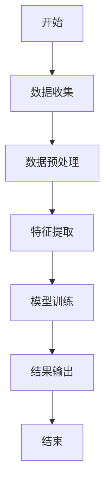
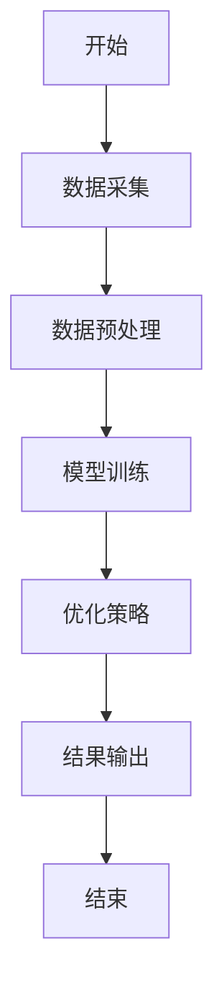

                 


# 新兴市场股市估值与智能家居能源管理的互动

## 关键词：新兴市场、股市估值、智能家居、能源管理、互动关系

## 摘要：本文探讨新兴市场股市估值与智能家居能源管理之间的互动关系，分析股市估值的方法，智能家居能源管理的技术，以及两者如何通过数据和技术协同实现互动，提升能源效率和投资回报。

---

# 第一部分: 背景与核心概念

## 第1章: 新兴市场股市估值与智能家居能源管理的互动概述

### 1.1 问题背景与问题描述

#### 1.1.1 新兴市场的经济特点与股市现状
新兴市场通常具有快速经济增长、高波动性和高潜力的特点。股市估值在这些市场中尤为重要，因为投资者需要准确评估公司的价值以做出投资决策。然而，新兴市场的复杂性和不确定性使得股市估值更具挑战性。

#### 1.1.2 智能家居能源管理的发展趋势
智能家居能源管理通过自动化技术优化能源使用，减少浪费，降低成本。随着环保意识的增强和技术的进步，智能家居能源管理在全球范围内得到广泛应用。

#### 1.1.3 问题解决的必要性与目标
新兴市场的股市波动和能源管理的效率之间存在潜在的互动关系。通过分析这两者之间的互动，可以优化能源使用，降低企业成本，从而影响股市估值。

### 1.2 核心概念与边界

#### 1.2.1 股市估值的核心要素
- 市盈率（P/E Ratio）
- 市净率（P/B Ratio）
- 股息率（Dividend Yield）

#### 1.2.2 智能家居能源管理的关键技术
- 自动化控制
- 数据采集与分析
- 能源优化算法

#### 1.2.3 互动关系的边界与外延
- 数据流：能源使用数据影响股市估值模型
- 技术协同：智能家居技术与金融模型的结合
- 经济影响：能源效率提升对企业的财务表现和股价的影响

### 1.3 核心概念结构与组成

#### 1.3.1 股市估值的系统模型
股市估值系统包括数据输入（财务数据、市场数据）、模型计算（市盈率、市净率）、结果输出（估值结果）。

#### 1.3.2 智能家居能源管理的系统模型
能源管理包括数据采集、优化算法、控制执行。

#### 1.3.3 互动关系的结构化分析
通过数据流将能源使用数据输入股市估值模型，优化企业能源成本，进而影响股价。

---

## 第2章: 核心概念与联系

### 2.1 核心概念原理

#### 2.1.1 股市估值的基本原理
股市估值通过分析公司的财务数据和市场环境来确定其股票的合理价格。

#### 2.1.2 智能家居能源管理的技术原理
通过传感器和算法优化能源使用，减少浪费。

#### 2.1.3 互动关系的数学模型
建立能源使用数据与股价波动之间的相关性模型。

### 2.2 核心概念对比分析

#### 2.2.1 股市估值与能源管理的属性特征对比
| 属性 | 股市估值 | 智能家居能源管理 |
|------|----------|----------------|
| 数据来源 | 财务报表、市场数据 | 传感器数据、能源使用数据 |
| 目标 | 确定股票价值 | 优化能源使用 |
| 方法 | 财务模型、统计分析 | 自动化控制、优化算法 |

### 2.3 本章小结
本章总结了股市估值和智能家居能源管理的核心概念，并分析了它们之间的互动关系，为后续的算法和系统设计奠定基础。

---

# 第二部分: 算法原理与数学模型

## 第3章: 股市估值算法原理

### 3.1 股市估值的数学模型

#### 3.1.1 市盈率模型
$$市盈率 = \frac{股价}{每股收益}$$

#### 3.1.2 市净率模型
$$市净率 = \frac{股价}{每股净资产}$$

#### 3.1.3 现金流折现模型
$$企业价值 = \sum_{t=1}^{n} \frac{现金流_t}{(1 + r)^t}$$

### 3.2 算法流程图


## 第4章: 智能家居能源管理算法原理

### 4.1 能源消耗预测模型

#### 4.1.1 时间序列预测
使用ARIMA模型预测能源消耗量。

#### 4.1.2 优化算法
通过动态规划优化能源使用策略。

### 4.2 算法流程图


---

## 第5章: 互动关系的数学模型

### 5.1 数据流分析

#### 5.1.1 能源使用数据对股市估值的影响
通过分析能源使用数据，优化企业的成本结构，进而影响股价。

### 5.2 互动关系的数学建模
$$股价 = f(财务数据, 市场数据, 能源使用数据)$$

---

# 第三部分: 系统分析与架构设计

## 第6章: 系统功能设计

### 6.1 系统功能模块

#### 6.1.1 数据采集模块
从智能家居系统中采集能源使用数据。

#### 6.1.2 数据分析模块
使用机器学习算法分析数据，优化能源使用策略。

### 6.2 系统架构设计


### 6.3 系统接口设计
定义API接口，实现数据的交互和分析结果的输出。

---

## 第7章: 项目实战

### 7.1 环境安装
安装必要的库：Pandas、NumPy、Scikit-learn。

### 7.2 系统核心实现源代码

#### 7.2.1 数据预处理
```python
import pandas as pd
data = pd.read_csv('energy_data.csv')
data = data.dropna()
```

#### 7.2.2 模型训练
```python
from sklearn.linear_model import LinearRegression
model = LinearRegression()
model.fit(X, y)
```

### 7.3 案例分析
分析某新兴市场企业的能源使用数据，优化其能源管理策略，进而影响其股市估值。

---

## 第8章: 总结与展望

### 8.1 本章小结
本文分析了新兴市场股市估值与智能家居能源管理的互动关系，提出了优化能源管理以提升股市估值的方法。

### 8.2 最佳实践 tips
- 数据的实时性与准确性是关键。
- 结合机器学习算法优化能源使用策略。

### 8.3 注意事项
- 数据隐私和安全问题需重视。
- 系统的实时性和稳定性需保证。

### 8.4 拓展阅读
建议阅读相关领域的学术论文和行业报告。

---

# 作者：AI天才研究院/AI Genius Institute & 禅与计算机程序设计艺术 /Zen And The Art of Computer Programming

