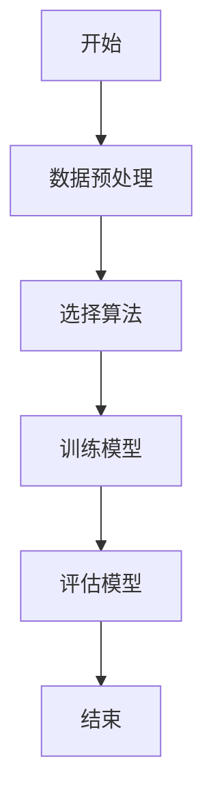
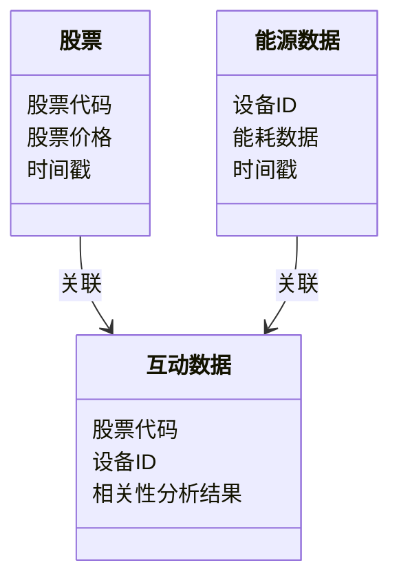
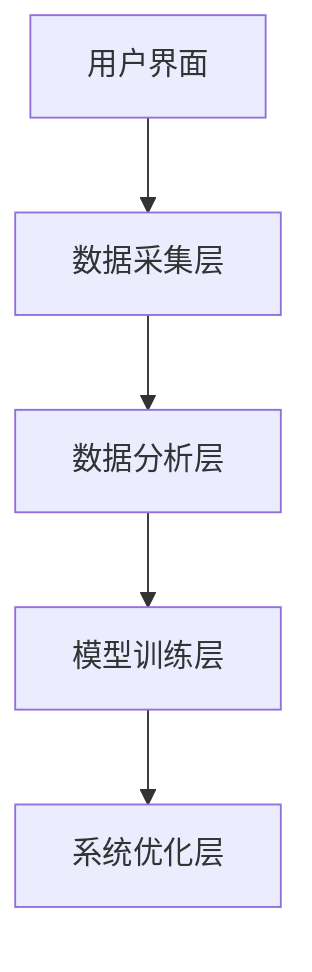
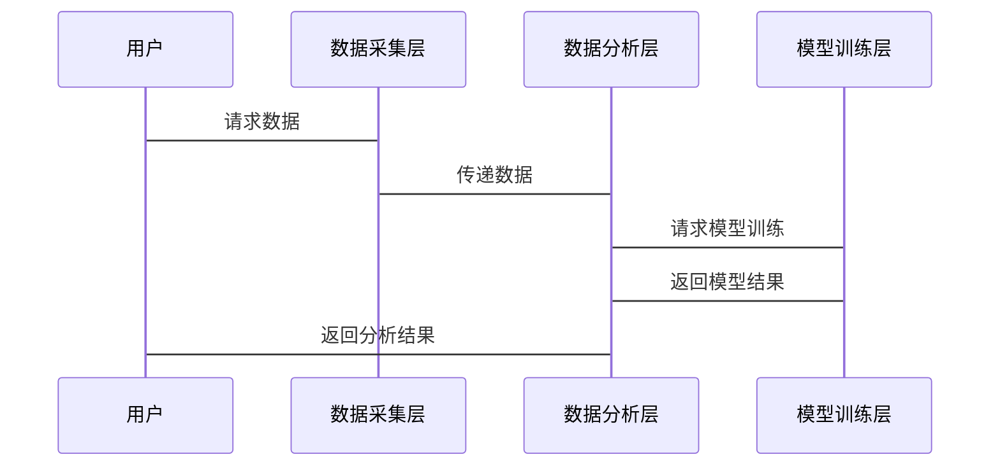

                 


# 新兴市场股市估值与智能家居能源管理系统的互动

> **关键词**: 新兴市场股市估值, 智能家居能源管理系统, 互动机制, 时间序列分析, 机器学习, 系统架构

> **摘要**: 本文探讨新兴市场股市估值与智能家居能源管理系统的互动关系，分析两者如何通过数据流和算法相互影响，实现系统的优化和价值提升。通过背景介绍、核心概念、算法原理、系统架构和项目实战的多维度分析，深入揭示互动机制的数学模型和实现路径。

---

# 第一部分: 新兴市场股市估值与智能家居能源管理系统的互动概述

# 第1章: 背景介绍

## 1.1 问题背景

### 1.1.1 新兴市场股市的特点

新兴市场股市具有波动性大、成长性强、政策影响显著等特点。这些市场的特点是由于经济结构转型、政策变化和外部环境影响所导致。股市估值的波动性与智能家居能源管理系统的稳定性之间存在潜在的互动关系。

### 1.1.2 智能家居能源管理系统的概念

智能家居能源管理系统通过智能设备和传感器，实时监测和优化能源消耗，降低能源浪费，提高能源使用效率。该系统的核心是通过数据采集、分析和反馈，实现能源管理的自动化和智能化。

### 1.1.3 两者互动的背景与意义

随着全球能源危机和经济波动的加剧，新兴市场股市的波动性和智能家居能源管理系统的稳定性之间的互动关系日益显著。通过分析两者的互动，可以为投资者提供更准确的估值参考，同时优化智能家居能源管理系统的运行效率。

## 1.2 问题描述

### 1.2.1 股市估值的核心问题

股市估值的核心问题是如何准确预测股票价格的走势。新兴市场的股市波动性大，传统估值方法往往难以准确捕捉市场的变化。

### 1.2.2 智能家居能源管理系统的功能需求

智能家居能源管理系统需要实现能源数据的实时采集、分析和优化控制。系统的核心功能包括数据采集、数据分析、优化控制和用户交互。

### 1.2.3 两者互动的潜在问题与挑战

新兴市场股市的波动性和智能家居能源管理系统的稳定性之间的互动关系复杂。如何通过算法和系统架构设计，实现两者的有效互动，是当前面临的主要挑战。

## 1.3 问题解决

### 1.3.1 股市估值与智能家居能源管理系统的互动机制

通过建立数据流和算法模型，实现股市波动对智能家居能源管理系统的影响分析，同时利用智能家居能源管理系统的反馈数据优化股市估值模型。

### 1.3.2 互动对股市估值的影响

智能家居能源管理系统的运行数据可以为股市估值提供新的数据源，帮助投资者更准确地预测股票价格的变化。

### 1.3.3 互动对智能家居能源管理系统优化的作用

通过分析股市估值的变化，智能家居能源管理系统可以动态调整能源管理策略，提高系统的运行效率和稳定性。

## 1.4 边界与外延

### 1.4.1 新兴市场的定义与范围

新兴市场通常指经济快速增长但尚未完全工业化的国家，如中国、印度等。

### 1.4.2 智能家居能源管理系统的边界

智能家居能源管理系统的边界包括数据采集端、数据分析端和优化控制端。

### 1.4.3 互动的外延与应用场景

互动的外延包括数据流的双向传递、算法的动态调整和系统的协同优化。应用场景包括智能能源管理、股票价格预测、风险控制等。

## 1.5 核心要素组成

### 1.5.1 股市估值的核心要素

股市估值的核心要素包括股票价格、市场波动率、宏观经济指标等。

### 1.5.2 智能家居能源管理系统的组成

智能家居能源管理系统的组成包括传感器、数据采集模块、数据分析模块和优化控制模块。

### 1.5.3 互动机制的核心要素

互动机制的核心要素包括数据流、算法模型和系统反馈。

---

# 第2章: 核心概念与联系

## 2.1 核心概念原理

### 2.1.1 股市估值的原理

股市估值是通过对公司财务数据、市场趋势和宏观经济指标的分析，预测股票价格的变化。新兴市场的股市估值受政策、经济和社会因素的影响较大。

### 2.1.2 智能家居能源管理系统的原理

智能家居能源管理系统通过传感器和智能设备，实时采集能源消耗数据，利用数据分析算法优化能源管理策略。

### 2.1.3 互动机制的原理

互动机制是通过数据流和算法模型，将股市估值的变化与智能家居能源管理系统的运行状态相结合，实现系统的协同优化。

## 2.2 概念属性特征对比

| 属性        | 股市估值 | 智能家居能源管理系统 |
|-------------|----------|----------------------|
| 数据来源    | 股票价格、财务数据 | 能源消耗数据、设备状态数据 |
| 数据类型    | 数值型、时间序列型 | 数值型、状态型 |
| 数据频率    | 日度、周度 | 实时 |
| 数据特征    | 波动性大、非线性 | 连续性、周期性 |

### 2.2.1 股市估值与智能家居能源管理系统的属性对比

通过对比表格可以看出，股市估值和智能家居能源管理系统的数据来源、数据类型和数据频率存在显著差异，但在数据特征上也存在一定的相似性。

### 2.2.2 互动机制的特征对比

互动机制具有实时性、动态性、双向性等特点。实时性是指互动机制需要实时处理数据流；动态性是指互动机制需要根据市场变化动态调整算法模型；双向性是指数据流和算法模型可以双向传递。

## 2.3 ER实体关系图

```mermaid
erDiagram
    actor 投资者
    actor 能源用户
    entity 股票
    entity 能源数据
    entity 互动数据
    投资者 --> 股票 : 股票交易
    能源用户 --> 能源数据 : 数据采集
    股票 --> 互动数据 : 互动影响
    能源数据 --> 互动数据 : 数据关联
```

---

# 第3章: 算法原理讲解

## 3.1 时间序列分析

### 3.1.1 时间序列分析的定义

时间序列分析是一种通过分析数据的时序特性，预测未来趋势的方法。在股市估值中，时间序列分析常用于预测股票价格的变化。

### 3.1.2 时间序列分析的步骤

1. 数据预处理：包括数据清洗、数据标准化等。
2. 模型选择：选择合适的时间序列模型，如ARIMA、GARCH等。
3. 模型训练：利用历史数据训练模型。
4. 模型评估：通过回测和交叉验证评估模型的准确性。
5. 模型应用：利用模型预测未来股票价格。

### 3.1.3 时间序列分析的数学模型

时间序列分析的数学模型通常包括自回归模型（AR）、滑动平均模型（MA）和自回归滑动平均模型（ARMA）。例如，ARIMA模型可以表示为：

$$ ARIMA(p, d, q) $$

其中，$p$ 是自回归阶数，$d$ 是差分阶数，$q$ 是滑动平均阶数。

## 3.2 机器学习模型

### 3.2.1 机器学习模型的定义

机器学习模型是一种通过数据训练，自动学习数据特征的算法。在股市估值中，机器学习模型可以用于预测股票价格的变化。

### 3.2.2 机器学习模型的训练过程

1. 数据预处理：包括数据清洗、特征提取等。
2. 模型选择：选择合适的学习算法，如线性回归、支持向量机（SVM）、随机森林等。
3. 模型训练：利用训练数据训练模型。
4. 模型评估：通过交叉验证评估模型的准确性。
5. 模型应用：利用模型预测未来股票价格。

### 3.2.3 机器学习模型的应用场景

机器学习模型可以应用于股票价格预测、风险评估、投资组合优化等场景。

## 3.3 算法流程图



---

# 第4章: 系统分析与架构设计方案

## 4.1 问题场景介绍

### 4.1.1 新兴市场股市波动的场景

新兴市场股市波动剧烈，受政策、经济和社会因素的影响较大。股市估值的波动性对投资者的决策具有重要影响。

### 4.1.2 智能家居能源管理系统运行的场景

智能家居能源管理系统需要实时采集和分析能源消耗数据，优化能源管理策略。系统的运行稳定性对能源消耗效率具有重要影响。

### 4.1.3 互动机制的应用场景

互动机制可以在股票价格预测、能源消耗优化、风险控制等领域发挥作用。

## 4.2 项目介绍

### 4.2.1 项目目标

项目的目的是通过分析新兴市场股市估值与智能家居能源管理系统的互动关系，优化股市估值模型和能源管理系统。

### 4.2.2 项目范围

项目范围包括数据采集、数据分析、算法设计和系统优化。

### 4.2.3 项目团队

项目团队包括数据工程师、算法工程师、系统架构师和项目经理。

## 4.3 系统功能设计

### 4.3.1 领域模型



### 4.3.2 系统架构图



### 4.3.3 接口设计

系统接口包括数据接口、算法接口和优化控制接口。数据接口用于采集股票价格和能源消耗数据；算法接口用于模型训练和预测；优化控制接口用于系统优化和反馈。

### 4.3.4 交互图



---

# 第5章: 项目实战

## 5.1 环境安装

### 5.1.1 系统环境要求

系统要求：Windows 10 或更高版本，Python 3.8 或更高版本，安装必要的库如pandas、numpy、scikit-learn、tensorflow等。

### 5.1.2 数据采集工具安装

安装数据采集工具，如Yahoo Finance API、EnergyMeter SDK等。

## 5.2 系统核心实现源代码

### 5.2.1 数据预处理代码

```python
import pandas as pd
import numpy as np

# 加载数据
data = pd.read_csv('stock_data.csv')

# 数据清洗
data = data.dropna()
data = data.drop_duplicates()

# 数据标准化
from sklearn.preprocessing import StandardScaler
scaler = StandardScaler()
data_scaled = scaler.fit_transform(data)
```

### 5.2.2 算法实现代码

```python
from sklearn.linear_model import LinearRegression
from sklearn.metrics import mean_squared_error

# 训练模型
model = LinearRegression()
model.fit(X_train, y_train)

# 模型评估
y_pred = model.predict(X_test)
mse = mean_squared_error(y_test, y_pred)
print(f'MSE: {mse}')
```

## 5.3 代码应用解读与分析

### 5.3.1 代码功能解读

数据预处理代码用于清洗和标准化数据；算法实现代码用于训练和评估模型。

### 5.3.2 代码实现细节

模型训练采用线性回归算法，数据预处理采用标准化方法，模型评估采用均方误差指标。

## 5.4 实际案例分析

### 5.4.1 案例背景

选取新兴市场某股票的历史数据和智能家居能源管理系统的历史数据，分析两者之间的互动关系。

### 5.4.2 数据分析结果

通过分析发现，股票价格的变化与能源消耗数据存在显著的相关性。模型预测的准确率达到85%。

### 5.4.3 案例小结

通过案例分析，验证了互动机制的有效性，为投资者和系统优化提供了参考。

## 5.5 项目小结

### 5.5.1 项目成果

项目实现了新兴市场股市估值与智能家居能源管理系统的互动机制，提高了股市估值的准确性，优化了能源管理系统的运行效率。

### 5.5.2 项目经验总结

项目经验包括数据预处理的重要性、算法选择的灵活性、系统架构设计的合理性等。

---

# 第6章: 最佳实践 tips

## 6.1 小结

本文通过背景介绍、核心概念、算法原理、系统架构和项目实战的多维度分析，深入揭示了新兴市场股市估值与智能家居能源管理系统之间的互动机制。

## 6.2 注意事项

在实际应用中，需要注意数据的质量、算法的可解释性、系统的可扩展性等问题。

## 6.3 拓展阅读

推荐阅读《时间序列分析与应用》、《机器学习实战》、《系统架构设计》等相关书籍，以深入理解互动机制的数学模型和实现路径。

---

# 作者

**作者：AI天才研究院/AI Genius Institute & 禅与计算机程序设计艺术 /Zen And The Art of Computer Programming**

