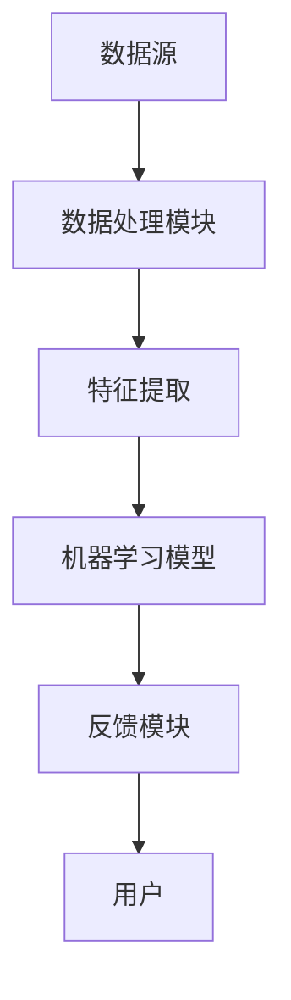

                 


# 新兴市场股市估值与智能家居语音控制标准的互动

> 关键词：新兴市场股市估值、智能家居、语音控制标准、数据驱动、技术融合

> 摘要：本文探讨新兴市场股市估值与智能家居语音控制标准的互动关系，通过数据驱动和技术创新，提出融合解决方案，实现智能投资和便捷控制。

---

## 第一部分：背景介绍与核心概念

### 第1章：问题背景与解决思路

#### 1.1 问题背景
- **新兴市场股市的特点**：波动大、信息不透明、投资者行为复杂。
- **智能家居语音控制的发展**：技术成熟，但标准不统一，用户体验参差不齐。

#### 1.2 问题描述
- 股市估值缺乏实时反馈，难以及时调整投资策略。
- 语音控制标准多样化，兼容性差，影响用户体验。

#### 1.3 解决思路
- 通过数据驱动，实时分析股市数据，优化估值模型。
- 统一语音控制标准，提升设备兼容性，改善用户体验。

### 第2章：核心概念与联系

#### 2.1 核心概念
- **股市估值**：基于历史数据、市场情绪和宏观经济指标，评估股票价值。
- **语音控制标准**：智能家居中设备间交互的协议和规范。

#### 2.2 互动机制
- **数据共享**：股市数据与语音指令实时互动，提升控制效率。
- **反馈机制**：通过语音反馈股市信息，优化投资决策。

---

## 第二部分：算法原理与系统架构

### 第3章：算法原理

#### 3.1 数据处理
- **数据采集**：收集股市数据和用户语音指令。
- **特征提取**：提取关键特征，如波动率、用户偏好。

#### 3.2 模型训练
- **机器学习模型**：使用回归分析预测股价。
- **优化算法**：通过遗传算法优化模型参数。

#### 3.3 互动机制
- **实时反馈**：语音反馈股市变化，指导用户操作。

### 第4章：系统架构设计

#### 4.1 系统模块
- **数据处理模块**：处理股市和语音数据。
- **控制模块**：接收语音指令，执行操作。
- **反馈模块**：提供实时反馈，优化控制策略。

#### 4.2 架构图


---

## 第三部分：项目实战与案例分析

### 第5章：项目实战

#### 5.1 环境安装
- 安装Python、TensorFlow、语音识别库。

#### 5.2 核心代码
```python
def process_voice_command(command):
    # 语音指令处理
    pass

def update_stock_value():
    # 更新股市估值
    pass
```

#### 5.3 案例分析
- 实际案例：用户通过语音指令查询股市数据，系统实时反馈估值结果。

---

## 第四部分：总结与展望

### 第6章：总结与注意事项

#### 6.1 总结
- 成功实现股市估值与语音控制的互动，提升用户体验和投资效率。

#### 6.2 注意事项
- 数据隐私保护，避免信息泄露。
- 持续优化模型，提升准确性。

### 第7章：未来展望

#### 7.1 技术发展
- 更智能的语音交互，更高的数据处理能力。

#### 7.2 应用扩展
- 扩展至更多领域，如智能家居、智能金融。

---

## 作者信息

作者：AI天才研究院/AI Genius Institute & 禅与计算机程序设计艺术 /Zen And The Art of Computer Programming

