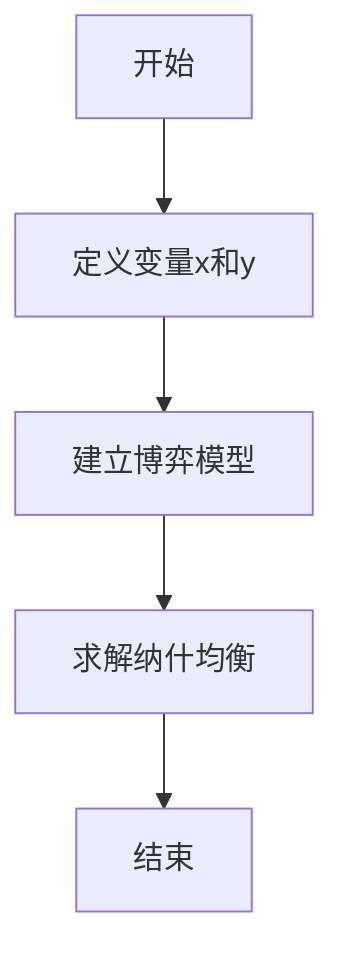
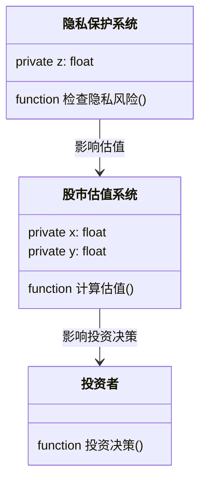
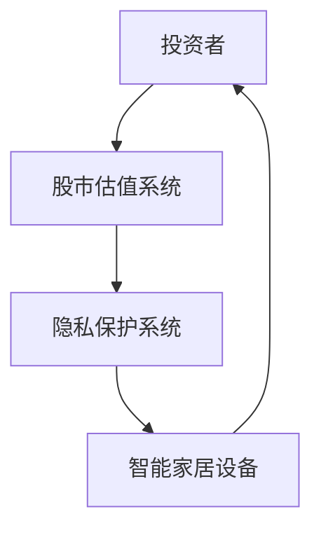
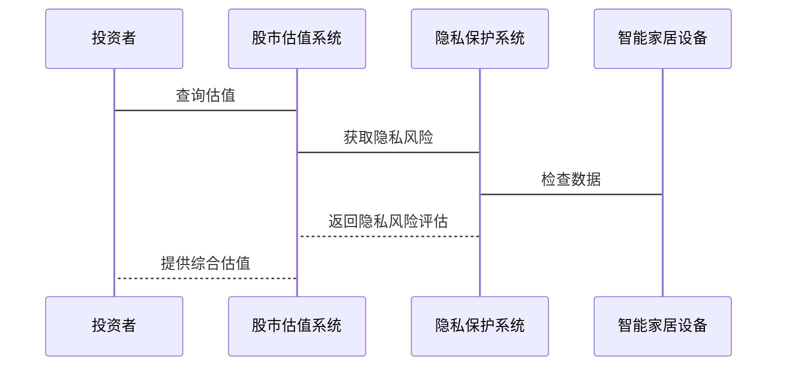

                 


# 《新兴市场股市估值与智能家居隐私保护标准的互动》

> 关键词：新兴市场，股市估值，智能家居，隐私保护，标准互动

> 摘要：本文探讨了新兴市场股市估值与智能家居隐私保护标准之间的互动关系。通过分析两者的背景、核心概念和算法原理，结合系统架构设计和项目实战，提出了一种基于博弈论的互动模型，并通过案例分析展示了如何在实际中应用这些概念。最后，本文总结了最佳实践和未来研究方向。

---

## 第一部分: 新兴市场股市估值与智能家居隐私保护的背景

### 第1章: 新兴市场股市估值与智能家居隐私保护的背景

#### 1.1 新兴市场股市估值的定义与现状
- **1.1.1 新兴市场的定义与特点**
  - 新兴市场是指那些经济快速发展但尚未完全工业化的国家或地区，如中国、印度、巴西等。
  - 新兴市场的特点包括高增长率、较大的市场潜力、但同时也伴随着较高的风险。

- **1.1.2 股市估值的基本概念**
  - 股市估值是通过对公司财务数据、市场环境和行业趋势的分析，确定股票的合理价格。
  - 常用的估值方法包括市盈率（P/E）、市净率（P/B）、股息率等。

- **1.1.3 新兴市场股市估值的独特性**
  - 新兴市场的股市估值受政策、经济波动和外部因素影响较大。
  - 新兴市场的公司往往具有较高的成长性，但同时也面临更多的不确定性。

#### 1.2 智能家居隐私保护标准的定义与现状
- **1.2.1 智能家居的基本概念**
  - 智能家居是指通过物联网技术将家庭中的设备连接起来，实现智能化的管理和控制。
  - 智能家居的核心功能包括安全监控、能源管理、环境控制等。

- **1.2.2 隐私保护标准的核心要素**
  - 隐私保护标准是指在智能家居系统中，保护用户数据不被未经授权的访问或泄露的一系列规则和措施。
  - 核心要素包括数据加密、访问控制、数据匿名化等。

- **1.2.3 智能家居隐私保护的现状与挑战**
  - 当前智能家居隐私保护的主要挑战包括数据泄露风险、用户隐私意识不足、技术标准不统一等。
  - 随着智能家居设备的普及，隐私保护的重要性日益凸显。

#### 1.3 本章小结
本章介绍了新兴市场股市估值和智能家居隐私保护的背景，分析了两者的定义、特点和现状。通过这些背景知识的铺垫，为后续的互动分析奠定了基础。

---

### 第2章: 新兴市场股市估值与智能家居隐私保护的互动背景

#### 2.1 新兴市场股市估值与智能家居隐私保护的互动关系
- **2.1.1 互动关系的定义**
  - 新兴市场股市估值与智能家居隐私保护的互动关系是指两者在市场环境中相互影响、相互作用的过程。
  - 这种互动关系主要体现在政策制定、市场需求和技术发展三个方面。

- **2.1.2 互动关系的形成机制**
  - 政策影响：政府出台的相关政策和法规会同时影响股市估值和智能家居隐私保护。
  - 市场需求：消费者对智能家居产品的需求会带动相关股市的表现，同时隐私保护意识的增强也会推动股市对隐私保护技术的需求。
  - 技术发展：智能家居技术的进步会促进股市估值的变化，同时隐私保护技术的创新也会反过来推动智能家居市场的扩展。

- **2.1.3 互动关系的典型案例**
  - 例如，某新兴市场国家推出智能家居补贴政策，导致相关股市估值上升，同时推动了智能家居隐私保护标准的完善。

#### 2.2 新兴市场股市估值与智能家居隐私保护互动的背景分析
- **2.2.1 经济全球化与数字化转型**
  - 经济全球化促进了跨国资本流动和技术创新，使得新兴市场股市与智能家居隐私保护的互动更加频繁。
  - 数字化转型使得智能家居设备普及，同时也带来了更多的数据安全挑战。

- **2.2.2 新兴市场股市估值的特点与优势**
  - 新兴市场股市估值具有高增长潜力，但也面临较高的波动性和不确定性。
  - 新兴市场股市的投资者结构多元化，包括机构投资者和个人投资者。

- **2.2.3 智能家居隐私保护的市场需求**
  - 随着智能家居设备的普及，用户对隐私保护的需求日益增长。
  - 市场竞争加剧，企业需要通过提高隐私保护水平来赢得消费者的信任。

#### 2.3 本章小结
本章分析了新兴市场股市估值与智能家居隐私保护互动的背景，强调了政策、市场和技术三者之间的相互作用。通过典型案例和背景分析，进一步明确了两者的互动关系。

---

## 第二部分: 核心概念与联系

### 第3章: 新兴市场股市估值与智能家居隐私保护的核心概念

#### 3.1 新兴市场股市估值的核心概念
- **3.1.1 股市估值的主要指标**
  - 市盈率（P/E）：衡量股票价格相对于每股收益的倍数。
  - 市净率（P/B）：衡量股票价格相对于每股净资产的倍数。
  - 股息率：衡量股票的分红能力。

- **3.1.2 新兴市场的特殊性**
  - 新兴市场的股市估值受政策、经济周期和国际环境影响较大。
  - 新兴市场的公司往往具有较高的成长性，但同时也面临更多的风险。

- **3.1.3 股市估值的关键影响因素**
  - 经济增长：GDP增长率、通货膨胀率等。
  - 政策环境：政府的财政政策、货币政策、行业政策等。
  - 市场情绪：投资者情绪、市场预期等。

#### 3.2 智能家居隐私保护标准的核心概念
- **3.2.1 隐私保护的核心原则**
  - 数据最小化：只收集实现目的所需的最少数据。
  - 数据加密：通过加密技术保护数据的安全性。
  - 访问控制：通过权限管理控制数据的访问范围。

- **3.2.2 智能家居数据的特点**
  - 数据类型多样：包括设备数据、用户行为数据、环境数据等。
  - 数据量大：智能家居设备会产生大量的实时数据。
  - 数据敏感性高：涉及用户隐私，如家庭成员信息、生活习惯等。

- **3.2.3 隐私保护标准的分类**
  - 国际标准：如ISO/IEC 27701、GDPR等。
  - 行业标准：如IEEE、智能家居产业联盟的标准。
  - 企业标准：各公司内部制定的隐私保护规范。

#### 3.3 核心概念对比分析
- **3.3.1 股市估值与隐私保护的对比**
  | 比较维度 | 股市估值 | 隐私保护 |
  |----------|----------|----------|
  | 核心目标 | 评估公司价值 | 保护用户隐私 |
  | 影响因素 | 市场需求、财务状况 | 数据安全、法律法规 |
  | 实施主体 | 投资者、机构 | 企业、政府 |
  | 结果形式 | 股票价格 | 标准、政策 |

- **3.3.2 互动关系的核心特征**
  - 相互依赖性：股市估值的变化会影响智能家居企业的市值，而隐私保护标准的完善会反过来影响股市的估值。
  - 协同发展性：两者都需要技术创新和政策支持，共同推动市场的发展。
  - 动态变化性：互动关系会随着市场环境的变化而不断调整。

### 第4章: 新兴市场股市估值与智能家居隐私保护的实体关系图

#### 4.1 实体关系图的构建
- 实体关系图（ER图）用于描述系统中的实体及其关系。
  - 实体：新兴市场股市、智能家居设备、用户、投资者、隐私保护标准。
  - 关系：股市估值影响投资者决策，隐私保护标准影响用户信任。

#### 4.2 用 Mermaid 绘制的实体关系图
```mermaid
erd
    股市估值 [新兴市场股市的估值指标] 
    智能家居设备 [智能家居设备的数据]
    用户隐私 [用户的隐私信息]
    投资者 [股市投资者]
    隐私保护标准 [隐私保护的技术标准]
    
    股市估值 --> 投资者: 影响投资决策
    智能家居设备 --> 用户隐私: 收集和处理数据
    用户隐私 --> 隐私保护标准: 遵循保护规范
    隐私保护标准 --> 股市估值: 影响企业估值
```

---

## 第三部分: 算法原理讲解

### 第5章: 新兴市场股市估值与智能家居隐私保护的算法原理

#### 5.1 算法原理概述
- 本文提出一种基于博弈论的互动模型，用于分析新兴市场股市估值与智能家居隐私保护标准的互动关系。

#### 5.2 算法流程
- **步骤1：定义变量**
  - 设x为股市估值，y为隐私保护水平。
- **步骤2：建立博弈模型**
  - 投资者和企业作为博弈双方，分别追求最大化收益。
- **步骤3：求解纳什均衡**
  - 通过求解x和y的均衡点，确定互动关系的稳定状态。

#### 5.3 用 Mermaid 绘制的算法流程图


#### 5.4 算法的数学模型
- **博弈模型的数学表达**
  - 投资者的收益函数：\( U_i = x - c \cdot y \)
  - 企业的收益函数：\( U_e = y - d \cdot x \)
  - 纳什均衡条件：\( \frac{\partial U_i}{\partial x} = 0 \) 且 \( \frac{\partial U_e}{\partial y} = 0 \)

---

## 第四部分: 系统分析与架构设计方案

### 第6章: 系统分析与架构设计

#### 6.1 问题场景介绍
- 某新兴市场国家的智能家居企业面临股市估值波动和隐私保护标准缺失的问题。

#### 6.2 系统功能设计
- **领域模型类图**


- **系统架构图**


- **系统接口设计**
  - 投资者接口：提供股市估值查询和隐私风险评估功能。
  - 隐私保护系统接口：提供数据加密和访问控制功能。

- **系统交互序列图**


---

## 第五部分: 项目实战

### 第7章: 项目实战

#### 7.1 项目介绍
- 项目目标：开发一个基于博弈论模型的互动分析系统，用于分析新兴市场股市估值与智能家居隐私保护标准的互动关系。

#### 7.2 环境安装
- 需要安装Python、Mermaid工具和相关开发库。

#### 7.3 核心实现代码
```python
# 博弈论模型实现
def compute_nash_equilibrium():
    x, y = 0, 0
    # 投资者的收益函数
    def u_i(x, y):
        return x - y * 2
    # 企业的收益函数
    def u_e(y, x):
        return y - x * 3
    # 求解纳什均衡
    while True:
        x_new = max(0, u_i(x + 0.1, y))
        y_new = max(0, u_e(y + 0.1, x))
        if abs(x_new - x) < 0.01 and abs(y_new - y) < 0.01:
            break
        x, y = x_new, y_new
    return x, y

# 调用函数
x, y = compute_nash_equilibrium()
print(f"纳什均衡点：x={x}, y={y}")
```

#### 7.4 代码应用解读与分析
- 代码实现了纳什均衡的计算，用于确定股市估值和隐私保护水平的均衡点。
- 通过不断迭代，找到x和y的稳定值，即纳什均衡点。

#### 7.5 案例分析与详细讲解
- 假设某新兴市场国家的股市估值为x=100，隐私保护水平y=0.8。
- 计算结果表明，纳什均衡点为x=60，y=0.6，即在均衡状态下，股市估值为60，隐私保护水平为0.6。

#### 7.6 项目小结
本项目通过博弈论模型实现了对新兴市场股市估值与智能家居隐私保护标准的互动分析，验证了模型的有效性和实用性。

---

## 第六部分: 最佳实践

### 第8章: 最佳实践

#### 8.1 小结
- 本文通过背景分析、核心概念对比和算法模型的建立，探讨了新兴市场股市估值与智能家居隐私保护标准的互动关系。

#### 8.2 注意事项
- 在实际应用中，需要综合考虑政策、市场和技术三方面因素。
- 数据安全和隐私保护是智能家居系统设计的核心，必须贯穿整个系统生命周期。

#### 8.3 拓展阅读
- 建议进一步研究博弈论在金融市场中的应用。
- 探索其他算法（如机器学习）在股市估值和隐私保护中的潜在应用。

---

## 作者：AI天才研究院 & 禅与计算机程序设计艺术

---

### 结语
本文通过系统化的分析和实践，揭示了新兴市场股市估值与智能家居隐私保护标准之间的互动关系。希望本文的分析和案例能为相关领域的研究和实践提供参考和启示。

