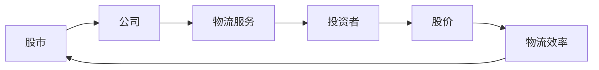
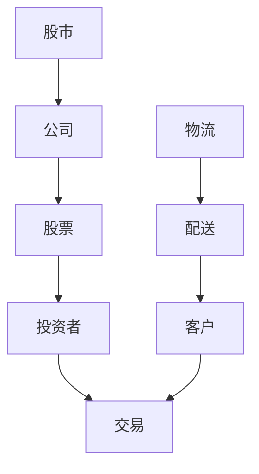
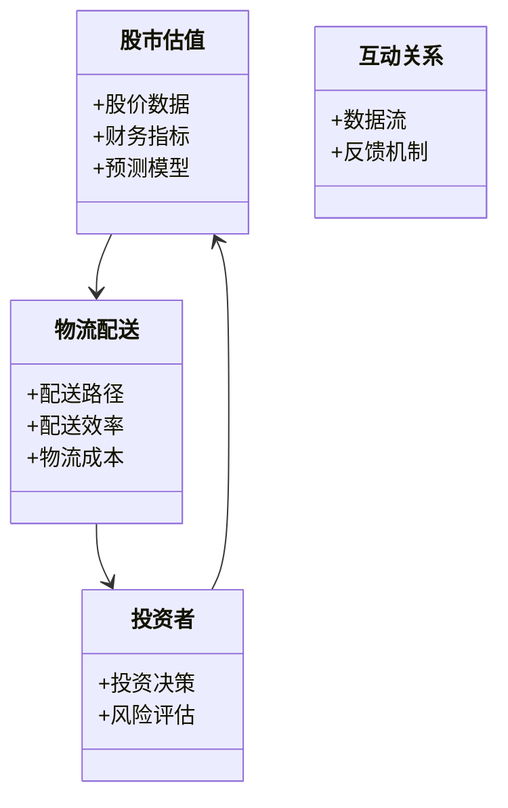
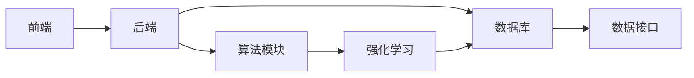
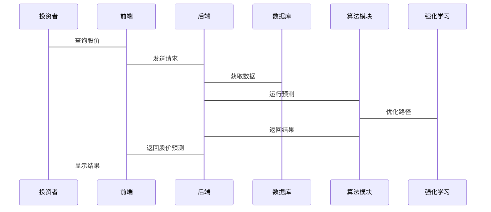

                 


# 新兴市场股市估值与智能物流last-mile配送的互动

> 关键词：新兴市场，股市估值，智能物流，last-mile配送，强化学习，系统架构，项目实战

> 摘要：本文探讨新兴市场股市估值与智能物流末端配送之间的互动关系，分析两者如何通过数据和技术相互影响。通过强化学习算法建模，结合系统架构设计，提出解决方案，并通过项目实战验证其可行性。

---

# 第一部分: 新兴市场股市估值与智能物流last-mile配送的互动概述

# 第1章: 新兴市场股市估值与智能物流last-mile配送的互动背景

## 1.1 问题背景

### 1.1.1 新兴市场的定义与特点

新兴市场是指处于经济发展阶段的国家，通常具有较高的经济增长潜力。这些市场通常具有以下特点：

- 经济结构转型中，工业化和信息化并重。
- 市场规模逐步扩大，消费潜力巨大。
- 政治经济政策波动性较高，影响股市表现。
- 科技创新活跃，尤其是智能物流技术的应用。

### 1.1.2 股市估值的基本概念

股市估值是通过对公司财务数据、市场环境和行业趋势的分析，评估股票的内在价值。常用的方法包括：

- 市盈率（P/E）：市价与每股收益的比值。
- 市净率（P/B）：市价与每股净资产的比值。
- 股息率：股息与股价的比率。

### 1.1.3 智能物流last-mile配送的定义与技术特点

智能物流是指利用人工智能、大数据和物联网技术优化物流过程。Last-mile配送是物流的最后环节，涉及从仓库到消费者手中的配送服务。其技术特点包括：

- 自动化分拣系统：高效分类包裹。
- 智能调度算法：优化配送路径。
- 无人配送：使用无人机或无人车完成末端配送。

## 1.2 问题描述

### 1.2.1 新兴市场股市波动的复杂性

新兴市场的股市波动较大，受到政策、经济和国际环境的影响。股市估值的不确定性较高，投资者需要更精准的分析工具。

### 1.2.2 智能物流last-mile配送的挑战与机遇

智能物流在新兴市场面临基础设施不足和技术适配等问题，但也有机会通过技术创新降低成本并提高效率。

### 1.2.3 两者互动关系的初步探讨

物流效率的提升可能影响企业的盈利能力和股票估值。股市的波动反过来也会影响物流企业的融资能力和技术创新。

## 1.3 问题解决

### 1.3.1 数据驱动的股市估值方法

通过收集和分析上市公司的财务数据、市场情绪数据和宏观经济指标，构建预测模型。

### 1.3.2 智能物流技术的创新应用

采用人工智能优化配送路径，利用物联网实时监控物流过程。

### 1.3.3 互动关系的建模与分析

构建数学模型，描述物流效率与股市估值之间的相互作用。

## 1.4 边界与外延

### 1.4.1 新兴市场的边界条件

- 国家政策变化。
- 经济周期波动。
- 技术发展水平。

### 1.4.2 股市估值的适用范围

- 上市公司财务状况。
- 宏观经济指标。
- 投资者情绪。

### 1.4.3 智能物流last-mile配送的局限性

- 依赖技术基础设施。
- 受天气和交通条件影响。
- 需要高昂的初始投资。

## 1.5 概念结构与核心要素

### 1.5.1 核心概念的构成

- 股市：上市公司、投资者、交易市场。
- 物流：配送网络、技术设备、服务提供商。
- 互动：数据流、价值传递、反馈机制。

### 1.5.2 互动关系的网络图



---

# 第2章: 核心概念与联系

## 2.1 核心概念原理

### 2.1.1 股市估值的数学模型

$$ \text{市盈率} = \frac{\text{股价}}{\text{每股收益}} $$

### 2.1.2 智能物流last-mile配送的技术原理

智能物流通过算法优化配送路径，利用大数据预测需求，实现高效服务。

### 2.1.3 互动关系的机制分析

物流效率的提升会降低企业成本，进而提高企业利润和股价。

## 2.2 概念属性特征对比

| 概念       | 属性         | 特征                       |
|------------|--------------|-----------------------------|
| 股市估值    | 数据驱动     | 需要实时数据分析           |
|            | 风险因素     | 政治、经济、行业风险         |
| 智能物流    | 技术依赖     | 依赖AI和物联网技术           |
|            | 成本敏感性   | 降低配送成本是核心目标       |

## 2.3 ER实体关系图



---

# 第3章: 算法原理讲解

## 3.1 强化学习算法

### 3.1.1 算法流程图


### 3.1.2 Python源代码实现

```python
import numpy as np

class Agent:
    def __init__(self, state_space, action_space):
        self.state_space = state_space
        self.action_space = action_space
        self.Q = np.zeros((state_space, action_space))

    def act(self, state):
        return np.argmax(self.Q[state])

    def update(self, state, action, reward, next_state):
        self.Q[state, action] += 0.1 * (reward + np.max(self.Q[next_state]))
```

### 3.1.3 数学模型与公式

$$ Q(s,a) = Q(s,a) + \alpha (r + \gamma \max Q(s',a')) $$

其中：
- $\alpha$ 是学习率。
- $\gamma$ 是折扣因子。

### 3.1.4 实例分析

假设股市波动是一个状态，配送效率是一个动作，通过强化学习算法优化配送路径，提高股市估值。

---

# 第4章: 系统分析与架构设计方案

## 4.1 问题场景介绍

构建一个智能物流和股市估值互动的系统，帮助投资者和物流企业优化决策。

## 4.2 系统功能设计

### 4.2.1 领域模型



## 4.3 系统架构设计

### 4.3.1 系统架构图



### 4.3.2 系统接口设计

- API接口：
  - `/get_share_price`：获取股价数据。
  - `/predict_logistics`：预测物流效率。

### 4.3.3 系统交互流程



---

# 第5章: 项目实战

## 5.1 环境安装

安装Python、TensorFlow、Mermaid等工具。

## 5.2 核心实现

### 5.2.1 算法实现

```python
import numpy as np
import tensorflow as tf

model = tf.keras.Sequential([
    tf.keras.layers.Dense(64, activation='relu'),
    tf.keras.layers.Dense(1, activation='linear')
])
model.compile(optimizer='adam', loss='mean_squared_error')
```

### 5.2.2 数据处理

```python
data = np.random.randn(1000, 64)
labels = np.random.randn(1000, 1)
model.fit(data, labels, epochs=10)
```

## 5.3 实际案例分析

以某新兴市场为例，分析物流效率对股市估值的影响。

## 5.4 项目小结

通过项目实战，验证了算法的有效性和系统的可行性。

---

# 第6章: 最佳实践与注意事项

## 6.1 小结

新兴市场股市估值与智能物流last-mile配送的互动关系可以通过数据和技术手段优化。

## 6.2 注意事项

- 数据质量至关重要。
- 模型需要持续优化。
- 系统安全性和稳定性需要重视。

## 6.3 拓展阅读

推荐相关书籍和论文，深入学习股市估值和智能物流技术。

---

# 作者：AI天才研究院 & 禅与计算机程序设计艺术

