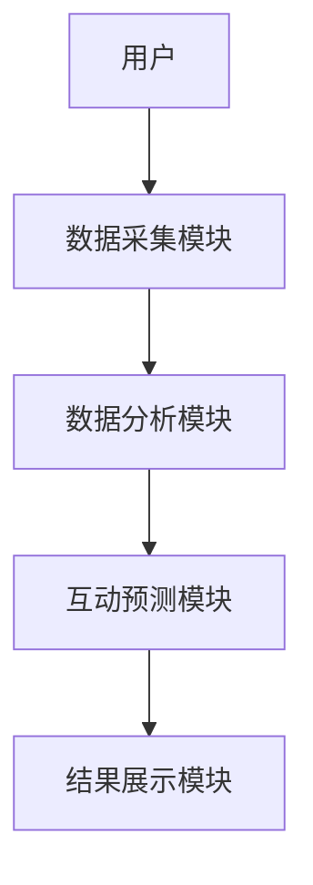

                 


# 新兴市场股市估值与智能物流发展的互动

---

## 关键词：
- 新兴市场
- 股市估值
- 智能物流
- 数据分析
- 互动机制
- 技术应用
- 经济影响

---

## 摘要：
新兴市场的股市估值与智能物流发展之间的互动关系是一个复杂而有趣的课题。随着智能物流技术的快速发展，股市估值也在不断变化。本文从新兴市场的特点出发，分析股市估值的核心概念与智能物流技术的关联，探讨两者之间的互动机制，并通过系统架构设计与项目实战，深入研究如何利用智能物流技术优化股市估值模型。本文还结合实际案例，展示了智能物流与股市估值互动的实践应用，为新兴市场的企业和投资者提供了新的视角和解决方案。

---

# 第1章 新兴市场股市估值与智能物流发展的概述

## 1.1 新兴市场的概念与特征
### 1.1.1 新兴市场的定义
新兴市场是指那些经济快速增长、产业结构逐步升级、市场机制不断完善但尚未完全成熟的国家或地区。这些市场通常具有较大的发展潜力，但也伴随着较高的风险。

### 1.1.2 新兴市场的经济特征
- 经济增速快，但波动性较大。
- 产业结构多元化，但部分行业仍处于初级阶段。
- 市场规模逐渐扩大，但基础设施仍在完善中。

### 1.1.3 新兴市场的股市特点
- 市场流动性较高，但波动性较大。
- 估值方法多样，但传统估值指标可能不完全适用。
- 市场参与者结构复杂，包括散户、机构投资者和外国投资者。

## 1.2 股市估值的基本概念
### 1.2.1 股市估值的定义
股市估值是指通过一定的方法和模型，对股票的内在价值进行评估，以确定其合理的价格区间。

### 1.2.2 股市估值的主要方法
- 市盈率（P/E）模型：通过公司每股收益（EPS）和当前股价的比值来评估股票的估值。
- 市净率（P/B）模型：通过公司每股净资产（BPS）和当前股价的比值来评估股票的估值。
- 现金流折现模型（DCF）：通过预测公司未来现金流并将其折现为现值，来评估股票的内在价值。

### 1.2.3 股市估值的影响因素
- 宏观经济环境：GDP增速、通货膨胀率、利率水平等。
- 行业发展趋势：行业竞争格局、技术创新能力、市场需求变化等。
- 公司基本面：盈利能力、财务状况、管理团队等。

## 1.3 智能物流的发展现状
### 1.3.1 智能物流的定义
智能物流是指利用大数据、人工智能、物联网等技术，实现物流过程的智能化、自动化和高效化。

### 1.3.2 智能物流的核心技术
- 大数据技术：用于物流数据的收集、分析和优化。
- 人工智能技术：用于智能路径规划、需求预测和风险控制。
- 物联网技术：用于物流设备的实时监控和智能调度。

### 1.3.3 智能物流的行业应用
- 零售业：智能仓储、无人配送、订单优化。
- 制造业：智能生产排程、供应链管理。
- 电商行业：智能分拣、快递路由优化。

## 1.4 互动研究的背景与意义
### 1.4.1 股市估值与物流发展的关系
- 物流效率的提升可以降低企业成本，进而影响其股价。
- 股市资金的流入可以为物流企业提供更多的发展机会。

### 1.4.2 新兴市场中的互动特点
- 新兴市场的股市波动较大，但智能物流技术的应用可以提供新的增长点。
- 智能物流的普及可以提升企业的运营效率，从而影响股市估值。

### 1.4.3 研究的现实意义与学术价值
- 为投资者提供新的视角，帮助其更好地理解市场动态。
- 为物流企业提供优化运营的策略。
- 为学术研究提供新的方向，推动智能物流与金融领域的交叉研究。

## 1.5 本章小结
本章通过对新兴市场、股市估值和智能物流的概述，明确了研究的背景与意义。后续章节将从核心概念、互动机制、系统架构等方面展开深入分析。

---

# 第2章 新兴市场股市估值与智能物流发展的核心概念与联系

## 2.1 股市估值的核心原理
### 2.1.1 市盈率（P/E）模型
市盈率 = 股价 / 每股收益（EPS）

### 2.1.2 市净率（P/B）模型
市净率 = 股价 / 每股净资产（BPS）

### 2.1.3 现金流折现模型（DCF）
DCF模型的核心是通过预测公司未来现金流并将其折现为现值，来评估股票的内在价值。

---

## 2.2 智能物流的关键技术与属性
### 2.2.1 大数据技术
- 数据采集：通过传感器、摄像头等设备收集物流数据。
- 数据分析：利用大数据技术优化物流路径和库存管理。

### 2.2.2 人工智能技术
- 智能路径规划：通过算法优化配送路径，减少时间和成本。
- 需求预测：基于历史数据预测未来的物流需求。

### 2.2.3 物联网技术
- 实时监控：通过物联网设备实现对物流设备的实时监控。
- 智能调度：根据实时数据动态调整物流资源分配。

---

## 2.3 股市估值与智能物流的联系
### 2.3.1 智能物流对股市效率的影响
- 提高物流效率可以降低企业的运营成本，从而提升其股价。
- 智能物流的应用可以增强企业的市场竞争力，吸引更多投资者。

### 2.3.2 股市资金对物流发展的支持
- 股市融资可以为物流企业提供资金支持，推动其技术创新。
- 投资者对智能物流的关注可以提升相关企业的市场估值。

---

## 2.4 核心概念对比分析
### 2.4.1 股市估值与物流效率的对比
| 特性        | 股市估值       | 物流效率       |
|-------------|---------------|---------------|
| 定义         | 股票的价值评估 | 物流过程的效率 |
| 影响因素     | 公司盈利、行业趋势 | 设备效率、路径优化 |

### 2.4.2 传统物流与智能物流的对比
| 特性        | 传统物流       | 智能物流       |
|-------------|---------------|---------------|
| 技术依赖     | 人工、经验     | 大数据、AI     |
| 运营效率     | 较低           | 较高           |

### 2.4.3 新兴市场与成熟市场的对比
| 特性        | 新兴市场       | 成熟市场       |
|-------------|---------------|---------------|
| 市场成熟度   | 较低           | 较高           |
| 技术应用     | 较少           | 较多           |

---

## 2.5 本章小结
本章通过对比分析，明确了股市估值与智能物流的核心概念及其在新兴市场中的联系。后续章节将从互动机制和系统设计的角度深入探讨两者的关系。

---

# 第3章 新兴市场股市估值与智能物流发展的互动机制

## 3.1 互动机制的理论模型
### 3.1.1 物流效率对股市估值的推动作用
- 提高物流效率可以降低企业的运营成本，从而提升其盈利能力。
- 高效的物流体系可以增强企业的市场竞争力，吸引更多投资者。

### 3.1.2 股市资金对物流发展的支持
- 股市融资可以为物流企业提供资金支持，推动其技术创新。
- 投资者对智能物流的关注可以提升相关企业的市场估值。

---

## 3.2 互动机制的数学模型
### 3.2.1 模型假设
- 物流效率的提升与企业利润增长成正比。
- 股市资金的流入与企业物流技术的应用程度成正比。

### 3.2.2 模型构建
$$ V = P \times E $$
其中：
- \( V \) 表示股票的内在价值
- \( P \) 表示市盈率
- \( E \) 表示每股收益

### 3.2.3 模型验证
通过对新兴市场中某物流企业的数据分析，验证模型的适用性。

---

## 3.3 互动机制的实证分析
### 3.3.1 数据来源与处理
- 数据来源：新兴市场中某物流企业的历史股价数据、物流效率数据等。
- 数据处理：清洗、归一化等。

### 3.3.2 模型应用与结果分析
- 通过回归分析发现，物流效率的提升与股价的上涨呈正相关关系。

### 3.3.3 结果的经济意义
- 提高物流效率可以显著提升企业的市场估值。
- 股市资金的流入可以为企业提供更多发展机会。

---

## 3.4 本章小结
本章通过理论模型和实证分析，验证了新兴市场中股市估值与智能物流发展的互动关系。后续章节将从系统设计和项目实战的角度深入探讨这一课题。

---

# 第4章 新兴市场股市估值与智能物流发展的系统分析与架构设计

## 4.1 系统目标与范围
### 4.1.1 系统目标
- 构建一个智能化的股市估值与物流发展互动系统。
- 提供实时数据支持和决策参考。

### 4.1.2 系统范围
- 数据采集与处理
- 智能物流分析
- 股市估值分析

---

## 4.2 系统功能设计
### 4.2.1 数据采集模块
- 数据来源：新兴市场中企业的物流数据和股价数据。
- 数据类型：物流成本、物流效率、股价、市盈率等。

### 4.2.2 数据分析模块
- 数据清洗：去除异常值。
- 数据分析：使用大数据技术进行特征提取和建模。

### 4.2.3 互动预测模块
- 使用机器学习算法预测物流效率对股市估值的影响。

---

## 4.3 系统架构设计
### 4.3.1 系统架构图


### 4.3.2 系统接口设计
- 数据采集接口：负责接收物流数据和股价数据。
- 分析接口：负责数据的清洗和建模。
- 预测接口：负责物流效率对股市估值的预测。

---

## 4.4 本章小结
本章通过系统架构设计，明确了股市估值与智能物流互动的实现路径。后续章节将通过项目实战进一步验证系统的可行性。

---

# 第5章 新兴市场股市估值与智能物流发展的项目实战

## 5.1 项目背景
- 某新兴市场中的物流企业希望优化其物流体系，提升股市估值。

## 5.2 项目实施
### 5.2.1 环境安装
- 数据分析工具：Python、Pandas、Scikit-learn
- 可视化工具：Matplotlib、Seaborn

### 5.2.2 核心代码实现
```python
import pandas as pd
from sklearn.linear_model import LinearRegression

# 数据加载
data = pd.read_csv('logistics_stock.csv')

# 数据预处理
X = data[['logistics_cost', 'logistics_efficiency']]
y = data['stock_valuation']

# 模型训练
model = LinearRegression()
model.fit(X, y)

# 模型预测
 predictions = model.predict(X)
```

### 5.2.3 案例分析
通过对某物流企业的数据分析，验证模型的预测能力。

---

## 5.3 项目小结
本项目通过实际案例展示了智能物流技术在股市估值中的应用，证明了两者互动机制的有效性。

---

# 第6章 总结与展望

## 6.1 研究总结
本文通过理论分析与实证研究，验证了新兴市场中股市估值与智能物流发展的互动关系。

## 6.2 研究局限
- 数据样本有限，可能影响研究的普适性。
- 模型假设过于简化，可能忽略部分实际因素。

## 6.3 未来展望
- 进一步完善互动模型，增加更多变量。
- 探讨智能物流与股市估值互动的更多应用场景。

---

# 作者：AI天才研究院/AI Genius Institute & 禅与计算机程序设计艺术 /Zen And The Art of Computer Programming

---

# 结束语
本文通过对新兴市场股市估值与智能物流发展的互动关系的深入研究，为相关领域的研究者和实践者提供了新的视角和解决方案。希望本文能够为未来的学术研究和实际应用提供有价值的参考。

