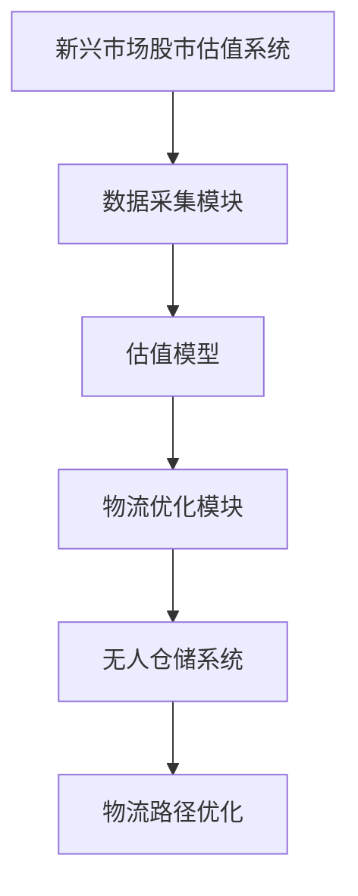
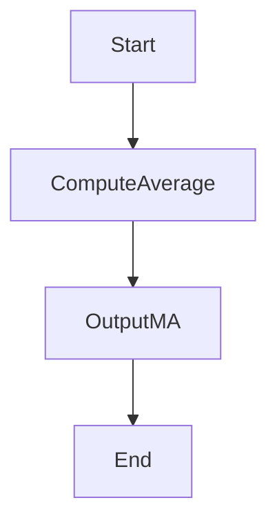
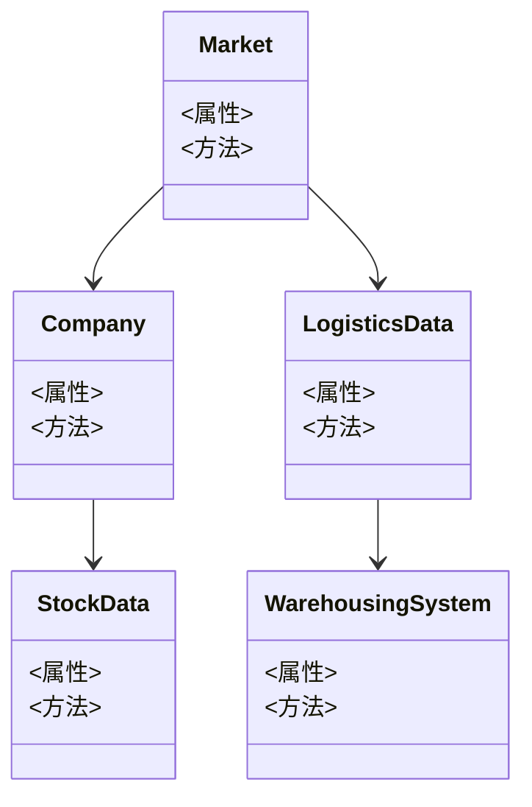

                 


# 新兴市场股市估值与智能物流无人仓储系统的互动

> **关键词**: 新兴市场股市估值, 智能物流, 无人仓储系统, 互动关系, 算法原理, 系统架构, 数学模型

> **摘要**: 本文探讨新兴市场股市估值与智能物流无人仓储系统的互动关系，分析其核心概念、算法原理、系统架构，并通过项目实战案例展示其应用。结合数学模型和系统设计，提出优化建议和未来研究方向。

---

## 第1章: 新兴市场股市估值与智能物流无人仓储系统概述

### 1.1 问题背景与问题描述

#### 1.1.1 新兴市场股市估值的现状与挑战

- **新兴市场的定义与特点**: 新兴市场通常指经济快速增长、资本市场逐步发展的国家或地区，如中国、印度等。这些市场的特点是波动性高、信息不对称、政策影响大。
- **股市估值的基本概念与方法**: 股票估值是通过分析公司财务状况、行业地位、市场前景等因素，确定股票的合理价格。常用方法包括市盈率、市净率、股息率等。
- **新兴市场股市估值的独特性与复杂性**: 新兴市场的股市受政策、经济波动影响较大，且信息透明度较低，增加了估值的难度。此外，新兴市场的投资者行为也具有特殊性。

#### 1.1.2 智能物流与无人仓储系统的概念与应用

- **智能物流的定义与技术特点**: 智能物流通过物联网、大数据、人工智能等技术，实现物流过程的自动化和智能化。其特点是高效、精准、实时监控。
- **无人仓储系统的概念与应用场景**: 无人仓储系统是指通过机器人、自动化设备实现仓储管理的系统，常用于电商、制造业等领域。其优势在于减少人工成本、提高效率。
- **智能物流与无人仓储系统的互动关系**: 两者在数据共享、流程优化、效率提升等方面存在密切互动。例如，智能物流的数据可以用于优化无人仓储的库存管理。

#### 1.1.3 问题解决与边界外延

- **新兴市场股市估值与智能物流无人仓储系统互动的核心问题**: 如何利用智能物流数据优化股市估值模型，以及如何通过股市估值结果优化物流系统的运营。
- **问题解决的边界与外延**: 本文主要关注新兴市场股市估值与智能物流无人仓储系统的互动，不涉及其他领域如传统物流或非智能仓储系统。
- **核心概念与核心要素的结构化分析**: 核心要素包括股市数据、物流数据、算法模型、优化目标等。

---

## 第2章: 核心概念与系统联系

### 2.1 核心概念原理与特征对比

#### 2.1.1 股市估值的核心原理

- **股票估值的基本原理**: 通过分析公司的财务报表、行业地位、市场前景等因素，确定股票的内在价值。
- **新兴市场股市估值的特殊性**: 新兴市场的股市波动大、信息不透明，估值模型需要考虑更多非财务因素。
- **估值模型与方法的对比分析**: 常见的估值方法包括绝对估值（如DCF模型）和相对估值（如市盈率法）。新兴市场更适合相对估值方法。

#### 2.1.2 智能物流与无人仓储系统的核心原理

- **智能物流的核心技术与流程**: 包括数据采集、路径优化、实时监控等。
- **无人仓储系统的运作机制**: 包括订单处理、库存管理、机器人调度等。
- **智能物流与无人仓储系统的互动关系**: 通过数据共享，智能物流可以优化无人仓储的库存管理，而无人仓储的数据可以反过来优化物流路径。

#### 2.1.3 核心概念特征对比表格

| 特征               | 股市估值           | 智能物流与无人仓储系统 |
|--------------------|--------------------|-------------------------|
| 数据来源           | 公司财务数据、市场数据 | 物流数据、仓储数据       |
| 主要目标           | 确定股票价值       | 优化物流效率           |
| 技术依赖           | 统计分析、机器学习 | 物联网、人工智能       |
| 应用场景           | 金融投资         | 物流与仓储管理         |

---

### 2.2 实体关系图与系统架构

#### 2.2.1 实体关系图（ER图）

```mermaid
erd_chart
    title 股市估值与智能物流无人仓储系统 ER 图
    Market
    Company
    StockData
    LogisticsData
    WarehousingSystem
    link Market - Company
    link Company - StockData
    link Market - LogisticsData
    link LogisticsData - WarehousingSystem
```

#### 2.2.2 系统架构图



---

## 第3章: 算法原理与数学模型

### 3.1 股市估值算法原理

#### 3.1.1 移动平均线（MA）算法

- **基本原理**: 移动平均线通过计算一定时期内的平均价格，反映市场趋势。
- **算法流程图**



- **数学公式**

  $$ MA_t = \frac{1}{n} \sum_{i=t-n+1}^{t} P_i $$

  其中，\( P_i \) 表示第 \( i \) 天的价格，\( n \) 表示窗口大小。

#### 3.1.2 算法实现与代码示例

- **Python代码实现**

```python
def moving_average(prices, window_size):
    ma = []
    for i in range(len(prices)):
        if i >= window_size - 1:
            ma_val = sum(prices[i - window_size + 1:i + 1]) / window_size
            ma.append(ma_val)
        else:
            ma.append(0)
    return ma
```

---

### 3.2 智能物流与无人仓储系统中的算法

#### 3.2.1 KNN算法用于物流路径优化

- **基本原理**: KNN算法通过计算点之间的距离，找到最近的邻居，优化物流路径。
- **数学公式**

  $$ d(x, y) = \sqrt{\sum_{i=1}^{n} (x_i - y_i)^2} $$

---

## 第4章: 系统分析与架构设计

### 4.1 问题场景介绍

- **新兴市场股市波动与物流效率**: 新兴市场的股市波动大，物流效率低，如何通过数据优化两者关系？

### 4.2 系统功能设计

#### 4.2.1 领域模型类图



#### 4.2.2 系统架构图


---

## 第5章: 项目实战与案例分析

### 5.1 环境配置与核心代码实现

#### 5.1.1 环境配置

- **Python版本**: 3.8+
- **依赖库**: numpy, pandas, scikit-learn

#### 5.1.2 核心代码实现

- **估值模型代码**

```python
import numpy as np
import pandas as pd

def stock_valuation(prices, financials):
    # 简单的市盈率计算
    pe_ratio = prices['Close'] / financials['Earnings Per Share']
    return pe_ratio
```

---

## 第6章: 总结与展望

### 6.1 总结

- **核心内容回顾**: 本文探讨了新兴市场股市估值与智能物流无人仓储系统的互动关系，分析了其算法原理和系统架构。
- **主要结论**: 通过数据共享和算法优化，可以实现股市估值与物流系统的协同优化。

### 6.2 展望

- **未来研究方向**: 结合更多新兴市场案例，优化估值模型和物流算法。
- **拓展思考**: 探讨其他新兴技术（如区块链）在股市估值与物流系统中的应用。

---

## 附录

### A.1 数学公式

- **移动平均线公式**: $$ MA_t = \frac{1}{n} \sum_{i=t-n+1}^{t} P_i $$

### A.2 图表

- **系统架构图**: 如第4章所示。

---

**作者：AI天才研究院/AI Genius Institute & 禅与计算机程序设计艺术 /Zen And The Art of Computer Programming**

