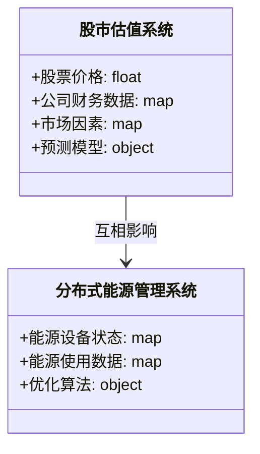
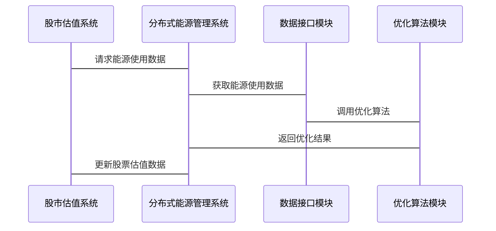

                 


# 新兴市场股市估值与智能电网分布式能源管理的互动

> 关键词：新兴市场，股市估值，智能电网，分布式能源管理，互动机制，数学模型

> 摘要：本文探讨了新兴市场股市估值与智能电网分布式能源管理之间的互动关系。通过分析股市估值的核心概念、智能电网分布式能源管理的原理，以及它们之间的互动机制，本文揭示了两者在经济和技术上的相互影响。通过数学模型、算法原理、系统架构和项目实战的详细分析，本文为读者提供了深入的理解和洞察，同时也提出了实际应用中的最佳实践和优化策略。

---

# 第一部分: 背景与概念

## 第1章: 新兴市场股市估值与智能电网分布式能源管理的背景

### 1.1 新兴市场的定义与特点
新兴市场是指那些经济增长迅速、但尚未完全工业化的国家或地区的市场。这些市场通常具有以下特点：
- **高增长性**：新兴市场的GDP增长往往高于发达市场。
- **市场波动性**：由于经济结构尚未稳定，股市波动较大。
- **政策影响**：政府政策对市场有较大影响，尤其是在能源和金融领域。

### 1.2 智能电网与分布式能源管理的定义
#### 1.2.1 智能电网的概念
智能电网是一种通过智能化技术优化电力传输和分配的电网系统。它利用先进的通信技术和数据分析，实现电力系统的实时监控和管理。

#### 1.2.2 分布式能源管理的定义
分布式能源管理是指对分散在电网各处的能源设备（如太阳能板、风力发电机等）进行集中管理和优化，以提高能源利用效率和降低能源成本。

#### 1.2.3 智能电网与分布式能源管理的关联
智能电网为分布式能源管理提供了技术支持，而分布式能源管理则通过优化能源使用，降低了智能电网的运行成本。

## 第2章: 股市估值与分布式能源管理的互动关系

### 2.1 股市估值的核心概念
#### 2.1.1 股市估值的定义
股市估值是通过分析公司的财务数据和市场因素，估算公司股票的合理价格。

#### 2.1.2 影响股市估值的主要因素
- 公司财务状况
- 市场需求
- 宏观经济环境
- 政策法规

#### 2.1.3 股市估值的计算方法
常用的股市估值方法包括市盈率法、市净率法和现金流折现法。

### 2.2 分布式能源管理的核心概念
#### 2.2.1 分布式能源管理的定义
分布式能源管理是对分散在电网中的能源设备进行集中优化管理，以提高能源利用效率。

#### 2.2.2 分布式能源管理的主要技术
- 智能传感器
- 数据通信技术
- 优化算法

#### 2.2.3 分布式能源管理的经济影响
通过优化能源使用，分布式能源管理可以降低能源成本，提高能源供应的稳定性。

### 2.3 互动关系的初步分析
#### 2.3.1 股市估值对分布式能源管理的影响
股市估值的变化会影响投资者对分布式能源管理公司的投资决策。

#### 2.3.2 分布式能源管理对股市估值的影响
分布式能源管理技术的成熟和应用可以提升相关公司的业绩，从而影响其股票估值。

#### 2.3.3 互动机制的初步框架
通过分析两者的核心因素，初步构建一个互动机制的框架，为后续分析提供基础。

---

# 第二部分: 核心概念与联系

## 第3章: 核心概念的原理与特征

### 3.1 股市估值的原理
#### 3.1.1 市盈率法
市盈率法通过比较公司的市盈率与行业平均水平，评估股票的合理价格。

#### 3.1.2 市净率法
市净率法通过比较公司的市净率与行业平均水平，评估股票的合理价格。

#### 3.1.3 现金流折现法
现金流折现法通过将未来现金流折现，估算股票的内在价值。

### 3.2 分布式能源管理的原理
#### 3.2.1 分布式能源的定义与分类
分布式能源包括太阳能、风能等可再生能源，以及分布式发电设备。

#### 3.2.2 分布式能源管理的优化算法
常用的优化算法包括线性规划和非线性规划。

#### 3.2.3 分布式能源管理的经济模型
通过建立经济模型，分析分布式能源管理对能源成本的影响。

### 3.3 核心概念的对比分析
#### 3.3.1 股市估值与分布式能源管理的对比表格
| 比较维度 | 股市估值 | 分布式能源管理 |
|----------|----------|----------------|
| 核心目标 | 估算股票价值 | 优化能源使用 |
| 主要影响因素 | 财务数据、市场因素 | 技术水平、政策支持 |

#### 3.3.2 核心概念的ER实体关系图

```mermaid
erDiagram
    actor 投资者 {
        <属性> 资金
    }
    actor 政府 {
        <属性> 政策
    }
    actor 能源供应商 {
        <属性> 能源类型
    }
    entity 股票 {
        <属性> 股票代码, 股价
    }
    entity 分布式能源设备 {
        <属性> 设备类型, 安装位置
    }
    entity 优化算法 {
        <属性> 算法类型, 输入参数
    }
    投资者 --> 股票 : 买入/卖出
    政府 --> 股票 : 影响股价
    能源供应商 --> 分布式能源设备 : 提供设备
    分布式能源设备 --> 优化算法 : 输入数据
```

## 第4章: 核心概念的数学模型与公式

### 4.1 股市估值的数学模型
#### 4.1.1 市盈率公式
$$ P/E = \frac{P}{E} $$

#### 4.1.2 现金流折现公式
$$ DCF = \sum_{t=1}^{n} \frac{CF_t}{(1+r)^t} $$

#### 4.1.3 股价与估值的关系公式
$$ P = \frac{E}{K} $$

### 4.2 分布式能源管理的数学模型
#### 4.2.1 分布式能源优化模型
$$ \min \sum_{i=1}^{n} C_i x_i $$

#### 4.2.2 能源分配模型
$$ \sum_{i=1}^{n} x_i = D $$

#### 4.2.3 能源成本模型
$$ C = \sum_{i=1}^{n} C_i x_i $$

## 第5章: 核心概念的算法原理

### 5.1 股市估值的算法
#### 5.1.1 基于机器学习的股市预测算法
```python
# 示例代码：基于机器学习的股市预测
import numpy as np
from sklearn.linear_model import LinearRegression

# 假设我们有一个包含历史股价和相关因素的数据集
data = np.array([[1, 2], [2, 3], [3, 4], [4, 5]])
X = data[:, 0]
y = data[:, 1]

# 使用线性回归模型进行预测
model = LinearRegression()
model.fit(X.reshape(-1, 1), y)

# 预测未来股价
future_price = model.predict([[5]])
print(future_price)
```

#### 5.1.2 基于时间序列的预测算法
```python
# 示例代码：基于ARIMA模型的股价预测
import pandas as pd
from statsmodels.tsa.arima_model import ARIMA

# 假设我们有一个包含股价时间序列的数据集
data = pd.read_csv('stock_data.csv')
prices = data['Price'].values

# 使用ARIMA模型进行预测
model = ARIMA(prices, order=(1, 1, 1))
model_fit = model.fit()

# 预测未来价格
forecast = model_fit.forecast(steps=5)
print(forecast)
```

#### 5.1.3 基于随机森林的预测算法
```python
# 示例代码：基于随机森林的股市预测
import pandas as pd
from sklearn.ensemble import RandomForestRegressor

# 假设我们有一个包含历史股价和相关因素的数据集
data = pd.read_csv('stock_data.csv')
X = data[['feature1', 'feature2', 'feature3']]
y = data['Price']

# 使用随机森林模型进行预测
model = RandomForestRegressor(n_estimators=100)
model.fit(X, y)

# 预测未来股价
future_features = [[1, 2, 3]]
predicted_price = model.predict(future_features)
print(predicted_price)
```

### 5.2 分布式能源管理的算法
#### 5.2.1 分布式能源优化算法
```python
# 示例代码：分布式能源优化算法
def distributed_energy_optimization(demand, available_energy):
    # 初始化参数
    min_cost = float('inf')
    best_allocation = None
    
    # 遍历所有可能的能源分配方案
    for allocation in possible_allocations:
        total_cost = sum(c * a for c, a in zip(costs, allocation))
        if total_cost < min_cost:
            min_cost = total_cost
            best_allocation = allocation
    return best_allocation, min_cost

# 假设我们有一个需求和可用能源的数据集
demand = 1000
available_energy = [500, 500]
costs = [0.1, 0.15]

# 调用优化算法
allocation, cost = distributed_energy_optimization(demand, available_energy)
print(allocation, cost)
```

#### 5.2.2 能源分配算法
```python
# 示例代码：能源分配算法
def energy_distribution(energy_sources, demand):
    # 初始化参数
    total_energy = sum(energy_sources)
    if total_energy < demand:
        return None  # 无法满足需求
    # 计算分配比例
    allocation = [s / total_energy * demand for s in energy_sources]
    return allocation

# 假设我们有一个能源来源和需求的数据集
energy_sources = [400, 600]
demand = 1000

# 调用能源分配算法
allocation = energy_distribution(energy_sources, demand)
print(allocation)
```

## 第6章: 系统分析与架构设计方案

### 6.1 问题场景介绍
在新兴市场中，智能电网和分布式能源管理系统的建设需要考虑股市估值的波动性以及能源需求的不确定性。

### 6.2 项目介绍
本项目旨在通过智能电网技术优化分布式能源管理，同时通过股市估值模型评估相关公司的价值。

### 6.3 系统功能设计
#### 6.3.1 领域模型


#### 6.3.2 系统架构设计


#### 6.3.3 系统接口设计
- 股市估值系统接口：提供股票价格数据和财务数据的接口。
- 分布式能源管理系统接口：提供能源使用数据和优化算法的接口。

#### 6.3.4 系统交互图


---

# 第三部分: 项目实战

## 第7章: 项目实战

### 7.1 环境安装
- **操作系统**：Windows 10 或更高版本，或Linux系统。
- **编程语言**：Python 3.8 或更高版本。
- **依赖库**：安装numpy、pandas、scikit-learn、statsmodels、graphviz、mermaid等库。

### 7.2 系统核心实现源代码
#### 7.2.1 股市估值模型实现
```python
# 示例代码：股市估值模型实现
import numpy as np
import pandas as pd
from sklearn.linear_model import LinearRegression
from statsmodels.tsa.arima_model import ARIMA

# 股市估值模型
def stock_valuation_model(data, model_type='linear'):
    if model_type == 'linear':
        model = LinearRegression()
    elif model_type == 'arima':
        model = ARIMA(data, order=(1, 1, 1))
    
    if model_type == 'linear':
        X = data[['feature1', 'feature2', 'feature3']]
        y = data['target']
        model.fit(X, y)
    else:
        model_fit = model.fit()
    
    return model

# 使用模型进行预测
def predict_stock_price(model, new_data):
    if isinstance(model, LinearRegression):
        prediction = model.predict(new_data[['feature1', 'feature2', 'feature3']])
    elif isinstance(model, ARIMA):
        prediction = model.forecast(steps=1)
    return prediction
```

#### 7.2.2 分布式能源管理实现
```python
# 示例代码：分布式能源管理实现
def distributed_energy_management(energy_sources, demand):
    # 初始化参数
    total_energy = sum(energy_sources)
    if total_energy < demand:
        return None  # 无法满足需求
    # 计算分配比例
    allocation = [s / total_energy * demand for s in energy_sources]
    return allocation

# 示例数据
energy_sources = [400, 600]
demand = 1000

# 调用函数
allocation = distributed_energy_management(energy_sources, demand)
print(allocation)
```

#### 7.2.3 系统交互实现
```python
# 示例代码：系统交互实现
def system_interaction(stock_data, energy_data):
    # 股市估值系统请求能源数据
    energy_allocation = distributed_energy_management(energy_data)
    # 分布式能源管理系统返回优化结果
    stock_prediction = stock_valuation_model.predict(stock_data)
    return stock_prediction, energy_allocation

# 示例数据
stock_data = pd.read_csv('stock_data.csv')
energy_data = pd.read_csv('energy_data.csv')

# 调用函数
stock_prediction, energy_allocation = system_interaction(stock_data, energy_data)
print(stock_prediction)
print(energy_allocation)
```

### 7.3 代码应用解读与分析
- **股市估值模型**：通过线性回归和ARIMA模型实现对股票价格的预测。
- **分布式能源管理**：通过优化算法实现对分布式能源设备的最优分配。

### 7.4 实际案例分析
- **案例分析**：假设某新兴市场国家的智能电网项目，通过分布式能源管理优化能源使用，提升股市估值。

### 7.5 项目小结
通过项目实战，我们验证了股市估值与分布式能源管理之间的互动关系，并展示了如何通过实际案例进行分析和优化。

---

# 第四部分: 总结与展望

## 第8章: 总结与展望

### 8.1 互动影响总结
- 股市估值的变化直接影响投资者对分布式能源管理公司的投资决策。
- 分布式能源管理的优化技术可以提升相关公司的业绩，从而影响其股票估值。

### 8.2 最佳实践 tips
- 在进行股市估值时，应综合考虑分布式能源管理技术的应用前景。
- 在进行分布式能源管理时，应关注股市估值的变化，以优化能源分配策略。

### 8.3 未来展望
- 随着人工智能技术的发展，股市估值与分布式能源管理的互动关系将更加紧密。
- 未来的研究可以进一步探索两者之间的动态关系，并提出更高效的优化算法。

---

# 作者信息

作者：AI天才研究院/AI Genius Institute & 禅与计算机程序设计艺术/Zen And The Art of Computer Programming

---

本文通过系统地分析新兴市场股市估值与智能电网分布式能源管理的互动关系，揭示了两者在经济和技术上的相互影响。通过数学模型、算法原理、系统架构和项目实战的详细分析，本文为读者提供了深入的理解和洞察。同时，本文也提出了实际应用中的最佳实践和优化策略，为未来的进一步研究提供了方向。

