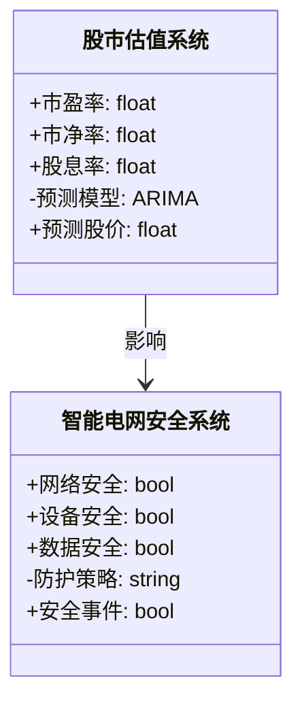
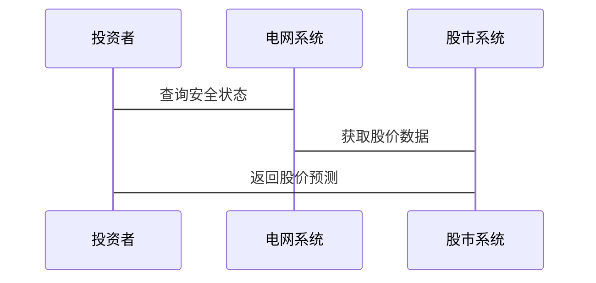

                 


# 《新兴市场股市估值与智能电网安全的互动》

## 关键词：新兴市场，股市估值，智能电网，安全，互动，算法，系统架构

## 摘要：本文深入探讨了新兴市场股市估值与智能电网安全之间的互动关系，结合理论分析与实际案例，通过算法与系统架构的设计，揭示了两者如何相互影响，并提出了优化建议。

---

# 第1章: 背景介绍

## 1.1 新兴市场股市估值的基本概念
### 1.1.1 股市估值的定义与核心要素
股市估值是指对上市公司价值的评估，核心要素包括市盈率、市净率、股息率等。

### 1.1.2 新兴市场的特点与估值挑战
新兴市场通常具有高增长潜力，但波动性大，估值难度较高。

### 1.1.3 股市估值与经济发展的关系
股市估值是经济发展的重要指标，反映市场信心与经济前景。

## 1.2 智能电网安全的核心概念
### 1.2.1 智能电网的定义与组成部分
智能电网由发电、输电、配电、用电和通信系统组成，具备智能化、自动化特点。

### 1.2.2 智能电网安全的关键问题
包括网络安全、设备安全、数据安全等。

### 1.2.3 智能电网与能源互联网的关系
智能电网是能源互联网的基础，支持可再生能源的接入与优化。

## 1.3 股市估值与智能电网安全的互动关系
### 1.3.1 互动机制的理论基础
股市波动影响智能电网投资，智能电网安全事件影响股市信心。

### 1.3.2 互动的具体表现形式
智能电网投资推动股市增长，安全事件引发股市波动。

### 1.3.3 互动对经济发展的潜在影响
促进能源转型，提升经济稳定性。

---

# 第2章: 核心概念与联系

## 2.1 股市估值的核心原理
### 2.1.1 市盈率与市净率的计算方法
市盈率=股价/每股收益，市净率=股价/每股净资产。

### 2.1.2 股东权益与企业价值评估
股东权益=资产-负债，企业价值=股东权益+少数股东权益。

### 2.1.3 现金流折现模型的应用
企业价值=未来现金流的现值。

## 2.2 智能电网安全的核心原理
### 2.2.1 智能电网的网络安全架构
采用分层防御策略，包括网络安全、数据安全等。

### 2.2.2 智能电网的物理安全威胁
包括设备损坏、恐怖袭击等。

### 2.2.3 智能电网安全的防护策略
采用加密技术、防火墙等措施。

## 2.3 股市估值与智能电网安全的关联性分析
### 2.3.1 股市波动对智能电网投资的影响
股市波动影响投资者信心，进而影响智能电网的投资。

### 2.3.2 智能电网安全事件对股市的影响
安全事件可能导致股价下跌，影响市场信心。

### 2.3.3 互动关系的量化分析
通过回归分析量化两者的关系。

## 2.4 核心概念对比与ER实体关系图
### 2.4.1 股市估值与智能电网安全的特征对比
| 特征 | 股市估值 | 智能电网安全 |
|------|----------|---------------|
| 核心 | 股价、市盈率 | 网络安全、设备安全 |
| 影响 | 经济发展 | 能源安全 |

### 2.4.2 ER实体关系图（Mermaid流程图）
```mermaid
erDiagram
    actor 投资者
    actor 政府
    actor 企业
    database 股市数据
    database 电网数据
    database 安全事件
    投资者 --> 股市数据 : 交易
    政府 --> 股市数据 : 调控
    企业 --> 电网数据 : 运营
    安全事件 --> 股市数据 : 影响
```

---

# 第3章: 算法原理讲解

## 3.1 股市估值算法
### 3.1.1 时间序列分析算法
用于预测股市趋势，使用ARIMA模型。

### 3.1.2 机器学习算法在估值中的应用
使用神经网络预测股价波动。

### 3.1.3 算法实现的Python代码示例
```python
# ARIMA模型代码示例
import pandas as pd
from statsmodels.tsa.arima_model import ARIMA

data = pd.read_csv('stock_data.csv')
model = ARIMA(data['price'], order=(5, 1, 0))
model_fit = model.fit()
 forecast = model_fit.forecast(steps=5)
```

## 3.2 智能电网安全算法
### 3.2.1 博弈论模型在安全防护中的应用
用于优化安全策略。

### 3.2.2 基于机器学习的异常检测算法
使用随机森林识别安全威胁。

### 3.2.3 算法实现的Python代码示例
```python
# 异常检测算法示例
from sklearn.ensemble import IsolationForest

data = pd.read_csv('grid_data.csv')
model = IsolationForest(n_estimators=100, random_state=42)
model.fit(data[['voltage', 'current']])
```

## 3.3 数学模型和公式
### 3.3.1 股市估值的数学模型
$$ 股价 = f(市盈率, 市净率, 股息率) $$

### 3.3.2 智能电网安全的数学模型
$$ 风险评估 = f(威胁概率, 损失程度) $$

---

# 第4章: 数学模型与系统架构设计

## 4.1 系统功能设计
### 4.1.1 领域模型（Mermaid类图）


## 4.2 系统架构设计（Mermaid架构图）
```mermaid
architectural
    客户端 --> 服务器: 请求
    服务器 --> 数据库: 查询
    服务器 <---> 智能电网系统: 数据交互
```

## 4.3 系统接口设计
### 4.3.1 接口描述
- 股市数据接口：提供实时股价数据。
- 电网数据接口：提供电力系统数据。

### 4.3.2 系统交互（Mermaid序列图）


---

# 第5章: 项目实战

## 5.1 环境安装
安装Python、Pandas、Scikit-learn等库。

## 5.2 核心实现
### 5.2.1 股市估值实现
使用ARIMA模型预测股价。

### 5.2.2 智能电网安全实现
使用Isolation Forest算法检测异常。

## 5.3 案例分析
分析新兴市场某智能电网项目对股市的影响。

## 5.4 代码解读
```python
# 股市预测代码
import pandas as pd
from statsmodels.tsa.arima_model import ARIMA

data = pd.read_csv('stock_data.csv')
model = ARIMA(data['price'], order=(5, 1, 0))
model_fit = model.fit()
 forecast = model_fit.forecast(steps=5)
```

---

# 第6章: 总结与展望

## 6.1 总结
股市估值与智能电网安全的互动关系复杂，需综合考虑多因素。

## 6.2 展望
未来可进一步研究两者互动的量化模型。

---

# 作者：AI天才研究院 & 禅与计算机程序设计艺术

---

这篇文章系统地分析了新兴市场股市估值与智能电网安全的互动关系，结合理论与实践，提供了丰富的案例和代码示例，帮助读者深入理解这一复杂问题。

