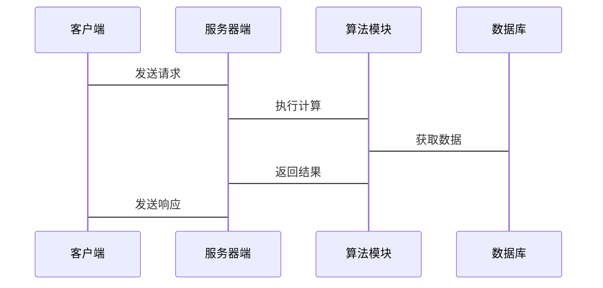

                 


# 新兴市场股市估值与智能电网微电网技术的互动

> 关键词：新兴市场、股市估值、智能电网、微电网技术、互动关系

> 摘要：本文探讨了新兴市场股市估值与智能电网微电网技术之间的互动关系，分析了智能电网和微电网技术对股市估值的影响，以及新兴市场中这些技术如何通过改变能源结构和企业盈利能力来影响股票价格。文章从技术基础、估值方法、互动机制、系统架构等多个角度展开，结合实际案例和系统设计，为投资者和技术专家提供了深入的分析和见解。

---

## 第一章：新兴市场与智能电网微电网技术概述

### 1.1 新兴市场的定义与特点
#### 1.1.1 新兴市场的定义
新兴市场是指经济快速发展、金融市场逐渐成熟但尚未完全发达的国家或地区。这些市场通常具有较高的增长率，但也伴随着较高的风险。

#### 1.1.2 新兴市场的经济与金融特点
- 高经济增长率
- 金融市场逐步完善
- 外资流入与流出频繁
- 经济结构转型

#### 1.1.3 新兴市场的股市发展现状
- 股市规模快速增长
- 投资者结构多样化
- 市场波动性较大

### 1.2 智能电网与微电网技术的定义
#### 1.2.1 智能电网的定义与组成部分
智能电网是一种通过先进信息通信技术、传感器和自动化系统，实现电力系统各个环节智能监测、分析和控制的现代化电力系统。

- **组成部分**：发电、输电、配电、用电、通信系统
- **核心特征**：智能化、自动化、互动化

#### 1.2.2 微电网的定义与工作原理
微电网是小型分布式能源系统，通常由分布式电源、储能系统、负荷和转换装置组成，能够独立运行或并入主电网。

- **工作原理**：通过协调控制实现能量优化分配和管理
- **优势**：灵活性高、可靠性强

#### 1.2.3 智能电网与微电网的技术优势
- 提高能源利用效率
- 降低碳排放
- 增强电网灵活性和适应性

### 1.3 股市估值与智能电网微电网技术的互动关系
#### 1.3.1 股市估值的基本概念
- 股市估值：通过财务指标和市场分析预测股票价值的过程
- 互动关系：智能电网和微电网技术通过改变能源结构和企业盈利模式，影响股市估值

#### 1.3.2 智能电网微电网技术对股市估值的影响
- 提高企业盈利能力
- 降低运营成本
- 增强市场竞争力

#### 1.3.3 互动关系的背景与意义
- 技术进步推动股市变化
- 市场需求影响技术发展
- 政策支持促进技术应用

---

## 第二章：智能电网微电网技术的技术基础

### 2.1 智能电网的核心技术
#### 2.1.1 智能电网的通信技术
- 电力线通信（PLC）
- 无线通信技术（Wi-Fi、4G、5G）

#### 2.1.2 智能电网的数据采集与分析
- 先进计量系统（AMI）
- 数据挖掘与预测分析

#### 2.1.3 智能电网的自动化控制
- 自动化开关设备
- 分布式控制技术

### 2.2 微电网的技术特点
#### 2.2.1 微电网的组成结构
- 分布式电源（如太阳能、风能）
- 储能系统（电池）
- 变流器和转换装置

#### 2.2.2 微电网的能量管理技术
- 负荷预测
- 能源优化调度

#### 2.2.3 微电网的并网与孤岛运行模式
- 并网运行：与主电网连接，获得备用电源
- 孤岛运行：独立运行，保证局部区域供电稳定性

### 2.3 智能电网与微电网的技术融合
#### 2.3.1 智能电网与微电网的协同工作
- 微电网作为智能电网的一部分，提供灵活性和冗余性

#### 2.3.2 微电网在智能电网中的应用
- 提供分布式能源支持
- 增强电网的适应性

#### 2.3.3 技术融合对能源结构的影响
- 促进可再生能源的利用
- 降低对传统能源的依赖

---

## 第三章：新兴市场股市估值的方法与模型

### 3.1 股市估值的基本方法
#### 3.1.1 市盈率法
- 公式：市盈率 = 股价 / 每股净利润
- 适用于盈利稳定的公司

#### 3.1.2 市净率法
- 公式：市净率 = 股价 / 每股净资产
- 适用于资产密集型行业

#### 3.1.3 股息率法
- 公式：股息率 = 每股股息 / 股价
- 适用于成熟企业

### 3.2 新兴市场的特殊估值方法
#### 3.2.1 增长型企业的估值模型
- 市盈率增长比（PEG）法
- 内在价值法

#### 3.2.2 风险调整贴现率法
- 考虑市场风险和企业特有风险的贴现率调整

#### 3.2.3 行业比较法
- 将目标企业与同行业可比公司进行对比分析

### 3.3 经济周期与股市估值的关系
#### 3.3.1 经济周期对股市的影响
- 上行周期：股市上涨
- 下行周期：股市下跌

#### 3.3.2 通货膨胀与股市估值
- 高通胀：可能推高股价，但也可能引发政策干预

#### 3.3.3 利率政策对股市的影响
- 低利率环境：股市估值上升
- 高利率环境：股市估值下降

---

## 第四章：智能电网微电网技术对股市估值的影响分析

### 4.1 智能电网微电网技术对能源结构的影响
#### 4.1.1 可再生能源的推广
- 提高可再生能源的使用比例
- 减少化石能源依赖

#### 4.1.2 电力成本的降低
- 技术进步降低发电成本
- 分布式能源减少输电损失

### 4.2 对企业盈利能力和市场竞争力的影响
#### 4.2.1 企业盈利能力的提升
- 通过技术优化提高效率
- 降低运营成本

#### 4.2.2 市场竞争力的增强
- 提供绿色能源解决方案
- 满足客户需求的灵活性

### 4.3 对投资者信心和市场预期的影响
#### 4.3.1 投资者信心的提升
- 技术创新带来投资机会
- 可持续发展吸引更多投资者

#### 4.3.2 市场预期的改变
- 技术应用推动股价上涨
- 政策支持增强市场预期

---

## 第五章：智能电网微电网技术与股市估值的互动机制

### 5.1 技术进步推动股市估值上升
#### 5.1.1 技术创新的直接效应
- 提高企业竞争力
- 增强市场地位

#### 5.1.2 技术应用的间接效应
- 推动行业整体发展
- 带动相关产业增长

### 5.2 市场需求影响技术发展
#### 5.2.1 消费者需求的多样化
- 微电网技术满足分布式能源需求
- 智能电网适应数字化转型

#### 5.2.2 企业技术研发的市场驱动
- 技术研发与市场需求相结合
- 技术创新满足客户新需求

### 5.3 政策支持促进技术应用
#### 5.3.1 政府政策的推动作用
- 补贴和税收优惠支持技术应用
- 产业政策引导技术发展

#### 5.3.2 技术应用促进政策完善
- 技术进步推动政策创新
- 政策支持加速技术普及

---

## 第六章：系统分析与架构设计方案

### 6.1 系统功能设计
#### 6.1.1 领域模型
```mermaid
classDiagram
    class 股市估值系统 {
        输入：市场数据、企业财务数据
        输出：股票估值结果
        方法：市盈率、市净率、股息率
    }
    class 智能电网微电网系统 {
        输入：能源数据、负荷数据
        输出：优化调度方案
        方法：能量管理、自动化控制
    }
    股市估值系统 <-->> 智能电网微电网系统
```

#### 6.1.2 系统架构


#### 6.1.3 系统接口设计
- API接口：数据输入、结果输出
- 数据格式：JSON或XML

#### 6.1.4 系统交互


---

## 第七章：项目实战

### 7.1 环境安装
- 安装Python和相关库（如Pandas、NumPy、Matplotlib）
- 安装Jupyter Notebook用于数据分析和可视化

### 7.2 核心实现源代码
```python
import pandas as pd
import numpy as np
import matplotlib.pyplot as plt

# 示例：计算市盈率
def calculate_pe(stock_data):
    pe = stock_data['price'] / stock_data['eps']
    return pe

# 示例数据
data = {
    'price': [100, 80, 90, 120],
    'eps': [2, 1.5, 3, 4]
}
stock_data = pd.DataFrame(data)

pe = calculate_pe(stock_data)
print("市盈率:", pe)
```

### 7.3 代码应用解读与分析
- 代码功能：计算股票的市盈率
- 输入数据：股票价格和每股收益
- 输出结果：市盈率列表

### 7.4 实际案例分析
- 案例背景：某新兴市场国家的智能电网项目
- 数据分析：项目实施前后股市估值的变化
- 结果解读：技术应用对股市估值的正面影响

---

## 第八章：总结与展望

### 8.1 最佳实践 tips
- 在新兴市场进行股市估值时，需考虑智能电网和微电网技术的影响
- 关注政策变化和技术进步对股市的长期影响
- 结合定量分析和定性分析，全面评估企业价值

### 8.2 小结
本文系统分析了智能电网和微电网技术对新兴市场股市估值的影响，探讨了两者之间的互动关系，并通过实际案例和系统设计展示了技术应用对股市的积极影响。

### 8.3 注意事项
- 数据的准确性和完整性
- 技术应用的可行性
- 市场风险和政策风险

### 8.4 拓展阅读
- 智能电网与能源互联网
- 微电网技术与可再生能源
- 股市估值的高级模型与方法

---

## 作者信息

作者：AI天才研究院/AI Genius Institute & 禅与计算机程序设计艺术 /Zen And The Art of Computer Programming

