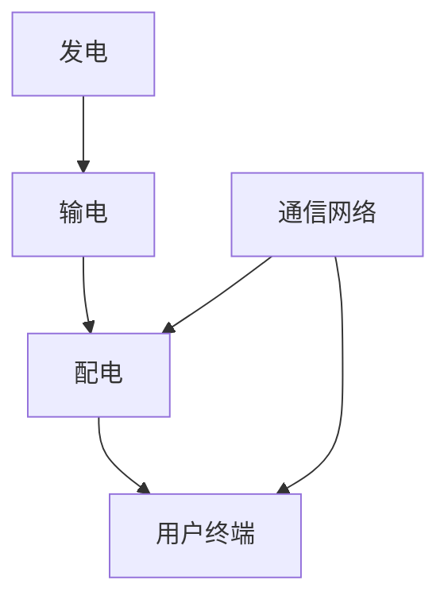
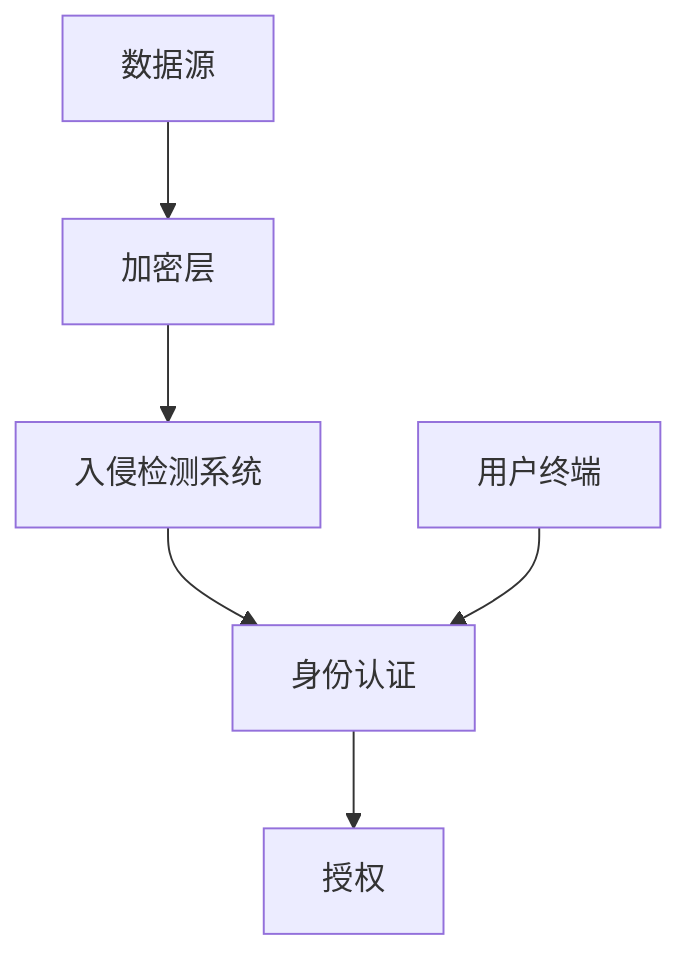

                 

# 新兴市场股市估值与智能电网网络安全技术的互动

> 关键词：新兴市场，股市估值，智能电网，网络安全，互动关系

> 摘要：本文探讨新兴市场股市估值与智能电网网络安全技术之间的互动关系，分析股市波动如何影响智能电网的投资决策，以及网络安全事件如何反过来影响股市的稳定性。通过构建数学模型和系统架构图，展示两者的动态交互。

---

## 第一部分：新兴市场股市估值

### 第1章：新兴市场股市估值概述

#### 1.1 股市估值的基本概念

股市估值是评估公司股票价值的过程，通常基于财务指标和市场条件。新兴市场具有高增长潜力，但也伴随着高风险和不确定性，这使得股市估值更具挑战性。

#### 1.2 新兴市场股市估值的方法

- **市盈率法（P/E Ratio）**：计算股价与每股收益的比例，适用于盈利稳定的公司。
- **市净率法（P/B Ratio）**：比较股价与每股净资产，适合评估资产密集型行业。
- **现金流折现法（DCF）**：预测未来现金流，以确定当前股票价值。

#### 1.3 新兴市场的特殊性与估值调整

新兴市场受经济波动、政策变化和行业差异影响较大，因此需要调整估值方法。例如，考虑通货膨胀率和政府监管政策对股市估值的影响。

---

### 第2章：新兴市场股市估值的挑战与解决方案

#### 2.1 经济波动的影响

新兴市场的经济波动可能导致股市估值的剧烈波动。投资者需通过宏观经济分析和风险评估来应对这些挑战。

#### 2.2 政治风险的评估

政治不稳定或政策变化可能影响股市估值，投资者需建立风险评估模型，量化政治风险对估值的影响。

#### 2.3 行业差异的考虑

不同行业在新兴市场中的表现差异显著，投资者需进行行业分析，选择具有增长潜力的行业进行投资。

---

## 第二部分：智能电网网络安全技术

### 第3章：智能电网网络安全概述

#### 3.1 智能电网的基本结构

智能电网由发电、输电、配电和用户终端组成，依赖先进的通信技术和数据处理系统。其脆弱性主要源于复杂的网络结构和多样化的攻击面。

#### 3.2 网络安全的重要性

智能电网的网络安全直接关系到能源供应的稳定性。网络攻击可能导致大规模停电或数据泄露，造成巨大的经济损失和社会影响。

---

### 第4章：智能电网网络安全技术

#### 4.1 加密技术

- **对称加密**：速度快，适用于数据传输。
- **非对称加密**：提供身份认证和数据完整性保障。
- **加密算法的选择与应用**：根据应用场景选择合适的加密算法，如AES用于数据保护，RSA用于身份认证。

#### 4.2 入侵检测系统

- **入侵检测的基本原理**：通过监测网络流量异常行为，识别潜在攻击。
- **常用入侵检测算法**：基于统计分析和机器学习的异常检测算法。
- **入侵检测系统的部署**：在关键节点部署入侵检测系统，实时监控网络活动。

#### 4.3 身份认证技术

- **多因素认证**：结合多种认证方式，提高安全性。
- **生物识别技术的应用**：如指纹识别和面部识别，用于用户身份验证。
- **身份认证的实现流程**：注册、认证和授权三个步骤。

---

### 第5章：智能电网网络安全的风险管理

#### 5.1 安全评估与风险管理

- **安全评估**：定期进行网络安全评估，识别潜在漏洞。
- **风险管理**：制定应急预案，减少网络安全事件的影响。

#### 5.2 安全事件响应

- **事件响应流程**：包括检测、隔离、调查和修复四个阶段。
- **安全事件分析**：利用日志分析工具，追踪攻击来源和影响范围。

---

## 第三部分：股市估值与智能电网网络安全的互动

### 第6章：互动关系的背景与机制

#### 6.1 股市估值对智能电网投资的影响

- **投资者信心与股市波动**：投资者信心影响股市波动，进而影响智能电网的投资决策。
- **股市波动对投资决策的影响**：股市波动可能导致投资者调整投资策略，影响智能电网的投资规模。

#### 6.2 智能电网安全对股市稳定性的影响

- **网络攻击对股市的影响**：网络攻击可能导致股市波动，影响投资者信心。
- **安全事件对投资者信心的冲击**：安全事件可能引发投资者恐慌，导致股市下跌。

---

### 第7章：互动关系的数学模型与分析

#### 7.1 数学模型构建

构建一个动态博弈模型，分析股市波动与智能电网安全的互动关系。模型包括投资者行为和安全策略两个变量，通过数学公式量化它们之间的关系。

$$ V = f(S, E, R) $$

其中，V为估值，S为安全因素，E为经济因素，R为风险。

#### 7.2 数学模型的分析

通过数学模型，分析安全策略和经济因素对估值的影响。例如，当安全风险增加时，估值可能下降，反之亦然。

---

### 第8章：互动关系的系统分析与架构设计

#### 8.1 智能电网系统的架构图

使用mermaid绘制智能电网系统的架构图，展示各个组件之间的关系。

#### 8.2 网络安全系统的架构图

使用mermaid绘制网络安全系统的架构图，展示加密技术、入侵检测系统和身份认证技术的协同作用。

---

### 第9章：互动关系的项目实战

#### 9.1 环境安装

安装必要的工具和软件，如数据处理工具、加密算法库和入侵检测系统。

#### 9.2 核心实现

实现智能电网安全系统的核心功能，如数据加密、入侵检测和身份认证。

#### 9.3 案例分析

通过具体案例分析，展示股市波动和网络安全事件对智能电网投资的影响。

---

## 结语

股市估值与智能电网网络安全技术的互动关系复杂而深刻。通过合理调整估值方法和加强网络安全技术，可以有效降低风险，促进智能电网的稳定发展。未来，随着技术的进步和市场的成熟，这种互动关系将更加紧密，为投资者和能源行业带来更多的机遇和挑战。

---

作者：AI天才研究院/AI Genius Institute & 禅与计算机程序设计艺术 /Zen And The Art of Computer Programming

