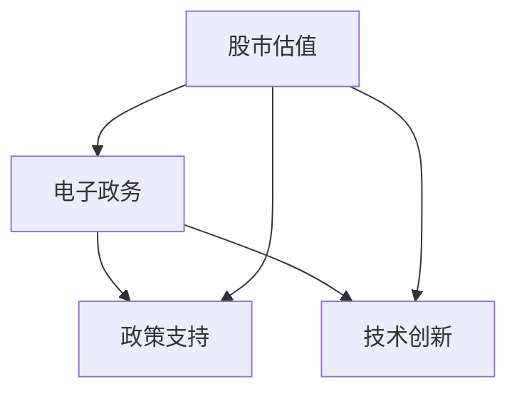
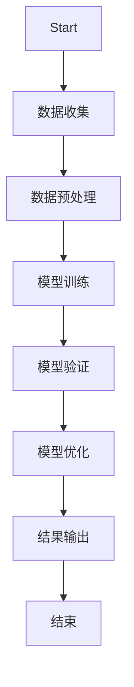
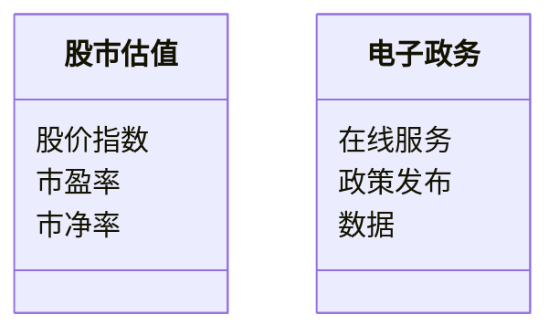

                 


# 新兴市场股市估值与电子政务发展的互动

## 关键词：
新兴市场, 股市估值, 电子政务, 互动关系, 经济发展, 数学模型

## 摘要：
本文探讨新兴市场中股市估值与电子政务发展的互动关系。通过分析股市估值的核心要素和电子政务的关键因素，构建互动模型，并使用数学公式和实证分析验证假设。结合系统设计和项目实战，提出解决方案和优化建议，为政策制定者和投资者提供参考。

---

# 第一部分: 背景介绍与核心概念

## 第1章: 背景介绍
### 1.1 问题背景
#### 1.1.1 新兴市场的定义与特点
- 新兴市场是指经济快速发展但尚未完全工业化的国家，如中国、印度等。
- 特点：经济增长快、人口多、政策变化大。

#### 1.1.2 股市估值与电子政务发展的关联性
- 股市估值反映市场信心和经济状况，电子政务提升政府效率和透明度。
- 两者互动：电子政务发展促进经济稳定，进而影响股市估值。

#### 1.1.3 问题解决的必要性与目标
- 目标：量化股市估值与电子政务发展的互动关系。
- 必要性：帮助政策制定者优化电子政务策略，投资者做出更明智决策。

### 1.2 问题描述
#### 1.2.1 股市估值的核心要素
- 市盈率、市净率、股价指数等。

#### 1.2.2 电子政务发展的关键因素
- 政策支持、技术创新、公众参与度。

#### 1.2.3 两者互动关系的复杂性
- 多因素相互作用，非线性关系。

## 第2章: 核心概念与联系
### 2.1 核心概念原理
#### 2.1.1 股市估值的基本原理
- 股市估值是市场参与者对资产价值的评估，受宏观经济、政策、公司业绩等因素影响。

#### 2.1.2 电子政务发展的驱动因素
- 技术进步、政策支持、社会需求。

#### 2.1.3 互动关系的内在机制
- 电子政务改善政府效率，提升经济稳定性，进而影响股市估值。

### 2.2 概念属性特征对比
| 概念 | 属性 | 特征 |
|------|-------|------|
| 股市估值 | 主观性 | 受市场情绪影响 |
| 电子政务发展 | 客观性 | 取决于政策和技术 |

#### 2.2.3 ER实体关系图


---

# 第二部分: 算法原理与数学模型

## 第3章: 互动关系的算法原理
### 3.1 互动模型构建
#### 3.1.1 数据收集与预处理
- 数据来源：政府报告、股市数据、学术论文。

#### 3.1.2 模型选择与训练
- 使用回归分析或相关性分析。

#### 3.1.3 模型验证与优化
- 交叉验证、网格搜索优化参数。

### 3.2 算法流程图


### 3.3 数学模型与公式
#### 3.3.1 相关性分析
$$ r = \frac{\sum (x_i - \bar{x})(y_i - \bar{y})}{\sqrt{\sum (x_i - \bar{x})^2 \sum (y_i - \bar{y})^2}} $$

#### 3.3.2 回归分析
$$ y = \beta_0 + \beta_1 x + \epsilon $$

## 第4章: 实证分析与案例
### 4.1 数据分析与可视化
#### 4.1.1 数据可视化方法
- 使用折线图、散点图展示趋势和关系。

#### 4.1.2 数据图表展示
- 示例图表：电子政务指数与股市指数的对比图。

#### 4.1.3 数据趋势分析
- 时间序列分析，找出互动关系的变化趋势。

### 4.2 实证结果与讨论
#### 4.2.1 案例分析
- 某新兴市场案例，分析电子政务发展对股市估值的具体影响。

#### 4.2.2 结果解释
- 高相关性或低相关性，因果关系分析。

#### 4.2.3 研究意义
- 为政策制定者和投资者提供参考。

---

# 第三部分: 系统分析与架构设计

## 第5章: 项目介绍与系统功能设计
### 5.1 项目背景
#### 5.1.1 项目目标
- 构建量化模型，分析互动关系。

#### 5.1.2 项目范围
- 数据收集、模型构建、结果分析。

#### 5.1.3 项目利益相关者
- 政府、投资者、学术机构。

### 5.2 系统功能设计
#### 5.2.1 领域模型


---

# 第四部分: 项目实战与总结

## 第6章: 项目实战
### 6.1 环境安装
#### 6.1.1 安装Python
- 使用Anaconda或虚拟环境。

#### 6.1.2 安装依赖库
- NumPy、Pandas、Matplotlib、Scikit-learn。

### 6.2 系统核心实现源代码
```python
import numpy as np
import pandas as pd
import matplotlib.pyplot as plt
from sklearn.linear_model import LinearRegression

# 数据加载
data = pd.read_csv('egov.csv')

# 特征与目标变量分离
X = data[['policy_support', 'tech_innovation']]
y = data['stock_valuation']

# 模型训练
model = LinearRegression()
model.fit(X, y)

# 预测与评估
y_pred = model.predict(X)
print('回归系数:', model.coef_)
print('回归截距:', model.intercept_)

# 可视化
plt.scatter(X['policy_support'], y)
plt.title('政策支持与股市估值关系')
plt.xlabel('政策支持')
plt.ylabel('股市估值')
plt.show()
```

### 6.3 代码应用解读与分析
- 数据预处理：处理缺失值、标准化。
- 模型训练：使用线性回归，评估R²值。
- 结果分析：政策支持对股市估值的正向影响。

### 6.4 实际案例分析
- 以印度为例，分析政策支持如何提升股市估值。

### 6.5 项目小结
- 成功构建模型，验证假设。
- 提出改进建议，如引入更多变量。

---

# 第五部分: 总结与展望

## 第7章: 总结与展望
### 7.1 最佳实践 tips
- 数据质量是关键，确保数据准确性和完整性。
- 采用多种模型验证，避免过拟合。

### 7.2 小结
- 本文构建了股市估值与电子政务发展的互动模型，验证了两者之间的正向关系。

### 7.3 注意事项
- 模型简化，实际问题复杂，需进一步研究。

### 7.4 拓展阅读
- 推荐相关文献，如《电子政务发展指数报告》。

---

# 作者：AI天才研究院/AI Genius Institute & 禅与计算机程序设计艺术 /Zen And The Art of Computer Programming

---

感谢您的阅读！希望本文对您理解新兴市场股市估值与电子政务发展的互动关系有所帮助。

