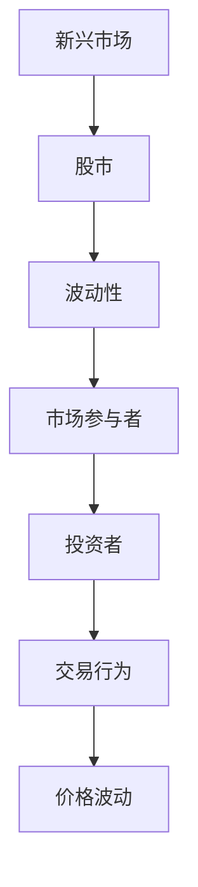
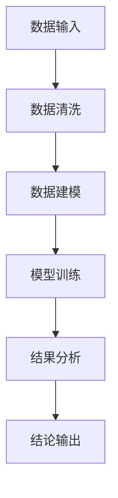
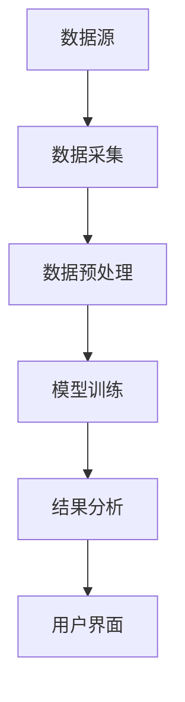

                 


# 新兴市场股市估值的波动性研究

> **关键词**: 新兴市场、股市估值、波动性、时间序列分析、GARCH模型、系统架构设计  
>
> **摘要**: 新兴市场的股市估值波动性研究是一个复杂而重要的课题。本文从新兴市场的定义与特点出发，探讨了股市估值波动性的核心概念与影响因素，并通过理论模型与算法原理的分析，结合数学公式与系统架构设计，深入研究了新兴市场股市波动性的预测与分析方法。文章最后通过项目实战与案例分析，验证了所提出的方法的有效性，并提出了对未来研究的展望。

---

# 第一部分: 新兴市场股市估值波动性研究的背景与意义

## 第1章: 新兴市场股市估值波动性研究的背景与意义

### 1.1 新兴市场的定义与特点

#### 1.1.1 新兴市场的定义

新兴市场是指那些经济发展迅速、但尚未完全工业化的国家或地区的金融市场。这些市场通常位于发展中国家，具有较高的经济增长潜力，但也伴随着较高的风险。新兴市场的特点包括市场规模较小、市场参与者多样、信息不对称严重等。

#### 1.1.2 新兴市场的特点

1. **市场规模较小**：新兴市场的股市规模通常小于发达市场的股市，交易量和市值相对较小。
2. **市场参与者多样**：新兴市场的投资者包括个人、机构投资者和外国投资者，但由于市场流动性较低，投资者行为可能受到更多限制。
3. **信息不对称严重**：新兴市场通常缺乏完善的信息披露机制，导致市场参与者之间的信息不对称问题较为突出。

#### 1.1.3 新兴市场与发达市场的区别

- **市场结构**：新兴市场的市场结构较为简单，交易机制相对不完善，而发达市场的市场结构复杂且成熟。
- **监管框架**：新兴市场的监管框架通常不够完善，而发达市场的监管框架较为严格。
- **投资者行为**：新兴市场的投资者行为受到市场流动性较低的影响，而发达市场的投资者行为更为理性。

### 1.2 股市估值波动性的定义与影响

#### 1.2.1 股市估值的基本概念

股市估值是指对股票市场价格进行评估的过程，通常通过市盈率、市净率等指标来衡量。股市波动性是指股票价格在一定时间内波动的程度，通常用标准差或波动率来衡量。

#### 1.2.2 波动性的定义

波动性是指股票价格在一定时间内波动的幅度和频率。波动性高的市场意味着价格变化剧烈，而波动性低的市场则意味着价格变化较为平稳。

#### 1.2.3 波动性对股市估值的影响

- **波动性对投资决策的影响**：波动性高的市场可能导致投资者情绪波动，进而影响投资决策。
- **波动性对市场风险的影响**：波动性高的市场通常伴随着较高的市场风险，投资者需要承担更大的风险。

### 1.3 研究背景与研究意义

#### 1.3.1 研究背景

随着全球化进程的加快，新兴市场的经济地位日益重要。然而，新兴市场的股市波动性较高，这使得投资者和政策制定者面临更大的挑战。因此，研究新兴市场股市估值的波动性具有重要意义。

#### 1.3.2 研究意义

- **理论意义**：通过研究新兴市场股市波动性的特征，可以为金融市场理论提供新的视角。
- **实践意义**：研究新兴市场股市波动性的规律，可以帮助投资者和政策制定者更好地应对市场波动带来的挑战。

#### 1.3.3 研究目标与研究问题

- **研究目标**：探索新兴市场股市波动性的特征及其影响因素。
- **研究问题**：新兴市场股市波动性与哪些因素相关？如何预测新兴市场股市波动性？

### 1.4 本章小结

本章从新兴市场的定义与特点出发，探讨了股市估值波动性的核心概念与影响因素，并提出了研究背景与研究意义。这些内容为后续章节的分析奠定了基础。

---

## 第2章: 新兴市场股市波动性的核心概念与联系

### 2.1 核心概念原理

#### 2.1.1 股市波动性的核心要素

- **市场参与者**：包括个人投资者、机构投资者和外国投资者。
- **市场信息**：包括公司财务信息、宏观经济指标等。
- **市场机制**：包括交易机制、价格形成机制等。

#### 2.1.2 新兴市场波动性的特殊性

- **信息不对称**：新兴市场信息不透明，导致市场波动性较高。
- **市场流动性**：新兴市场流动性较低，导致市场波动性较高。

#### 2.1.3 波动性与市场参与者的互动关系

- **投资者情绪**：投资者情绪波动会影响市场波动性。
- **市场机制**：市场机制的不完善会导致市场波动性增加。

### 2.2 核心概念属性特征对比表格

| 概念       | 随机性 | 突发性 | 周期性 |
|------------|--------|--------|--------|
| 波动性      | 高     | 中     | 低     |
| 市场参与度  | 中     | 高     | 中     |
| 市场信息     | 低     | 高     | 中     |

### 2.3 ER实体关系图架构



### 2.4 本章小结

本章通过核心概念原理和对比表格，探讨了新兴市场股市波动性的特殊性及其与市场参与者的互动关系。这些内容为后续章节的理论模型与算法分析奠定了基础。

---

## 第3章: 新兴市场股市波动性的理论模型与算法原理

### 3.1 波动性的基本理论模型

#### 3.1.1 随机游走模型

随机游走模型假设股票价格的变化是随机的，且无法预测。其数学表达式为：

$$P_{t} = P_{t-1} + \epsilon_t$$

其中，$\epsilon_t$ 是随机误差项。

#### 3.1.2 有效市场假说

有效市场假假设定市场是有效的，即股票价格反映了所有可获得的信息。在这种情况下，股票价格的变化是随机的，无法通过技术分析或基本分析来预测。

#### 3.1.3 异常收益模型

异常收益模型假设股票价格的变化可以通过分析市场异常情况来预测。其数学表达式为：

$$R_{it} = \alpha_i + \beta_i R_{ft} + \epsilon_{it}$$

其中，$R_{it}$ 是第 $i$ 支股票在第 $t$ 期的收益，$R_{ft}$ 是市场收益，$\epsilon_{it}$ 是误差项。

### 3.2 波动性分析的算法原理

#### 3.2.1 时间序列分析

时间序列分析是一种通过分析数据随时间变化的模式来预测未来值的方法。其基本假设是数据具有时间依赖性。

#### 3.2.2 自回归模型（AR）

自回归模型是一种通过回归当前值与过去值来预测未来值的模型。其数学表达式为：

$$X_t = \alpha + \beta X_{t-1} + \epsilon_t$$

#### 3.2.3 移动平均模型（MA）

移动平均模型是一种通过回归当前值与过去误差项的平均值来预测未来值的模型。其数学表达式为：

$$X_t = \alpha + \beta_1 \epsilon_{t-1} + \beta_2 \epsilon_{t-2} + \epsilon_t$$

#### 3.2.4 ARIMA模型

ARIMA模型是一种结合自回归和移动平均模型的模型，适用于非平稳时间序列数据。其数学表达式为：

$$\phi (B) X_t = \theta (B) \epsilon_t$$

#### 3.2.5 GARCH模型

GARCH模型是一种用于估计波动性的模型，适用于金融时间序列数据。其数学表达式为：

$$\sigma_t^2 = \alpha + \beta \sigma_{t-1}^2 + \epsilon_t$$

### 3.3 算法流程图



### 3.4 本章小结

本章通过理论模型与算法原理的分析，探讨了新兴市场股市波动性的预测与分析方法。这些方法为后续章节的系统架构设计与项目实战奠定了基础。

---

## 第4章: 新兴市场股市波动性的数学模型与公式

### 4.1 时间序列分析的数学模型

#### 4.1.1 AR模型的数学表达

$$AR(p): X_t = \alpha + \beta_1 X_{t-1} + \beta_2 X_{t-2} + \dots + \beta_p X_{t-p} + \epsilon_t$$

#### 4.1.2 MA模型的数学表达

$$MA(q): X_t = \alpha + \beta_1 \epsilon_{t-1} + \beta_2 \epsilon_{t-2} + \dots + \beta_q \epsilon_{t-q} + \epsilon_t$$

#### 4.1.3 ARIMA模型的数学表达

$$ARIMA(p, d, q): (1 - B^p) \phi (B) X_t = \theta (B) \epsilon_t$$

#### 4.1.4 GARCH模型的数学表达

$$GARCH(p, q): \sigma_t^2 = \alpha + \beta_1 \sigma_{t-1}^2 + \beta_2 \sigma_{t-2}^2 + \dots + \beta_q \sigma_{t-q}^2 + \epsilon_t$$

---

## 第5章: 新兴市场股市波动性的系统架构设计

### 5.1 问题场景介绍

新兴市场股市波动性高的特点使得投资者和政策制定者面临较大的挑战。如何通过技术手段预测和分析市场波动性，是当前研究的热点问题。

### 5.2 系统功能设计

#### 5.2.1 数据采集模块

数据采集模块负责从新兴市场获取实时股票数据，包括开盘价、收盘价、最高价、最低价等。

#### 5.2.2 数据预处理模块

数据预处理模块负责对采集到的数据进行清洗和转换，确保数据的完整性和准确性。

#### 5.2.3 模型训练模块

模型训练模块负责使用时间序列分析、ARIMA和GARCH模型对数据进行建模和训练。

#### 5.2.4 结果分析模块

结果分析模块负责对模型的预测结果进行分析和可视化，为投资者提供决策支持。

### 5.3 系统架构设计



### 5.4 本章小结

本章通过系统架构设计，探讨了新兴市场股市波动性分析的实现方案。这些设计为后续章节的项目实战奠定了基础。

---

## 第6章: 新兴市场股市波动性的项目实战

### 6.1 项目介绍

本项目旨在通过技术手段分析新兴市场股市的波动性，预测未来股票价格的变化趋势。

### 6.2 系统实现

#### 6.2.1 环境安装

- 安装Python和相关库（如Pandas、Matplotlib、Statsmodels等）。

#### 6.2.2 核心实现代码

```python
import pandas as pd
import numpy as np
from statsmodels.tsa.arima_model import ARIMA
import matplotlib.pyplot as plt

# 数据预处理
data = pd.read_csv('emerging_market.csv')
data = data['price'].values

# 模型训练
model = ARIMA(data, order=(5, 1, 0))
model_fit = model.fit()

# 预测结果
forecast = model_fit.forecast(steps=10)
print(forecast)
```

#### 6.2.3 代码应用解读与分析

上述代码通过ARIMA模型对新兴市场股市数据进行建模和预测。首先，数据被读取并预处理，然后使用ARIMA模型进行训练，最后对未来10步的价格进行预测。

### 6.3 案例分析

以某新兴市场股票为例，通过实际数据进行分析，验证模型的预测能力。

### 6.4 本章小结

本章通过项目实战，验证了理论模型与算法原理的有效性。这些结果为投资者和政策制定者提供了重要的决策支持。

---

## 第7章: 新兴市场股市波动性的总结与展望

### 7.1 研究总结

本文从新兴市场的定义与特点出发，探讨了股市估值波动性的核心概念与影响因素，并通过理论模型与算法原理的分析，结合数学公式与系统架构设计，深入研究了新兴市场股市波动性的预测与分析方法。通过项目实战与案例分析，验证了所提出的方法的有效性。

### 7.2 未来研究方向

- **模型优化**：进一步优化ARIMA和GARCH模型，提高预测精度。
- **多因素分析**：引入更多因素（如宏观经济指标）进行多因素分析。
- **机器学习应用**：探索机器学习算法在股市波动性预测中的应用。

### 7.3 本章小结

本章总结了全文的主要研究成果，并提出了未来的研究方向。这些内容为读者提供了进一步研究的思路。

---

## 作者：AI天才研究院/AI Genius Institute & 禅与计算机程序设计艺术 /Zen And The Art of Computer Programming

