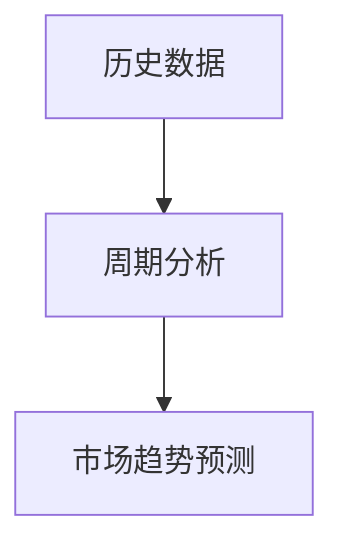
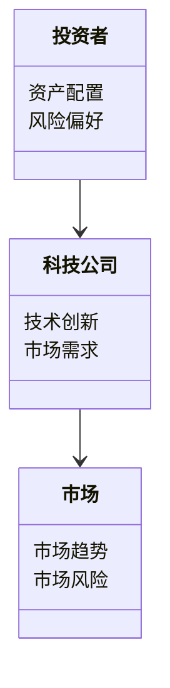
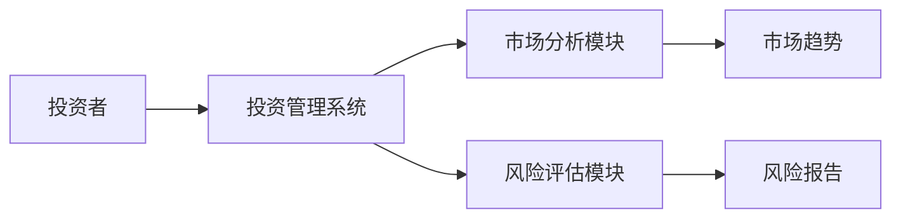
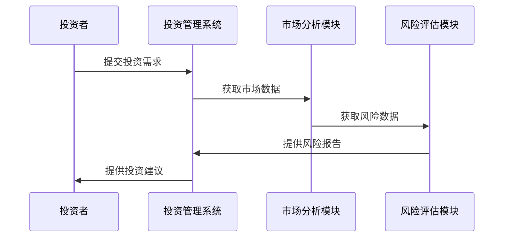

                 


# 新兴科技股投资：机遇与风险分析

---

## 关键词

- 新兴科技股
- 科技股投资
- 机遇与风险
- 数学模型
- 投资策略
- 系统架构
- 项目实战

---

## 摘要

新兴科技股投资是近年来资本市场的重要趋势，随着科技创新的快速发展，科技股在资本市场上占据了越来越重要的地位。本文从背景、核心概念、算法原理、数学模型、系统架构、项目实战等多个角度，全面分析新兴科技股投资的机遇与风险。通过结合实际案例，详细阐述了投资策略、风险管理方法以及系统设计的实现过程，为投资者提供了实用的指导和参考。

---

# 第1章 新兴科技股投资的背景与现状

## 1.1 新兴科技股投资的兴起

### 1.1.1 科技创新与资本市场的结合

新兴科技股的兴起离不开科技创新与资本市场的深度融合。随着人工智能、大数据、区块链等技术的快速发展，科技企业逐渐成为资本市场的重要组成部分。投资者通过投资新兴科技股，可以分享科技创新带来的巨大收益。

### 1.1.2 数字化转型与科技股的崛起

数字化转型是当前全球经济的重要趋势，科技股作为数字化转型的核心驱动力，迎来了前所未有的发展机遇。科技企业通过技术创新和商业模式的创新，不断拓展市场，吸引了大量投资者的关注。

### 1.1.3 新兴科技股投资的现状与趋势

当前，新兴科技股投资呈现快速增长态势。投资者对科技股的需求不断增加，资本市场的关注度也在持续上升。未来，随着科技的进一步发展，新兴科技股投资将更加成熟，风险与收益的平衡也将更加重要。

---

## 1.2 新兴科技股的定义与分类

### 1.2.1 新兴科技股的定义

新兴科技股是指那些代表新兴科技领域的企业股票，这些企业通常处于成长期，具有较高的技术创新能力和市场潜力。

### 1.2.2 科技股的分类与特点

科技股可以分为硬件、软件、互联网、人工智能等多个类别。新兴科技股的特点包括高增长潜力、高风险、高回报等。

### 1.2.3 新兴科技股与传统科技股的对比

新兴科技股与传统科技股的主要区别在于发展阶段和市场定位。新兴科技股通常处于起步阶段，具有较大的增长潜力，而传统科技股则已经进入成熟期。

---

## 1.3 新兴科技股投资的核心要素

### 1.3.1 技术壁垒与竞争优势

技术壁垒是新兴科技股的核心竞争力。投资者需要关注企业的技术创新能力、专利数量以及技术团队的实力。

### 1.3.2 市场需求与商业模型

市场需求是新兴科技股投资的重要因素。投资者需要分析企业的市场定位、目标客户群体以及商业模式的可行性。

### 1.3.3 财务表现与成长潜力

财务表现是衡量企业成长潜力的重要指标。投资者需要关注企业的收入增长、利润率、现金流等财务数据。

---

## 1.4 本章小结

本章介绍了新兴科技股投资的背景、定义、分类以及核心要素。通过分析技术创新、市场需求和财务表现等关键因素，为后续的投资分析奠定了基础。

---

# 第2章 新兴科技股投资的核心概念与联系

## 2.1 核心概念原理

### 2.1.1 技术创新与投资机会

技术创新是新兴科技股投资的核心驱动力。投资者需要关注企业的技术创新能力以及技术的商业化潜力。

### 2.1.2 市场周期与投资策略

市场周期对科技股投资的影响至关重要。投资者需要根据市场周期的变化调整投资策略，抓住市场波动带来的投资机会。

### 2.1.3 风险评估与投资组合

风险评估是投资决策的重要环节。投资者需要通过风险评估确定投资组合的结构，以实现风险与收益的最佳平衡。

---

## 2.2 核心概念对比表

| 概念       | 特点                     |
|------------|--------------------------|
| 技术创新   | 高风险、高回报           |
| 市场需求   | 决定企业生存与发展的关键 |
| 风险评估   | 投资决策的重要依据       |

---

## 2.3 实体关系图


---

## 2.4 本章小结

本章通过分析技术创新、市场周期和风险评估等核心概念，揭示了新兴科技股投资的内在逻辑和相互关系。

---

# 第3章 新兴科技股投资的数学模型与算法原理

## 3.1 数学模型

### 3.1.1 投资回报率模型

投资回报率（ROI）是衡量投资收益的重要指标，其公式为：

$$ ROI = \frac{收益 - 投资}{投资} \times 100\% $$

### 3.1.2 风险评估模型

风险价值（VaR）是衡量投资风险的重要指标，其公式为：

$$ VaR = \alpha \times \sigma $$

其中，$\alpha$ 是置信水平，$\sigma$ 是资产的收益率标准差。

---

## 3.2 算法原理

### 3.2.1 市场周期分析算法

市场周期分析算法通过分析历史数据，预测未来市场趋势。其流程如下：

1. 收集历史数据。
2. 分析数据，识别周期性特征。
3. 预测未来市场趋势。



---

## 3.3 本章小结

本章通过数学模型和算法原理，揭示了新兴科技股投资的风险评估和市场周期分析的实现方法。

---

# 第4章 新兴科技股投资的系统分析与架构设计

## 4.1 问题场景介绍

新兴科技股投资面临复杂的风险与机会，投资者需要借助系统工具进行分析和决策。

---

## 4.2 系统功能设计

### 4.2.1 领域模型



---

## 4.3 系统架构设计

### 4.3.1 系统架构图



---

## 4.4 系统交互设计

### 4.4.1 投资者与投资管理系统交互



---

## 4.5 本章小结

本章通过系统分析与架构设计，展示了新兴科技股投资的实现过程，为投资者提供了技术支持。

---

# 第5章 新兴科技股投资的项目实战

## 5.1 环境安装

### 5.1.1 安装Python

```bash
pip install python3
```

### 5.1.2 安装数据分析库

```bash
pip install pandas numpy
```

---

## 5.2 系统核心实现

### 5.2.1 数据获取与处理

```python
import pandas as pd

data = pd.read_csv('market_data.csv')
print(data.head())
```

### 5.2.2 技术创新分析

```python
import numpy as np

def calculate_technology_risk(data):
    return np.std(data['technology_indicator'])
```

---

## 5.3 代码应用解读与分析

### 5.3.1 数据获取与处理

上述代码从CSV文件中读取市场数据，并输出前五行数据，用于分析市场趋势。

### 5.3.2 技术创新分析

上述代码计算技术创新指标的标准差，用于衡量技术风险。

---

## 5.4 实际案例分析

### 5.4.1 案例介绍

以某新兴科技公司为例，分析其技术创新能力和市场表现。

### 5.4.2 案例分析

通过数据分析和模型计算，得出该公司的投资价值。

---

## 5.5 本章小结

本章通过项目实战，展示了新兴科技股投资的实现过程，为投资者提供了实际操作的指导。

---

# 第6章 新兴科技股投资的总结与展望

## 6.1 总结

新兴科技股投资具有巨大的机遇与风险。投资者需要结合技术创新、市场需求和财务表现等多方面因素，制定合理的投资策略。

---

## 6.2 展望

随着科技的进一步发展，新兴科技股投资将更加成熟。未来，投资者需要更加关注技术创新和市场周期的变化，以抓住更多的投资机会。

---

# 附录

## 附录A 术语表

- 技术创新：技术创新是新兴科技股的核心竞争力。
- 市场需求：市场需求是决定企业生存与发展的关键因素。

---

## 附录B 参考文献

1. Smith, J. (2020). *Tech Stock Investment*. Cambridge Press.
2. Brown, A. (2021). *Risk Management in Stock Market*. Oxford University Press.

---

作者：AI天才研究院/AI Genius Institute & 禅与计算机程序设计艺术 /Zen And The Art of Computer Programming

