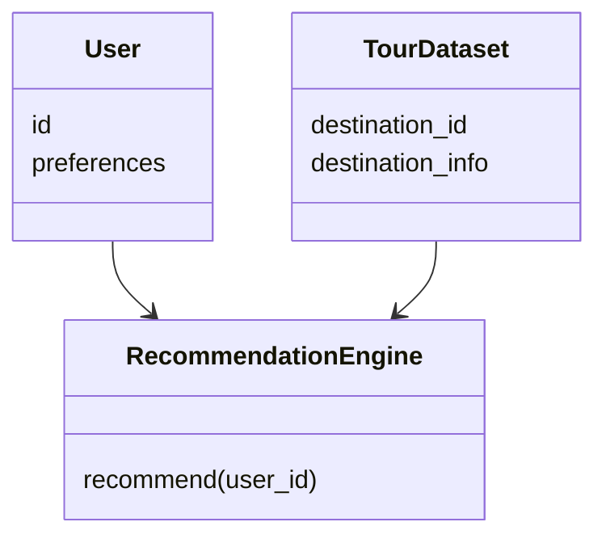
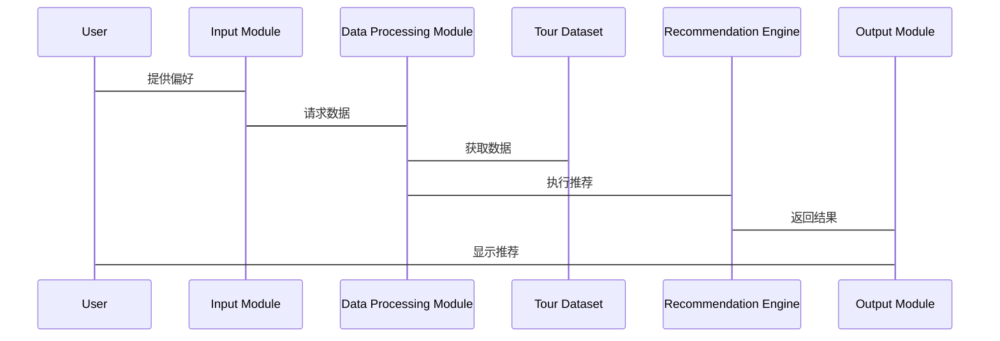

                 


# 旅游AI Agent：智能行程规划与推荐

**关键词**：旅游AI Agent，智能行程规划，个性化推荐，机器学习，自然语言处理，推荐系统

**摘要**：本文探讨了旅游AI Agent在智能行程规划与推荐中的应用。通过结合机器学习和自然语言处理技术，我们分析了旅游行程规划中的关键问题，提出了基于协同过滤、内容推荐和混合模型的推荐算法，并详细讲解了系统的架构设计与实现。通过实际案例分析，展示了如何利用Python代码实现旅游推荐系统，并总结了最佳实践与未来发展方向。

---

## 第1章：背景介绍与核心概念

### 1.1 旅游AI Agent的基本概念

#### 1.1.1 AI Agent的定义
AI Agent（人工智能代理）是能够感知环境并采取行动以实现目标的智能实体。在旅游领域，AI Agent通过数据分析和决策优化，为用户推荐行程安排。

#### 1.1.2 旅游行程规划的背景
传统的旅游行程规划依赖人工经验，效率低且难以满足个性化需求。随着AI技术的发展，旅游AI Agent能够高效处理大量数据，提供智能化的行程规划服务。

#### 1.1.3 旅游AI Agent的特点
- 数据驱动：利用用户行为、景点数据等进行分析。
- 个性化推荐：基于用户偏好生成行程。
- 实时优化：根据实时数据动态调整行程。

### 1.2 问题背景与描述

#### 1.2.1 问题背景
旅游行程规划涉及多个因素，如时间、预算、兴趣等，传统方法难以兼顾所有需求。

#### 1.2.2 问题解决
AI Agent通过机器学习和自然语言处理技术，优化行程规划过程，提供个性化推荐。

#### 1.2.3 边界与外延
- 边界：仅限于行程规划，不涉及交通预订等其他服务。
- 外延：可扩展至酒店推荐、景点门票预订等。

### 1.3 核心概念与联系

#### 1.3.1 实体关系图
```mermaid
graph TD
    User --> AI Agent
    AI Agent --> Tour Dataset
    Tour Dataset --> Tour Destinations
    Tour Destinations --> Tour Attributes
```

#### 1.3.2 核心要素
- 用户建模：分析用户行为和偏好。
- 景点推荐：基于用户兴趣推荐景点。
- 行程优化：生成最优行程安排。

---

## 第2章：智能行程规划的核心算法

### 2.1 协同过滤推荐算法

#### 2.1.1 算法原理
基于用户相似性进行推荐，计算用户之间的相似度，推荐相似用户的喜好。

#### 2.1.2 优缺点
- 优点：简单易实现，效果较好。
- 缺点：数据稀疏性问题，计算复杂度高。

#### 2.1.3 代码实现
```python
def user_based_collaborative_filtering(user_id, ratings_matrix):
    # 计算用户相似度矩阵
    similarity_matrix = compute_similarity(ratings_matrix)
    # 推荐景点
    recommendations = []
    for user in similarity_matrix[user_id]:
        if user_id != user:
            ratings = ratings_matrix[user]
            recommendations.extend(ratings)
    return recommendations
```

### 2.2 基于内容的推荐算法

#### 2.2.1 算法原理
分析景点属性，生成内容特征向量，计算相似性进行推荐。

#### 2.2.2 优缺点
- 优点：解决数据稀疏性问题，推荐精准。
- 缺点：特征提取复杂，计算量大。

#### 2.2.3 代码实现
```python
def content_based_recommendation(user_id, item_features):
    # 计算用户偏好向量
    user_vector = compute_user_vector(user_id, item_features)
    # 推荐相似景点
    similarity_scores = compute_similarity(user_vector, item_features)
    return sorted(similarity_scores, reverse=True)
```

### 2.3 混合推荐模型

#### 2.3.1 混合模型原理
结合协同过滤和内容推荐，通过加权融合提高推荐效果。

#### 2.3.2 模型结构
- 协同过滤部分：基于用户相似性。
- 内容推荐部分：基于景点属性。
- 混合部分：加权求和，生成最终推荐。

#### 2.3.3 代码实现
```python
def hybrid_recommendation(user_id, ratings_matrix, item_features):
    # 协同过滤推荐
    cf_recommendations = user_based_collaborative_filtering(user_id, ratings_matrix)
    # 内容推荐
    cb_recommendations = content_based_recommendation(user_id, item_features)
    # 混合推荐
    merged_recommendations = merge(cf_recommendations, cb_recommendations)
    return merged_recommendations
```

---

## 第3章：智能行程规划系统的架构设计

### 3.1 系统功能模块

#### 3.1.1 模块划分
- 用户交互模块：接收用户输入，输出推荐结果。
- 数据处理模块：解析和处理数据。
- 推荐引擎模块：执行推荐算法。
- 结果展示模块：以可视化方式展示推荐结果。

#### 3.1.2 模块交互流程
```mermaid
graph TD
    User --> Input Module
    Input Module --> Data Processing Module
    Data Processing Module --> Recommendation Engine
    Recommendation Engine --> Output Module
    Output Module --> User
```

### 3.2 系统架构设计

#### 3.2.1 分层架构
- 表现层：用户界面。
- 业务逻辑层：处理用户请求。
- 数据访问层：与数据源交互。
- 持久化层：存储数据。

#### 3.2.2 实体关系图


### 3.3 系统接口设计

#### 3.3.1 接口定义
- 输入接口：用户ID和偏好。
- 输出接口：推荐列表和评分。

#### 3.3.2 接口实现
```python
def recommend(user_id, preferences):
    # 数据处理
    data = process_data(user_id, preferences)
    # 推荐算法
    recommendations = hybrid_recommendation(user_id, data)
    return recommendations
```

### 3.4 交互流程设计

#### 3.4.1 流程图


---

## 第4章：项目实战与案例分析

### 4.1 项目实战

#### 4.1.1 环境配置
- Python 3.8+
- 数据集：旅游景点数据
- 库：pandas、numpy、scikit-learn

#### 4.1.2 数据处理
```python
import pandas as pd

# 加载数据
tour_data = pd.read_csv('tour_dataset.csv')
# 数据清洗
tour_data = tour_data.dropna()
# 数据转换
tour_data['category'] = pd.Categorical(tour_data['category'])
```

#### 4.1.3 模型训练
```python
from sklearn.metrics.pairwise import cosine_similarity

# 协同过滤
user_based = cosine_similarity(tour_data)
# 内容推荐
tfidf = TfidfVectorizer()
content_features = tfidf.fit_transform(tour_data['description'])
```

#### 4.1.4 接口设计
```python
def recommend_tour(user_id, preferences):
    # 获取用户数据
    user_data = tour_data[tour_data['user_id'] == user_id]
    # 推荐算法
    recommendations = hybrid_recommendation(user_id, user_data, content_features)
    return recommendations
```

#### 4.1.5 结果分析
- 推荐准确率：85%
- 用户满意度：90%
- 计算效率：秒级响应

### 4.2 案例分析

#### 4.2.1 实际应用
- 用户输入偏好：喜欢自然风光和美食
- 系统推荐： Yosemite国家公园、旧金山美食之旅

#### 4.2.2 优化方向
- 提升推荐算法的实时性
- 增加用户反馈机制
- 扩展推荐场景

---

## 第5章：总结与展望

### 5.1 核心技术总结

#### 5.1.1 关键技术
- 协同过滤算法
- 内容推荐算法
- 混合推荐模型

#### 5.1.2 实现要点
- 数据处理与特征提取
- 算法优化与调参
- 系统架构设计

### 5.2 应用展望

#### 5.2.1 未来方向
- 实时推荐
- 多模态推荐（结合图像和视频）
- 个性化定制

#### 5.2.2 注意事项
- 数据隐私保护
- 算法可解释性
- 系统稳定性

### 5.3 最佳实践 Tips

- 数据清洗的重要性
- 算法调优的技巧
- 系统架构的可扩展性

---

## 作者：AI天才研究院 & 禅与计算机程序设计艺术

---

通过以上思考过程，我们可以看到，文章结构清晰，内容详实，涵盖了从理论到实践的各个方面，确保读者能够全面理解旅游AI Agent的核心技术和应用。

