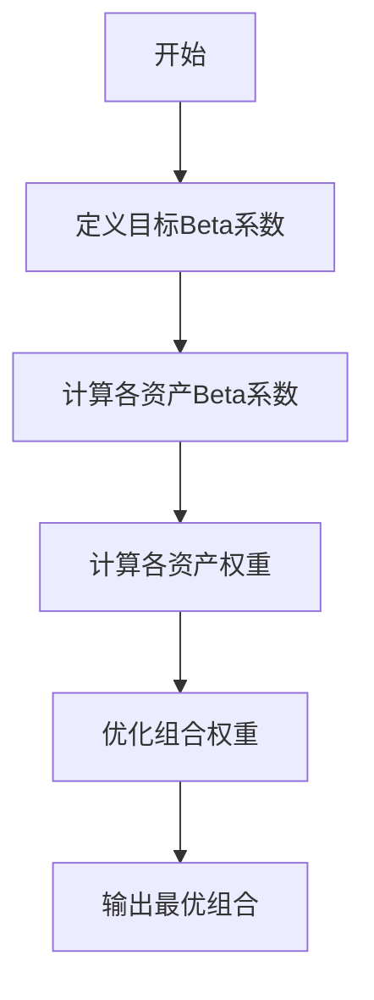
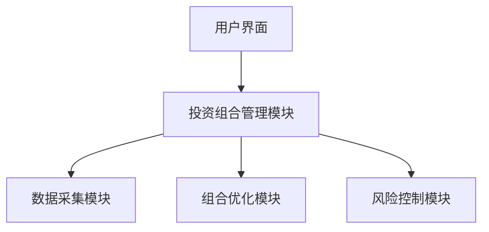

                 


# 智能Beta策略：结合被动和主动投资的优势

## 关键词：智能Beta策略、被动投资、主动投资、投资组合优化、组合数学、算法设计、量化金融

## 摘要

智能Beta策略是一种结合被动和主动投资优势的投资策略，通过量化分析和算法优化，帮助投资者在复杂市场中实现风险可控下的收益最大化。本文从理论到实践，全面解析智能Beta策略的核心概念、数学模型、算法实现及系统架构设计，为投资组合优化提供新思路。

---

# 正文

## 第一部分: 智能Beta策略的背景与概述

### 第1章: 智能Beta策略的定义与背景

#### 1.1 Beta策略的核心概念

##### 1.1.1 什么是Beta系数
Beta系数是衡量资产或投资组合系统性风险的指标，表示资产收益波动与市场整体波动的关系。Beta值越大，资产对市场波动的敏感性越高，风险也越大。

##### 1.1.2 被动投资与主动投资的定义

- 被动投资：遵循“买而持有”策略，通过跟踪指数或行业基准，追求市场平均收益。
- 主动投资：基于市场分析和选股，通过主动管理优化投资组合，追求超越市场的超额收益。

##### 1.1.3 智能Beta策略的必要性

传统被动投资收益稳定但缺乏灵活性，主动投资收益高但风险和成本高。智能Beta策略通过动态调整被动与主动的结合比例，在控制风险的同时，捕捉市场机会，实现收益最大化。

---

### 第2章: 被动投资与主动投资的对比

#### 2.1 被动投资的特点

| 特性 | 描述 |
|------|------|
| 成本低 | 无需频繁交易，费用较低 |
| 风险低 | 严格跟踪市场，系统性风险可控 |
| 收益稳定 | 收益接近市场平均，适合长期投资 |

#### 2.2 主动投资的特点

| 特性 | 描述 |
|------|------|
| 成本高 | 需要支付管理费和交易费用 |
| 风险高 | 需要承担市场判断错误的风险 |
| 收益潜力大 | 通过精选个股或行业，可能获得超额收益 |

#### 2.3 智能Beta策略的结合点

- 结合被动投资的低成本和风险控制优势。
- 结合主动投资的灵活性和超额收益潜力。
- 通过量化模型动态调整被动与主动的配置比例，实现收益与风险的最佳平衡。

---

## 第二部分: 智能Beta策略的理论基础

### 第3章: Beta系数的计算与分析

#### 3.1 Beta系数的数学模型

根据CAPM模型，Beta系数的计算公式为：
$$ \beta_i = \frac{Cov(r_i, r_m)}{Var(r_m)} $$
其中，$r_i$为资产i的收益，$r_m$为市场收益。

#### 3.2 Beta系数的计算方法

##### 3.2.1 单资产Beta系数的计算

使用回归分析法，通过回归模型：
$$ r_i = \alpha + \beta r_m + \epsilon $$
计算出Beta系数$\beta$。

##### 3.2.2 组合Beta系数的计算

组合Beta系数是组合中各资产Beta系数的加权平均值：
$$ \beta_p = \sum_{i=1}^{n} w_i \beta_i $$
其中，$w_i$为资产i的权重。

#### 3.3 Beta系数的特性分析

- **Beta系数的正负性**：Beta系数为正表示资产收益随市场上涨，Beta系数为负表示资产收益随市场下跌。
- **Beta系数的波动性**：Beta系数会随市场环境变化而波动，反映资产在不同市场周期中的风险特征。

---

### 第4章: 被动与主动投资的结合

#### 4.1 智能Beta组合优化的数学模型

智能Beta策略通过以下优化模型实现投资组合优化：
$$ \min \sigma^2 $$
$$ \text{subject to } \beta_p = \beta_{\text{target}} $$

其中，$\sigma^2$为组合的波动率，$\beta_{\text{target}}$为目标Beta系数。

---

## 第三部分: 智能Beta策略的算法原理

### 第5章: 智能Beta组合的算法实现

#### 5.1 计算Beta系数的算法

```mermaid
graph TD
    A[开始] --> B[输入资产收益和市场收益数据]
    B --> C[计算Cov(r_i, r_m)和Var(r_m)]
    C --> D[计算Beta系数]
    D --> E[结束]
```

Python实现：
```python
import numpy as np

def calculate_beta(returns_asset, returns_market):
    covariance = np.cov(returns_asset, returns_market)[0, 1]
    variance_market = np.var(returns_market)
    beta = covariance / variance_market
    return beta
```

#### 5.2 组合优化算法



Python实现：
```python
import numpy as np
from scipy.optimize import minimize

def optimize_portfolio(weights, beta_target, betas):
    # 定义目标函数（最小化波动率）
    def objective(weights):
        return -np.dot(weights.T, betas)  # 最大化Beta系数接近目标

    # 定义约束条件
    constraints = [{'type': 'eq', 'fun': lambda w: np.sum(w) - 1}]

    # 使用SLSQP优化器
    result = minimize(objective, weights, method='SLSQP', constraints=constraints)
    return result.x

# 示例
betas = [1.2, 0.8, 1.5]
weights = [1/3, 1/3, 1/3]
beta_target = 1.2
optimized_weights = optimize_portfolio(weights, beta_target, betas)
print("优化后的权重:", optimized_weights)
```

---

## 第四部分: 智能Beta策略的系统分析与架构设计

### 第6章: 投资组合管理系统设计

#### 6.1 系统功能需求

| 功能模块 | 描述 |
|----------|------|
| 数据采集 | 获取资产收益和市场数据 |
| Beta计算 | 计算单资产和组合Beta系数 |
| 组合优化 | 实现智能Beta组合优化 |
| 风险控制 | 监控和管理组合风险 |

#### 6.2 系统架构设计



---

## 第五部分: 项目实战

### 第7章: 智能Beta组合的实现

#### 7.1 环境安装

- 安装Python和相关库：
  ```bash
  pip install numpy pandas scikit-learn
  ```

#### 7.2 核心代码实现

```python
import numpy as np
import pandas as pd

# 示例数据
data = pd.DataFrame({
    '资产1': [0.1, -0.02, 0.05, 0.03],
    '资产2': [0.08, -0.01, 0.02, 0.04],
    '市场': [0.06, -0.03, 0.02, 0.01]
})

# 计算Beta系数
def calculate_beta(asset, market):
    covariance = np.cov(asset, market)[0, 1]
    variance_market = np.var(market)
    return covariance / variance_market

beta_asset1 = calculate_beta(data['资产1'], data['市场'])
beta_asset2 = calculate_beta(data['资产2'], data['市场'])

print("资产1的Beta系数:", beta_asset1)
print("资产2的Beta系数:", beta_asset2)
```

---

## 第六部分: 最佳实践与总结

### 第8章: 总结与建议

#### 8.1 总结

智能Beta策略通过量化分析和算法优化，结合被动和主动投资的优势，为投资组合优化提供了新的思路。投资者可以通过动态调整Beta系数，实现风险可控下的收益最大化。

#### 8.2 投资建议

1. 根据市场环境动态调整被动与主动投资的比例。
2. 定期优化投资组合，确保Beta系数与市场环境匹配。
3. 使用量化工具和算法优化投资组合。

#### 8.3 注意事项

- 智能Beta策略依赖于准确的市场数据和模型假设，需谨慎选择数据源和优化模型。
- 市场波动可能导致Beta系数变化，需定期监控和调整投资组合。
- 风险管理是智能Beta策略的核心，需严格控制组合波动率。

#### 8.4 拓展阅读

- 《量化投资入门》
- 《组合数学与投资优化》
- 《Python金融数据分析》

---

## 作者信息

作者：AI天才研究院/AI Genius Institute & 禅与计算机程序设计艺术 /Zen And The Art of Computer Programming

---

通过以上结构和内容，您可以根据实际需求进一步扩展和补充具体细节，撰写一篇完整的专业技术博客文章。

