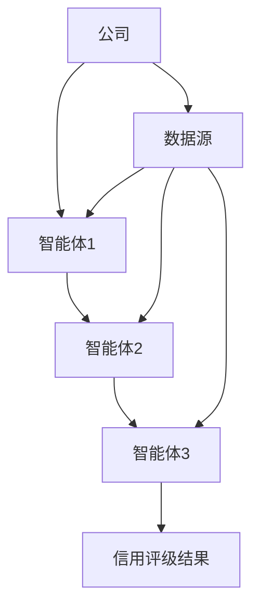
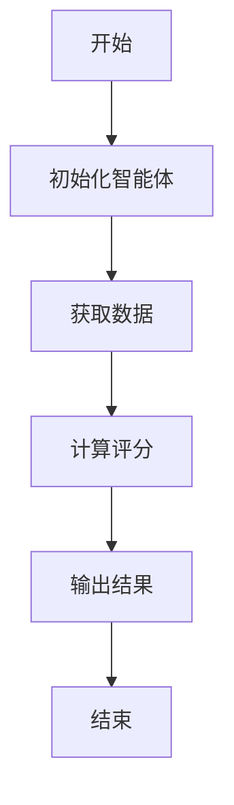
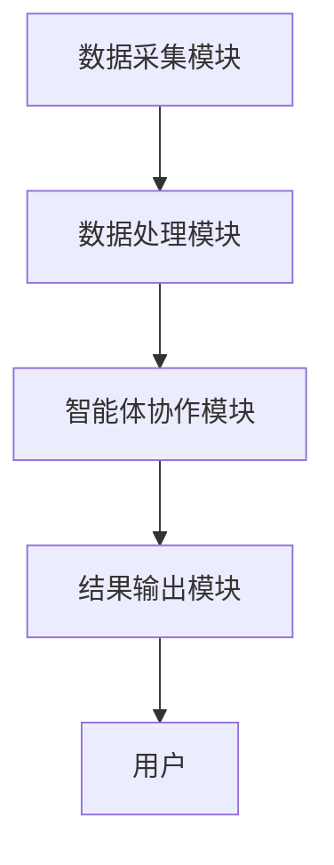
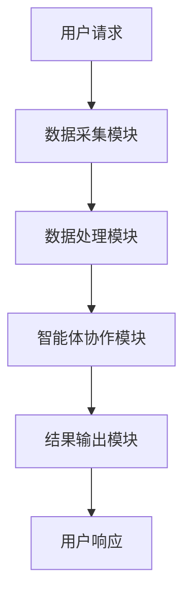

                 


# 智能体协作实现全面的公司信用评级

## 关键词：智能体协作，信用评级，多智能体系统，信用评估，人工智能

## 摘要：本文详细探讨了如何利用智能体协作技术实现对公司信用评级的全面评估。通过分析传统信用评级的局限性，提出了基于多智能体协作的解决方案，结合算法原理、系统架构设计和实际案例分析，展示了智能体协作在信用评级中的优势和应用前景。

---

# 第一部分: 智能体协作与信用评级背景

## 第1章: 智能体协作与信用评级背景

### 1.1 问题背景与描述

#### 1.1.1 传统信用评级的局限性
传统的信用评级方法主要依赖于财务数据和简单的统计模型，存在以下问题：
- 数据维度有限，难以覆盖企业的多维度风险。
- 评估过程缺乏动态性，难以应对市场变化。
- 人工干预较多，效率低下且易受主观因素影响。

#### 1.1.2 智能体协作的优势与必要性
智能体协作通过多个智能体的协同工作，能够实时处理海量数据，提供更全面的信用评估。其优势包括：
- 多维度数据整合：智能体可以同时分析财务、市场、供应链等多方面数据。
- 实时性：智能体能够快速响应数据变化，提供动态评估。
- 高效性：通过分布式计算，大幅提高评估效率。

#### 1.1.3 信用评级的核心目标与边界
信用评级的核心目标是准确评估企业的信用状况，帮助金融机构做出风险控制决策。其边界包括：
- 数据范围：仅限于企业相关的财务、市场和运营数据。
- 时间范围：通常为近期数据，不涉及历史过久的信息。
- 目标范围：仅限于信用评分，不涉及企业其他业务决策。

### 1.2 智能体协作的基本概念

#### 1.2.1 智能体的定义与特征
智能体（Agent）是指能够感知环境、自主决策并执行任务的实体。其主要特征包括：
- 自主性：能够在没有外部干预的情况下独立运作。
- 反应性：能够根据环境变化调整行为。
- 协作性：能够与其他智能体协同工作，共同完成复杂任务。

#### 1.2.2 多智能体协作的原理
多智能体协作是指多个智能体通过通信和协调，共同完成复杂任务的过程。其核心原理包括：
- 任务分解：将复杂任务分解为多个子任务，由不同智能体负责。
- 通信协议：智能体之间通过特定协议交换信息和协调行动。
- 协作机制：通过协作算法确保各智能体的有效配合。

#### 1.2.3 信用评级中的智能体角色
在信用评级中，智能体可以扮演以下角色：
- 数据采集智能体：负责从不同来源收集企业数据。
- 数据分析智能体：对数据进行清洗、处理和分析。
- 评分计算智能体：基于分析结果计算信用评分。
- 结果输出智能体：将评分结果整合并输出给用户。

### 1.3 本章小结
本章介绍了传统信用评级的局限性，提出了智能体协作的优势，并详细阐述了智能体的基本概念及其在信用评级中的角色。

---

## 第2章: 智能体协作与信用评级的核心概念

### 2.1 核心概念的原理

#### 2.1.1 智能体协作的数学模型
智能体协作可以通过数学模型描述。例如，多智能体协作的评分模型可以表示为：
$$
\text{总评分} = \sum_{i=1}^{n} w_i \cdot s_i
$$
其中，$w_i$ 是第 $i$ 个智能体的权重，$s_i$ 是其贡献的评分。

#### 2.1.2 信用评级的指标体系
信用评级通常涉及多个指标，如财务状况、市场表现、管理能力等。这些指标可以通过权重分配，形成一个评分体系。

#### 2.1.3 智能体协作与信用评级的关系
智能体协作通过多个智能体的协同工作，能够更全面地覆盖信用评级的各个维度，提供更准确的评分结果。

### 2.2 核心概念的对比分析

#### 2.2.1 智能体协作与传统信用评级的对比
| 特性       | 智能体协作       | 传统信用评级     |
|------------|------------------|------------------|
| 数据来源   | 多源、实时       | 单一、静态       |
| 处理方式   | 分布式计算       | 集中式处理       |
| 评估效率   | 高               | 低               |

#### 2.2.2 不同智能体协作算法的特征对比
| 算法名称     | 基于规则的协作   | 基于学习的协作   | 基于市场的协作   |
|--------------|------------------|------------------|------------------|
| 优点         | 简单易实现         | 高精度           | 高效性           |
| 缺点         | 灵活性差           | 计算复杂         | 需要市场机制     |

#### 2.2.3 信用评级指标的权重对比
| 指标         | 财务状况       | 市场表现       | 管理能力       |
|--------------|----------------|----------------|----------------|
| 权重         | 40%            | 30%            | 30%            |

### 2.3 实体关系图



### 2.4 本章小结
本章通过对比分析，详细阐述了智能体协作与传统信用评级的差异，以及不同智能体协作算法的特征，并通过实体关系图展示了信用评级的核心概念。

---

## 第3章: 智能体协作算法的原理与实现

### 3.1 算法原理

#### 3.1.1 多智能体协作的基本原理
多智能体协作算法的核心在于任务分解和协作机制。任务分解将复杂任务拆分为多个子任务，由不同智能体负责。协作机制通过通信协议确保智能体之间的信息共享和协同行动。

#### 3.1.2 基于智能体的信用评级算法
基于智能体的信用评级算法通常包括以下步骤：
1. 数据采集：智能体从不同数据源获取企业信息。
2. 数据处理：对数据进行清洗、转换和预处理。
3. 评分计算：各智能体根据分配的任务计算评分。
4. 结果整合：将各智能体的评分结果整合，得出最终信用评分。

#### 3.1.3 算法的数学模型与公式
评分模型可以表示为：
$$
\text{总评分} = \sum_{i=1}^{n} w_i \cdot s_i
$$
其中，$w_i$ 是第 $i$ 个智能体的权重，$s_i$ 是其贡献的评分。

### 3.2 算法实现

#### 3.2.1 算法流程图



#### 3.2.2 算法代码实现
以下是基于Python的算法实现示例：

```python
class Agent:
    def __init__(self, id, data_source):
        self.id = id
        self.data_source = data_source
        self.weight = 0.3  # 示例权重

    def collect_data(self):
        # 从数据源获取数据
        return self.data_source.get_data()

    def compute_score(self, data):
        # 计算评分
        return data * self.weight

# 初始化智能体
agent1 = Agent(1, data_source1)
agent2 = Agent(2, data_source2)
agent3 = Agent(3, data_source3)

# 获取数据
data1 = agent1.collect_data()
data2 = agent2.collect_data()
data3 = agent3.collect_data()

# 计算评分
score1 = agent1.compute_score(data1)
score2 = agent2.compute_score(data2)
score3 = agent3.compute_score(data3)

# 总评分
total_score = score1 + score2 + score3
```

#### 3.2.3 算法的数学模型和公式
评分模型的公式可以进一步优化，例如：
$$
\text{总评分} = \sum_{i=1}^{n} w_i \cdot s_i + \beta
$$
其中，$\beta$ 是一个常数项，用于调整整体评分。

### 3.3 本章小结
本章详细讲解了多智能体协作算法的原理，并通过代码示例展示了算法的实现过程。

---

## 第4章: 系统架构设计与实现

### 4.1 系统架构设计

#### 4.1.1 系统模块划分
系统架构通常包括以下模块：
- 数据采集模块：负责从不同数据源获取企业信息。
- 数据处理模块：对数据进行清洗、转换和预处理。
- 智能体协作模块：实现多个智能体的协作和计算。
- 结果输出模块：将评分结果输出给用户。

#### 4.1.2 系统架构图



### 4.2 系统功能设计

#### 4.2.1 数据采集模块
数据采集模块需要支持多种数据源，如财务报表、市场数据、供应链信息等。

#### 4.2.2 数据处理模块
数据处理模块负责数据的清洗、转换和预处理，确保数据的准确性和一致性。

#### 4.2.3 智能体协作模块
智能体协作模块实现多个智能体的协作，包括任务分配、通信和结果整合。

#### 4.2.4 结果输出模块
结果输出模块将评分结果以可视化形式呈现给用户，便于理解和决策。

### 4.3 系统接口设计

#### 4.3.1 数据接口
数据接口用于与数据源的交互，通常采用REST API或数据库连接。

#### 4.3.2 智能体接口
智能体接口定义了智能体之间的通信协议和交互方式。

#### 4.3.3 用户接口
用户接口用于展示评分结果，通常采用Web界面或API调用。

### 4.4 系统交互流程图



### 4.5 本章小结
本章详细设计了系统架构，包括模块划分、接口设计和交互流程，并通过mermaid图展示了系统的整体架构。

---

## 第5章: 项目实战与案例分析

### 5.1 项目实战

#### 5.1.1 环境安装
需要安装以下工具和库：
- Python 3.8+
- Pandas、NumPy等数据处理库
- scikit-learn等机器学习库

#### 5.1.2 核心代码实现

```python
import pandas as pd
from sklearn.preprocessing import StandardScaler

class CreditAgent:
    def __init__(self, id, data):
        self.id = id
        self.data = data
        self.scaler = StandardScaler()

    def preprocess_data(self):
        # 数据预处理
        return self.scaler.fit_transform(self.data)

    def compute_score(self, model):
        # 基于模型的评分计算
        return model.predict(self.preprocess_data())

# 示例数据
data = {
    ' revenue': [100, 200, 300],
    ' profit': [20, 30, 40],
    ' debt': [50, 60, 70]
}

# 初始化智能体
agent = CreditAgent(1, pd.DataFrame(data))

# 数据预处理
processed_data = agent.preprocess_data()

# 计算评分
model = ...  # 示例模型
score = agent.compute_score(model)
```

#### 5.1.3 代码解读与分析
上述代码实现了智能体的数据预处理和评分计算功能，通过标准化处理数据，并利用机器学习模型进行评分预测。

### 5.2 案例分析

#### 5.2.1 案例背景
某公司财务数据如下：
- 营业收入：300万元
- 利润：50万元
- 债务：100万元

#### 5.2.2 案例分析过程
1. 数据预处理：对财务数据进行标准化处理。
2. 智能体协作：多个智能体分别计算不同维度的评分。
3. 结果整合：将各智能体的评分整合，得出最终信用评分。

#### 5.2.3 分析结果
最终信用评分为75分，属于中等信用风险。

### 5.3 本章小结
本章通过实际案例展示了智能体协作在信用评级中的应用，详细讲解了项目实战的过程和分析结果。

---

## 第6章: 总结与展望

### 6.1 总结
智能体协作通过多个智能体的协同工作，能够更全面地评估企业的信用状况，提高评估的准确性和效率。本文详细探讨了智能体协作的核心概念、算法原理和系统架构，并通过实际案例展示了其应用效果。

### 6.2 展望
未来，智能体协作在信用评级中的应用将更加广泛，随着人工智能技术的进步，智能体的协作能力将进一步提升，信用评级的准确性也将不断提高。

### 6.3 最佳实践 tips
- 在实际应用中，应根据具体需求选择合适的智能体协作算法。
- 数据预处理是关键步骤，需确保数据的准确性和完整性。
- 系统架构设计需充分考虑可扩展性和可维护性。

### 6.4 小结
智能体协作在信用评级中的应用前景广阔，值得进一步研究和探索。

### 6.5 注意事项
- 智能体协作的实现需要强大的计算能力和高效的通信机制。
- 数据隐私和安全问题需高度重视。

### 6.6 拓展阅读
- 《Multi-Agent Systems》
- 《Credit Risk Management》
- 《Artificial Intelligence in Finance》

---

## 作者：AI天才研究院/AI Genius Institute & 禅与计算机程序设计艺术/Zen And The Art of Computer Programming

---

以上是《智能体协作实现全面的公司信用评级》的技术博客文章的完整内容，涵盖了从背景介绍、核心概念、算法原理到系统架构和项目实战的各个方面。

