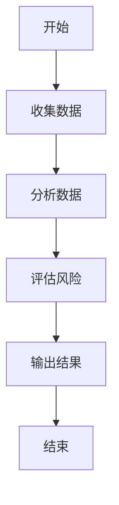

                 


# 智能体协作评估公司的地缘政治风险：全球价值投资必备

**关键词**：智能体协作、地缘政治风险、全球投资、系统架构、算法原理

**摘要**：本文探讨了利用智能体协作技术评估公司地缘政治风险的方法，旨在为全球价值投资者提供决策支持。通过详细分析智能体协作的核心原理、算法设计、系统架构及实际案例，本文为读者提供了一套完整的解决方案，帮助投资者在复杂的全球市场中降低风险，实现稳健投资。

---

## 第一部分: 地缘政治风险评估的智能体协作概述

### 第1章: 地缘政治风险与智能体协作概述

#### 1.1 地缘政治风险的定义与影响
- **1.1.1 地缘政治风险的核心概念**  
  地缘政治风险是指因国家间的政治、经济、军事冲突或政策变化对企业经营环境产生的不确定性。这种风险可能影响企业的供应链、市场准入和财务稳定性。

- **1.1.2 地缘政治风险对企业的影响**  
  企业可能面临贸易壁垒增加、资产被没收、项目延迟或成本上升等问题。例如，中美贸易摩擦对企业全球供应链的影响就是一个典型案例。

- **1.1.3 全球化背景下的地缘政治风险特点**  
  全球化使得企业更加依赖跨国供应链，同时也增加了地缘政治风险的复杂性。例如，地缘政治冲突可能导致能源价格波动或关键原材料供应中断。

#### 1.2 智能体协作的基本原理
- **1.2.1 智能体协作的定义**  
  智能体协作是指多个智能体（Agent）通过共享信息、协同决策来完成共同目标的过程。每个智能体都有自己的目标和决策机制，但通过协作实现整体优化。

- **1.2.2 智能体协作的核心机制**  
  智能体协作依赖于信息共享、任务分配和协调机制。例如，利用分布式计算和博弈论模型，智能体可以在不完全信任的情况下达成共识。

- **1.2.3 智能体协作与传统评估方法的对比**  
  传统评估方法通常依赖于单点分析，而智能体协作可以通过分布式计算和实时数据处理，提供更动态和全面的评估结果。

---

## 第二部分: 智能体协作评估地缘政治风险的核心概念

### 第2章: 地缘政治风险评估的核心要素

#### 2.1 地缘政治风险的关键维度
- 政治稳定性：包括政府更迭、政策变化等。
- 经济政策：包括贸易壁垒、关税政策等。
- 地缘冲突：包括战争、领土争端等。
- 法律环境：包括法律法规的变化对企业的影响。

#### 2.2 智能体协作的多维度分析
- 每个智能体负责分析一个维度，通过协作整合各维度的信息，形成综合评估结果。

#### 2.3 核心概念对比表（使用 Mermaid 表格）

```mermaid
| 维度       | 传统评估方法 | 智能体协作评估 |
|------------|--------------|----------------|
| 数据来源   | 单一数据源    | 多数据源协作   |
| 处理方式   | 集中式分析    | 分布式计算      |
| 实时性     | 低            | 高              |
| 可扩展性   | 有限          | 高              |
```

### 第3章: 智能体协作的实体关系分析

#### 3.1 实体关系图（使用 Mermaid ER 图）

```mermaid
erd
actor:投资者
actor:企业
actor:政府
actor:国际组织
```

---

## 第三部分: 地缘政治风险评估的算法原理

### 第4章: 地缘政治风险评估算法

#### 4.1 算法概述（使用 Mermaid 流程图）



#### 4.2 算法实现（使用 Python 代码）

```python
def geopolitical_risk_assessment():
    # 收集数据
    data = collect_data()
    # 分析数据
    analysis = analyze_data(data)
    # 评估风险
    risk = assess_risk(analysis)
    # 输出结果
    return output_result(risk)

geopolitical_risk_assessment()
```

#### 4.3 算法的数学模型（使用 LaTeX 公式）

$$ \text{风险值} = \sum_{i=1}^{n} w_i \cdot r_i $$

其中，$w_i$ 是第 $i$ 个风险因子的权重，$r_i$ 是第 $i$ 个风险因子的值。

---

## 第四部分: 系统分析与架构设计

### 第6章: 地缘政治风险评估系统的架构设计

#### 6.1 系统功能需求分析
- 数据采集模块：收集全球政治、经济数据。
- 数据分析模块：利用智能体协作进行风险评估。
- 用户界面：展示评估结果，提供决策支持。

#### 6.2 系统架构设计（使用 Mermaid 架构图）


---

## 第五部分: 项目实战与案例分析

### 第7章: 项目实战

#### 7.1 环境安装与配置
- 安装 Python 和相关库（如 Pandas、NumPy）。
- 配置数据源（如爬取公开数据或使用API）。

#### 7.2 核心代码实现
```python
import pandas as pd

def collect_data():
    # 示例：从API获取数据
    data = pd.read_json('https://example.com/api')
    return data

def analyze_data(data):
    # 示例：计算风险指数
    risk_index = data['风险因子'].mean()
    return risk_index

def assess_risk(analysis):
    # 示例：判断风险等级
    if analysis > 0.7:
        return '高风险'
    elif analysis > 0.4:
        return '中风险'
    else:
        return '低风险'

def output_result(risk):
    print(f"地缘政治风险等级：{risk}")

geopolitical_risk_assessment()
```

#### 7.3 代码解读与优化
- 数据采集模块负责获取实时数据。
- 数据分析模块利用统计方法计算风险指数。
- 风险评估模块基于阈值判断风险等级。

### 第8章: 案例分析与经验总结

#### 8.1 典型案例分析
- 某跨国企业因地缘政治冲突导致供应链中断，通过智能体协作评估及时调整策略，降低损失。

#### 8.2 经验总结与改进建议
- 数据采集的实时性至关重要。
- 算法模型需要定期更新，以适应地缘政治环境的变化。

---

## 第六部分: 结论与展望

### 第9章: 结论与未来研究方向

#### 9.1 全书总结
智能体协作技术为地缘政治风险评估提供了新的思路，通过多智能体协作，可以实现更全面、更动态的风险评估。

#### 9.2 未来研究方向
- 探索更高效的智能体协作算法。
- 研究如何将智能体协作应用于更多领域。

---

**作者：AI天才研究院/AI Genius Institute & 禅与计算机程序设计艺术 /Zen And The Art of Computer Programming**

---

以上是文章的完整目录和部分内容，每个章节都按照逻辑顺序展开，结合理论与实践，深入浅出地介绍了智能体协作在地缘政治风险评估中的应用。

