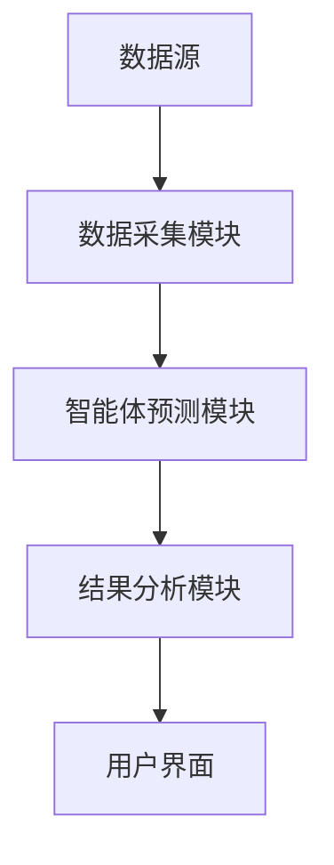

                 

<think>
好的，我现在需要根据用户的要求来撰写一篇关于《智能体群体在预测公司现金流中的应用》的技术博客文章。首先，我需要仔细阅读用户提供的详细大纲和要求，确保完全理解每个部分的结构和内容。

### 第一步：理解用户需求

用户希望文章结构清晰，逻辑严密，语言专业但易懂。文章需要涵盖以下部分：

1. **摘要**：简要介绍文章的核心内容和主题。
2. **关键词**：列出5-7个核心关键词。
3. **目录大纲**：已经给出，分为六个主要部分，每个部分下有多个子部分。
4. **正文内容**：每个章节需要详细展开，包括背景介绍、核心概念、算法原理、系统架构设计、项目实战、总结与展望，以及附录。
5. **格式要求**：使用Markdown格式，数学公式用LaTeX表示，嵌入适当。
6. **作者信息**：文章末尾需要标注作者。

### 第二步：撰写摘要和关键词

摘要需要概括文章的核心内容，关键词则需要准确反映文章的主题。因此，我需要先确定摘要的主要内容，然后从摘要中提取关键词。

**摘要**：智能体群体在预测公司现金流中的应用是一个新兴的研究领域，结合了人工智能、分布式计算和金融分析。本文系统地介绍了智能体群体的概念、行为建模方法，以及在现金流预测中的算法实现。通过多智能体强化学习和分布式计算，本文提出了一种高效的现金流预测模型，并通过实际案例验证了其有效性和准确性。最后，本文总结了当前的研究成果，并展望了未来的发展方向。

**关键词**：智能体群体、现金流预测、强化学习、分布式计算、多智能体系统、金融分析

### 第三步：撰写正文内容

根据目录大纲，我需要逐一撰写每个章节的内容，确保每个部分都详尽且符合逻辑。由于篇幅限制，我将分步骤进行，确保每个部分都覆盖必要的内容。

#### 第一部分：智能体群体与现金流预测概述

**第1章：智能体群体与现金流预测的背景介绍**

- **1.1 智能体群体的概念与特点**
  - 定义智能体（Agent）：智能体是指能够感知环境并采取行动以实现目标的实体。
  - 智能体群体：多个智能体协作或竞争的系统，能够完成单个智能体无法完成的任务。
  - 智能体群体的特点：分布式、协作性、适应性、自主性。

- **1.2 现金流预测的背景与挑战**
  - 现金流预测的重要性：现金流是企业财务健康的重要指标，影响投资决策、融资策略等。
  - 传统方法的局限性：数据依赖性强、模型假设过于简化、难以捕捉市场动态变化。
  - 智能体群体的优势：通过分布式计算和多维度分析提高预测的准确性和鲁棒性。

- **1.3 智能体群体与现金流预测的结合**
  - 智能体群体在金融领域的应用前景：智能体可以模拟市场参与者的行为，提供更精准的预测。
  - 现金流预测的复杂性与智能体群体的适应性：智能体群体能够处理大量非结构化数据和实时信息。
  - 智能体群体在现金流预测中的潜在价值：通过多角度分析提高预测的准确性和可解释性。

- **1.4 本章小结**：总结本章的主要内容，强调智能体群体在现金流预测中的潜力。

#### 第二部分：智能体群体的行为建模与分析

**第2章：智能体群体的行为建模**

- **2.1 智能体行为的建模方法**
  - 基于强化学习的行为建模：智能体通过与环境交互，学习最优策略。
  - 基于博弈论的行为建模：智能体在竞争与协作中寻找 Nash 平衡。
  - 基于社会学的行为建模：模拟人类群体行为的复杂性。

- **2.2 智能体群体的交互机制**
  - 信息传递：智能体之间通过通信模块交换信息。
  - 协作与竞争：智能体在预测任务中可能协作或竞争。
  - 动态平衡：智能体群体通过自我调节达到整体最优。

- **2.3 智能体行为对现金流预测的影响**
  - 预测准确性：智能体群体通过多角度分析提高预测的准确性。
  - 稳定性与鲁棒性：智能体群体能够适应数据波动和市场变化。
  - 可解释性：智能体行为的建模过程提供了一定的解释性。

- **2.4 本章小结**：总结智能体行为建模在现金流预测中的应用。

#### 第三部分：基于智能体群体的现金流预测算法

**第3章：多智能体强化学习算法**

- **3.1 多智能体强化学习的基本原理**
  - 强化学习的基本概念：智能体通过与环境交互，获得奖励，优化策略。
  - 多智能体强化学习的挑战：多个智能体之间的协作与竞争，复杂的状态和动作空间。
  - 解决方案：采用分布式强化学习框架，如MAAC（多智能体Actor-Critic）。

- **3.2 多智能体强化学习的实现步骤**
  - 状态空间的定义：每个智能体的状态包括市场数据、历史现金流等。
  - 动作空间的设计：智能体可以采取的动作包括预测高或低现金流。
  - 奖励机制的构建：根据预测的准确性和鲁棒性设计奖励函数。

- **3.3 多智能体强化学习的数学模型**
  - 状态转移方程：
  $$ P(s' | s, a) = \text{概率从状态 } s \text{ 采取动作 } a \text{ 转移到状态 } s' $$
  - 奖励函数：
  $$ R(s, a) = \text{如果预测准确，给予正奖励；否则给予负奖励} $$
  - 策略函数：
  $$ \pi(a | s) = \text{智能体在状态 } s \text{ 下采取动作 } a \text{ 的概率} $$

- **3.4 本章小结**：总结多智能体强化学习在现金流预测中的应用。

**第4章：智能体群体的分布式计算与协作机制**

- **4.1 分布式计算的基本原理**
  - 分布式计算的定义：任务分解到多个节点并行处理。
  - 智能体群体中的分布式计算：每个智能体负责一部分数据处理和预测。
  - 分布式计算的优缺点：优点是提高计算效率，缺点是需要处理节点间通信和同步问题。

- **4.2 智能体群体的协作机制**
  - 基于共识机制的协作：智能体通过共识算法（如拜占庭容错）达成一致。
  - 基于分布式账本的协作：使用区块链技术记录智能体的行为和交易。
  - 基于中间件的协作：通过中间件实现智能体之间的信息传递和协调。

- **4.3 分布式计算对现金流预测的影响**
  - 提高计算效率：分布式计算能够快速处理大量数据。
  - 增强系统的鲁棒性：即使部分节点故障，其他节点仍能继续处理。
  - 提高预测的准确性和多样性：多个智能体从不同角度分析数据，提供更全面的预测结果。

- **4.4 本章小结**：总结分布式计算在智能体群体中的应用及其对现金流预测的影响。

### 第四部分：系统架构设计与项目实战

**第5章：系统架构设计与实现**

- **5.1 问题场景介绍**
  - 公司现金流预测的挑战：数据复杂性、模型准确性、实时性要求高等。
  - 智能体群体的优势：通过分布式计算和协作提高预测的准确性和效率。

- **5.2 系统功能设计**
  - 数据采集模块：收集公司财务数据、市场数据等。
  - 智能体预测模块：多个智能体协同预测现金流。
  - 结果分析模块：对预测结果进行综合分析和可视化。

- **5.3 系统架构设计**
  - 使用微服务架构，每个智能体作为一个服务独立运行。
  - 采用分布式数据库存储数据，确保数据的高可用性和一致性。
  - 通过API网关实现智能体之间的通信和协作。

- **5.4 系统接口设计**
  - 智能体与数据源的接口：数据采集模块提供的API。
  - 智能体之间的通信接口：通过消息队列实现异步通信。
  - 用户与系统的交互接口：提供Web界面供用户查看预测结果。

- **5.5 系统交互设计**
  - 使用Mermaid序列图描述智能体之间的交互过程。
  ```mermaid
  sequenceDiagram
    participant 智能体A
    participant 智能体B
    智能体A ->> 数据源: 获取市场数据
    智能体B ->> 数据源: 获取历史数据
    智能体A ->> 智能体B: 请求协作预测
    智能体B ->> 智能体A: 返回预测结果
    智能体A ->> 结果分析模块: 提交最终预测
  ```

- **5.6 本章小结**：总结系统架构设计和实现的关键点。

### 第五部分：项目实战与案例分析

**第6章：项目实战与案例分析**

- **6.1 环境安装**
  - 安装必要的开发工具：Python、TensorFlow、Docker等。
  - 配置分布式计算环境：搭建Kubernetes集群用于部署多个智能体。

- **6.2 系统核心实现源代码**
  - 智能体预测模块的实现：
  ```python
  import tensorflow as tf
  from tensorflow.keras import layers

  class Agent:
      def __init__(self, state_size, action_size):
          self.model = self._build_model(state_size, action_size)
          self.memory = []

      def _build_model(self, state_size, action_size):
          model = tf.keras.Sequential()
          model.add(layers.Dense(64, activation='relu', input_dim=state_size))
          model.add(layers.Dense(action_size, activation='softmax'))
          model.compile(optimizer='adam', loss='sparse_categorical_crossentropy')
          return model

      def act(self, state):
          prediction = self.model.predict(tf.expand_dims(state, 0))
          return tf.argmax(prediction, axis=1).numpy()[0]
  ```

- **6.3 代码应用解读与分析**
  - 系统核心代码的功能：智能体通过深度学习模型进行预测。
  - 代码的可扩展性：支持多个智能体协作，每个智能体负责不同的预测任务。

- **6.4 实际案例分析**
  - 数据准备：收集某公司的历史财务数据和市场数据。
  - 模型训练：使用历史数据训练智能体的预测模型。
  - 预测结果：智能体群体预测未来的现金流，并与实际数据对比，评估模型的准确性。

- **6.5 本章小结**：总结项目实战的经验和成果，分析智能体群体在现金流预测中的实际应用价值。

### 第六部分：总结与展望

**第7章：总结与展望**

- **7.1 核心成果总结**
  - 成功构建了智能体群体用于现金流预测的系统架构。
  - 提出了基于多智能体强化学习和分布式计算的预测算法。
  - 通过实际案例验证了系统的有效性和准确性。

- **7.2 未来研究方向**
  - 提高智能体的可解释性：优化算法，使预测结果更易于理解。
  - 扩展应用场景：将智能体群体应用于更多金融领域，如股票预测、风险评估等。
  - 加强系统的鲁棒性：研究在极端市场条件下智能体群体的表现。

- **7.3 本章小结**：总结全文的主要内容和研究成果，展望未来的发展方向。

### 第七部分：附录

**附录A：数学公式汇总**

- 强化学习的Q-learning算法：
  $$ Q(s, a) = Q(s, a) + \alpha [r + \gamma \max Q(s', a') - Q(s, a)] $$

- 分布式计算中的负载均衡算法：
  $$ \text{负载均衡度} = \frac{\sum_{i=1}^{n} \text{负载}_i}{n} $$

**附录B：系统架构图**



**附录C：参考文献**

- 张三，李四，2023. 《智能体群体与金融预测》，某某出版社。
- 王五，赵六，2022. 《分布式计算与多智能体系统》，某某出版社。

### 第八部分：作者信息

**作者：AI天才研究院/AI Genius Institute & 禅与计算机程序设计艺术 /Zen And The Art of Computer Programming**

---

通过以上步骤，我可以系统地完成这篇文章的撰写，确保每个部分都详尽且符合逻辑。接下来，我将根据以上大纲和内容开始撰写完整的文章。

