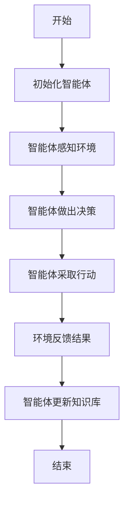
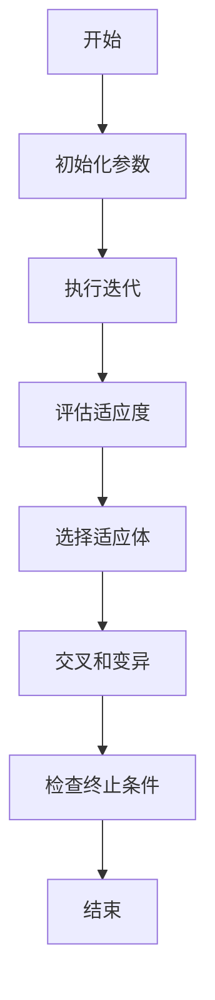
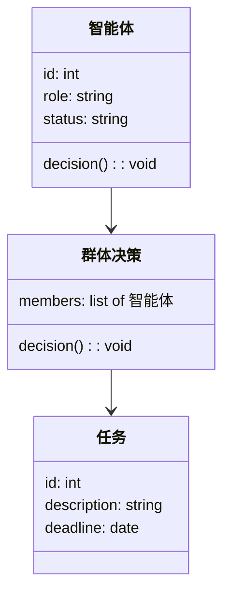
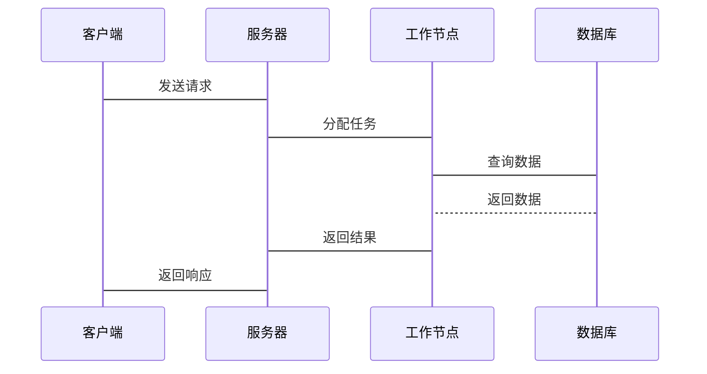

                 


# 智能体群体智慧在识别新兴产业机会中的应用

## 关键词：智能体、群体智慧、新兴产业、机会识别、算法、系统架构、项目实战

## 摘要：
智能体群体智慧是一种通过多个智能体协同工作来解决复杂问题的方法。本文探讨了智能体群体智慧在识别新兴产业机会中的应用，分析了其核心算法、系统架构以及实际案例。通过详细讲解智能体群体智慧的原理、实现和优化方法，本文旨在为读者提供一个全面的视角，帮助他们在新兴产业中发现和把握机会。

---

## 第1章: 智能体群体智慧的基本概念

### 1.1 智能体的基本概念
#### 1.1.1 智能体的定义与特征
- **定义**：智能体（Agent）是指能够感知环境并采取行动以实现目标的实体。
- **特征**：自主性、反应性、目标导向性、社会性。

#### 1.1.2 群体智能与个体智能的区别
- **个体智能**：单个智能体的决策和行动。
- **群体智能**：多个智能体协同工作，共同完成任务。

#### 1.1.3 智能体群体智慧的核心要素
- 协作、通信、协调、决策。

### 1.2 智能体群体智慧的背景与应用
#### 1.2.1 问题背景与问题描述
- **问题背景**：识别新兴产业机会的难度增加，传统方法效率低下。
- **问题描述**：智能体群体智慧的优势：高效、准确、适应性强。

#### 1.2.2 智能体群体智慧的解决思路
- 通过多个智能体协同工作，利用群体智慧进行数据挖掘、模式识别和决策优化。

#### 1.2.3 智能体群体智慧的边界与外延
- **边界**：智能体的个体能力有限，群体协作可以弥补个体不足。
- **外延**：智能体群体智慧可以应用于多个领域，如金融、医疗、教育等。

### 1.3 智能体群体智慧的概念结构
#### 1.3.1 概念属性特征对比表格
| 智能体属性 | 个体智能 | 群体智能 |
|------------|----------|----------|
| 决策方式   | 独立决策 | 协同决策 |
| 信息处理   | 个体处理 | 共享处理 |
| 计算资源   | 单一资源 | 分布资源 |

#### 1.3.2 ER实体关系图架构
```mermaid
entity 智能体群体 {
    属性：id, name, role, status
    关系：参与（到 任务）
}
entity 任务 {
    属性：id, name, description, deadline
    关系：由（多个 智能体群体）完成
}
```

#### 1.3.3 智能体群体智慧的核心要素组成
- 智能体：个体智能体。
- 通信机制：智能体之间的信息交互。
- 协作机制：智能体之间的任务分配和协作。
- 决策机制：群体决策的过程和方法。

---

## 第2章: 智能体群体智慧在新兴产业中的应用

### 2.1 新兴产业机会识别的挑战与需求
#### 2.1.1 新兴产业的特点与识别难点
- **特点**：快速变化、创新性强、市场不确定性高。
- **识别难点**：数据量大、信息分散、模式复杂。

#### 2.1.2 传统方法的局限性
- 数据处理能力有限，难以捕捉复杂模式。
- 人工分析效率低，耗时长。

#### 2.1.3 智能体群体智慧的优势
- 高效的数据处理能力。
- 群体协作，提高识别准确率。
- 灵活适应市场变化。

### 2.2 智能体群体智慧的核心算法
#### 2.2.1 群体智能算法的原理与流程


#### 2.2.2 智能体之间的信息交互机制
- 通信协议：智能体之间通过特定协议进行信息交换。
- 信息共享：智能体将感知到的信息共享到群体知识库。

#### 2.2.3 群体决策的优化方法
- 分布式决策：每个智能体根据局部信息做出决策。
- 协作优化：通过群体协作不断优化决策结果。

### 2.3 智能体群体智慧的数学模型
#### 2.3.1 群体行为的数学建模
- 群体行为可以通过概率论和统计学模型进行描述。

#### 2.3.2 智能体决策的数学公式
- 决策函数：\( f(x) = \sum_{i=1}^{n} a_i x_i \)
- 优化目标：\( \min f(x) \) 或 \( \max f(x) \)

#### 2.3.3 群体智慧的优化算法
- 遗传算法：\( f(x) \) 的优化可以通过基因的交叉和变异来实现。

---

## 第3章: 智能体群体智慧的算法实现

### 3.1 群体智能算法的实现步骤
#### 3.1.1 算法流程图（Mermaid）


#### 3.1.2 算法实现的Python代码
```python
import random

def fitness(x):
    return sum(a * x[i] for i, a in enumerate(coefficients))

def mutate(x):
    i = random.randint(0, len(x)-1)
    x[i] = x[i] * (1 + random.gauss(0, 0.1))
    return x

def crossover(x1, x2):
    i = random.randint(0, len(x1)-1)
    return x1[:i] + x2[i:], x2[:i] + x1[i:]

# 初始化参数
population = [random.uniform(0, 1) for _ in range(pop_size)]
```

#### 3.1.3 算法实现的详细解读
- 初始化参数：生成初始智能体的参数。
- 迭代过程：通过多次迭代优化决策结果。
- 适应度评估：评估每个智能体的决策效果。
- 选择与优化：通过选择、交叉和变异优化智能体的参数。

### 3.2 群体决策的优化方法
#### 3.2.1 优化算法的数学模型
- 最优化目标：\( \max f(x) \) 或 \( \min f(x) \)
- 约束条件：\( g(x) \geq 0 \) 或 \( h(x) = 0 \)

#### 3.2.2 优化算法的实现代码
```python
def optimize(f, constraints):
    for each iteration:
        evaluate f(x)
        check constraints
        apply optimization step
```

#### 3.2.3 优化算法的案例分析
- 案例：优化投资组合，最大化收益，最小化风险。

---

## 第4章: 智能体群体智慧的系统架构设计

### 4.1 系统功能设计
#### 4.1.1 系统功能模块划分
- 智能体模块：负责个体决策和行动。
- 通信模块：负责智能体之间的信息交互。
- 群体决策模块：负责群体决策和优化。

#### 4.1.2 系统功能的领域模型（Mermaid类图）


#### 4.1.3 系统功能的实现方式
- 智能体通过API进行通信。
- 群体决策模块通过协调机制分配任务。

### 4.2 系统架构设计
#### 4.2.1 系统架构的总体设计（Mermaid架构图）


#### 4.2.2 系统架构的实现细节
- 服务器负责接收请求和分配任务。
- 工作节点负责具体任务的执行。
- 知识库负责存储和管理数据。

#### 4.2.3 系统架构的优化建议
- 使用分布式架构提高效率。
- 采用缓存技术减少数据访问时间。

### 4.3 系统接口设计
#### 4.3.1 系统接口的定义与实现
- API接口：RESTful API。
- 数据格式：JSON。

#### 4.3.2 系统接口的交互流程（Mermaid序列图）


#### 4.3.3 系统接口的测试方法
- 使用Postman进行接口测试。
- 编写自动化测试脚本。

---

## 第5章: 智能体群体智慧的项目实战

### 5.1 环境安装与配置
#### 5.1.1 开发环境的选择与安装
- 开发工具：PyCharm或VS Code。
- 开发环境：Python 3.8以上版本。
- 依赖库：numpy, matplotlib, scikit-learn。

#### 5.1.2 数据集的获取与预处理
- 数据来源：公开数据集或爬取数据。
- 数据清洗：处理缺失值、异常值。

#### 5.1.3 环境配置的注意事项
- 安装必要的Python包。
- 配置开发环境的路径。

### 5.2 系统核心实现源代码
#### 5.2.1 群体智能算法的实现代码
```python
def evolve(population, fitness_fn, mutation_rate=0.1):
    new_population = []
    for _ in range(len(population)):
        parent1 = selection(population, fitness_fn)
        parent2 = selection(population, fitness_fn)
        child1, child2 = crossover(parent1, parent2)
        child1 = mutate(child1, mutation_rate)
        child2 = mutate(child2, mutation_rate)
        new_population.append(child1)
        new_population.append(child2)
    return new_population
```

#### 5.2.2 群体决策模块的实现代码
```python
class GroupDecision:
    def __init__(self, members):
        self.members = members

    def decide(self, task):
        decisions = [member.decision(task) for member in self.members]
        return self.optimize(decisions)

    def optimize(self, decisions):
        # 具体优化方法根据任务而定
        pass
```

#### 5.2.3 系统通信模块的实现代码
```python
import requests

def send_request(data):
    response = requests.post('http://localhost:5000/api', json=data)
    return response.json()
```

### 5.3 代码应用解读与分析
#### 5.3.1 群体智能算法的代码解读
- 初始化群体：生成初始智能体。
- 进化过程：通过选择、交叉和变异生成新的群体。
- 适应度评估：评估每个智能体的决策效果。

#### 5.3.2 群体决策模块的代码解读
- 初始化：将多个智能体组合成一个群体。
- 决策过程：每个智能体做出决策，群体决策模块优化这些决策。
- 优化方法：根据具体任务选择合适的优化算法。

### 5.4 实际案例分析和详细讲解剖析
#### 5.4.1 案例背景
- **行业**：金融科技。
- **问题**：识别新兴的金融科技机会。

#### 5.4.2 数据收集与处理
- **数据来源**：市场报告、新闻、专利数据。
- **数据预处理**：清洗、标注。

#### 5.4.3 群体智能算法的应用
- **算法目标**：识别高潜力的金融科技领域。
- **算法实现**：使用进化算法优化投资组合。

### 5.5 项目小结
#### 5.5.1 项目成果
- 成功识别多个新兴金融科技机会。
- 提高了决策的准确性和效率。

#### 5.5.2 经验总结
- 群体智能算法的有效性。
- 系统架构设计的重要性。

---

## 第6章: 智能体群体智慧的最佳实践与拓展

### 6.1 最佳实践 tips
- **系统设计**：模块化设计，便于维护和扩展。
- **算法优化**：根据具体任务选择合适的算法。
- **数据处理**：确保数据的准确性和完整性。

### 6.2 小结
- 本文详细介绍了智能体群体智慧的基本概念、算法实现和系统架构设计。
- 通过实际案例展示了其在新兴产业机会识别中的应用。

### 6.3 注意事项
- **数据隐私和安全问题**：确保数据的安全性和隐私性。
- **算法的可解释性和透明度**：确保算法的决策过程清晰透明。
- **系统的鲁棒性和容错能力**：确保系统在异常情况下的稳定运行。

### 6.4 拓展阅读
- **推荐阅读**：《群体智能》（Swarm Intelligence）。
- **参考文献**：Nature-inspired optimization algorithms.

---

## 作者：AI天才研究院/AI Genius Institute & 禅与计算机程序设计艺术 /Zen And The Art of Computer Programming

