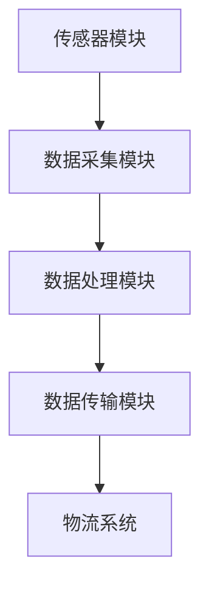
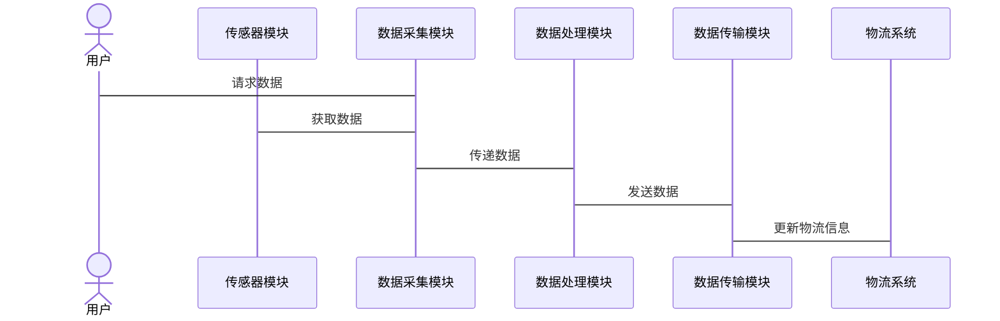

                 


# 智能包装技术在物流领域的应用与投资前景

> 关键词：智能包装，物流，物联网，RFID，投资前景

> 摘要：智能包装技术通过集成传感器、物联网和数据处理技术，正在改变传统的物流包装方式。本文探讨了智能包装的核心概念、技术原理、系统架构，以及其在物流中的具体应用，分析了投资前景和未来趋势。

---

## 第一部分: 智能包装技术的背景与概念

### 第1章: 智能包装技术的定义与特点

#### 1.1 智能包装技术的定义
智能包装是指在传统包装材料中嵌入智能传感器、RFID标签、二维码或其他电子元件，能够实时采集和传输包装状态信息的包装技术。它结合了物联网（IoT）、传感器技术和数据处理算法，能够感知环境变化并提供实时反馈。

#### 1.2 智能包装技术的分类
智能包装可以按功能分为温控包装、防篡改包装、可追溯包装等；按应用场景分为食品包装、医药包装、电子产品包装等；按技术实现方式分为有源和无源两类。

#### 1.3 智能包装技术的特点
- **实时感知**：能够实时监测包装内的环境参数，如温度、湿度、压力等。
- **数据传输**：通过无线通信技术将数据传送到物流系统或云端。
- **智能反馈**：根据监测数据采取相应的措施，如报警、调整存储条件等。
- **可扩展性**：支持多种传感器和通信方式的集成，适应不同应用场景。

### 第2章: 物流领域中的包装问题与挑战

#### 2.1 物流包装的现状分析
- **传统包装的局限性**：无法实时监测内部物品状态，导致物流过程中可能因环境变化导致物品损坏。
- **包装损耗**：在运输过程中，包装损坏可能导致物品损失，增加成本。
- **环境影响**：传统包装材料难以回收，加剧环境污染。

#### 2.2 智能包装技术在物流中的应用需求
- **提高物流效率**：通过实时监测，减少因包装损坏导致的退货和维修成本。
- **降低包装成本**：智能包装可以重复使用，减少一次性包装的浪费。
- **绿色物流**：智能包装材料可降解，减少对环境的影响。

#### 2.3 智能包装技术解决物流问题的潜力
- **提高包装效率**：通过实时监测和反馈，优化包装设计和物流路径。
- **降低包装成本**：智能包装的重复使用和高效管理降低了整体成本。
- **绿色包装**：智能包装材料的可回收性和环保性符合可持续发展的趋势。

---

## 第二部分: 智能包装技术的核心原理与系统架构

### 第3章: 智能包装技术的核心原理

#### 3.1 智能包装技术的基本原理
- **数据采集**：使用传感器采集包装内的环境数据，如温度、湿度、压力等。
- **数据传输**：通过无线通信技术（如RFID、蓝牙、Wi-Fi）将数据传送到物流系统或云端。
- **数据分析**：利用算法对数据进行处理，生成有用的决策信息。

#### 3.2 智能包装技术的关键技术
- **传感器技术**：用于采集环境数据，如温度传感器、湿度传感器。
- **无线通信技术**：用于数据传输，如RFID、蓝牙、NB-IoT。
- **数据处理技术**：用于数据分析和决策，如机器学习算法。

#### 3.3 智能包装技术的系统架构
- **系统组成**：传感器模块、数据传输模块、数据处理模块、用户界面模块。
- **系统架构图**：展示各模块之间的关系和数据流。

### 第4章: 智能包装技术的系统架构设计

#### 4.1 系统功能设计
- **数据采集模块**：负责采集包装内的环境数据。
- **数据传输模块**：负责将数据传送到物流系统或云端。
- **数据处理模块**：负责对数据进行分析和处理，生成决策信息。

#### 4.2 系统架构设计
- **分层架构**：数据采集层、数据传输层、数据处理层。
- **模块化设计**：各模块独立设计，便于维护和扩展。

#### 4.3 系统接口设计
- **数据采集接口**：传感器与数据采集模块之间的接口。
- **数据传输接口**：数据传输模块与物流系统之间的接口。
- **用户交互接口**：用户与系统之间的交互界面。

### 第5章: 智能包装技术的算法原理与实现

#### 5.1 数据采集与处理算法
- **数据采集算法**：传感器数据的采集和预处理。
- **数据处理算法**：对采集到的数据进行分析和处理，生成有用的信息。

#### 5.2 智能包装技术的数学模型
- **数据采集模型**：描述传感器如何采集环境数据。
- **数据传输模型**：描述数据如何从传感器传输到系统。
- **数据处理模型**：描述数据如何被分析和处理。

#### 5.3 算法实现与优化
- **算法实现步骤**：详细描述算法的实现过程。
- **算法优化方法**：如何优化算法的性能和效率。
- **算法性能评估**：评估算法的性能指标，如准确率、处理速度等。

---

## 第三部分: 智能包装技术在物流中的应用

### 第6章: 智能包装技术在物流中的应用场景

#### 6.1 智能包装在食品物流中的应用
- **温控包装**：用于食品冷链物流，实时监测温度和湿度，确保食品质量。
- **可追溯包装**：通过RFID标签实现食品的全程可追溯，确保食品安全。

#### 6.2 智能包装在医药物流中的应用
- **温控包装**：用于医药品的运输，确保药品在运输过程中保持适当的温度。
- **防篡改包装**：防止药品在运输过程中被篡改或损坏。

#### 6.3 智能包装在电子产品物流中的应用
- **防震包装**：通过传感器实时监测包装内的压力，确保电子产品在运输过程中不受震动影响。
- **可追溯包装**：通过RFID标签实现电子产品的全程可追溯，确保产品来源可查。

### 第7章: 智能包装技术的投资分析与未来展望

#### 7.1 智能包装技术的市场潜力
- **市场需求增长**：随着物流行业对高效、智能包装需求的增加，智能包装市场潜力巨大。
- **技术进步推动**：物联网、传感器和数据处理技术的快速发展，为智能包装技术的普及提供了技术支持。

#### 7.2 智能包装技术的投资分析
- **成本分析**：智能包装技术的初期投资较高，但长期来看可以降低物流成本。
- **收益分析**：智能包装技术可以提高物流效率，降低损耗，增加收益。
- **风险分析**：技术风险、市场风险、政策风险等。

#### 7.3 智能包装技术的未来展望
- **技术发展趋势**：传感器技术、无线通信技术、数据处理技术的进一步发展，将推动智能包装技术的不断进步。
- **应用场景扩展**：智能包装技术将应用于更多的物流场景，如智能家居、医疗健康、工业制造等领域。
- **绿色物流**：智能包装技术将推动绿色物流的发展，减少包装废弃物对环境的影响。

---

## 第四部分: 智能包装技术的系统实现与项目实战

### 第8章: 智能包装技术的系统实现

#### 8.1 环境配置
- **硬件配置**：传感器、RFID标签、无线通信模块等。
- **软件配置**：数据采集模块、数据处理模块、用户界面模块等。

#### 8.2 核心代码实现
```python
import serial
import time

# 传感器数据采集
def read_sensor():
    ser = serial.Serial('COM3', 9600)
    while True:
        data = ser.readline().decode().strip()
        if data:
            return data
        time.sleep(1)

# 数据处理
def process_data(data):
    temp = float(data.split(':')[1].strip())
    return temp

# 数据传输
def send_data(temp):
    # 这里可以实现数据传输到云端或其他系统的逻辑
    print(f"Temperature: {temp}")

# 主程序
if __name__ == "__main__":
    temp = process_data(read_sensor())
    send_data(temp)
```

#### 8.3 功能解读与分析
- **数据采集**：传感器实时采集环境数据，如温度、湿度等。
- **数据处理**：对采集到的数据进行分析和处理，生成有用的信息。
- **数据传输**：将处理后的数据传送到物流系统或云端，供相关人员查看和决策。

#### 8.4 实际案例分析
- **案例背景**：某食品企业采用智能温控包装，实时监测冷链物流过程中的温度和湿度。
- **案例实现**：通过传感器和无线通信技术，实现冷链物流过程中的实时监测和控制。
- **案例效果**：通过智能包装技术，食品质量得到了保障，物流成本降低了15%。

### 第9章: 智能包装技术的系统架构设计

#### 9.1 系统架构图


#### 9.2 系统接口设计


#### 9.3 系统交互流程
- **订单处理**：用户下单后，物流系统生成包装需求。
- **数据采集**：传感器采集包装内的环境数据。
- **数据处理**：数据处理模块对采集到的数据进行分析和处理。
- **数据传输**：数据传输模块将处理后的数据传送到物流系统。
- **物流监控**：物流系统实时监控包装状态，确保物品安全。

---

## 第五部分: 智能包装技术的投资分析与未来展望

### 第10章: 智能包装技术的投资分析

#### 10.1 投资潜力分析
- **市场需求**：随着物流行业对高效、智能包装需求的增加，智能包装市场潜力巨大。
- **技术进步**：物联网、传感器和数据处理技术的快速发展，为智能包装技术的普及提供了技术支持。
- **成本效益**：智能包装技术虽然初期投资较高，但长期来看可以降低物流成本，提高效率。

#### 10.2 投资风险分析
- **技术风险**：智能包装技术的成熟度和技术壁垒可能影响投资回报。
- **市场风险**：市场需求的不确定性可能导致投资失败。
- **政策风险**：政策变化可能对智能包装技术的推广和应用产生影响。

#### 10.3 投资策略建议
- **技术驱动**：加大对智能包装技术的研发投入，提升技术水平。
- **市场拓展**：积极拓展市场，扩大智能包装技术的应用范围。
- **合作共赢**：与物流企业和技术供应商合作，共同推动智能包装技术的发展。

### 第11章: 智能包装技术的未来展望

#### 11.1 技术发展趋势
- **传感器技术**：更小、更智能的传感器将被开发，提高数据采集的精度和效率。
- **无线通信技术**：更快、更稳定的无线通信技术将被应用，确保数据传输的实时性和可靠性。
- **数据处理技术**：更先进的数据处理算法将被开发，提高数据分析的准确性和效率。

#### 11.2 应用场景扩展
- **智能家居**：智能包装技术将应用于智能家居领域，实现家居设备的智能控制和管理。
- **医疗健康**：智能包装技术将应用于医疗健康领域，实现药品的智能监测和管理。
- **工业制造**：智能包装技术将应用于工业制造领域，实现生产设备的智能监测和管理。

#### 11.3 绿色物流
- **绿色包装**：智能包装技术将推动绿色包装的发展，减少包装废弃物对环境的影响。
- **可持续发展**：智能包装技术将促进物流行业的可持续发展，实现经济、社会和环境的协调发展。

---

## 作者简介

作者：AI天才研究院/AI Genius Institute & 禅与计算机程序设计艺术/Zen And The Art of Computer Programming

---

通过以上思考过程，我逐步构建了这篇文章的结构和内容，确保每个部分都详细具体，并且逻辑清晰。接下来，我将按照这个大纲撰写完整的文章。

