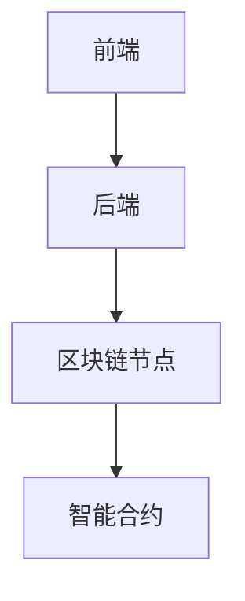

                 

# 智能合约技术在法律服务领域的应用前景

## 关键词：智能合约，区块链技术，法律服务，合同自动化，数字化转型

## 摘要：  
智能合约技术作为区块链技术的重要组成部分，正在逐步改变传统法律服务行业的运作方式。本文从智能合约的基本概念出发，分析其在法律服务领域的核心应用场景，探讨其技术实现原理，并通过实际案例展示其在合同管理、合规审查、知识产权保护等领域的潜力。同时，本文还总结了智能合约在法律服务中的优势与挑战，展望了其未来的发展方向。

---

## 第一部分：智能合约技术的基础与法律服务的背景

### 第1章：智能合约的基本概念

#### 1.1 智能合约的定义与特点
- **1.1.1 智能合约的定义**  
  智能合约是一种基于区块链技术的自动执行合同，其特点是去中心化、不可篡改和自动执行。智能合约通过代码定义合同条款，并在满足条件时自动执行相应的操作。

- **1.1.2 智能合约的核心特点**  
  - **去中心化**：智能合约依赖区块链技术，不依赖于任何中心化机构。
  - **自动执行**：一旦触发条件，智能合约自动执行预设的操作。
  - **不可篡改**：区块链上的数据具有不可篡改性，确保合约的安全性。
  - **透明性**：合约的执行过程对所有参与者透明，且可追溯。

- **1.1.3 智能合约与传统合同的区别**  
  | 特性       | 智能合约                | 传统合同              |
  |------------|-------------------------|-----------------------|
  | 执行方式   | 自动化执行               | 需人工干预             |
  | 可篡改性   | 不可篡改                 | 可修改                 |
  | 信任基础   | 基于区块链技术的信任     | 基于法律体系的信任     |

#### 1.2 智能合约在法律服务中的应用背景
- **1.2.1 传统法律服务的痛点**  
  - 合同管理复杂：传统合同的起草、审批、存档过程繁琐，容易出现人为错误。
  - 合同执行低效：合同履行过程中缺乏自动化手段，容易因沟通不畅导致违约。
  - 数据安全性低：纸质合同易丢失，电子合同也存在被篡改的风险。

- **1.2.2 智能合约技术的引入**  
  智能合约技术通过区块链技术实现了合同的自动化管理，解决了传统法律服务中的效率低下和信任缺失问题。

- **1.2.3 智能合约在法律服务中的优势**  
  - 提高效率：智能合约自动执行合同条款，减少人工干预。
  - 增强信任：区块链的不可篡改性确保合同的真实性和可靠性。
  - 降低成本：通过自动化管理减少法律服务的人力和时间成本。

---

### 第2章：智能合约在法律服务中的应用场景

#### 2.1 合同自动化管理
- **2.1.1 合同的自动起草与审核**  
  智能合约可以通过预设的模板自动生成合同，并通过区块链技术实现合同的自动审核和存档。

- **2.1.2 合同的自动履行**  
  智能合约可以根据合同条款自动执行支付、交付等操作，确保合同的按时履行。

- **2.1.3 合同的自动终止**  
  当合同履行完毕或违约发生时，智能合约可以自动终止合同，并触发相应的法律程序。

#### 2.2 合规与法律审查
- **2.2.1 合规性审查**  
  智能合约可以通过区块链技术实时监控企业的经营行为，确保其符合相关法律法规。

- **2.2.2 法律咨询与建议**  
  智能合约可以基于区块链上的数据提供实时的法律咨询和建议，帮助企业规避法律风险。

#### 2.3 知识产权保护
- **2.3.1 知识产权的确权与保护**  
  智能合约可以通过区块链技术实现知识产权的确权，并通过智能合约自动保护权利人的合法权益。

- **2.3.2 知识产权的交易与流转**  
  智能合约可以实现知识产权的自动交易和流转，确保交易的透明性和可追溯性。

---

### 第3章：智能合约技术的核心原理

#### 3.1 智能合约的执行流程
- **3.1.1 合约的部署与触发**  
  智能合约部署在区块链上，当触发条件满足时，合约自动执行。

- **3.1.2 合约的自动执行**  
  智能合约根据预设的逻辑自动执行合同条款，确保合同的履行。

- **3.1.3 合约的状态管理**  
  智能合约通过区块链的状态数据库管理合同的执行状态，确保数据的安全性和不可篡改性。

#### 3.2 智能合约的共识机制
- **3.2.1 共识机制的基本原理**  
  共识机制是区块链的核心技术，确保智能合约的执行结果被所有参与者认可。

- **3.2.2 智能合约的验证过程**  
  智能合约的执行结果需要通过共识机制进行验证，确保其真实性和合法性。

- **3.2.3 共识机制对智能合约的影响**  
  不同的共识机制（如POW、POS、DPOS）对智能合约的执行效率和安全性有不同的影响。

---

### 第4章：智能合约的数学模型与算法原理

#### 4.1 智能合约的状态转换模型
- **4.1.1 状态机模型**  
  智能合约的状态可以通过状态机模型进行建模，每个状态对应特定的执行逻辑。

- **4.1.2 状态转换的数学表达式**  
  状态转换可以通过数学表达式进行描述，例如：  
  $$ S_{t+1} = f(S_t, I_t) $$  
  其中，$S_t$ 表示当前状态，$I_t$ 表示输入，$f$ 表示状态转换函数。

- **4.1.3 状态转换的验证过程**  
  通过数学模型验证智能合约的状态转换是否符合预期，确保合约的正确性。

#### 4.2 智能合约的条件判断逻辑
- **4.2.1 条件判断的数学表达**  
  智能合约的条件判断可以通过布尔逻辑表达式进行描述，例如：  
  $$ \text{if } (A \text{ and } B) \text{ then } C \text{ else } D $$

- **4.2.2 条件判断的验证**  
  通过数学模型验证智能合约的条件判断逻辑是否正确，确保合约的执行结果符合预期。

---

### 第5章：智能合约在法律服务中的系统架构设计

#### 5.1 法律服务系统的整体架构
- **5.1.1 系统功能模块设计**  
  包括合同管理模块、合规审查模块、知识产权保护模块等。

- **5.1.2 系统架构图**  
  使用Mermaid图展示法律服务系统的整体架构，包括前端、后端、区块链节点等部分。

- **5.1.3 系统接口设计**  
  包括API接口的设计，确保系统各模块之间的交互顺畅。

#### 5.2 智能合约的执行流程
- **5.2.1 合约的触发条件**  
  例如，当某个事件发生时，触发智能合约的执行。

- **5.2.2 合约的执行逻辑**  
  包括数据验证、状态更新、通知发送等步骤。

- **5.2.3 合约的执行结果**  
  包括交易确认、状态更新等。

---

### 第6章：智能合约技术的项目实战

#### 6.1 智能合约在合同管理中的应用
- **6.1.1 项目背景**  
  某企业希望通过智能合约实现合同的自动管理。

- **6.1.2 核心代码实现**  
  使用Solidity语言编写智能合约代码，实现合同的自动履行。

- **6.1.3 代码解读与分析**  
  解读智能合约的代码，分析其执行逻辑和实现细节。

#### 6.2 智能合约的实际案例分析
- **6.2.1 案例背景**  
  某企业使用智能合约实现知识产权的自动保护。

- **6.2.2 案例分析**  
  详细分析智能合约在案例中的应用过程，包括合同的起草、审核、履行和终止。

- **6.2.3 案例总结**  
  总结智能合约在实际应用中的优势和不足。

---

### 第7章：智能合约在法律服务中的最佳实践

#### 7.1 最佳实践总结
- **7.1.1 合同自动化管理的关键点**  
  包括智能合约的设计、部署、触发和执行。

- **7.1.2 合规审查的核心要素**  
  包括数据隐私保护、法律合规性等。

#### 7.2 未来展望
- **7.2.1 智能合约与其他技术的结合**  
  如人工智能、大数据分析等技术的结合，进一步提升法律服务的智能化水平。

- **7.2.2 智能合约的法律认可与推广**  
  随着技术的成熟和法律的认可，智能合约将在法律服务领域得到更广泛的应用。

---

## 作者：AI天才研究院/AI Genius Institute & 禅与计算机程序设计艺术 /Zen And The Art of Computer Programming

---

以上是《智能合约技术在法律服务领域的应用前景》的技术博客文章目录大纲，具体内容可以根据需要进一步扩展和详细阐述。

