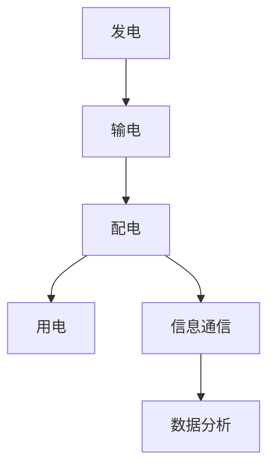

                 

# 智能电网技术在能源转型中的作用与投资

> 关键词：智能电网技术、能源转型、可再生能源、能源互联网、投资分析

> 摘要：智能电网技术作为能源转型的核心支撑，正在推动全球能源系统向清洁化、智能化和高效化方向发展。本文从智能电网技术的定义、核心概念、算法原理、数学模型、系统架构、项目实战等多个维度，深入分析其在能源转型中的作用与投资价值，为读者提供全面而深入的解读。

---

# 第1章: 智能电网技术与能源转型概述

## 1.1 智能电网技术的定义与特点

### 1.1.1 智能电网的基本概念
智能电网是一种通过智能化技术优化电力系统运行的新型电网系统，它利用先进的信息通信技术、数据分析技术和自动化技术，实现电力的高效传输、分配和管理。

### 1.1.2 智能电网的核心特点
- **智能化**：通过传感器和数据分析实现对电网的实时监控和智能决策。
- **互联性**：支持多种能源的接入和共享，形成能源互联网。
- **高效性**：通过优化电力传输和分配，降低能源浪费。
- **安全性**：具备强大的安全防护机制，防止网络攻击和物理破坏。

### 1.1.3 智能电网与传统电网的区别
| 特性 | 传统电网 | 智能电网 |
|------|----------|----------|
| 自动化水平 | 低 | 高 |
| 数据处理能力 | 简单 | 复杂 |
| 可再生能源支持 | 有限 | 强大 |
| 用户参与度 | 低 | 高 |

## 1.2 能源转型的背景与挑战

### 1.2.1 全球能源结构的变化
全球能源结构正在从化石能源向可再生能源转型，这要求电力系统具备更高的灵活性和适应性。

### 1.2.2 可再生能源的快速发展
可再生能源如太阳能和风能在全球范围内的快速发展，为智能电网技术的应用提供了广阔的空间。

### 1.2.3 能源转型的必要性与挑战
- **必要性**：减少温室气体排放，应对气候变化。
- **挑战**：可再生能源的间歇性、电网的稳定性问题、技术成本高等。

## 1.3 智能电网在能源转型中的作用

### 1.3.1 提高能源利用效率
智能电网通过优化电力传输和分配，减少能源浪费。

### 1.3.2 支持可再生能源的接入
智能电网能够灵活调节电力供需，支持可再生能源的并网和使用。

### 1.3.3 促进能源系统的灵活性与安全性
智能电网通过实时监控和智能决策，提高能源系统的安全性和灵活性。

## 1.4 本章小结
智能电网技术作为能源转型的核心支撑，通过智能化和互联化的方式，解决了传统电网在能源转型中的诸多难题，为全球能源系统的清洁化和高效化发展提供了重要保障。

---

# 第2章: 智能电网技术的核心概念与原理

## 2.1 智能电网的核心技术

### 2.1.1 智能输配电技术
智能输配电技术通过传感器和自动化系统，实现对输配电过程的实时监控和智能调节。

### 2.1.2 能源互联网技术
能源互联网技术将电力系统与信息通信系统深度融合，实现能源的高效共享和协同。

### 2.1.3 储能技术
储能技术通过电池等设备存储多余电力，实现电力的灵活调配。

## 2.2 智能电网的通信与数据处理

### 2.2.1 电力系统中的通信技术
电力系统需要高速、可靠的通信网络，支持数据的实时传输和分析。

### 2.2.2 数据采集与分析
通过传感器和数据采集系统，获取电力系统的实时数据，并利用大数据技术进行分析和优化。

### 2.2.3 人工智能在智能电网中的应用
人工智能技术如机器学习和深度学习，被广泛应用于电力系统的预测、优化和决策中。

## 2.3 智能电网的数学模型与公式

### 2.3.1 电力系统的基本数学模型
电力系统的运行可以通过以下公式表示：
$$ P = V^2 \cdot \cos\theta $$
其中，\( P \) 表示功率，\( V \) 表示电压，\( \theta \) 表示功率因数角。

### 2.3.2 智能电网的负荷预测公式
负荷预测可以通过以下公式进行：
$$ \hat{y} = a \cdot x + b $$
其中，\( \hat{y} \) 表示预测负荷，\( x \) 表示时间变量，\( a \) 和 \( b \) 为模型参数。

### 2.3.3 智能电网的能量流分析公式
能量流可以通过以下公式进行分析：
$$ E_{\text{in}} = E_{\text{out}} + E_{\text{loss}} $$
其中，\( E_{\text{in}} \) 表示输入能量，\( E_{\text{out}} \) 表示输出能量，\( E_{\text{loss}} \) 表示能量损失。

## 2.4 本章小结
智能电网技术的核心在于通过智能化和数字化手段，优化电力系统的运行效率和安全性，为能源转型提供强有力的技术支持。

---

# 第3章: 智能电网技术的经济性与投资分析

## 3.1 智能电网技术的经济性分析

### 3.1.1 投资成本分析
智能电网的投资成本包括硬件设备、软件开发、通信网络建设等。

### 3.1.2 运营成本分析
运营成本包括设备维护、数据处理、人工成本等。

### 3.1.3 经济效益评估
经济效益可以通过能源浪费减少、电力成本降低等指标进行评估。

## 3.2 智能电网技术的投资模式

### 3.2.1 政府投资模式
政府可以通过财政拨款、补贴等方式支持智能电网建设。

### 3.2.2 企业投资模式
企业可以自行投资建设智能电网项目，获取经济效益。

### 3.2.3 公私合营模式
公私合营模式通过政府与企业的合作，共同分担投资风险和收益。

## 3.3 智能电网技术的风险管理与投资决策

### 3.3.1 投资风险分析
智能电网投资面临技术风险、市场风险和政策风险。

### 3.3.2 投资决策模型
投资决策模型可以通过以下公式表示：
$$ \text{NPV} = \sum_{t=1}^{n} \frac{C_t}{(1+r)^t} $$
其中，\( \text{NPV} \) 表示净现值，\( C_t \) 表示第 \( t \) 年的现金流，\( r \) 表示贴现率。

### 3.3.3 风险控制策略
风险控制策略包括技术保障、政策跟踪和市场分析。

## 3.4 本章小结
智能电网技术的经济性分析和投资决策是推动其大规模应用的关键，需要政府、企业和研究机构共同努力，降低投资风险，提高经济效益。

---

# 第4章: 智能电网技术的商业模式创新

## 4.1 智能电网技术的商业模式

### 4.1.1 基于数据的商业模式
通过数据采集和分析，提供增值服务。

### 4.1.2 基于服务的商业模式
提供智能电网相关的运维服务。

### 4.1.3 基于平台的商业模式
构建智能电网平台，吸引多方参与。

## 4.2 智能电网技术的创新案例

### 4.2.1 可再生能源的共享经济模式
通过智能电网平台，实现可再生能源的共享和交易。

### 4.2.2 智能电网的虚拟电厂模式
虚拟电厂通过聚合分布式能源资源，形成虚拟电厂进行电力交易。

### 4.2.3 智能电网的能源服务模式
提供能源管理、能效优化等服务，帮助用户降低能源成本。

## 4.3 商业模式创新对能源转型的推动作用

### 4.3.1 提高能源利用效率
通过创新商业模式，实现能源的高效利用。

### 4.3.2 促进可再生能源的普及
通过共享经济模式，降低可再生能源的接入成本。

### 4.3.3 推动能源市场的多元化发展
通过虚拟电厂模式，促进能源市场的多元化和灵活化。

## 4.4 本章小结
智能电网技术的商业模式创新是推动能源转型的重要驱动力，通过多样化和灵活的商业模式，实现能源系统的可持续发展。

---

# 第5章: 智能电网技术的系统架构与设计

## 5.1 智能电网的系统架构

### 5.1.1 系统组成
智能电网系统包括发电、输电、配电、用电和信息通信五个部分。

### 5.1.2 系统设计
系统设计需要考虑可扩展性、可靠性和安全性。

### 5.1.3 系统架构图

## 5.2 智能电网的通信网络设计

### 5.2.1 通信技术选择
选择适合的通信技术，如光纤通信、无线通信等。

### 5.2.2 网络架构设计
设计高效的通信网络架构，确保数据的实时传输。

### 5.2.3 安全防护设计
通过加密技术和防火墙等手段，保障通信网络的安全性。

## 5.3 智能电网的系统实现

### 5.3.1 系统实现流程
1. 需求分析
2. 系统设计
3. 系统开发
4. 测试与优化
5. 部署与维护

### 5.3.2 系统实现案例
以某智能电网项目为例，详细描述系统实现的过程和关键点。

## 5.4 本章小结
智能电网系统的架构设计和通信网络设计是实现智能电网技术的关键，需要综合考虑技术可行性、经济性和安全性。

---

# 第6章: 智能电网技术的项目实战

## 6.1 项目背景介绍

### 6.1.1 项目目标
通过智能电网技术实现某地区电力系统的优化和升级。

### 6.1.2 项目范围
覆盖发电、输电、配电和用电四个环节。

## 6.2 项目实施过程

### 6.2.1 环境安装
安装必要的硬件设备和软件系统。

### 6.2.2 核心功能实现
实现智能监控、数据采集和能量管理等功能。

### 6.2.3 系统测试
进行功能测试、性能测试和安全测试。

## 6.3 项目成果与分析

### 6.3.1 成果展示
通过项目实施，实现了电力系统的智能化和高效化。

### 6.3.2 成果分析
对比传统电网，智能电网在能源利用效率和成本节约方面表现出显著优势。

## 6.4 本章小结
智能电网技术的项目实施是其在能源转型中应用的重要实践，通过具体案例分析，展示了其巨大的应用潜力和经济效益。

---

# 第7章: 总结与展望

## 7.1 本章总结

### 7.1.1 智能电网技术的核心作用
智能电网技术在能源转型中发挥了关键作用，推动了能源系统的智能化和高效化。

### 7.1.2 投资价值分析
智能电网技术具备较高的投资价值，但需要政府、企业和研究机构的共同努力。

## 7.2 未来展望

### 7.2.1 技术发展趋势
智能电网技术将进一步深度融合人工智能、大数据等先进技术。

### 7.2.2 市场发展前景
随着能源转型的深入推进，智能电网技术的市场前景广阔。

### 7.2.3 投资机会分析
智能电网技术的投资机会主要集中在技术创新、商业模式创新和市场拓展方面。

## 7.3 本章小结
智能电网技术作为能源转型的核心支撑，其未来发展潜力巨大，值得投资者和研究机构持续关注。

---

# 作者：AI天才研究院/AI Genius Institute & 禅与计算机程序设计艺术 /Zen And The Art of Computer Programming

---

**文章总结：**  
本文系统地探讨了智能电网技术在能源转型中的作用与投资价值，从技术原理、经济性分析、商业模式创新、系统架构设计、项目实战等多个维度进行了深入分析。通过本文的阅读，读者可以全面了解智能电网技术的核心内容和未来发展趋势，为能源转型和投资决策提供有力支持。

