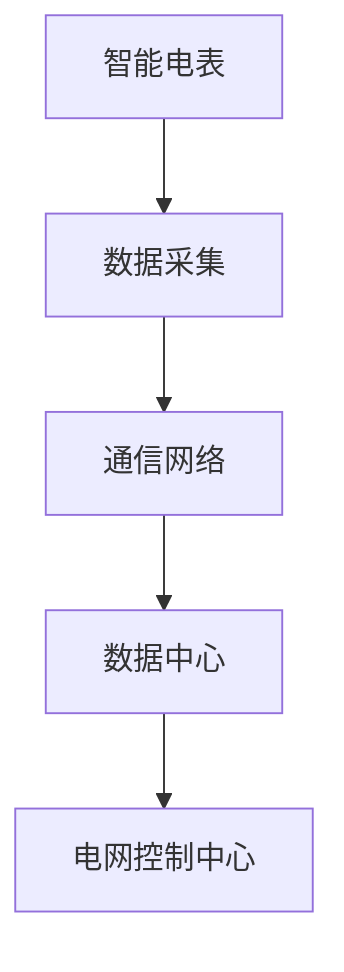
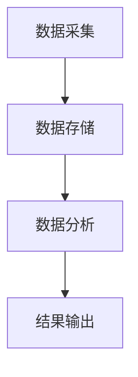
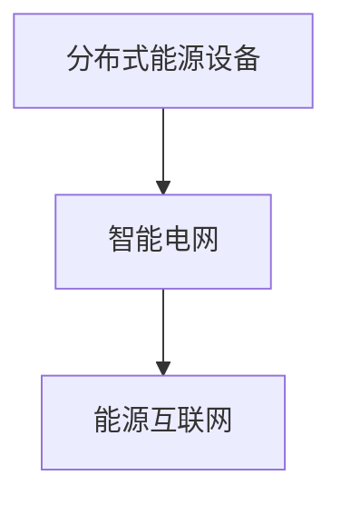
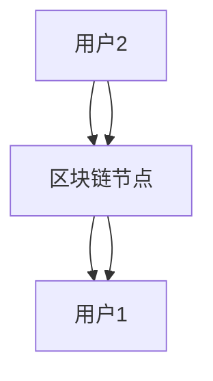
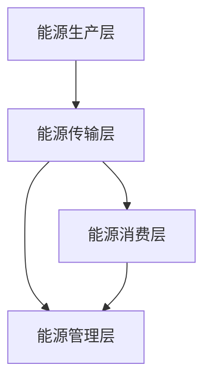
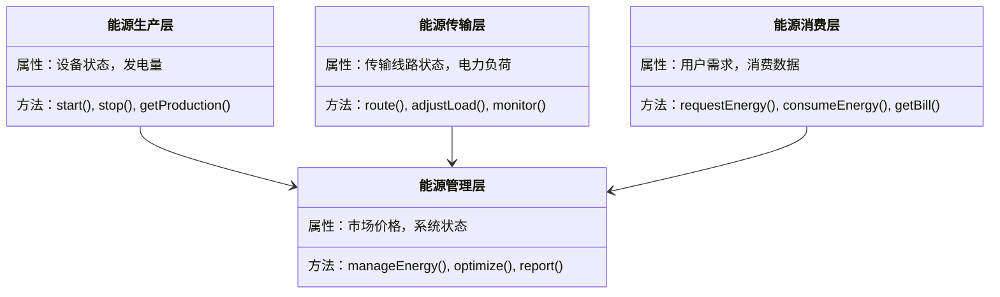

                 


# 智能电网技术的发展与能源互联网投资

> **关键词**：智能电网，能源互联网，可再生能源，投资分析，分布式能源，区块链技术

> **摘要**：本文深入探讨了智能电网技术的发展及其在能源互联网中的应用，分析了能源互联网的投资机会与挑战。通过技术原理、系统架构和实际案例的详细讲解，为读者提供了全面的视角，帮助其理解智能电网与能源互联网的现状、发展趋势及其投资潜力。

---

# 第一部分: 智能电网技术的发展与能源互联网概述

## 第1章: 智能电网技术的背景与概念

### 1.1 智能电网的定义与特点

#### 1.1.1 智能电网的定义
智能电网（Smart Grid）是通过先进的信息通信技术（ICT）、传感器、控制技术、能源存储技术与传统电力系统相结合，形成的一个智能化、自动化的电力网络。其核心目标是实现电力系统中发电、输电、配电、用电各环节的智能化管理，以提高电力系统的效率、可靠性和可持续性。

#### 1.1.2 智能电网的核心特点
智能电网具有以下几个核心特点：
- **实时监测与控制**：通过传感器和通信技术，实时监测电网运行状态，并实现对电网各环节的动态控制。
- **自我调节能力**：智能电网能够根据负荷变化和能源供应情况，自动调整电网运行参数，以维持系统的稳定。
- **分布式能源接入**：支持分布式能源（如太阳能、风能等）的接入，实现能源的灵活调配。
- **高效能与环保**：通过优化能源分配和减少能量损失，降低碳排放，推动可持续发展。

#### 1.1.3 智能电网与传统电网的区别
| **特性**         | **传统电网**             | **智能电网**             |
|------------------|--------------------------|--------------------------|
| 能源来源         | 以化石能源为主           | 包括可再生能源           |
| 智能化程度       | 较低，依赖人工操作         | 高度智能化，自动化       |
| 能源分配效率     | 较低，能量损耗较大         | 较高，能量损耗较小       |
| 灵活性           | 较低，难以适应分布式能源   | 较高，支持分布式能源接入 |

### 1.2 智能电网的发展背景

#### 1.2.1 全球能源结构的变化
随着全球能源需求的增加和化石能源的枯竭，能源结构正在向清洁化、多元化方向转变。可再生能源（如太阳能、风能）的比例逐步增加，这要求电力系统能够适应多种能源的接入和调配。

#### 1.2.2 可再生能源的快速发展
可再生能源的快速发展对电力系统的灵活性和适应性提出了更高要求。智能电网能够通过实时监测和动态调整，有效整合可再生能源，减少其对电网稳定性的冲击。

#### 1.2.3 智能电网的必要性与重要性
智能电网是实现能源转型和应对气候变化的关键技术。它不仅能够提高能源利用效率，还能够减少碳排放，推动可持续发展。

### 1.3 能源互联网的概念与特点

#### 1.3.1 能源互联网的定义
能源互联网（Energy Internet）是基于智能电网和物联网技术，将能源生产、传输、存储、消费等环节连接起来，形成一个开放、共享、高效的能源生态系统。它类似于信息互联网，但专注于能源的流通与管理。

#### 1.3.2 能源互联网与智能电网的关系
能源互联网是智能电网的扩展与延伸，智能电网是能源互联网的基础。能源互联网不仅涵盖电力系统，还涉及天然气、热能等多种能源形式，强调多能互补与协同优化。

#### 1.3.3 能源互联网的特征
- **分布式能源系统**：支持多种能源形式的分布式接入与协同管理。
- **数字化与智能化**：通过大数据、人工智能等技术，实现能源系统的智能调度与优化。
- **多能互补与协同优化**：实现不同能源形式之间的互补与协同，提高能源利用效率。

---

## 第2章: 智能电网技术的发展与创新

### 2.1 智能电网的关键技术

#### 2.1.1 物联网技术在智能电网中的应用
物联网（IoT）通过传感器和通信技术，实时监测和采集电网运行数据。例如，智能电表可以实时采集用户的用电数据，并通过无线通信技术传送到数据中心，实现对用电情况的实时监控。

**物联网在智能电网中的应用流程图**：


#### 2.1.2 大数据技术在智能电网中的应用
大数据技术通过对海量数据的分析，帮助电网企业优化能源分配、预测负荷变化、识别潜在故障。例如，通过分析历史用电数据，可以预测未来的用电需求，并制定相应的电力供应计划。

**大数据分析流程图**：


#### 2.1.3 人工智能技术在智能电网中的应用
人工智能（AI）可以通过机器学习算法，预测负荷变化、优化电网运行。例如，使用支持向量机（SVM）算法进行负荷预测，或者使用强化学习算法进行电网优化控制。

**机器学习负荷预测模型**：
$$
\text{预测负荷} = \text{历史负荷数据} \times \text{权重} + \text{偏差项}
$$

---

### 2.2 能源互联网的核心技术

#### 2.2.1 分布式能源系统
分布式能源系统通过在用户端部署分布式发电设备（如太阳能电池板、风力发电机），实现能源的本地生产与消费。这种系统能够减少对中央电站的依赖，提高能源供应的可靠性和安全性。

**分布式能源系统架构图**：


#### 2.2.2 区块链技术在能源互联网中的应用
区块链技术通过去中心化的方式，实现能源交易的透明化和安全性。例如，在能源互联网中，用户可以通过区块链技术直接交易多余的能源，减少中间环节的成本。

**区块链能源交易流程图**：


---

## 第3章: 能源互联网的投资分析与机会

### 3.1 全球能源互联网的投资背景

#### 3.1.1 全球能源市场的现状
全球能源市场正在经历一场深刻的变革。随着可再生能源技术的进步和成本的下降，越来越多的企业和个人开始投资于分布式能源系统。

#### 3.1.2 能源互联网的投资驱动因素
- **技术进步**：智能电网和区块链技术的成熟为能源互联网的发展提供了技术基础。
- **政策支持**：各国政府通过政策扶持和补贴，鼓励能源互联网的投资与应用。
- **市场需求**：随着能源需求的增长和环境压力的增大，能源互联网的投资需求日益迫切。

### 3.2 能源互联网的投资机会

#### 3.2.1 可再生能源的投资机会
可再生能源是能源互联网的重要组成部分。投资者可以通过投资太阳能、风能等可再生能源项目，获得长期稳定的收益。

#### 3.2.2 分布式能源系统的投资机会
分布式能源系统通过减少对中央电站的依赖，提高了能源供应的可靠性和安全性。投资者可以通过投资分布式能源设备和相关技术，分享能源互联网的收益。

#### 3.2.3 区块链技术在能源交易中的应用
区块链技术在能源互联网中的应用为投资者提供了新的机会。例如，投资者可以投资于区块链能源交易平台，或者开发基于区块链的能源管理平台。

### 3.3 能源互联网投资的风险与挑战

#### 3.3.1 技术风险
能源互联网的核心技术尚未完全成熟，存在技术不确定性。例如，区块链技术在能源交易中的应用仍需克服性能瓶颈和安全性问题。

#### 3.3.2 市场风险
能源互联网市场尚处于发展阶段，市场需求的不确定性较高。投资者需要对市场趋势和政策变化保持敏感。

#### 3.3.3 政策风险
能源互联网的发展依赖于政策支持。政策的变化可能对投资者的利益产生重大影响。

---

## 第4章: 能源互联网的系统架构与设计

### 4.1 系统架构设计

#### 4.1.1 能源互联网的系统架构
能源互联网的系统架构包括以下几个部分：
- **能源生产层**：包括分布式能源设备和集中式能源站。
- **能源传输层**：包括智能电网和能源互联网的通信网络。
- **能源消费层**：包括用户端的能源消费设备和智能终端。
- **能源管理层**：包括能源交易平台、能源管理系统和数据分析平台。

**能源互联网系统架构图**：


#### 4.1.2 系统功能设计
能源互联网的系统功能包括：
- **能源生产与管理**：监控和管理分布式能源设备的运行状态。
- **能源传输与分配**：通过智能电网实现能源的灵活调配。
- **能源消费与优化**：根据用户需求和市场价格，优化能源消费。

**系统功能设计类图**：


---

## 第5章: 能源互联网的项目实战

### 5.1 项目背景

#### 5.1.1 项目介绍
本项目旨在设计和实现一个基于智能电网和区块链技术的能源互联网系统。系统包括能源生产、传输、消费和管理四个部分。

#### 5.1.2 项目目标
- 实现分布式能源设备的接入与管理。
- 构建智能电网，实现能源的灵活调配。
- 开发能源交易平台，实现能源的点对点交易。

### 5.2 项目实现

#### 5.2.1 环境安装
项目需要以下环境：
- 操作系统：Linux（Ubuntu 20.04）
- 开发工具：Python 3.8，PyCharm
- 区块链框架：Hyperledger Fabric
- 数据库：PostgreSQL
- 通信协议：MQTT

#### 5.2.2 核心实现
**能源生产层**：
```python
class DistributedEnergyDevice:
    def __init__(self, name, type, capacity):
        self.name = name
        self.type = type
        self.capacity = capacity
        self.status = "idle"
    
    def start(self):
        self.status = "running"
        print(f"{self.name} is running.")
    
    def stop(self):
        self.status = "idle"
        print(f"{self.name} is idle.")
```

**能源传输层**：
```python
class SmartGrid:
    def __init__(self, name, capacity):
        self.name = name
        self.capacity = capacity
        self.current_load = 0
    
    def route(self, source, destination, power):
        self.current_load += power
        print(f"Routed {power} from {source} to {destination}.")
```

**能源管理层**：
```python
class EnergyManager:
    def __init__(self, name, market):
        self.name = name
        self.market = market
    
    def manage_energy(self):
        # 根据市场价格和系统状态调整能源分配
        pass
```

#### 5.2.3 实际案例分析
以某地区分布式光伏发电项目为例，通过智能电网实现光伏发电的实时监测和优化控制。同时，通过区块链技术实现光伏发电的点对点交易，提高能源利用效率和经济效益。

---

## 第6章: 总结与展望

### 6.1 总结
智能电网技术的发展为能源互联网的实现提供了技术基础，而能源互联网的投资与应用为能源行业的转型提供了新的机遇。通过技术创新和商业模式的优化，能源互联网将推动全球能源结构的优化和可持续发展。

### 6.2 展望
未来，能源互联网将更加智能化、分布式和协同化。随着人工智能、区块链等技术的进一步发展，能源互联网的投资潜力将更加巨大。

---

## 第7章: 最佳实践与注意事项

### 7.1 最佳实践
- **技术选型**：根据项目需求选择合适的技术方案，避免盲目追求最新技术。
- **数据安全**：重视数据安全和隐私保护，确保系统运行的安全性。
- **政策合规**：密切关注政策变化，确保项目符合相关法律法规。

### 7.2 注意事项
- **技术风险**：在项目实施过程中，要充分考虑技术风险，并制定应对策略。
- **市场需求**：深入了解市场需求，确保项目的商业可行性。
- **团队协作**：加强团队协作，确保项目的顺利实施。

---

**作者：AI天才研究院/AI Genius Institute & 禅与计算机程序设计艺术 /Zen And The Art of Computer Programming**

---

以上是文章的详细内容，涵盖了智能电网技术的发展、能源互联网的投资分析、系统架构与设计以及项目实战等方面，结合了技术原理、实际案例和投资策略，为读者提供了全面的视角。

