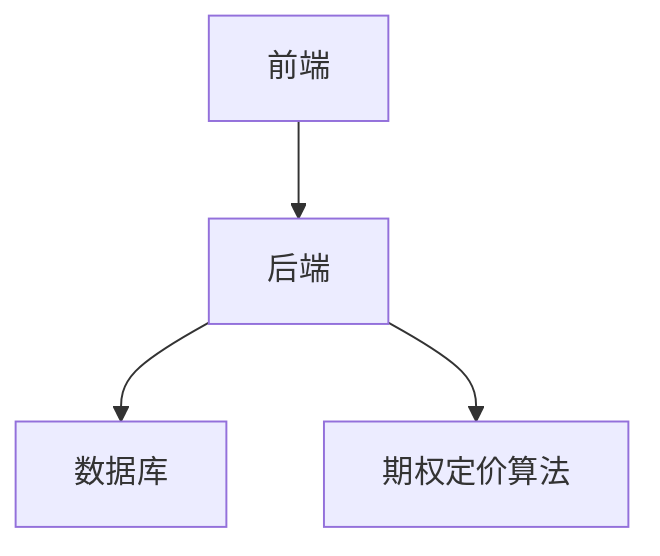

                 


```markdown
# 期权策略：利用衍生品管理投资风险

> 关键词：期权策略, 风险管理, 衍生品, Greeks, 期权定价, Black-Scholes 模型

> 摘要：期权策略是一种利用衍生品来管理投资风险的有效工具。本文将深入探讨期权的基本概念、定价模型、核心策略以及如何通过这些策略在实际投资中进行风险管理。通过逐步分析和实例讲解，帮助读者理解期权策略的原理和应用，掌握如何利用期权来对冲市场波动带来的风险。

---

## 第一部分: 期权策略基础

### 第1章: 期权的基本概念与特性

#### 1.1 期权的定义与分类
- **1.1.1 期权的定义**
  - 期权是一种金融衍生品，赋予持有者在特定时间内以预定价格买入或卖出标的资产的权利。
- **1.1.2 期权的分类**
  - **认购期权（Call Option）**：买方有权以行权价买入标的资产。
  - **认沽期权（Put Option）**：买方有权以行权价卖出标的资产。
- **1.1.3 期权的买方与卖方**
  - 买方：拥有权利但没有义务，可以选择行权或不行权。
  - 卖方：承担义务，必须在买方行权时履行合约。

#### 1.2 期权的基本特性
- **权利与义务的不对称性**
  - 买方仅享有权利，卖方则必须承担相应的义务。
- **时间价值与内在价值**
  - 内在价值：期权行权后实际价值的组成部分。
  - 时间价值：期权剩余时间的价值，随着时间的流逝而减少。
- **Delta、Gamma、Theta等 Greeks 的概念**
  - **Delta**：期权价格对标的资产价格变化的敏感度。
  - **Gamma**：Delta对标的资产价格变化的敏感度。
  - **Theta**：期权价格随时间流逝的敏感度。

### 第2章: 期权定价模型

#### 2.1 Black-Scholes 模型
- **模型的假设条件**
  - 标的资产价格服从几何布朗运动。
  - 无风险利率已知且恒定。
  - 没有交易成本和税费。
  - 可以通过卖空标的资产和期权来对冲风险。
- **模型的公式推导**
  - 认购期权定价公式：
    $$ C = S_0 \Phi(d_1) - K e^{-rT} \Phi(d_2) $$
    其中：
    $$ d_1 = \frac{\ln(S_0/K) + (r + \frac{\sigma^2}{2})T}{\sigma \sqrt{T}} $$
    $$ d_2 = d_1 - \sigma \sqrt{T} $$
  - 认沽期权定价公式：
    $$ P = K e^{-rT} \Phi(-d_2) - S_0 \Phi(-d_1) $$
- **模型的应用场景**
  - 适用于股票、指数等标的资产的定价。

#### 2.2 二叉树模型
- **模型的基本原理**
  - 假设标的资产价格在每个时间段内有两种可能的变动：上涨或下跌。
- **模型的实现步骤**
  - 确定标的资产的价格路径。
  - 计算期权在每一步的价格。
  - 回溯计算期权的当前价格。
- **模型与 Black-Scholes 的对比**
  - 二叉树模型更适用于美式期权和非连续波动率的情况。
  - Black-Scholes 模型假设波动率恒定，适用于欧式期权。

---

## 第二部分: 期权策略的核心概念

### 第3章: 基本期权策略

#### 3.1 股票认购期权策略
- **单纯认购期权**
  - 买方仅持有认购期权，期望标的资产价格上涨。
- **保护性认购期权**
  - 买方同时持有标的资产和认购期权，用于对冲标的资产价格下跌的风险。
- **保险策略（Covered Call）**
  - 卖出认购期权，同时持有标的资产，赚取期权费，限制上涨收益。

#### 3.2 股票认沽期权策略
- **单纯认沽期权**
  - 买方仅持有认沽期权，期望标的资产价格下跌。
- **保护性认沽期权**
  - 买方同时持有标的资产和认沽期权，用于对冲标的资产价格上升的风险。
- **保险策略（Covered Put）**
  - 卖出认沽期权，同时持有标的资产，赚取期权费，限制下跌损失。

### 第4章: 高级期权策略

#### 4.1 跨式策略（Straddle）
- **4.1.1 跨式策略的定义**
  - 同时买入认购期权和认沽期权，标的资产相同，到期日相同，行权价相同。
- **4.1.2 跨式策略的应用场景**
  - 预期标的资产价格将大幅波动，但不确定方向。
- **4.1.3 跨式策略的风险管理**
  - 需要较大的资金投入，适合波动率较高的市场环境。

#### 4.2 宽跨式策略（Strangle）
- **4.2.1 宽跨式策略的定义**
  - 买入认购期权和认沽期权，标的资产相同，到期日相同，但行权价不同，认沽期权的行权价低于认购期权的行权价。
- **4.2.2 宽跨式策略的应用场景**
  - 预期标的资产价格将大幅波动，但不确定方向，且波动率较高。
- **4.2.3 宽跨式策略的风险管理**
  - 对标的资产价格波动的方向和幅度有较高的敏感性，适合风险承受能力较强的投资者。

---

## 第三部分: 期权策略的算法与数学模型

### 第5章: 期权定价算法的实现

#### 5.1 Black-Scholes 模型的 Python 实现
```python
import numpy as np
from scipy.stats import norm

def black_scholes(S, K, r, sigma, T):
    d1 = (np.log(S/K) + (r + sigma**2/2)*T) / (sigma*np.sqrt(T))
    d2 = d1 - sigma*np.sqrt(T)
    C = S * norm.cdf(d1) - K * np.exp(-r*T) * norm.cdf(d2)
    return C
```

#### 5.2 二叉树模型的实现
```python
def binomial_tree(S, K, r, sigma, T, steps):
    dt = T / steps
    df = np.exp(-r*dt)
    up = np.exp(sigma*np.sqrt(dt))
    down = 1/up
    qu = (down - df)/(up*down - df)
    qd = 1 - qu
    # 计算期权价格
    option_price = 0
    for _ in range(steps):
        S *= up
        if S >= K:
            option_price += K * qu * df
        else:
            option_price += S * qu * df
        S = S * down
    option_price /= steps
    return option_price
```

---

## 第四部分: 期权策略的系统架构与项目实战

### 第6章: 期权定价系统的实现

#### 6.1 项目介绍
- **项目目标**：构建一个基于 Black-Scholes 模型的期权定价系统。
- **技术栈**：
  - 前端：HTML, CSS, JavaScript
  - 后端：Python, Flask
  - 数据库：SQLite

#### 6.2 系统功能设计
- **用户界面**：
  - 输入标的资产价格、行权价、无风险利率、波动率和到期时间。
  - 计算并显示期权价格和 Greeks。

#### 6.3 系统架构设计


---

## 第五部分: 最佳实践与总结

### 第7章: 期权策略的注意事项

#### 7.1 风险管理
- **杠杆风险**：期权具有杠杆效应，可能放大损失。
- **流动性风险**：某些期权品种流动性较低，难以快速成交。

#### 7.2 市场环境
- **波动率**：期权价格对波动率敏感，波动率高的市场更适合使用期权策略。

#### 7.3 拓展阅读
- 建议阅读《Options, Futures, and Other Derivatives》（John C. Hull 著）以深入理解期权市场的运作机制。

---

## 作者：AI天才研究院/AI Genius Institute & 禅与计算机程序设计艺术 /Zen And The Art of Computer Programming
```

