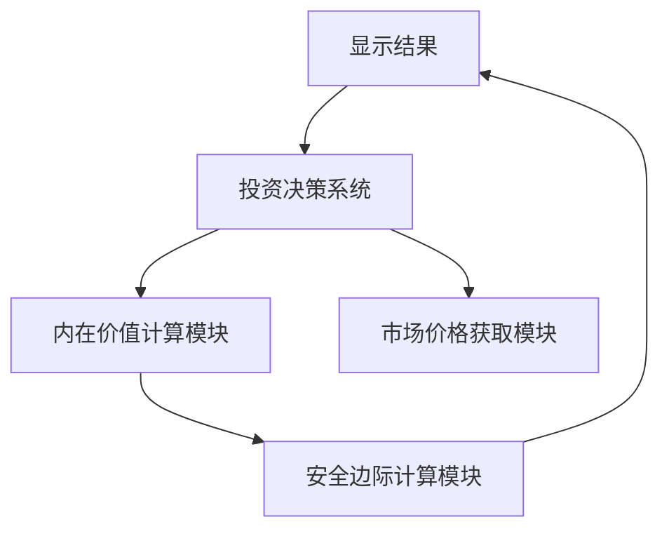
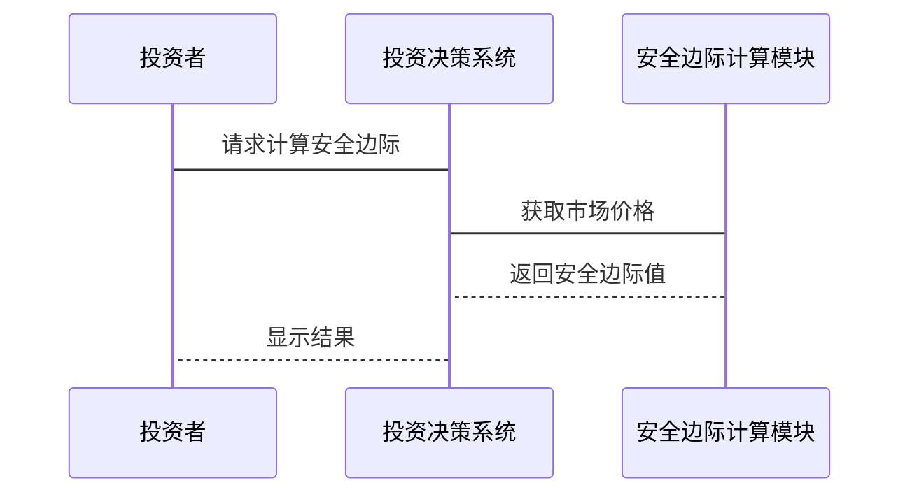

                 


# 本杰明·格雷厄姆的安全边际现代诠释

## 关键词
安全边际, 投资学, 价值投资, 现代诠释, 风险管理, 算法模型, 系统设计

## 摘要
本杰明·格雷厄姆的安全边际理论是价值投资的核心思想之一，强调以低于内在价值的价格买入资产以降低风险。本文从现代视角重新诠释这一理论，结合数学模型、算法和系统设计，探讨其在当前投资环境中的应用，分析其核心概念、计算方法，并通过实际案例展示其在风险管理中的价值。

---

## 第一部分：安全边际的基本概念

### 第1章：安全边际的定义与背景

#### 1.1 安全边际的核心概念
- **1.1.1 安全边际的定义**  
  安全边际是资产的内在价值与其市场价格之间的差额，表示投资者在价格波动中能够承受的最大损失。

- **1.1.2 安全边际的历史背景**  
  格雷厄姆在20世纪初提出安全边际，强调在市场波动中保护资本的重要性。

- **1.1.3 安全边际在投资中的作用**  
  通过安全边际，投资者可以避免支付过高的价格，降低投资风险。

#### 1.2 安全边际的数学模型
- **1.2.1 安全边际的计算公式**  
  $$\text{安全边际} = \text{内在价值} - \text{市场价格}$$  
  内在价值是资产的真实价值，市场价格是当前市价。

- **1.2.2 安全边际与投资风险的关系**  
  安全边际越大，投资风险越低，反之亦然。

#### 1.3 安全边际的现代应用
- **1.3.1 现代投资环境中的安全边际**  
  在当前市场中，安全边际的计算需要考虑通货膨胀、利率变化等因素。

- **1.3.2 技术进步对安全边际的影响**  
  数据分析和算法的进步使安全边际的计算更加精确和高效。

---

## 第二部分：安全边际的核心概念与联系

### 第2章：安全边际的数学模型与公式

#### 2.1 安全边际的数学模型
- **2.1.1 基于价值的安全边际计算**  
  $$\text{内在价值} = \frac{\text{年收益}}{\text{预期收益率}}$$  
  例如，年收益为100，预期收益率为10%，则内在价值为100/0.1=1000。

- **2.1.2 基于价格的安全边际计算**  
  $$\text{安全边际} = \text{内在价值} - \text{市场价格}$$  
  如果市场价格为800，内在价值为1000，则安全边际为200。

#### 2.2 安全边际的属性特征对比表格
| 属性          | 内在价值 | 市场价格 | 安全边际 |
|---------------|----------|----------|----------|
| 计算基础      | 现金流   | 供需关系 | 差异     |
| 时间因素      | 长期     | 短期     | 短期     |
| 变化频率      | 缓慢     | 快速     | 可能为正或负 |

#### 2.3 ER实体关系图
```mermaid
er
actor:投资者
portfolio:投资组合
margin:安全边际
actor --> portfolio: 计算
portfolio --> margin: 安全边际值
```

---

## 第三部分：算法原理讲解

### 第3章：安全边际算法的实现

#### 3.1 算法原理
- **步骤1：计算内在价值**  
  基于现金流折现法（DCF）计算资产的内在价值。

- **步骤2：确定市场价格**  
  获取资产当前市场价格。

- **步骤3：计算安全边际**  
  $$\text{安全边际} = \text{内在价值} - \text{市场价格}$$

#### 3.2 Python源代码实现
```python
def calculate_margin(intrinsic_value, market_price):
    return intrinsic_value - market_price

# 示例计算
iv = 1000
mp = 800
margin = calculate_margin(iv, mp)
print(f"安全边际为: {margin}")
```

#### 3.3 数学模型与公式
- 内在价值公式：  
  $$\text{内在价值} = \frac{\text{年收益}}{\text{预期收益率}}$$  
- 安全边际公式：  
  $$\text{安全边际} = \text{内在价值} - \text{市场价格}$$

---

## 第四部分：系统分析与架构设计方案

### 第4章：安全边际的系统架构设计

#### 4.1 问题场景介绍
- 投资者需要在市场波动中快速计算安全边际，以做出投资决策。

#### 4.2 系统功能设计
- **功能模块1：内在价值计算**  
  使用现金流折现法计算资产的内在价值。

- **功能模块2：市场价格获取**  
  从数据源获取市场价格。

- **功能模块3：安全边际计算**  
  基于前两个模块的结果计算安全边际。

#### 4.3 系统架构设计


#### 4.4 系统接口设计
- **输入接口**：接收资产的年收益和预期收益率。
- **输出接口**：显示计算出的安全边际值。

#### 4.5 系统交互设计


---

## 第五部分：项目实战

### 第5章：安全边际的实际应用

#### 5.1 环境安装
- 安装Python和Pandas库：
  ```bash
  pip install pandas
  ```

#### 5.2 核心代码实现
```python
import pandas as pd

def calculate_margin(iv, mp):
    return iv - mp

# 示例数据
data = {'资产': ['资产A', '资产B'], 
        '年收益': [100, 150], 
        '预期收益率': [0.1, 0.12]}
df = pd.DataFrame(data)

# 计算内在价值和安全边际
df['内在价值'] = df['年收益'] / df['预期收益率']
df['市场价格'] = [800, 900]
df['安全边际'] = df['内在价值'] - df['市场价格']

print(df)
```

#### 5.3 案例分析
- 资产A的安全边际为200，资产B的安全边际为-150。  
  - 资产A值得投资，因为安全边际为正。  
  - 资产B不值得投资，因为安全边际为负。

#### 5.4 项目小结
- 项目总结：安全边际在实际投资中的应用可以帮助投资者做出更明智的决策。  
- 经验分享：定期更新市场数据和重新计算安全边际是必要的。

---

## 第六部分：总结与展望

### 第6章：安全边际的现代诠释总结

#### 6.1 主要内容回顾
- 安全边际是价值投资中的核心概念，通过计算内在价值与市场价格的差额，帮助投资者降低风险。

#### 6.2 最佳实践Tips
- **风险管理**：定期评估投资组合的安全边际，及时调整投资策略。  
- **数据准确性**：确保内在价值计算的数据准确可靠。

#### 6.3 小结与注意事项
- 安全边际计算需要结合市场实际情况，避免过于依赖单一模型。  
- 投资者应根据市场变化动态调整安全边际的计算参数。

---

## 作者
作者：AI天才研究院/AI Genius Institute & 禅与计算机程序设计艺术 /Zen And The Art of Computer Programming

