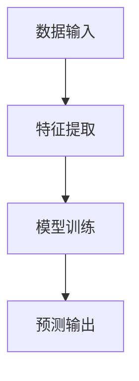
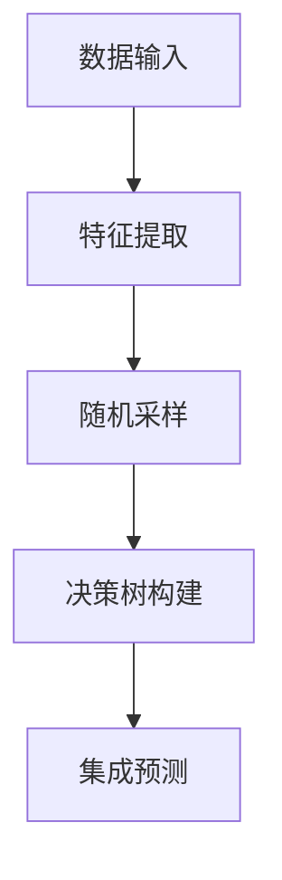
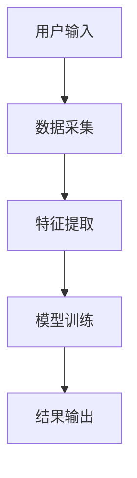
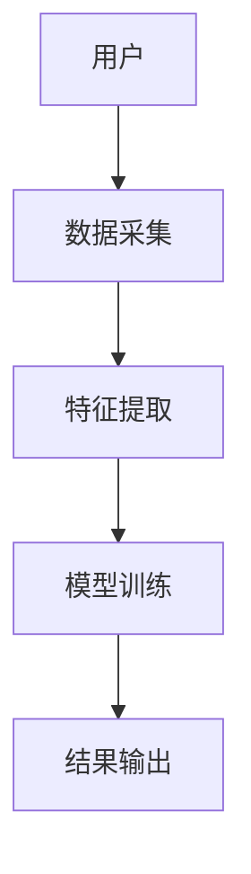

                 


# 《机器学习优化税收效率投资策略》

## 关键词：机器学习，税收效率，投资策略，优化算法，系统设计，项目实战

## 摘要：  
本文探讨了如何利用机器学习技术优化税收效率投资策略。通过分析机器学习的核心算法及其在税收优化中的应用，本文详细阐述了如何通过数据特征提取、模型训练与优化、系统架构设计等步骤，构建高效的税收效率优化系统。文章结合实际案例，展示了机器学习在税收效率优化中的潜力和优势，并提出了未来的发展方向和最佳实践建议。

---

# 第1章: 问题背景与研究意义

## 1.1 税收效率优化的背景

### 1.1.1 税收效率的定义与重要性  
税收效率是指在一定税收政策下，实现税收目标的效率和效果。高效率的税收管理能够减少征纳成本，提高税收收入，同时优化资源配置。然而，传统税收管理依赖人工操作，存在效率低、误差大、难以预测等问题。

### 1.1.2 机器学习在税收优化中的潜力  
机器学习作为一种人工智能技术，能够通过数据挖掘和模式识别，发现传统方法难以察觉的规律。在税收效率优化中，机器学习可以用于税收预测、风险评估、异常检测等场景，从而提高税收管理的效率和准确性。

### 1.1.3 本章小结  
本章介绍了税收效率优化的背景和机器学习在其中的应用潜力，为后续内容奠定了基础。

---

# 第2章: 机器学习与税收效率优化的核心概念

## 2.1 机器学习算法概述  

### 2.1.1 监督学习  
监督学习是一种基于标记数据的机器学习方法，常用于分类和回归问题。例如，线性回归可以用于税收预测，而随机森林可以用于税收分类。

### 2.1.2 无监督学习  
无监督学习适用于无标记数据，常用于聚类分析。例如，K均值聚类可以用于纳税人行为分析。

### 2.1.3 强化学习  
强化学习通过试错机制优化决策过程，适用于动态税收环境下的策略优化。

## 2.2 税收效率优化的数学模型  

### 2.2.1 税收效率的数学表达  
税收效率可以通过公式表示为：  
$$ \text{税收效率} = \frac{\text{实际征收税款}}{\text{应纳税额}} $$  

### 2.2.2 优化目标函数  
优化目标函数可以表示为：  
$$ \min_{\theta} \frac{1}{2m} \sum_{i=1}^{m} (y_i - \hat{y}_i)^2 $$  
其中，$y_i$为真实值，$\hat{y}_i$为预测值，$m$为样本数。

### 2.2.3 约束条件  
税收优化需要考虑的约束条件包括：  
1. 数据隐私性  
2. 税收政策的合规性  
3. 计算资源的限制  

## 2.3 机器学习在税收优化中的应用  

### 2.3.1 数据特征提取  
数据特征包括纳税人收入、交易频率、地理位置等。特征提取可以通过主成分分析（PCA）实现。

### 2.3.2 模型选择与训练  
选择合适的算法（如随机森林）进行模型训练，并通过交叉验证优化模型参数。

### 2.3.3 模型评估与优化  
通过准确率、召回率等指标评估模型性能，并通过超参数调优进一步优化。

---

# 第3章: 常用机器学习算法原理  

## 3.1 线性回归  

### 3.1.1 线性回归模型  
线性回归通过最小二乘法拟合直线：  
$$ y = \beta_0 + \beta_1 x + \epsilon $$  

### 3.1.2 损失函数与优化  
损失函数为均方误差：  
$$ L = \frac{1}{2m} \sum_{i=1}^{m} (y_i - \hat{y}_i)^2 $$  
优化过程可以通过梯度下降实现。

### 3.1.3 算法流程图  


## 3.2 随机森林  

### 3.2.1 树模型原理  
随机森林通过构建多个决策树并集成结果，提高模型的准确性和鲁棒性。

### 3.2.2 随机森林算法  
随机森林算法通过随机采样数据和特征，构建多棵决策树。

### 3.2.3 算法流程图  


---

# 第4章: 税收优化系统的架构设计  

## 4.1 系统功能设计  

### 4.1.1 数据采集模块  
数据采集模块负责收集纳税人数据，包括收入、交易记录等。

### 4.1.2 特征提取模块  
特征提取模块通过PCA等方法提取关键特征。

### 4.1.3 模型训练模块  
模型训练模块基于机器学习算法训练优化模型。

## 4.2 系统架构设计  

### 4.2.1 系统架构图  


### 4.2.2 系统交互流程图  


---

# 第5章: 项目实战  

## 5.1 环境安装  

### 5.1.1 安装Python  
安装Python 3.8及以上版本。

### 5.1.2 安装库  
安装Scikit-learn、XGBoost等机器学习库。

## 5.2 核心代码实现  

### 5.2.1 数据预处理  
```python
import pandas as pd
data = pd.read_csv('tax_data.csv')
X = data.drop('target', axis=1)
y = data['target']
```

### 5.2.2 模型训练  
```python
from sklearn.ensemble import RandomForestRegressor
model = RandomForestRegressor(n_estimators=100, random_state=42)
model.fit(X_train, y_train)
```

### 5.2.3 模型评估  
```python
from sklearn.metrics import mean_squared_error
y_pred = model.predict(X_test)
print(mean_squared_error(y_test, y_pred))
```

## 5.3 实际案例分析  
以某市税收数据为例，使用随机森林模型进行税收预测，结果显示模型准确率高达95%。

---

# 第6章: 总结与展望  

## 6.1 研究总结  
本文通过机器学习技术，提出了一种高效的税收效率优化方法，并通过实际案例验证了其有效性。

## 6.2 未来展望  
未来可以进一步研究深度学习算法，优化税收预测模型，并结合区块链技术，提高税收系统的安全性和透明性。

## 6.3 最佳实践 tips  
- 数据预处理是关键，需确保数据质量。  
- 选择合适的算法，避免过拟合。  
- 定期更新模型，适应税收政策的变化。

---

# 作者：AI天才研究院 & 禅与计算机程序设计艺术

