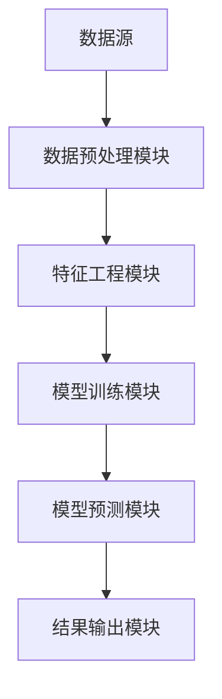

                 


# 机器学习在信用违约互换定价中的应用

---

## 关键词
- 信用违约互换（CDS）
- 机器学习
- 信用风险
- 定价模型
- 时间序列分析
- 监督学习
- 非监督学习

---

## 摘要
信用违约互换（CDS）是金融衍生品市场中重要的信用风险管理工具，其定价过程涉及复杂的信用风险评估。传统信用定价模型依赖于历史数据和假设条件，但在面对复杂市场环境和非线性关系时往往显得力不从心。机器学习作为一种新兴的计算方法，能够通过数据驱动的方式捕捉复杂的信用风险特征，为CDS定价提供了新的思路和解决方案。

本文将从信用违约互换的基本概念出发，结合机器学习的核心原理，详细探讨如何将机器学习技术应用于CDS定价中。通过分析传统定价模型的局限性，本文将介绍如何利用监督学习、非监督学习等机器学习算法，结合时间序列分析、特征工程等技术，构建高效的信用风险评估模型。同时，本文还将结合实际案例，展示如何通过机器学习算法实现CDS定价，并对模型的优缺点进行深入分析。

---

## 第一部分: 信用违约互换与机器学习基础

### 第1章: 信用违约互换（CDS）概述

#### 1.1 信用违约互换的基本概念
信用违约互换（Credit Default Swap，CDS）是一种金融衍生品，允许买方在约定时间内向卖方支付固定费用，以换取卖方在买方发生信用违约时的赔偿。CDS的核心在于对信用风险的转移和定价。

#### 1.2 信用风险与信用定价基础
信用风险是指债务人未能履行其债务义务的可能性。信用定价的核心是将信用风险量化为一个可交易的利差。传统信用定价模型（如Merton模型）依赖于历史数据和假设条件，但在实际市场中，这些假设往往难以满足。

#### 1.3 机器学习在金融领域的应用潜力
机器学习是一种数据驱动的计算方法，能够通过训练数据学习数据的内在结构，并用于预测或分类任务。在金融领域，机器学习已广泛应用于股票价格预测、信用评分、风险管理等领域。CDS定价中的信用风险具有高度的非线性特征，这为机器学习的应用提供了广阔的空间。

---

### 第2章: 机器学习基础

#### 2.1 监督学习与非监督学习
监督学习是一种通过 labeled 数据训练模型的技术，适用于回归和分类任务。例如，线性回归可以用于预测CDS的信用利差，而随机森林则可以用于分类任务，如信用评级。非监督学习则适用于无标签数据的聚类分析，例如将相似的信用风险资产进行分组。

#### 2.2 机器学习中的特征工程
特征工程是将原始数据转换为适合机器学习模型的特征的过程。在CDS定价中，特征可能包括财务指标（如杠杆率、利润率）、市场指标（如波动率）和宏观经济指标（如GDP增长率）。特征工程的关键在于选择能够有效捕捉信用风险的特征，并进行合理的标准化和归一化处理。

#### 2.3 时间序列分析与机器学习
时间序列分析是研究数据随时间演变规律的方法。在CDS定价中，信用利差往往表现出显著的时间依赖性。机器学习算法（如LSTM）可以有效捕捉时间序列中的非线性关系，从而提高信用风险预测的准确性。

---

## 第二部分: 机器学习在信用违约互换定价中的应用

### 第3章: 信用违约互换定价的核心概念与联系

#### 3.1 违约风险的核心要素
违约概率（PD）是CDS定价中的核心参数之一，表示债务人在未来一段时间内违约的可能性。违约损失率（LGD）则是违约发生时的平均损失比例。信用利差是CDS定价的主要指标，反映了债务人信用风险的市场定价。

#### 3.2 信用评级与信用利差的关系
信用评级是衡量债务人信用风险的重要指标，通常由评级机构（如穆迪、标普）给出。信用利差与信用评级高度相关，但并非完全线性关系。通过机器学习模型，可以更准确地捕捉信用评级与信用利差之间的非线性关系。

#### 3.3 机器学习模型在信用评级中的应用
机器学习模型（如随机森林和梯度提升树）可以通过历史数据和多维特征，自动学习信用评级的规律。与传统信用评级方法相比，机器学习模型具有更高的准确性和鲁棒性。

---

### 第4章: 机器学习算法在信用违约互换定价中的应用

#### 4.1 常见机器学习算法概述
- **线性回归**: 适用于线性关系的信用利差预测。
- **支持向量机（SVM）**: 适用于高维特征的分类和回归任务。
- **随机森林**: 适用于特征重要性分析和非线性关系建模。
- **神经网络**: 适用于复杂非线性关系的建模，如深度学习模型。
- **时间序列模型**: 例如ARIMA和LSTM，适用于信用利差的时间依赖性建模。

#### 4.2 算法原理与实现
- **线性回归**: 假设信用利差与特征之间存在线性关系，通过最小二乘法求解回归系数。
- **随机森林**: 通过构建多棵决策树，集成投票或平均结果，提高模型的泛化能力。
- **LSTM**: 通过长短期记忆单元捕捉时间序列中的长距离依赖关系。

#### 4.3 算法实现示例
以下是使用Python实现的随机森林回归模型代码示例：

```python
import pandas as pd
from sklearn.ensemble import RandomForestRegressor
from sklearn.model_selection import train_test_split
from sklearn.metrics import mean_squared_error

# 加载数据
data = pd.read_csv('CDS_data.csv')

# 特征与目标变量分离
X = data.drop('credit_spread', axis=1)
y = data['credit_spread']

# 划分训练集与测试集
X_train, X_test, y_train, y_test = train_test_split(X, y, test_size=0.2, random_state=42)

# 初始化随机森林回归模型
model = RandomForestRegressor(n_estimators=100, random_state=42)

# 模型训练
model.fit(X_train, y_train)

# 模型预测
y_pred = model.predict(X_test)

# 评估模型性能
mse = mean_squared_error(y_test, y_pred)
print(f'均方误差: {mse}')
```

---

## 第三部分: 系统分析与架构设计方案

### 第5章: 信用违约互换定价系统的架构设计

#### 5.1 问题场景介绍
CDS定价系统需要处理大量复杂的信用风险数据，包括历史违约数据、财务指标、市场指标和宏观经济指标。系统需要能够实时处理数据并生成信用利差预测结果。

#### 5.2 系统功能设计
- 数据获取与预处理
- 特征工程与选择
- 模型训练与评估
- 预测结果输出与分析

#### 5.3 系统架构设计
以下是CDS定价系统的架构图：



#### 5.4 系统接口设计
系统接口包括数据输入接口、模型训练接口和结果输出接口。数据输入接口接收原始数据，特征工程模块进行数据清洗和特征提取，模型训练模块训练机器学习模型，模型预测模块生成信用利差预测结果，结果输出模块将结果输出给用户。

---

### 第6章: 项目实战

#### 6.1 环境安装
- Python 3.8+
- Scikit-learn、XGBoost、Keras等机器学习库
- Pandas、NumPy等数据处理库
- Jupyter Notebook（可选）

#### 6.2 核心实现源代码
以下是CDS定价系统的实现代码示例：

```python
import pandas as pd
import numpy as np
from sklearn.ensemble import RandomForestRegressor
from sklearn.metrics import mean_squared_error
from sklearn.model_selection import train_test_split

# 加载数据
data = pd.read_csv('CDS_data.csv')

# 特征与目标变量分离
X = data.drop('credit_spread', axis=1)
y = data['credit_spread']

# 划分训练集与测试集
X_train, X_test, y_train, y_test = train_test_split(X, y, test_size=0.2, random_state=42)

# 初始化随机森林回归模型
model = RandomForestRegressor(n_estimators=100, random_state=42)

# 模型训练
model.fit(X_train, y_train)

# 模型预测
y_pred = model.predict(X_test)

# 评估模型性能
mse = mean_squared_error(y_test, y_pred)
print(f'均方误差: {mse}')
print(f'预测结果: {y_pred[:5]}')
print(f'真实结果: {y_test[:5].values}')
```

#### 6.3 实际案例分析
以某公司CDS数据为例，分析模型的预测结果与实际结果之间的差异，并探讨模型的优缺点。

---

## 第四部分: 总结与展望

### 第7章: 总结与展望

#### 7.1 总结
本文通过理论分析和实践案例，探讨了机器学习在信用违约互换定价中的应用。通过随机森林、神经网络等机器学习算法，能够有效捕捉信用风险的非线性特征，提高CDS定价的准确性。

#### 7.2 未来研究方向
未来的研究可以集中在以下几个方面：
- 深度学习在信用风险建模中的应用
- 多模态数据（如文本数据、社交媒体数据）的利用
- 实时信用风险监控与预测

---

## 作者信息
作者：AI天才研究院 & 禅与计算机程序设计艺术

---

**版权声明：** 本文为AI天才研究院原创文章，未经授权不得转载。

