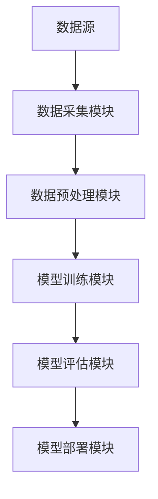

                 


# 机器学习在信用风险评估中的应用

> 关键词：信用风险评估，机器学习，算法，系统架构，项目实战

> 摘要：本文详细探讨了机器学习在信用风险评估中的应用，从背景介绍到核心概念，再到具体算法和系统架构的设计，最后通过项目实战展示如何利用机器学习模型进行信用风险评估。文章内容丰富，结构清晰，旨在为读者提供全面的技术指导。

---

## 第1章: 信用风险评估的背景与机器学习的引入

### 1.1 信用风险的基本概念

信用风险是指借款人或交易对手未能履行其合同义务，导致资金损失的风险。在金融领域，信用风险是三大主要风险之一，其他两个是市场风险和操作风险。信用风险评估的核心目标是通过分析借款人的信用状况，预测其违约的可能性，并据此制定相应的风险管理策略。

#### 1.1.1 信用风险的定义
信用风险是指在信用交易中，由于交易对手无法履行其合同义务而给债权人带来的损失风险。在银行、证券和保险等金融行业中，信用风险尤为重要，因为它直接影响机构的资产质量和盈利能力。

#### 1.1.2 信用风险的分类
信用风险可以分为以下几种：
- **主权风险**：国家或政府机构违约的风险。
- **企业风险**：企业客户违约的风险。
- **零售风险**：个人客户违约的风险。
- **结算风险**：交易过程中因对手方违约而产生的风险。

#### 1.1.3 信用风险在金融领域的重要性
信用风险是金融机构风险管理的核心内容之一。有效的信用风险管理可以帮助机构减少因客户违约带来的损失，优化资产配置，提高资本使用效率。

---

### 1.2 机器学习的定义与特点

机器学习是一种人工智能技术，通过数据训练模型，使其能够从数据中学习并做出预测或决策。与传统统计方法相比，机器学习具有以下特点：
- **数据驱动**：依赖大量数据进行训练。
- **非线性建模**：能够捕捉数据中的非线性关系。
- **自动特征提取**：在某些情况下，模型可以自动提取特征。
- **可解释性**：部分模型（如线性回归）具有较高的可解释性，而有些模型（如随机森林）则较为复杂。

---

### 1.3 机器学习在信用风险评估中的应用背景

传统信用风险评估方法主要依赖于线性模型，如信用评分卡模型。然而，这些方法在处理复杂数据和非线性关系时存在局限性。机器学习的引入弥补了这一不足，提供了更强大的工具来处理复杂的信用风险问题。

#### 1.3.1 传统信用风险评估方法的局限性
- **线性假设的限制**：传统模型假设变量之间的关系是线性的，这可能无法捕捉复杂的信用风险特征。
- **特征工程复杂**：需要手动提取和选择特征，耗时且容易出错。
- **模型更新困难**：当市场环境变化时，传统模型难以快速适应。

#### 1.3.2 机器学习在信用风险评估中的优势
- **非线性建模能力**：机器学习算法能够捕捉数据中的非线性关系，提高模型的准确性。
- **自动特征提取**：某些算法（如随机森林）可以在一定程度上自动提取特征，减少人工干预。
- **可扩展性**：机器学习模型可以处理大量数据，并且能够快速适应新的数据。

#### 1.3.3 机器学习在信用风险评估中的应用场景
- **客户信用评分**：通过机器学习模型预测客户的违约概率。
- **风险定价**：根据信用风险评估结果，制定相应的贷款利率。
- **欺诈检测**：识别潜在的欺诈性交易。

---

## 第2章: 机器学习在信用评分中的应用

### 2.1 信用评分模型的核心要素

信用评分模型的关键要素包括借款人的信用历史、收入状况、负债情况等。这些要素通过数据特征化后，输入到模型中进行评估。

#### 2.1.1 借款人特征
- **年龄**：借款人的年龄可能影响其还款能力。
- **收入**：收入水平是评估还款能力的重要指标。
- **职业**：某些职业可能与违约风险相关。

#### 2.1.2 借款人行为
- **还款记录**：是否有按时还款的历史记录。
- **信用查询频率**：借款人频繁查询信用报告可能表明财务状况不佳。

#### 2.1.3 借款人信用历史
- **信用评分**：如FICO评分。
- **违约历史**：是否有过违约记录。

---

### 2.2 机器学习算法的选择与优化

在信用评分模型中，选择合适的算法至关重要。常见的算法包括逻辑回归、随机森林和梯度提升树（如XGBoost）。

#### 2.2.1 逻辑回归
逻辑回归是一种经典的分类算法，适用于二分类问题。其基本思想是通过logit函数将线性组合映射到概率空间。

$$ P(y=1|x) = \frac{1}{1 + e^{-\beta x}} $$

#### 2.2.2 随机森林
随机森林是一种基于决策树的集成算法，通过随机采样和特征选择来提高模型的泛化能力。

#### 2.2.3 梯度提升树
梯度提升树是一种迭代优化算法，通过不断训练弱模型（如决策树）来提高整体性能。

---

### 2.3 系统架构设计

信用评分系统的架构设计需要考虑数据的采集、处理、建模和部署。

#### 2.3.1 系统架构图



---

## 第3章: 项目实战

### 3.1 数据准备与特征工程

#### 3.1.1 数据采集
从数据库或CSV文件中读取数据，确保数据的完整性和准确性。

#### 3.1.2 数据预处理
- **缺失值处理**：使用均值、中位数或删除法处理缺失值。
- **特征编码**：将分类变量转换为数值形式。
- **数据标准化**：对数值特征进行标准化或归一化处理。

#### 3.1.3 特征选择
使用相关性分析或模型内部的特征重要性评估来选择关键特征。

---

### 3.2 模型训练与评估

#### 3.2.1 训练逻辑回归模型

```python
from sklearn.linear_model import LogisticRegression
from sklearn.metrics import accuracy_score

# 训练模型
model = LogisticRegression()
model.fit(X_train, y_train)

# 预测
y_pred = model.predict(X_test)

# 评估
print("准确率:", accuracy_score(y_test, y_pred))
```

#### 3.2.2 训练随机森林模型

```python
from sklearn.ensemble import RandomForestClassifier

model = RandomForestClassifier(n_estimators=100, max_depth=4, random_state=42)
model.fit(X_train, y_train)

y_pred = model.predict(X_test)
print("准确率:", accuracy_score(y_test, y_pred))
```

---

### 3.3 模型部署与应用

将训练好的模型部署到生产环境中，用于实时信用评分。

#### 3.3.1 接口设计

```python
def predict_credit_score(customer_data):
    # 数据预处理
    processed_data = preprocess(customer_data)
    # 预测
    prediction = model.predict(processed_data)
    return prediction
```

---

## 第4章: 总结与最佳实践

### 4.1 本章小结

本文详细探讨了机器学习在信用风险评估中的应用，从背景介绍到系统架构设计，再到项目实战，为读者提供了全面的技术指导。

### 4.2 注意事项

- 数据质量是模型性能的关键，需确保数据的完整性和准确性。
- 模型解释性在信用风险评估中非常重要，尤其是监管要求较高的领域。
- 定期更新模型，以适应市场环境的变化。

### 4.3 拓展阅读

- 《Hands-On Machine Learning with Scikit-Learn, Keras, and TensorFlow》
- 《信用评分模型的构建与应用》

---

作者：AI天才研究院/Zen And The Art of Computer Programming

