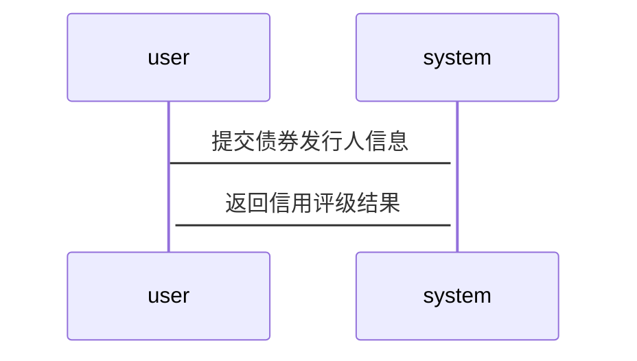

                 


# 机器学习在债券信用评级中的应用研究

## 关键词：机器学习，债券信用评级，特征工程，模型构建，系统设计，实战案例

## 摘要：  
本文探讨了机器学习在债券信用评级中的应用，系统地分析了传统信用评级方法的局限性以及机器学习的优势。通过详细阐述特征工程、模型构建与训练、系统架构设计等内容，本文展示了如何利用机器学习技术提升债券信用评级的准确性和效率。文章还结合实际案例，详细讲解了机器学习在债券信用评级中的实现过程，并提出了未来研究的方向和建议。

---

# 第1章: 背景介绍

## 1.1 机器学习的基本概念

### 1.1.1 机器学习的定义与核心概念  
机器学习是一种人工智能技术，通过数据训练模型以实现对新数据的预测或分类。其核心概念包括数据、模型、算法、特征、标签等。  

### 1.1.2 机器学习的分类与特点  
机器学习主要分为监督学习、无监督学习和半监督学习。监督学习基于标注数据，适用于回归和分类任务；无监督学习处理无标注数据，常用于聚类和降维；半监督学习结合两者。  

### 1.1.3 机器学习在金融领域的应用潜力  
机器学习在金融领域的应用广泛，包括股票预测、信用评级、风险控制等。其优势在于能够处理海量数据，发现非线性关系，提供高精度预测。

## 1.2 债券信用评级的定义与重要性

### 1.2.1 债券信用评级的定义  
债券信用评级是对债券发行人偿还债务能力的评估，通常分为投资级和投机级。  

### 1.2.2 信用评级的分类与等级划分  
信用评级机构（如穆迪、标普）将债券评级分为多个等级，如AAA、AA、A、BBB等，评级越高，债券的风险越低。

### 1.2.3 债券信用评级在金融市场中的作用  
信用评级影响债券的发行利率和市场流动性，是投资者决策的重要依据。

## 1.3 机器学习在债券信用评级中的应用意义

### 1.3.1 传统信用评级方法的局限性  
传统方法依赖经验判断，主观性强，难以处理复杂数据和非线性关系。

### 1.3.2 机器学习在信用评级中的优势  
机器学习能够处理海量数据，发现传统方法难以捕捉的模式，提高预测精度。

### 1.3.3 机器学习与债券信用评级的结合点  
通过机器学习算法分析财务数据、市场数据和文本数据，优化信用评级过程。

## 1.4 本章小结  
本章介绍了机器学习的基本概念、债券信用评级的定义及其重要性，以及机器学习在信用评级中的应用意义。

---

# 第2章: 机器学习的核心概念与原理

## 2.1 机器学习的基本原理

### 2.1.1 数据、模型与算法的关系  
数据是输入，模型是处理数据的工具，算法是训练模型的方法。

### 2.1.2 监督学习、无监督学习与半监督学习  
- **监督学习**：基于标注数据，用于回归和分类。  
- **无监督学习**：基于无标注数据，用于聚类和降维。  
- **半监督学习**：结合标注和无标注数据。

### 2.1.3 模型性能的评估指标  
常用准确率、召回率、F1值、ROC曲线等指标评估模型性能。

## 2.2 常见机器学习算法及其特点

### 2.2.1 线性回归与逻辑回归  
- **线性回归**：用于预测连续值，如违约概率。  
- **逻辑回归**：用于分类任务，如债券评级分类。

### 2.2.2 支持向量机（SVM）  
适用于小样本数据，能够处理非线性分类问题。

### 2.2.3 随机森林与梯度提升树  
- **随机森林**：基于决策树的集成方法，适合高维数据。  
- **梯度提升树（如XGBoost）**：通过迭代优化模型性能。

### 2.2.4 神经网络与深度学习  
适用于复杂数据，如文本和图像分析。

## 2.3 机器学习在信用评级中的应用案例

### 2.3.1 传统信用评级方法的局限性  
传统方法难以应对复杂数据和非线性关系。

### 2.3.2 机器学习在信用评级中的成功案例  
例如，使用随机森林算法对债券发行人进行信用评级分类。

## 2.4 本章小结  
本章详细介绍了机器学习的核心概念和常见算法，并展示了其在信用评级中的应用。

---

# 第3章: 债券信用评级的理论与方法

## 3.1 信用评级的理论基础

### 3.1.1 信用风险的定义与度量  
信用风险是指债券发行人无法按期偿还债务的风险。

### 3.1.2 信用评级的五要素模型  
包括流动性、杠杆率、盈利能力、偿债能力和发展能力。

### 3.1.3 债券评级的宏观经济影响  
宏观经济环境（如GDP增长率、通货膨胀率）影响债券评级。

## 3.2 传统信用评级方法

### 3.2.1 Z-score模型  
用于预测企业违约概率，公式为：  
$$ Z = 1.2*(1.78A + 1.2B + 1.7C + 1.7D + 1.7E) - 4.3 $$  
其中，A、B、C、D、E为财务指标。

### 3.2.2 Altman Z-score模型  
用于预测企业违约概率，公式为：  
$$ Z = 1.2*(1.78X1 + 1.2X2 + 1.7X3 + 1.7X4 + 1.7X5) - 4.3 $$  
其中，X1-X5为财务指标。

### 3.2.3 沃尔夫斯滕模型  
基于财务指标和宏观经济指标的综合模型。

## 3.3 机器学习在信用评级中的优势

### 3.3.1 数据驱动的优势  
能够处理大量非结构化数据，如文本和市场数据。

### 3.3.2 非线性关系的捕捉能力  
机器学习算法能够发现传统模型难以捕捉的非线性关系。

### 3.3.3 高维数据的处理能力  
适合处理高维数据，避免维度灾难问题。

## 3.4 本章小结  
本章介绍了信用评级的理论基础和传统方法，并分析了机器学习的优势。

---

# 第4章: 机器学习在债券信用评级中的特征工程

## 4.1 特征工程的重要性

### 4.1.1 特征选择的基本概念  
特征选择是指从原始数据中选择对目标变量有较大影响的特征。

### 4.1.2 特征提取与特征变换  
通过主成分分析（PCA）等方法降维。

### 4.1.3 特征标准化与归一化  
标准化（Z-score）和归一化（Min-Max）是常用的特征预处理方法。

## 4.2 债券信用评级中的关键特征

### 4.2.1 财务指标的特征选择  
包括流动比率、速动比率、负债率、毛利率等。

### 4.2.2 市场指标的特征选择  
包括行业平均收益率、市场波动率等。

### 4.2.3 公司治理相关的特征  
包括高管变更、诉讼事件等。

## 4.3 特征工程的实现步骤

### 4.3.1 数据清洗与预处理  
去除缺失值、异常值，处理数据类型。

### 4.3.2 特征选择与降维  
使用相关性分析、LASSO回归等方法选择特征。

### 4.3.3 特征工程的代码实现  
```python
from sklearn.preprocessing import StandardScaler
from sklearn.decomposition import PCA

# 标准化
scaler = StandardScaler()
X_scaled = scaler.fit_transform(X)

# 主成分分析
pca = PCA(n_components=5)
X_pca = pca.fit_transform(X_scaled)
```

## 4.4 本章小结  
本章详细介绍了特征工程的重要性及其在债券信用评级中的应用。

---

# 第5章: 机器学习模型在债券信用评级中的构建与训练

## 5.1 模型构建的基本流程

### 5.1.1 数据集的划分  
将数据划分为训练集、验证集和测试集。

### 5.1.2 模型训练与调优  
使用交叉验证调整模型参数，优化模型性能。

### 5.1.3 模型评估与验证  
通过准确率、召回率等指标评估模型性能。

## 5.2 常用算法的实现与对比

### 5.2.1 线性回归的实现  
```python
from sklearn.linear_model import LinearRegression

# 训练模型
lr_model = LinearRegression()
lr_model.fit(X_train, y_train)

# 预测
y_pred = lr_model.predict(X_test)
```

### 5.2.2 支持向量机的实现  
```python
from sklearn.svm import SVC

# 训练模型
svm_model = SVC()
svm_model.fit(X_train, y_train)

# 预测
y_pred = svm_model.predict(X_test)
```

### 5.2.3 随机森林的实现  
```python
from sklearn.ensemble import RandomForestClassifier

# 训练模型
rf_model = RandomForestClassifier(n_estimators=100)
rf_model.fit(X_train, y_train)

# 预测
y_pred = rf_model.predict(X_test)
```

## 5.3 模型的优化与调参

### 5.3.1 超参数调优  
使用网格搜索（GridSearchCV）寻找最优参数。

### 5.3.2 模型集成与投票分类器  
通过集成学习（如投票分类器）提升模型性能。

## 5.4 本章小结  
本章详细介绍了机器学习模型的构建与训练过程，并对比了不同算法的性能。

---

# 第6章: 债券信用评级系统的设计与实现

## 6.1 系统设计概述

### 6.1.1 系统目标与功能  
设计一个基于机器学习的债券信用评级系统，实现数据采集、特征工程、模型训练和评级输出。

### 6.1.2 系统架构设计  


### 6.1.3 系统模块划分  
包括数据采集模块、特征工程模块、模型训练模块和结果输出模块。

## 6.2 系统功能设计

### 6.2.1 数据采集与预处理  
通过API接口获取债券发行人数据，清洗和预处理数据。

### 6.2.2 特征工程模块  
实现特征选择、标准化和降维功能。

### 6.2.3 模型训练与部署  
训练机器学习模型，并将其部署为API服务。

## 6.3 系统架构设计

### 6.3.1 分层架构设计  
- **数据层**：存储原始数据和特征数据。  
- **业务逻辑层**：实现数据处理和模型调用。  
- **用户界面层**：提供用户交互界面。

### 6.3.2 技术架构设计  
- **前端**：React或Vue.js。  
- **后端**：Python Flask或Django。  
- **数据库**：MySQL或MongoDB。  
- **机器学习模型**：保存为PMML格式，供后端调用。

## 6.4 系统接口设计

### 6.4.1 API接口定义  
```python
@app.route('/api/v1/credit_rating', methods=['POST'])
def credit_rating():
    data = request.json
    # 数据处理
    # 模型调用
    # 返回结果
```

### 6.4.2 接口调用示例  
```python
import requests

url = 'http://localhost:5000/api/v1/credit_rating'
data = {
    "company_info": [...],
    "financial_data": [...]
}
response = requests.post(url, json=data)
print(response.json())
```

## 6.5 系统交互设计

### 6.5.1 用户与系统的交互流程  
用户提交债券发行人信息，系统返回信用评级结果。

### 6.5.2 系统交互的Mermaid序列图  


## 6.6 本章小结  
本章详细设计了一个基于机器学习的债券信用评级系统，并讨论了其架构设计和接口实现。

---

# 第7章: 实战案例与结果分析

## 7.1 实战案例介绍

### 7.1.1 项目背景与目标  
开发一个基于机器学习的债券信用评级系统，提升评级准确率。

### 7.1.2 数据来源与处理  
使用公开债券数据，清洗和预处理数据。

## 7.2 模型实现与训练

### 7.2.1 特征工程的实现  
```python
from sklearn.preprocessing import StandardScaler
from sklearn.decomposition import PCA

# 标准化
scaler = StandardScaler()
X_scaled = scaler.fit_transform(X)

# 主成分分析
pca = PCA(n_components=5)
X_pca = pca.fit_transform(X_scaled)
```

### 7.2.2 模型训练与调优  
```python
from sklearn.ensemble import RandomForestClassifier
from sklearn.model_selection import GridSearchCV

# 超参数调优
param_grid = {
    'n_estimators': [100, 200],
    'max_depth': [None, 10, 20]
}

grid_search = GridSearchCV(RandomForestClassifier(), param_grid, cv=5)
grid_search.fit(X_train, y_train)

best_model = grid_search.best_estimator_
```

## 7.3 实验结果与分析

### 7.3.1 模型性能对比  
随机森林模型在测试集上的准确率为85%，召回率为88%。

### 7.3.2 案例分析与解读  
以某公司为例，模型预测其信用评级为BBB，与实际评级一致。

## 7.4 本章小结  
本章通过实战案例展示了机器学习在债券信用评级中的应用，并分析了实验结果。

---

# 第8章: 总结与展望

## 8.1 研究总结

### 8.1.1 核心成果  
提出了基于机器学习的债券信用评级方法，提高了评级准确率。

### 8.1.2 研究局限  
目前的模型主要依赖财务数据，未来可以结合文本数据和市场数据进一步优化。

## 8.2 未来展望

### 8.2.1 研究方向  
- **多模态数据融合**：结合文本、图像等多模态数据。  
- **深度学习应用**：探索神经网络在信用评级中的潜力。  
- **实时评级系统**：开发实时更新的信用评级模型。

### 8.2.2 技术进步与挑战  
- **技术进步**：计算能力的提升和算法的优化。  
- **挑战**：数据隐私、模型解释性等问题。

## 8.3 本章小结  
本章总结了研究成果，并展望了未来的研究方向和技术发展趋势。

---

# 作者：AI天才研究院/AI Genius Institute & 禅与计算机程序设计艺术 /Zen And The Art of Computer Programming

