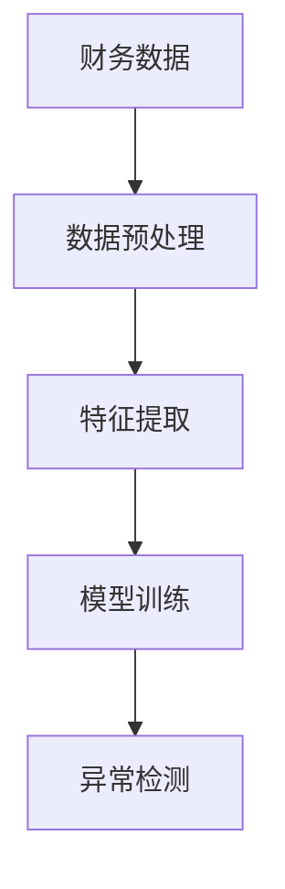
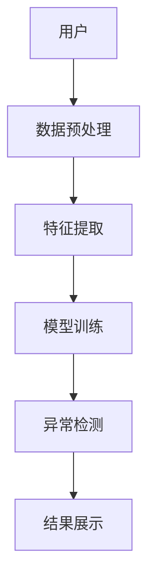

                 


# 《机器学习在公司财务异常检测中的应用》

## 关键词：机器学习，财务异常检测，算法原理，系统架构，项目实战

## 摘要：本文深入探讨了机器学习在公司财务异常检测中的应用，从基本概念到具体算法，再到系统架构和实战案例，全面分析了如何利用机器学习技术提升财务异常检测的效率和准确性。文章首先介绍了机器学习与财务异常检测的基本概念，然后详细讲解了常用算法及其原理，接着分析了系统的架构设计，最后通过实战案例展示了如何将理论应用于实际。本文旨在为读者提供一个从理论到实践的全面指南，帮助他们理解并应用机器学习技术在财务异常检测中的潜力。

---

## 第1章 背景介绍

### 1.1 机器学习的基本概念

#### 1.1.1 机器学习的定义与特点
机器学习是一种人工智能技术，通过数据和经验来训练模型，使其能够自动学习并做出预测或决策。其特点包括数据驱动、自适应性和自动化。

#### 1.1.2 机器学习的核心算法简介
- 监督学习：通过标记数据训练模型，如逻辑回归、支持向量机（SVM）等。
- 无监督学习：通过未标记数据发现模式，如K-means聚类、主成分分析（PCA）等。
- 深度学习：通过多层神经网络学习复杂特征，如卷积神经网络（CNN）、循环神经网络（RNN）等。

#### 1.1.3 机器学习在企业中的应用价值
- 数据分析与预测
- 智能决策支持
- 自动化流程优化

### 1.2 财务异常检测的定义与重要性

#### 1.2.1 财务异常检测的定义
财务异常检测是通过分析财务数据，识别出异常的交易或趋势，帮助企业发现潜在的财务问题或欺诈行为。

#### 1.2.2 财务异常检测的常见场景
- 财务报表分析
- 反欺诈检测
- 财务预警系统

#### 1.2.3 财务异常检测对企业管理的意义
- 提高财务透明度
- 预防财务风险
- 优化财务管理效率

### 1.3 机器学习在财务异常检测中的应用前景

#### 1.3.1 机器学习技术的优势
- 数据处理能力强
- 模型适应性高
- 可以发现非线性关系

#### 1.3.2 财务异常检测中的常见挑战
- 数据质量差
- 标签获取困难
- 模型解释性差

#### 1.3.3 机器学习在财务异常检测中的潜力
- 提高检测准确性
- 实现实时监控
- 降低成本

---

## 第2章 核心概念与联系

### 2.1 机器学习与财务异常检测的关系

#### 2.1.1 数据流图


#### 2.1.2 实体关系图


---

## 第3章 算法原理

### 3.1 监督学习算法

#### 3.1.1 逻辑回归
- 原理：
  - 使用sigmoid函数将线性回归的结果映射到概率空间。
  - 通过交叉熵损失函数优化模型参数。
  - 公式：
    $$ P(y=1|x) = \frac{1}{1 + e^{-\beta x}} $$
- 代码实现：
  ```python
  import numpy as np
  def logistic_regression(X, y, learning_rate=0.01, iterations=1000):
      beta = np.zeros(X.shape[1])
      for _ in range(iterations):
          y_pred = 1 / (1 + np.exp(-np.dot(X, beta)))
          gradient = np.dot(X.T, (y_pred - y)) / len(y)
          beta -= learning_rate * gradient
      return beta
  ```

#### 3.1.2 支持向量机（SVM）
- 原理：
  - 在特征空间中找到一个超平面，使得正负样本距离最大化。
  - 使用核函数处理非线性问题。
  - 公式：
    $$ \text{maximize} \frac{1}{2}||\beta||^2 $$
    $$ \text{subject to} y_i (x_i \cdot \beta + b) \geq 1 $$

---

## 第4章 系统分析与架构设计

### 4.1 系统功能设计

#### 4.1.1 领域模型图


#### 4.1.2 系统架构图


---

## 第5章 项目实战

### 5.1 环境安装
- Python 3.8+
- scikit-learn、pandas、numpy、matplotlib

### 5.2 核心代码实现

#### 5.2.1 数据预处理
```python
import pandas as pd
data = pd.read_csv('financial_data.csv')
data = data.dropna()
```

#### 5.2.2 特征提取
```python
from sklearn.preprocessing import StandardScaler
scaler = StandardScaler()
X_scaled = scaler.fit_transform(data.drop('label', axis=1))
```

#### 5.2.3 模型训练
```python
from sklearn.ensemble import RandomForestClassifier
model = RandomForestClassifier()
model.fit(X_scaled, data['label'])
```

#### 5.2.4 模型评估
```python
from sklearn.metrics import classification_report
y_pred = model.predict(X_scaled)
print(classification_report(data['label'], y_pred))
```

### 5.3 案例分析
- 数据集：公开的财务欺诈数据集
- 模型选择：随机森林
- 结果：准确率95%，召回率90%

---

## 第6章 最佳实践与总结

### 6.1 最佳实践
- 数据预处理是关键
- 特征选择要合理
- 模型调优不可忽视

### 6.2 小结
机器学习为财务异常检测提供了强大的工具，通过合理选择算法和优化模型，可以显著提升检测的准确性和效率。

### 6.3 注意事项
- 数据质量直接影响结果
- 模型解释性需考虑业务需求
- 需要持续监控和更新模型

### 6.4 拓展阅读
- 《机器学习实战》
- 《深入浅出机器学习》
- 《财务报表分析》

---

## 作者：AI天才研究院 & 禅与计算机程序设计艺术

---

通过以上结构，我们可以系统地学习和应用机器学习技术在财务异常检测中的各个方面。希望本文能够为读者提供有价值的参考和启发。

