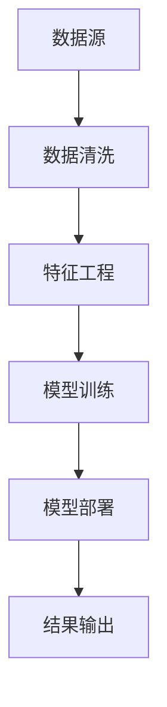

                 


# 机器学习在另类投资标的选择中的应用

> 关键词：机器学习，另类投资，特征工程，模型评估，系统架构

> 摘要：机器学习在金融投资领域中的应用日益广泛，尤其是在另类投资领域，其独特的优势使得投资决策更加精准和高效。本文将从机器学习的基本概念出发，深入探讨其在另类投资中的应用，包括核心算法、系统架构设计、实战案例等，为读者提供全面的技术解析。

---

## 第一章: 机器学习与另类投资的背景

### 1.1 另类投资的基本概念

#### 1.1.1 另类投资的定义
另类投资是指那些不传统的资产类别，包括私募股权、房地产信托（REITs）、对冲基金、商品期货、加密货币等。与传统股票和债券相比，另类资产具有更高的风险和收益潜力。

#### 1.1.2 机器学习的定义
机器学习是一种人工智能技术，通过数据训练模型，使其能够从经验中学习并做出预测或决策。与传统编程不同，机器学习模型能够通过数据自动优化参数，提高预测准确性。

#### 1.1.3 机器学习在另类投资中的结合
机器学习通过分析大量非结构化数据（如新闻、社交媒体、市场情绪等），帮助投资者发现传统金融模型难以捕捉的投资机会。

---

### 1.2 机器学习在金融投资中的应用背景

#### 1.2.1 传统金融分析的局限性
传统金融分析依赖于统计学方法和基本面分析，难以应对市场中的非线性关系和复杂数据。

#### 1.2.2 机器学习的优势
机器学习能够处理海量数据，发现隐藏在数据中的模式，并实时调整模型以适应市场变化。

#### 1.2.3 机器学习在另类投资中的独特价值
通过机器学习，投资者可以更精准地评估另类资产的风险和收益，优化投资组合，降低投资风险。

---

## 第二章: 机器学习的核心概念与原理

### 2.1 机器学习的核心原理

#### 2.1.1 数据驱动的决策
机器学习依赖于数据，通过训练模型从数据中提取特征，从而做出决策。

#### 2.1.2 特征提取与选择
特征工程是机器学习的关键步骤，通过选择和提取有效的特征，可以显著提高模型的性能。

#### 2.1.3 模型训练与优化
通过训练数据优化模型参数，使其能够准确预测目标变量。

---

### 2.2 机器学习的主要算法

#### 2.2.1 监督学习
监督学习通过训练数据预测目标变量，常用于分类和回归问题。

#### 2.2.2 非监督学习
非监督学习通过聚类分析发现数据中的自然分组，常用于市场细分和风险评估。

#### 2.2.3 强化学习
强化学习通过与环境交互，逐步优化策略，常用于动态投资组合管理。

---

## 第三章: 机器学习在另类投资中的应用

### 3.1 机器学习在另类投资中的核心应用

#### 3.1.1 风险评估与管理
通过机器学习模型预测市场风险，优化投资组合配置。

#### 3.1.2 资产定价与估值
利用机器学习模型分析影响资产价格的因素，提高估值准确性。

#### 3.1.3 投资机会识别
通过自然语言处理技术分析新闻和社交媒体，识别潜在投资机会。

---

### 3.2 机器学习算法在投资中的具体应用

#### 3.2.1 线性回归
线性回归用于预测资产的回报率，帮助投资者制定投资策略。

#### 3.2.2 支持向量机
支持向量机用于分类问题，常用于市场趋势预测。

#### 3.2.3 随机森林
随机森林用于特征重要性分析，帮助投资者识别关键影响因素。

---

## 第四章: 系统架构设计与实现

### 4.1 系统架构设计

#### 4.1.1 数据获取与处理
从多个数据源获取另类资产数据，进行清洗和特征工程。

#### 4.1.2 模型训练与部署
通过机器学习算法训练模型，并将其部署到生产环境。

#### 4.1.3 系统监控与优化
实时监控模型性能，及时优化模型以适应市场变化。

---

### 4.2 系统架构图



---

## 第五章: 项目实战与案例分析

### 5.1 项目背景与目标

#### 5.1.1 项目背景
通过机器学习模型预测另类资产的回报率，优化投资组合配置。

#### 5.1.2 项目目标
构建一个基于机器学习的另类资产投资决策系统，帮助投资者提高收益和降低风险。

---

### 5.2 项目实现

#### 5.2.1 环境配置
```python
# 安装必要的库
import numpy as np
import pandas as pd
from sklearn.model import LinearRegression
from sklearn.metrics import mean_squared_error
```

#### 5.2.2 数据处理
```python
# 示例数据处理代码
data = pd.read_csv('alternative_assets.csv')
X = data[['feature1', 'feature2', 'feature3']]
y = data['target']
```

#### 5.2.3 模型训练
```python
model = LinearRegression()
model.fit(X, y)
y_pred = model.predict(X)
print('均方误差:', mean_squared_error(y, y_pred))
```

---

### 5.3 案例分析

#### 5.3.1 案例背景
分析某私募股权基金的回报率，构建预测模型。

#### 5.3.2 数据分析与建模
通过特征工程提取关键影响因素，训练线性回归模型预测回报率。

#### 5.3.3 结果解读
评估模型性能，优化投资策略。

---

## 第六章: 总结与展望

### 6.1 总结

机器学习在另类投资中的应用显著提高了投资决策的精准性和效率。通过特征工程、算法优化和系统架构设计，投资者能够更好地应对市场风险，抓住投资机会。

### 6.2 展望

未来，随着机器学习技术的不断发展，其在另类投资中的应用将更加广泛和深入。投资者需要不断学习新技术，优化系统架构，以应对复杂多变的市场环境。

---

作者：AI天才研究院 & 禅与计算机程序设计艺术

