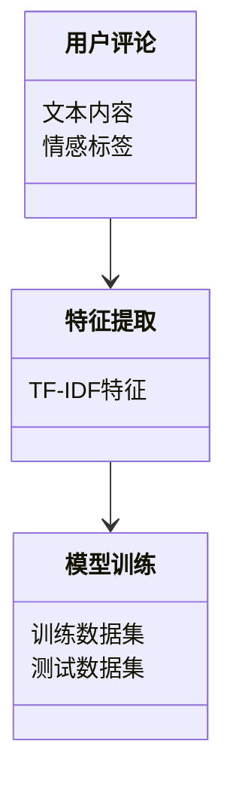

                 


# 《机器学习在另类数据信号提取中的应用》

> **关键词**: 机器学习, 另类数据, 信号提取, 特征工程, 数据预处理, 模型训练

> **摘要**:  
本文深入探讨了机器学习在另类数据信号提取中的应用，从基本概念到高级算法，结合实际案例，详细分析了如何利用机器学习技术从非传统数据源中提取有价值的信息。文章首先介绍了机器学习和另类数据的基本概念，随后从特征提取、模型选择、系统架构设计等角度展开讨论，结合数学公式、代码示例和图表，全面解析了机器学习在信号提取中的核心原理和实际应用。最后，本文总结了当前的研究热点和未来发展趋势，为读者提供了深入的学习和实践指导。

---

# 第一部分: 机器学习与另类数据信号提取的背景

# 第1章: 机器学习与另类数据信号提取概述

## 1.1 机器学习的基本概念

### 1.1.1 机器学习的定义与特点

机器学习是一种人工智能技术，通过数据训练模型，使其能够从数据中学习并做出预测或决策。其特点包括：

- **数据驱动**: 依赖大量数据进行训练。
- **自动化学习**: 模型能够自动调整参数以优化性能。
- **泛化能力**: 模型能够适应新的、未见的数据。

### 1.1.2 机器学习的核心要素

- **数据**: 训练的基础，包括特征和标签。
- **模型**: 用于表示数据规律的数学结构。
- **算法**: 用于训练模型的规则和步骤。
- **目标函数**: 优化模型性能的指标。

### 1.1.3 机器学习的应用领域

- **金融**: 风险评估、欺诈检测。
- **医疗**: 病例诊断、药物发现。
- **社交网络**: 用户行为分析、情感分析。

## 1.2 另类数据信号的定义与特点

### 1.2.1 另类数据的定义

另类数据是指非传统结构化的数据，例如文本、图像、音频、视频等。这些数据通常需要经过处理才能被机器学习模型利用。

### 1.2.2 另类数据的类型与来源

- **文本数据**: 社交媒体评论、新闻文章。
- **图像数据**: 图片、视频帧。
- **音频数据**: 音频片段、语音信号。

### 1.2.3 另类数据在不同领域的应用

- **金融**: 从新闻中提取市场情绪。
- **社交网络**: 分析用户行为和情感。
- **医疗**: 从医学图像中提取诊断信息。

## 1.3 机器学习在另类数据信号提取中的作用

### 1.3.1 机器学习在数据处理中的优势

- **自动化特征提取**: 通过模型自动提取有用的特征。
- **非线性关系建模**: 能够捕捉复杂的模式。
- **高维数据处理**: 适用于高维非结构化数据。

### 1.3.2 机器学习在信号提取中的核心作用

- **降维**: 通过主成分分析（PCA）等方法减少数据维度。
- **分类与回归**: 对信号进行分类或预测。
- **聚类分析**: 发现数据中的潜在结构。

### 1.3.3 机器学习在另类数据中的应用前景

- **实时分析**: 实时处理流数据。
- **多模态数据融合**: 结合多种数据源进行分析。
- **深度学习的应用**: 利用深度学习模型提取高层次特征。

## 1.4 本章小结

本章介绍了机器学习的基本概念、另类数据的定义与特点，以及机器学习在信号提取中的作用。接下来将从特征提取、模型选择等方面深入探讨机器学习的应用。

---

# 第二部分: 机器学习与另类数据的核心概念

# 第2章: 数据信号的特征与提取方法

## 2.1 数据信号的特征分析

### 2.1.1 数据信号的特征维度

- **时间序列**: 数据随时间变化的特征。
- **空间分布**: 数据在空间上的分布特征。
- **频率特性**: 数据在频域上的特征。

### 2.1.2 数据信号的特征分类

- **低频特征**: 如均值、方差。
- **高频特征**: 如峰峰值、周期性。

### 2.1.3 数据信号的特征提取方法

- **统计方法**: 计算均值、标准差等统计量。
- **频域分析**: 使用傅里叶变换提取频域特征。
- **时域分析**: 分析数据的时间序列特征。

## 2.2 机器学习模型的核心原理

### 2.2.1 机器学习模型的输入与输出

- **输入**: 特征向量或数据样本。
- **输出**: 预测结果或分类标签。

### 2.2.2 机器学习模型的训练过程

- **监督学习**: 基于标签数据进行训练。
- **无监督学习**: 从无标签数据中发现结构。
- **半监督学习**: 结合有标签和无标签数据。

### 2.2.3 机器学习模型的评估指标

- **准确率**: 预测正确的比例。
- **精确率和召回率**: 分类任务中的关键指标。
- **F1分数**: 调和平均数，平衡精确率和召回率。

## 2.3 数据信号与机器学习模型的关系

### 2.3.1 数据信号对模型性能的影响

- **数据质量**: 噪声多会影响模型性能。
- **特征相关性**: 特征之间高度相关会降低模型效率。
- **特征维度**: 高维数据可能导致维度灾难。

### 2.3.2 模型选择对数据信号提取的影响

- **模型复杂度**: 复杂模型可能过拟合。
- **模型适用性**: 选择适合数据特性的模型。
- **模型优化**: 通过调参提高性能。

### 2.3.3 数据信号与模型优化的关系

- **特征选择**: 选择对目标变量有影响的特征。
- **特征工程**: 对特征进行预处理和增强。
- **超参数调优**: 优化模型的性能。

## 2.4 本章小结

本章从特征提取和模型原理两个方面探讨了机器学习在信号提取中的应用。接下来将从算法原理的角度深入分析。

---

# 第三部分: 机器学习算法原理与数学模型

# 第3章: 机器学习算法的数学模型

## 3.1 线性回归模型

### 3.1.1 线性回归的定义

线性回归是一种用于预测目标变量的线性关系模型。

### 3.1.2 线性回归的数学公式

$$ y = \beta_0 + \beta_1x_1 + \beta_2x_2 + \dots + \beta_nx_n + \epsilon $$

其中：
- $y$ 是目标变量。
- $x_i$ 是特征变量。
- $\beta_i$ 是模型系数。
- $\epsilon$ 是误差项。

### 3.1.3 线性回归的优化过程

使用最小二乘法优化目标函数：

$$ \text{最小化} \quad \sum_{i=1}^n (y_i - (\beta_0 + \beta_1x_{i1} + \dots + \beta_kx_{ik}))^2 $$

### 3.1.4 线性回归的优缺点

- **优点**: 简单、易于解释。
- **缺点**: 无法处理非线性关系。

## 3.2 随机森林模型

### 3.2.1 随机森林的定义

随机森林是一种基于树的集成学习方法。

### 3.2.2 随机森林的数学模型

随机森林通过构建多棵决策树，并通过投票或平均的方式进行预测。

### 3.2.3 随机森林的优化过程

- **特征采样**: 每棵树使用不同的特征子集。
- **样本采样**: 使用带有放回的抽样。

### 3.2.4 随机森林的优缺点

- **优点**: 高精度、抗过拟合。
- **缺点**: 黑箱模型，解释性差。

## 3.3 XGBoost模型

### 3.3.1 XGBoost的定义

XGBoost是一种基于树的优化算法，支持正则化和分布式训练。

### 3.3.2 XGBoost的数学模型

目标函数：

$$ \text{目标} = \text{损失函数} + \text{正则化项} $$

### 3.3.3 XGBoost的优化过程

- **正则化**: 避免过拟合。
- **分布式训练**: 处理大数据集。

### 3.3.4 XGBoost的优缺点

- **优点**: 高效、支持大规模数据。
- **缺点**: 参数调整复杂。

## 3.4 本章小结

本章从数学模型的角度分析了线性回归、随机森林和XGBoost三种算法，探讨了它们在信号提取中的应用。接下来将从系统架构设计的角度深入分析。

---

# 第四部分: 系统架构设计与实现

# 第4章: 系统架构设计

## 4.1 问题场景介绍

假设我们有一个社交媒体数据集，需要从用户评论中提取情感信号。

## 4.2 系统功能设计

### 4.2.1 领域模型



### 4.2.2 系统架构


### 4.2.3 系统接口设计

- **输入接口**: 用户评论文本。
- **输出接口**: 情感预测结果。

### 4.2.4 系统交互流程

```mermaid
sequenceDiagram
    用户提交评论
    ->> 特征提取模块: 提取TF-IDF特征
    <<- 特征提取模块: 返回特征向量
    ->> 模型训练模块: 训练模型
    <<- 模型训练模块: 返回训练好的模型
    ->> 模型预测模块: 预测情感
    <<- 模型预测模块: 返回预测结果
```

## 4.3 本章小结

本章从系统架构的角度分析了如何设计一个基于机器学习的信号提取系统。接下来将从项目实战的角度深入分析。

---

# 第五部分: 项目实战与应用

# 第5章: 项目实战

## 5.1 环境安装与配置

- **Python版本**: 3.8及以上。
- **依赖库安装**:

```bash
pip install numpy pandas scikit-learn xgboost
```

## 5.2 数据预处理

### 5.2.1 数据加载

```python
import pandas as pd
data = pd.read_csv('comments.csv')
```

### 5.2.2 特征提取

```python
from sklearn.feature_extraction.text import TfidfVectorizer
vectorizer = TfidfVectorizer()
X = vectorizer.fit_transform(data['comment'])
```

### 5.2.3 数据分割

```python
from sklearn.model_selection import train_test_split
X_train, X_test, y_train, y_test = train_test_split(X, data['label'], test_size=0.2)
```

## 5.3 模型训练与优化

### 5.3.1 模型选择

```python
from xgboost import XGBClassifier
model = XGBClassifier()
model.fit(X_train, y_train)
```

### 5.3.2 模型调优

```python
from sklearn.model_selection import GridSearchCV
param_grid = {
    'n_estimators': [100, 200],
    'learning_rate': [0.1, 0.2]
}
grid_search = GridSearchCV(model, param_grid)
grid_search.fit(X_train, y_train)
best_model = grid_search.best_estimator_
```

### 5.3.3 模型评估

```python
from sklearn.metrics import accuracy_score
y_pred = best_model.predict(X_test)
print(accuracy_score(y_test, y_pred))
```

## 5.4 实际案例分析

### 5.4.1 案例背景

分析用户评论的情感倾向。

### 5.4.2 案例实现

```python
# 加载数据
data = pd.read_csv('comments.csv')

# 特征提取
vectorizer = TfidfVectorizer()
X = vectorizer.fit_transform(data['comment'])

# 数据分割
X_train, X_test, y_train, y_test = train_test_split(X, data['label'], test_size=0.2)

# 模型训练
model = XGBClassifier()
model.fit(X_train, y_train)

# 模型预测
y_pred = model.predict(X_test)

# 模型评估
print(accuracy_score(y_test, y_pred))
```

### 5.4.3 案例小结

通过实际案例分析，验证了机器学习在另类数据信号提取中的有效性。

## 5.5 本章小结

本章通过一个实际案例，详细讲解了机器学习在另类数据信号提取中的应用。接下来将从扩展与展望的角度进行总结。

---

# 第六部分: 扩展与展望

# 第6章: 扩展与展望

## 6.1 当前研究热点

- **深度学习的应用**: 利用深度学习模型提取高层次特征。
- **多模态数据融合**: 综合多种数据源进行分析。
- **实时信号提取**: 实时处理流数据。

## 6.2 未来发展趋势

- **模型解释性**: 提高模型的可解释性。
- **高效算法**: 开发更高效的算法处理大数据。
- **领域应用扩展**: 将机器学习应用于更多领域。

## 6.3 读者思考与建议

- **深入学习**: 学习更多机器学习算法和框架。
- **实践项目**: 通过实际项目加深理解。
- **持续关注**: 关注领域内的最新研究和进展。

## 6.4 本章小结

本章总结了当前的研究热点和未来发展趋势，为读者提供了进一步学习和实践的方向。

---

# 作者：AI天才研究院/AI Genius Institute & 禅与计算机程序设计艺术/Zen And The Art of Computer Programming

