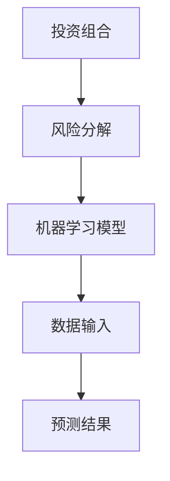
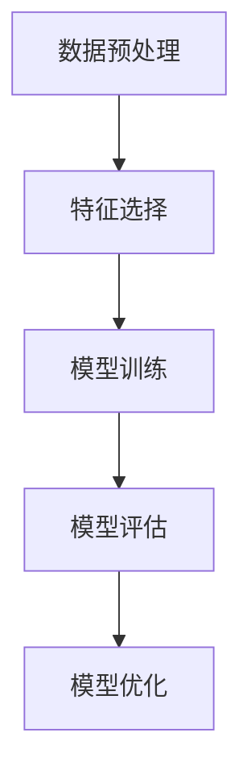

                 

# 机器学习在投资组合风险分解中的应用

> 关键词：机器学习，投资组合，风险分解，金融风险管理，数学模型

> 摘要：本文深入探讨了机器学习在投资组合风险分解中的应用，通过详细分析背景、核心概念、算法原理、系统架构、项目实战和最佳实践，展示了如何利用机器学习技术提升金融风险管理的效率和准确性。文章结合理论与实践，提供了丰富的案例和代码示例，帮助读者全面理解并应用这些方法。

---

# 第1章: 投资组合风险分解概述

## 1.1 投资组合风险的基本概念
### 1.1.1 投资组合风险的定义
投资组合风险是指在一定时期内，投资组合的收益波动或损失的可能性。风险分解是将整体风险拆解为各个组成部分的过程，有助于更精准地识别和管理风险来源。

### 1.1.2 风险分解的必要性
风险分解可以帮助投资者理解不同资产或因素对整体风险的贡献，从而优化投资组合，降低潜在风险。

### 1.1.3 机器学习在风险分解中的作用
传统统计方法在处理复杂非线性关系时存在局限性，而机器学习算法能够捕捉复杂模式，提高风险分解的准确性。

## 1.2 机器学习的基本概念
### 1.2.1 机器学习的定义
机器学习是一种人工智能技术，通过数据训练模型，使其能够从数据中学习并做出预测或决策。

### 1.2.2 机器学习的核心特点
数据驱动、非线性建模能力、适应性。

### 1.2.3 机器学习与传统统计方法的区别
机器学习能够处理高维数据和复杂模式，而传统统计方法通常假设数据分布和关系较为简单。

## 1.3 机器学习在金融领域的应用
### 1.3.1 金融领域的机器学习应用现状
广泛应用于股票预测、信用评分、风险管理等领域。

### 1.3.2 投资组合风险分解中的机器学习应用
通过机器学习模型分解资产收益，识别风险来源。

### 1.3.3 机器学习在金融风险管理中的优势
提高预测精度，发现传统方法难以捕捉的模式。

## 1.4 本章小结
本章介绍了投资组合风险分解的基本概念、机器学习的核心特点及其在金融领域的应用，为后续内容奠定了基础。

---

# 第2章: 机器学习的核心概念与联系

## 2.1 核心概念原理
### 2.1.1 回归模型的原理
回归模型用于预测连续型目标变量，通过最小化预测误差来拟合数据。

### 2.1.2 分类模型的原理
分类模型用于预测离散型目标变量，通过训练数据学习分类边界。

### 2.1.3 聚类分析的原理
聚类分析用于将数据分成相似的组，发现数据中的潜在结构。

## 2.2 核心概念属性特征对比表格
| 概念 | 属性 | 描述 |
|------|------|------|
| 回归模型 | 监督学习 | 预测连续型目标变量 |
| 分类模型 | 监督学习 | 预测离散型目标变量 |
| 聚类分析 | 无监督学习 | 发现数据中的潜在结构 |

## 2.3 ER实体关系图架构

## 2.4 本章小结
本章通过对比分析机器学习的核心概念，展示了它们在投资组合风险分解中的潜在应用。

---

# 第3章: 机器学习算法原理与数学模型

## 3.1 线性回归模型
### 3.1.1 线性回归的数学模型
$$ y = \beta_0 + \beta_1x_1 + \beta_2x_2 + \cdots + \beta_nx_n + \epsilon $$

### 3.1.2 最小二乘法的原理
通过最小化预测误差平方和，求解回归系数。

### 3.1.3 线性回归的优缺点
优点：简单、可解释性强；缺点：假设变量间线性关系，可能无法捕捉复杂模式。

## 3.2 支持向量回归
### 3.2.1 支持向量回归的原理
通过最大化间隔最小化预测误差，构建鲁棒的回归模型。

### 3.2.2 核函数的选择与应用
使用核函数将数据映射到高维空间，捕捉非线性关系。

### 3.2.3 支持向量回归的数学模型
$$ y = \sum_{i=1}^n \alpha_i y_i K(x_i, x) + b $$

## 3.3 机器学习算法流程图

## 3.4 本章小结
本章详细讲解了线性回归和支持向量回归的原理及数学模型，为后续应用奠定了基础。

---

# 第4章: 投资组合风险分解的系统架构设计

## 4.1 问题场景介绍
### 4.1.1 投资组合风险分解的目标
识别各资产对整体风险的贡献。

### 4.1.2 机器学习在风险分解中的应用场景
预测资产收益，分解风险来源。

### 4.1.3 系统设计的必要性
构建高效系统，支持复杂金融数据的处理和分析。

## 4.2 系统功能设计
### 4.2.1 预测模块

---

作者：AI天才研究院/AI Genius Institute & 禅与计算机程序设计艺术 /Zen And The Art of Computer Programming

