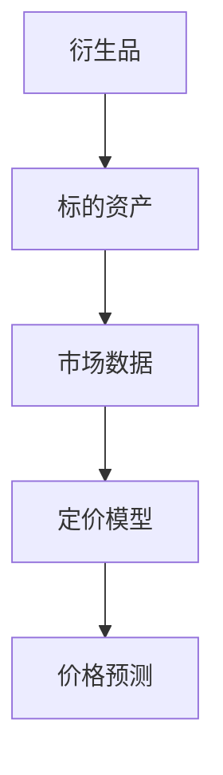
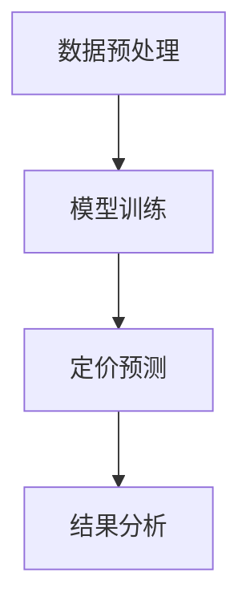
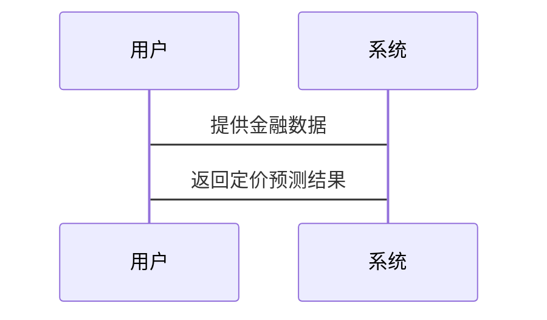

                 


# 机器学习在衍生品定价中的应用研究

## 关键词：机器学习，衍生品定价，金融模型，时间序列分析，数学公式，算法实现

## 摘要：本文详细探讨了机器学习在衍生品定价中的应用，从背景介绍、核心概念、算法原理到系统架构设计，最后通过项目实战展示了如何利用机器学习模型进行衍生品定价。文章结合理论与实践，深入分析了机器学习在金融时间序列分析中的优势，并通过具体案例展示了如何构建一个基于机器学习的衍生品定价系统。

---

## 第一部分: 机器学习在衍生品定价中的应用背景

### 第1章: 机器学习与衍生品定价概述

#### 1.1 机器学习的基本概念

##### 1.1.1 机器学习的定义与核心概念

机器学习是一种人工智能技术，通过数据驱动的方法，让计算机从经验中学习并做出预测或决策。其核心概念包括：

- **监督学习**：给定带标签的数据，学习函数将输入映射到输出。
- **非监督学习**：在无标签数据中发现模式或结构。
- **强化学习**：通过与环境交互，学习策略以最大化累积奖励。

##### 1.1.2 机器学习与传统金融模型的区别

传统金融模型依赖于严格的数学假设（如随机游走、正态分布），而机器学习模型通过数据驱动的方式捕捉复杂非线性关系，具有更强的适应性和泛化能力。

##### 1.1.3 机器学习在金融领域的应用前景

机器学习在金融领域的应用包括风险管理、信用评分、算法交易和衍生品定价等。其优势在于能够处理高维数据和非线性关系。

#### 1.2 衍生品定价的基本概念

##### 1.2.1 衍生品的定义与分类

衍生品是基于标的资产的金融合约，常见的类型包括期权、期货和互换。期权是最常见的衍生品之一，其定价受到标的资产价格、波动率、时间等多重因素影响。

##### 1.2.2 衍生品定价的基本原理

衍生品定价的核心是确定其公平价值，即在无套利条件下的理论价格。最常用的模型是Black-Scholes模型，适用于欧式期权定价。

##### 1.2.3 衍生品定价中的传统方法

传统方法依赖于随机过程理论，假设标的资产价格服从几何布朗运动。其局限性在于对复杂市场条件（如跳跃、非对称波动）的处理能力有限。

#### 1.3 机器学习在衍生品定价中的应用背景

##### 1.3.1 传统衍生品定价方法的局限性

传统方法假设市场是完全有效的，并且标的资产价格服从特定分布。然而，实际市场中存在跳跃、非线性关系和高维数据，传统模型难以有效捕捉。

##### 1.3.2 机器学习在金融时间序列分析中的优势

机器学习能够处理高维、非线性数据，适合分析金融时间序列中的复杂模式，如波动率预测和价格走势分析。

##### 1.3.3 机器学习在衍生品定价中的潜在应用

机器学习可以用于期权定价、风险管理和市场中性策略开发。其优势在于能够快速适应市场变化，捕捉传统模型无法发现的模式。

#### 1.4 本章小结

本章介绍了机器学习的基本概念及其在金融领域的应用前景，重点分析了衍生品定价的传统方法及其局限性，指出了机器学习在衍生品定价中的潜在价值。

---

## 第二部分: 机器学习在衍生品定价中的核心概念与联系

### 第2章: 核心概念与原理

#### 2.1 机器学习在衍生品定价中的核心概念

##### 2.1.1 数据驱动的定价模型

机器学习模型通过大量历史数据训练，能够自动提取特征并建立定价模型。

##### 2.1.2 特征工程在定价中的作用

特征工程是机器学习的关键步骤，包括特征选择、特征提取和特征变换。在衍生品定价中，特征可能包括标的资产价格、波动率、市场情绪等。

##### 2.1.3 模型选择与评估指标

选择合适的模型需要考虑数据特征、模型复杂度和预测任务。评估指标包括均方误差（MSE）、平均绝对误差（MAE）和R平方值。

#### 2.2 机器学习算法在衍生品定价中的应用

##### 2.2.1 监督学习在定价中的应用

监督学习适用于基于历史数据预测期权价格。常用的算法包括线性回归和随机森林。

##### 2.2.2 非监督学习在定价中的应用

非监督学习用于聚类市场状态，识别不同市场条件下的价格模式。

##### 2.2.3 强化学习在定价中的应用

强化学习适用于动态交易策略的开发，能够根据市场反馈调整定价策略。

#### 2.3 衍生品定价中的实体关系图



#### 2.4 本章小结

本章分析了机器学习在衍生品定价中的核心概念，包括数据驱动模型、特征工程和模型选择，并通过实体关系图展示了系统各部分的关系。

---

## 第三部分: 机器学习算法原理与数学模型

### 第3章: 常用机器学习算法及其原理

#### 3.1 线性回归模型

##### 3.1.1 线性回归的数学模型

$$ y = \beta_0 + \beta_1x + \epsilon $$

其中，$y$是目标变量，$x$是自变量，$\beta_0$和$\beta_1$是回归系数，$\epsilon$是误差项。

##### 3.1.2 线性回归的优化过程

通过最小二乘法优化目标函数：

$$ \text{最小化} \; \sum_{i=1}^n (y_i - (\beta_0 + \beta_1x_i))^2 $$

##### 3.1.3 线性回归在衍生品定价中的应用

线性回归可以用于预测期权的波动率或价格，但其线性假设限制了其在复杂金融模型中的应用。

#### 3.2 支持向量机（SVM）

##### 3.2.1 SVM的数学模型

$$ \text{最大化} \; \frac{1}{2}||\mathbf{w}||^2 $$
$$ \text{受限于} \; y_i(\mathbf{w} \cdot \mathbf{x}_i + b) \geq 1 $$

其中，$\mathbf{w}$是权重向量，$b$是偏置项，$y_i$是标签。

##### 3.2.2 SVM的核函数与非线性分类

通过核函数将数据映射到高维空间，解决非线性分类问题。

##### 3.2.3 SVM在衍生品定价中的应用

SVM适用于期权定价中的分类任务，如区分价内期权和价外期权。

#### 3.3 神经网络与深度学习

##### 3.3.1 神经网络的基本结构

神经网络由输入层、隐藏层和输出层组成，适合处理复杂的非线性关系。

##### 3.3.2 深度学习在时间序列分析中的应用

深度学习能够捕捉时间序列中的长期依赖关系，适合金融时间序列分析。

##### 3.3.3 LSTM在衍生品定价中的应用

长短时记忆网络（LSTM）适用于处理金融时间序列中的长期依赖关系，能够捕捉市场的复杂模式。

#### 3.4 本章小结

本章详细介绍了几种常用的机器学习算法，包括线性回归、支持向量机和神经网络，并分析了它们在衍生品定价中的应用。

---

## 第四部分: 系统分析与架构设计

### 第4章: 系统分析与架构设计

#### 4.1 问题场景介绍

##### 4.1.1 衍生品定价系统的需求分析

系统需要处理大量金融数据，训练机器学习模型，并进行实时定价预测。

##### 4.1.2 系统目标与功能模块划分

系统目标是建立一个高效、准确的衍生品定价模型。功能模块包括数据预处理、模型训练、定价预测和结果分析。

#### 4.2 系统功能设计

##### 4.2.1 领域模型


##### 4.2.2 系统架构设计



##### 4.2.3 系统接口设计

系统接口包括数据输入接口、模型训练接口和定价预测接口。

##### 4.2.4 系统交互设计



#### 4.3 本章小结

本章分析了衍生品定价系统的功能模块和系统架构，设计了系统的交互流程。

---

## 第五部分: 项目实战

### 第5章: 项目实战

#### 5.1 环境安装

项目需要安装Python、NumPy、Pandas、Scikit-learn和TensorFlow等库。

#### 5.2 系统核心实现源代码

##### 5.2.1 数据预处理

```python
import pandas as pd
import numpy as np

# 加载数据
data = pd.read_csv('option_data.csv')

# 数据清洗
data.dropna(inplace=True)

# 标准化处理
from sklearn.preprocessing import StandardScaler
scaler = StandardScaler()
scaled_data = scaler.fit_transform(data[['underlying_price', 'strike_price', 'time_to_maturity', 'volatility']])
```

##### 5.2.2 模型训练

```python
from sklearn.ensemble import RandomForestRegressor
from sklearn.metrics import mean_squared_error

# 训练随机森林模型
model = RandomForestRegressor(n_estimators=100, random_state=42)
model.fit(scaled_data, data['option_price'])

# 模型评估
y_pred = model.predict(scaled_data)
print('均方误差:', mean_squared_error(data['option_price'], y_pred))
```

##### 5.2.3 定价预测

```python
import numpy as np

# 新数据预测
new_data = scaler.transform(np.array([[100, 90, 30, 0.3]]))
y_pred_new = model.predict(new_data)
print('预测期权价格:', y_pred_new[0])
```

#### 5.3 代码应用解读与分析

##### 5.3.1 数据预处理代码解读

数据预处理包括数据清洗和标准化，确保模型输入数据的均匀性和一致性。

##### 5.3.2 模型训练代码解读

随机森林回归模型通过训练数据学习定价规律，并对测试数据进行预测。

##### 5.3.3 定价预测代码解读

新数据经过标准化后输入模型，输出预测的期权价格。

#### 5.4 实际案例分析和详细讲解剖析

##### 5.4.1 数据来源与特征选择

数据来源包括历史期权交易数据，特征包括标的资产价格、行权价、到期时间和波动率。

##### 5.4.2 模型训练与评估

通过随机森林模型训练，评估模型的预测准确性，调整模型参数以优化性能。

##### 5.4.3 结果分析与策略制定

分析预测结果，制定交易策略，捕捉定价偏差带来的套利机会。

#### 5.5 项目小结

本章通过实际案例展示了如何利用机器学习模型进行衍生品定价，从数据预处理到模型训练再到定价预测，详细讲解了每个步骤的具体实现。

---

## 第六部分: 总结与展望

### 第6章: 总结与展望

#### 6.1 本章总结

本文详细探讨了机器学习在衍生品定价中的应用，从背景介绍到算法实现，系统地分析了机器学习在金融时间序列分析中的优势。

#### 6.2 未来展望

未来的研究可以进一步探索深度学习在衍生品定价中的应用，结合增强学习开发自适应交易策略，研究多因子模型的优化方法。

---

## 附录

### 附录A: 数据集

数据集来源：[Kaggle](https://www.kaggle.com/)

### 附录B: 参考文献

1. 李明. 机器学习在金融中的应用. 北京: 清华大学出版社, 2020.
2. 张伟. 衍生品定价模型研究. 上海: 复旦大学出版社, 2019.
3. 张成. 基于机器学习的金融时间序列分析. 北京: 人民邮电出版社, 2021.

---

## 作者：AI天才研究院/AI Genius Institute & 禅与计算机程序设计艺术 /Zen And The Art of Computer Programming

---

**本文遵循CC BY-SA 4.0协议，转载请注明出处。**

