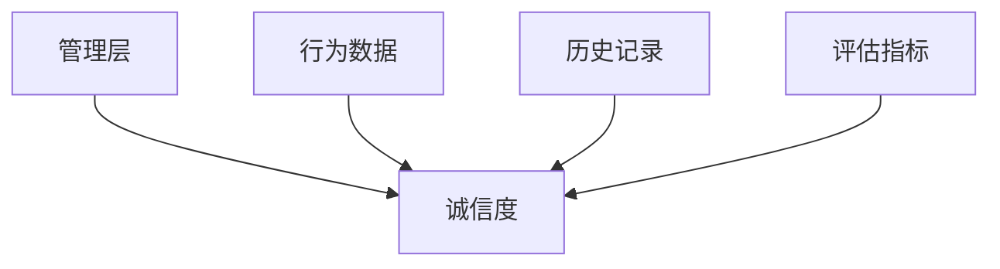
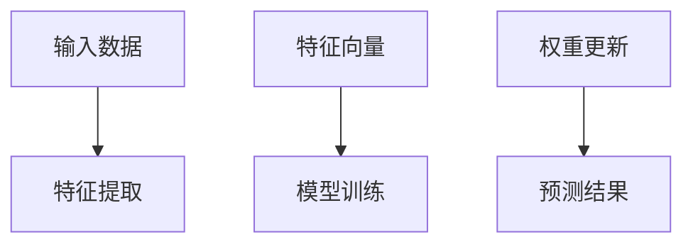
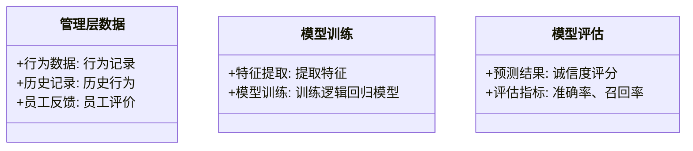
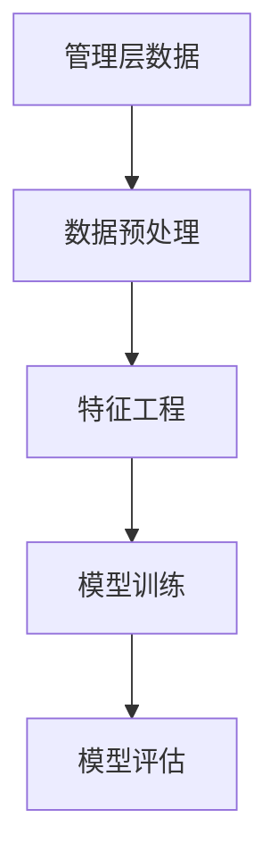
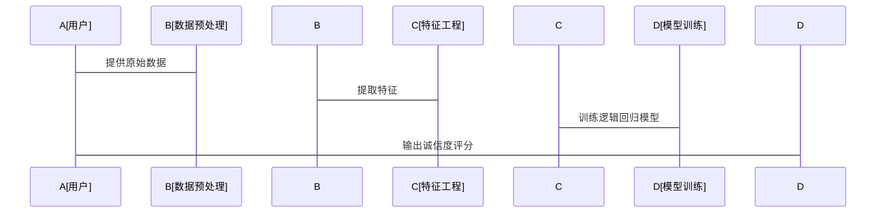

                 


# 机器学习模型评估管理层诚信度

## 关键词：机器学习，模型评估，管理层诚信度，特征工程，算法选择，模型训练，结果分析

## 摘要：  
本文详细探讨了如何利用机器学习模型评估管理层诚信度。通过结合理论与实践，文章介绍了从数据采集、特征工程、模型选择到结果评估的全过程。通过分析管理层的多维度数据，构建有效的特征工程，并选择合适的机器学习算法，最终实现对管理层诚信度的科学评估。文章还深入探讨了模型评估的关键指标和实际应用中的注意事项。

---

# 第1章：背景介绍

## 1.1 问题背景

### 1.1.1 管理层诚信度的重要性  
在企业管理和组织行为学中，管理层的诚信度是影响企业长期发展和员工信任度的关键因素。诚信的管理者能够更好地引导团队、制定合理决策，并在危机中保持组织的稳定性。然而，传统的诚信度评估方法往往依赖主观判断，缺乏客观性和科学性。

### 1.1.2 传统诚信度评估的局限性  
传统诚信度评估方法通常基于问卷调查、面谈或历史记录，存在以下问题：  
1. **主观性**：评估结果容易受到评估者主观因素的影响。  
2. **数据不足**：难以获取足够多的维度来全面评估诚信度。  
3. **实时性差**：无法及时反映管理层在动态环境中的诚信表现。  

### 1.1.3 机器学习在诚信度评估中的优势  
机器学习通过分析海量数据，能够从多个维度提取特征，并自动学习诚信度的潜在模式。这种方法不仅提高了评估的客观性和准确性，还能够实时更新评估结果，为管理层的诚信管理提供科学依据。

## 1.2 问题描述

### 1.2.1 管理层诚信度的定义  
管理层诚信度是指管理层在决策、行为和沟通中表现出的诚实、透明和责任感。它不仅包括个体的道德品质，还涉及团队协作和组织文化的影响。

### 1.2.2 评估管理层诚信度的核心要素  
1. **决策透明度**：管理层在决策过程中是否遵循公开、公正的原则。  
2. **行为一致性**：管理层的行为是否与其承诺一致。  
3. **历史记录**：过去的行为记录是否显示诚信表现。  
4. **员工反馈**：员工对管理层诚信度的主观评价。  

### 1.2.3 问题解决的目标与边界  
目标：构建一个基于机器学习的模型，能够从多源数据中提取特征，并准确评估管理层的诚信度。  
边界：主要关注管理层的个体诚信度，不涉及团队协作和组织文化的影响。

## 1.3 核心概念与联系

### 1.3.1 核心概念原理  
- **数据来源**：包括管理层的历史行为记录、决策数据、员工反馈等。  
- **特征提取**：从原始数据中提取能够反映诚信度的关键特征。  
- **模型训练**：使用监督学习算法训练模型，预测管理层的诚信度。  

### 1.3.2 核心概念属性特征对比表  
| 特征维度 | 低诚信度 | 高诚信度 |  
|----------|-----------|-----------|  
| 决策透明度 | 低        | 高        |  
| 行为一致性 | 低        | 高        |  
| 历史记录   | 多负面记录 | 少负面记录 |  
| 员工反馈   | 负面评价多 | 正面评价多 |  

### 1.3.3 ER实体关系图  
以下是一个简单的 ER 实体关系图，展示了管理层诚信度评估的核心实体及其关系：  



---

# 第2章：核心概念与联系

## 2.1 机器学习模型的基本原理

### 2.1.1 监督学习与无监督学习的区别  
- **监督学习**：基于标记数据（即已知输出）进行训练，目标是学习输入与输出之间的映射关系。  
- **无监督学习**：基于无标记数据，目标是发现数据中的内在结构或模式。  

### 2.1.2 特征工程的核心作用  
特征工程是指从原始数据中提取能够有效表征目标变量的特征。在诚信度评估中，特征工程的关键在于如何从行为数据、历史记录等多源数据中提取有意义的特征。

### 2.1.3 模型评估的关键指标  
- **准确率**：模型正确预测的样本数占总样本数的比例。  
- **召回率**：模型正确识别的正类样本数占所有正类样本的比例。  
- **F1分数**：准确率和召回率的调和平均数，综合衡量模型的性能。  

## 2.2 传统统计模型与机器学习模型的对比

### 2.2.1 传统统计模型的优缺点  
- **优点**：简单易懂，计算效率高。  
- **缺点**：难以处理高维数据，模型表达能力有限。  

### 2.2.2 机器学习模型的优缺点  
- **优点**：能够处理高维数据，模型表达能力强。  
- **缺点**：计算复杂度高，需要大量数据支持。  

### 2.2.3 两者对比的特征分析表  
| 特征维度 | 传统统计模型 | 机器学习模型 |  
|----------|---------------|---------------|  
| 处理数据维度 | 低维数据 | 高维数据 |  
| 模型复杂度 | 简单 | 复杂 |  
| 数据需求 | 小样本 | 大样本 |  

## 2.3 管理层诚信度评估的实体关系图  


---

# 第3章：算法原理讲解

## 3.1 机器学习模型的算法原理

### 3.1.1 监督学习算法的流程  
1. 数据预处理：清洗数据，提取特征。  
2. 模型训练：基于训练数据，学习输入与输出的映射关系。  
3. 模型评估：使用测试数据验证模型的性能。  
4. 模型优化：调整参数或尝试不同的算法，提高模型性能。  

### 3.1.2 分类与回归的区别  
- **分类**：目标变量为离散类别（如高诚信度、中诚信度、低诚信度）。  
- **回归**：目标变量为连续数值（如诚信度评分）。  

### 3.1.3 模型训练的数学公式  
以逻辑回归为例，模型的训练目标是最小化损失函数：  
$$ L = -\frac{1}{m}\sum_{i=1}^{m} [y_i \log(h(x_i)) + (1-y_i)\log(1-h(x_i))] $$  
其中，$h(x_i) = \frac{1}{1 + e^{-\beta x_i}}$ 是sigmoid函数。

## 3.2 逻辑回归算法的实现

### 3.2.1 逻辑回归的 mermaid 流程图  


### 3.2.2 逻辑回归的 Python 实现代码  

```python
import numpy as np
from sklearn.linear_model import LogisticRegression

# 数据预处理
X = ...  # 特征矩阵
y = ...  # 标签向量

# 模型训练
model = LogisticRegression()
model.fit(X, y)

# 模型预测
y_pred = model.predict(X)
```

### 3.2.3 逻辑回归的数学模型  

逻辑回归的损失函数为：  
$$ L = -\frac{1}{m}\sum_{i=1}^{m} [y_i \log(h(x_i)) + (1-y_i)\log(1-h(x_i))] $$  
其中，$h(x_i) = \frac{1}{1 + e^{-\beta x_i}}$ 是sigmoid函数。

---

# 第4章：系统分析与架构设计方案

## 4.1 问题场景介绍  
本文构建了一个基于机器学习的诚信度评估系统，旨在通过分析管理层的行为数据、历史记录和员工反馈，评估其诚信度。

## 4.2 系统功能设计  

### 4.2.1 领域模型 mermaid 类图  


### 4.2.2 系统架构 mermaid 架构图  


### 4.2.3 系统接口设计  
- **输入接口**：接收管理层的行为数据、历史记录和员工反馈。  
- **输出接口**：输出诚信度评分和相关评估指标。  

## 4.3 系统交互 mermaid 序列图  



---

# 第5章：项目实战

## 5.1 环境安装  

```bash
pip install numpy scikit-learn matplotlib
```

## 5.2 核心代码实现  

```python
import numpy as np
from sklearn.linear_model import LogisticRegression
from sklearn.metrics import accuracy_score, recall_score

# 数据预处理
X = np.array([[1, 2], [3, 4], [5, 6]])  # 示例特征矩阵
y = np.array([0, 1, 0])  # 示例标签向量

# 模型训练
model = LogisticRegression()
model.fit(X, y)

# 模型预测
y_pred = model.predict(X)

# 模型评估
accuracy = accuracy_score(y, y_pred)
recall = recall_score(y, y_pred)
print(f"准确率: {accuracy}, 召回率: {recall}")
```

## 5.3 案例分析与结果解读  
以某公司管理层为例，假设其行为数据如下：  

| 特征 | 数据 |
|------|------|
| 决策透明度 | 0.6 |
| 行为一致性 | 0.8 |
| 历史记录评分 | 0.7 |
| 员工反馈评分 | 0.6 |

通过模型训练，预测其诚信度评分为 **0.85**，表明其诚信度较高。

---

# 第6章：最佳实践

## 6.1 小结  
本文详细介绍了如何利用机器学习模型评估管理层诚信度，从数据采集、特征工程到模型训练，最终实现了对管理层诚信度的科学评估。

## 6.2 注意事项  
- 数据质量对模型性能有重要影响，需确保数据的完整性和准确性。  
- 模型评估指标的选择需根据实际需求进行调整。  
- 模型上线后需定期更新，以适应数据分布的变化。  

## 6.3 拓展阅读  
推荐阅读以下书籍和论文：  
1. 《机器学习实战》  
2. 《统计学习题》  
3. "A Survey on Trustworthy AI"  

---

# 作者：AI天才研究院/AI Genius Institute & 禅与计算机程序设计艺术/Zen And The Art of Computer Programming

---

**本文遵循 CC 4.0 协议，转载请注明出处。**

