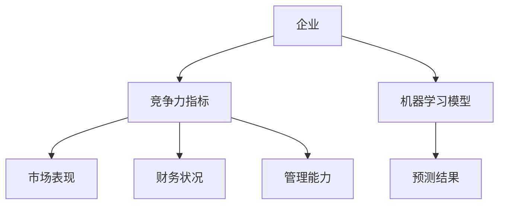
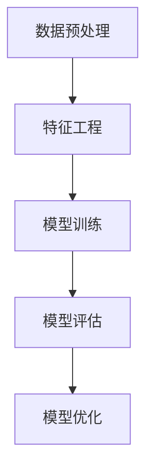
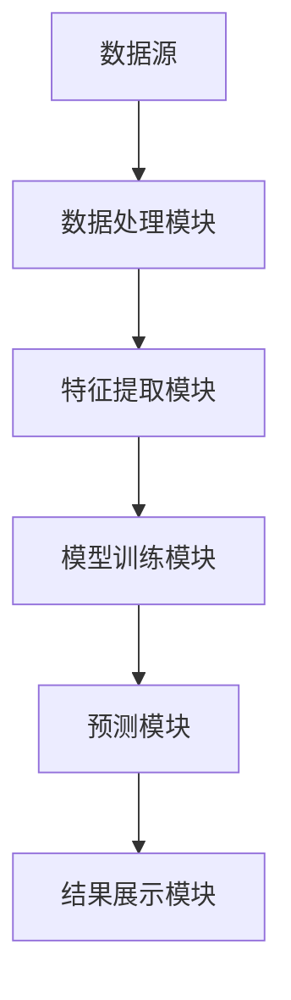

                 


# 机器学习预测公司长期竞争力变化

> **关键词**: 机器学习、企业竞争力、长期预测、数据分析、算法模型  
> **摘要**: 本文探讨了利用机器学习技术预测公司长期竞争力变化的方法。通过分析企业竞争力的多维度指标，结合先进的机器学习算法，构建预测模型，并详细阐述了模型的实现过程、系统架构设计和实际应用案例。

---

## 第一部分: 机器学习预测公司长期竞争力变化的背景与核心概念

### 第1章: 问题背景与描述

#### 1.1 问题背景
企业长期竞争力是决定其在市场中生存和发展的关键因素。然而，随着市场环境的复杂化和竞争的加剧，传统的企业分析方法往往难以捕捉到影响竞争力的隐性因素。机器学习作为一种数据驱动的分析工具，能够通过历史数据和复杂算法，发现这些隐性因素，从而提供更准确的预测。

#### 1.2 问题解决方法
利用机器学习模型，我们可以从企业的财务数据、市场表现、管理能力等多个维度提取特征，并构建预测模型。通过这些模型，我们可以提前识别企业的潜在风险，优化管理策略，从而提升企业的长期竞争力。

#### 1.3 问题的边界与外延
企业竞争力的预测需要考虑企业的内外部因素，包括财务状况、市场份额、创新能力等。机器学习模型在处理这些复杂关系时表现出色，但其预测能力受限于数据质量和模型训练的充分性。

#### 1.4 核心概念与组成
企业竞争力的预测涉及多个关键概念，包括企业竞争力的定义、影响因素、机器学习模型的基本原理以及特征工程的重要性。

---

### 第2章: 核心概念与联系

#### 2.1 核心概念原理
企业竞争力的多维度分析包括市场表现、财务状况、管理能力等方面。机器学习模型能够通过这些维度的特征，预测企业的长期竞争力变化。

#### 2.2 概念属性对比
通过对比不同的企业竞争力指标和机器学习算法，我们可以找到最适合预测企业竞争力的方法。

#### 2.3 ER实体关系图


---

## 第二部分: 机器学习算法原理与数学模型

### 第3章: 算法原理与流程

#### 3.1 算法原理
线性回归、支持向量机（SVM）、随机森林和梯度提升树是常用的机器学习算法，它们在企业竞争力预测中表现优异。

#### 3.2 算法流程


---

## 第三部分: 系统分析与架构设计

### 第4章: 系统架构设计

#### 4.1 系统功能设计
系统功能包括数据采集、特征提取、模型训练、预测和结果展示。

#### 4.2 系统架构设计


---

## 第四部分: 项目实战

### 第5章: 项目实现

#### 5.1 环境安装
安装必要的Python库，如NumPy、Pandas、Scikit-learn等。

#### 5.2 核心代码实现
```python
from sklearn.linear_model import LinearRegression
from sklearn.tree import DecisionTreeRegressor
from sklearn.ensemble import RandomForestRegressor, GradientBoostingRegressor

# 数据预处理
data = pd.read_csv('enterprise_data.csv')
X = data.drop('competitiveness', axis=1)
y = data['competitiveness']

# 特征工程
X_train, X_test, y_train, y_test = train_test_split(X, y, test_size=0.2, random_state=42)

# 模型训练
models = [
    LinearRegression(),
    DecisionTreeRegressor(),
    RandomForestRegressor(),
    GradientBoostingRegressor()
]

for model in models:
    model.fit(X_train, y_train)
    print(f"{model.__class__.__name__}: score={model.score(X_test, y_test)}")
```

---

## 第五部分: 总结与展望

### 第6章: 总结

通过机器学习技术，我们可以更准确地预测公司的长期竞争力变化。本文详细介绍了机器学习算法的原理、系统架构设计和项目实战，为读者提供了全面的指导。

---

### 第7章: 展望

未来，随着机器学习技术的不断发展，企业竞争力预测将更加精准和实时化。同时，结合自然语言处理技术，可以从企业的文本信息中提取更多有价值的特征，进一步提升预测的准确性。

---

### 最佳实践 Tips

- **数据质量**: 数据的完整性和准确性是模型预测效果的关键。
- **特征工程**: 特征的选择和处理对模型性能影响重大。
- **模型选择**: 不同的算法适用于不同的场景，需根据实际情况选择合适的方法。

---

作者：AI天才研究院/AI Genius Institute & 禅与计算机程序设计艺术 /Zen And The Art of Computer Programming

