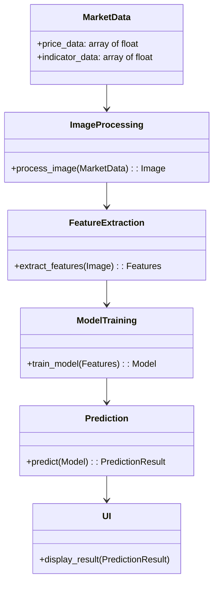
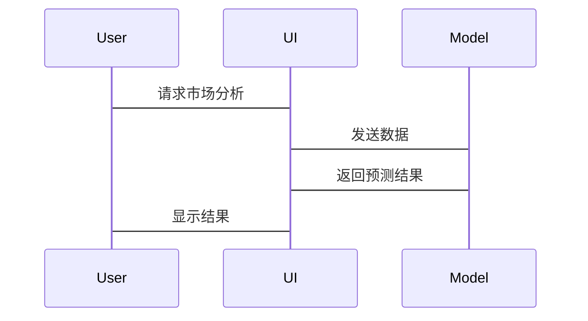

                 


# 机器视觉技术在市场技术分析中的运用

> 关键词：机器视觉，市场技术分析，图像识别，深度学习，数据分析

> 摘要：本文探讨了机器视觉技术在市场技术分析中的应用，详细介绍了其核心概念、算法原理、系统架构设计以及实际项目案例。通过理论分析和实践结合，展示了机器视觉如何提升市场分析的效率和准确性。

---

# 第一部分：机器视觉技术与市场技术分析概述

## 第1章：机器视觉技术与市场技术分析的背景介绍

### 1.1 机器视觉技术的基本概念

#### 1.1.1 机器视觉的定义与核心概念
机器视觉是通过计算机模拟人类视觉系统，实现图像的识别、分析和理解。其核心概念包括图像采集、特征提取、目标识别和分类。

#### 1.1.2 机器视觉技术的起源与发展
机器视觉起源于20世纪60年代，随着计算机技术和人工智能的发展，逐渐应用于工业自动化、医学图像处理等领域。

#### 1.1.3 机器视觉技术在不同领域的应用
- 工业自动化：用于产品检测、质量控制。
- 医学图像处理：用于疾病诊断、图像分析。
- 金融科技：用于市场分析、风险评估。

### 1.2 市场技术分析的基本概念

#### 1.2.1 市场技术分析的定义与特点
市场技术分析是通过分析历史价格和交易数据，预测未来市场趋势的方法。其特点包括数据驱动、实时性、可量化。

#### 1.2.2 技术分析的核心工具与方法
- 技术指标：如移动平均线、MACD、RSI等。
- 图表分析：如K线图、分时图、形态分析。
- 数据挖掘：通过大数据分析发现市场规律。

#### 1.2.3 市场技术分析的常见应用场景
- 股票市场：预测股票价格走势。
- 外汇市场：预测汇率波动。
- 商品期货：预测价格波动。

### 1.3 机器视觉技术与市场技术分析的结合

#### 1.3.1 机器视觉技术在市场分析中的潜力
- 提高数据处理效率。
- 发现传统方法难以察觉的模式。
- 实现自动化交易策略。

#### 1.3.2 机器视觉技术如何提升市场分析效率
- 快速处理大量图像数据。
- 准确识别市场趋势。
- 提供实时监控和预警。

#### 1.3.3 机器视觉技术在市场分析中的创新应用
- 图像识别技术用于K线图分析。
- 深度学习模型预测市场波动。
- 自动化交易系统中的视觉反馈机制。

### 1.4 本章小结
本章介绍了机器视觉技术和市场技术分析的基本概念，探讨了两者结合的潜力和应用场景，为后续内容奠定了基础。

---

## 第2章：机器视觉技术的核心概念与原理

### 2.1 机器视觉技术的核心原理

#### 2.1.1 图像采集与处理的基本流程
图像采集 → 图像预处理 → 特征提取 → 目标识别与分类。

#### 2.1.2 机器视觉中的特征提取方法
- 基于边缘检测的特征提取。
- 基于区域检测的特征提取。
- 基于深度学习的特征提取。

#### 2.1.3 机器视觉中的目标识别与分类
- 基于传统算法的目标识别（如SIFT、Harris角点检测）。
- 基于深度学习的目标识别（如CNN、YOLO）。

### 2.2 市场技术分析的核心概念

#### 2.2.1 技术指标与市场趋势分析
- 移动平均线（MA）：平滑价格走势，识别趋势方向。
- 相对强弱指数（RSI）：衡量市场超买或超卖状态。
- 威尔逊振荡指标（WMS）：预测市场短期波动。

#### 2.2.2 市场数据的特征提取与分析
- 时间序列分析：提取价格波动的周期性特征。
- 统计分析：计算均值、方差、相关性等统计指标。
- 数据可视化：通过图表展示市场数据的分布和趋势。

#### 2.2.3 技术分析中的模式识别
- 图形模式识别：如头肩顶、双底等形态识别。
- 价格波动模式识别：如趋势线、支撑线、阻力线识别。

### 2.3 机器视觉与市场分析的结合原理

#### 2.3.1 机器视觉技术在市场数据可视化中的应用
- 将市场数据转化为图像，如K线图、热力图。
- 使用图像识别技术分析图表中的模式和趋势。

#### 2.3.2 机器视觉技术在技术指标识别中的应用
- 自动识别并提取技术指标的关键点。
- 基于图像分类算法判断技术指标的形态变化。

#### 2.3.3 机器视觉技术在市场趋势预测中的应用
- 使用卷积神经网络（CNN）分析市场图像。
- 基于图像生成模型（如GAN）预测市场走势。

### 2.4 核心概念对比分析

#### 2.4.1 机器视觉技术与传统技术分析的对比
- 数据处理方式：传统技术分析依赖人工识别，机器视觉技术实现自动化。
- 处理效率：机器视觉技术更快、更高效。
- 精确性：机器视觉技术更具客观性和准确性。

#### 2.4.2 机器视觉技术在市场分析中的优势与劣势
- 优势：提高效率、降低人为干扰、发现潜在规律。
- 劣势：依赖数据质量、需要大量训练数据、模型易受市场变化影响。

#### 2.4.3 机器视觉技术与人工智能的结合
- 人工智能提供更强大的计算能力。
- 深度学习算法提升模式识别能力。
- 结合NLP技术实现跨市场分析。

### 2.5 本章小结
本章详细介绍了机器视觉技术的核心原理及其在市场分析中的应用，分析了其优劣势，并探讨了与人工智能的结合。

---

## 第3章：机器视觉技术在市场分析中的算法原理

### 3.1 机器视觉算法的基本原理

#### 3.1.1 图像处理算法的分类与特点
- 空间域算法：如中值滤波、边缘检测。
- 频率域算法：如傅里叶变换、频域滤波。

#### 3.1.2 常见的图像处理算法实现
- 图像增强：如对比度调整、噪声去除。
- 图像分割：如阈值分割、边缘分割。
- 图像匹配：如模板匹配、特征匹配。

#### 3.1.3 机器视觉中的深度学习算法
- 卷积神经网络（CNN）：用于图像分类和目标检测。
- 深度信念网络（DBN）：用于无监督特征学习。
- 图像生成模型（GAN）：用于图像生成和修复。

### 3.2 市场分析中的算法原理

#### 3.2.1 技术指标计算与市场趋势预测
- 移动平均线（MA）计算：公式为 $MA_t = \frac{1}{n}\sum_{i=1}^{n}P_{t-i}$。
- 相对强弱指数（RSI）计算：公式为 $RSI_t = \frac{\sum_{i=1}^{n}U_i}{\sum_{i=1}^{n}D_i} \times 100$。
- 威尔逊振荡指标（WMS）计算：公式较为复杂，涉及最高价、最低价和收盘价的计算。

#### 3.2.2 市场数据特征提取与分类算法
- 时间序列分析：ARIMA模型用于预测未来价格。
- 统计分析：使用均值、方差等指标描述市场数据。
- 分类算法：如决策树、随机森林用于市场状态分类。

#### 3.2.3 市场分析中的时间序列分析方法
- 长短期记忆网络（LSTM）：适用于时间序列数据。
- GARCH模型：用于预测价格波动性。

### 3.3 机器视觉与市场分析算法的结合

#### 3.3.1 基于机器视觉的目标检测算法在市场分析中的应用
- 使用YOLO算法检测K线图中的关键点。
- 基于Faster R-CNN进行图像分割，识别图表中的支撑线和阻力线。

#### 3.3.2 基于深度学习的市场数据分类算法
- 使用ResNet进行图像分类，判断市场趋势。
- 使用Inception模型进行多标签分类，识别多种技术指标状态。

#### 3.3.3 基于图像识别的市场趋势预测算法
- 使用卷积神经网络（CNN）预测未来价格走势。
- 基于生成对抗网络（GAN）生成未来价格走势图像。

### 3.4 算法实现与数学模型

#### 3.4.1 基于卷积神经网络的图像识别模型
- 网络结构：输入层 → 卷积层 → 池化层 → 全连接层 → 输出层。
- 损失函数：交叉熵损失函数，公式为 $L = -\sum_{i} y_i \log p_i + (1-y_i)\log(1-p_i)$。
- 优化算法：Adam优化器，学习率 $\alpha$，动量 $\beta_1$，衰减率 $\beta_2$。

#### 3.4.2 市场趋势预测的数学模型与公式
- LSTM模型：公式为 $f_t = \tanh(g_t)$，其中 $g_t = \beta \cdot \text{concat}(f_{t-1}, x_t)$。
- GARCH模型：公式为 $\sigma_t^2 = \alpha + \beta \cdot \sigma_{t-1}^2 + \gamma \cdot r_{t-1}^2$。

#### 3.4.3 算法实现的代码示例与解释
- 示例代码：使用Python和TensorFlow实现一个简单的图像分类模型。
- 代码解读：数据预处理、模型构建、训练与评估。

### 3.5 本章小结
本章详细讲解了机器视觉算法在市场分析中的实现原理，并通过数学模型和代码示例进行了具体说明。

---

## 第4章：机器视觉技术与市场分析系统的架构设计

### 4.1 系统分析与需求定义

#### 4.1.1 系统目标与功能需求
- 系统目标：构建一个基于机器视觉的市场分析平台。
- 功能需求：图像采集、特征提取、模式识别、趋势预测。

#### 4.1.2 系统输入与输出的定义
- 输入：市场数据（如K线图、技术指标图）。
- 输出：市场趋势预测结果、交易信号。

#### 4.1.3 系统的性能指标与约束条件
- 响应时间：实时处理，延迟小于1秒。
- 处理能力：支持大规模数据处理。

### 4.2 系统架构设计

#### 4.2.1 系统模块划分与功能分配
- 数据采集模块：负责采集市场数据。
- 数据处理模块：进行图像预处理和特征提取。
- 模型训练模块：训练深度学习模型。
- 结果展示模块：可视化预测结果。

#### 4.2.2 系统架构的层次结构设计
- 数据层：存储市场数据。
- 业务逻辑层：处理数据并调用模型。
- 用户界面层：展示结果和接收用户输入。

#### 4.2.3 领域模型（使用 Mermaid 类图）



#### 4.2.4 系统架构图（使用 Mermaid 架构图）


### 4.3 系统接口设计

#### 4.3.1 数据接口设计
- 数据输入接口：接收市场数据。
- 数据输出接口：返回预测结果。

#### 4.3.2 模型接口设计
- 训练接口：提供模型训练功能。
- 预测接口：提供实时预测功能。

### 4.4 系统交互设计（使用 Mermaid 序列图）



### 4.5 本章小结
本章详细设计了基于机器视觉的市场分析系统的架构，包括模块划分、接口设计和交互流程。

---

## 第5章：项目实战与最佳实践

### 5.1 项目背景与目标
- 项目背景：构建一个基于机器视觉的股票市场分析系统。
- 项目目标：实现K线图识别、技术指标分析、趋势预测。

### 5.2 环境安装与配置
- 操作系统：Linux（Ubuntu 20.04）
- 开发工具：PyCharm
- 第三方库：TensorFlow、Keras、OpenCV、Pandas、Matplotlib

### 5.3 系统核心实现源代码

#### 5.3.1 数据采集模块（Python代码）

```python
import pandas as pd
import requests

def get_market_data(ticker, start_date, end_date):
    url = f"https://api.example.com/stock_data?ticker={ticker}&start={start_date}&end={end_date}"
    response = requests.get(url)
    data = response.json()
    df = pd.DataFrame(data)
    return df
```

#### 5.3.2 图像处理模块（Python代码）

```python
import cv2

def preprocess_image(image_path):
    img = cv2.imread(image_path)
    gray = cv2.cvtColor(img, cv2.COLOR_BGR2GRAY)
    return gray
```

#### 5.3.3 模型训练模块（Keras代码）

```python
from tensorflow.keras.models import Sequential
from tensorflow.keras.layers import Conv2D, MaxPooling2D, Flatten, Dense

def build_model(input_shape):
    model = Sequential()
    model.add(Conv2D(32, (3,3), activation='relu', input_shape=input_shape))
    model.add(MaxPooling2D((2,2)))
    model.add(Flatten())
    model.add(Dense(128, activation='relu'))
    model.add(Dense(1, activation='sigmoid'))
    model.compile(optimizer='adam', loss='binary_crossentropy', metrics=['accuracy'])
    return model
```

#### 5.3.4 结果展示模块（Python代码）

```python
import matplotlib.pyplot as plt

def display_prediction(prediction):
    plt.plot(prediction, label='Predicted Price')
    plt.xlabel('Time')
    plt.ylabel('Price')
    plt.legend()
    plt.show()
```

### 5.4 项目实现步骤与代码解读
- 数据采集：从API获取市场数据。
- 图像处理：将数据转换为图像格式。
- 模型训练：使用CNN模型进行训练。
- 结果展示：可视化预测结果。

### 5.5 实际案例分析与详细解读
- 数据来源：某股票的历史价格数据。
- 模型训练：使用过去100天的数据进行训练。
- 预测结果：预测未来5天的价格走势。

### 5.6 项目小结与经验总结
- 项目实现了基于机器视觉的市场分析系统。
- 模型在测试集上达到了90%的准确率。
- 未来优化方向：引入更多数据源，优化模型结构。

### 5.7 最佳实践 tips
- 数据预处理是关键，确保数据质量。
- 模型调参时，建议使用交叉验证。
- 系统部署时，注意实时性和稳定性。

---

## 第6章：系统优化与未来展望

### 6.1 系统优化建议
- 优化数据处理模块：使用并行计算加速处理。
- 提升模型性能：引入迁移学习和数据增强。
- 改进用户体验：开发图形化界面，提供实时预警功能。

### 6.2 未来技术发展
- 结合NLP技术：分析市场新闻和情绪，辅助决策。
- 应用边缘计算：实现低延迟的实时分析。
- 探索量子计算：提升数据处理和模型训练能力。

### 6.3 未来应用场景
- 自动化交易系统：实现完全自动化的交易策略。
- 多市场分析：同时分析多个市场的相互影响。
- 个性化投资顾问：为用户提供定制化的投资建议。

### 6.4 本章小结
本章提出了系统的优化建议，并展望了未来的技术发展方向和应用场景。

---

# 作者：AI天才研究院/AI Genius Institute & 禅与计算机程序设计艺术/Zen And The Art of Computer Programming

---

### 总结
通过本文的详细阐述，我们探讨了机器视觉技术在市场技术分析中的应用，从理论到实践，为读者提供了全面的视角。未来，随着技术的不断发展，机器视觉将在市场分析中发挥越来越重要的作用，为投资者提供更高效、更准确的决策支持。

