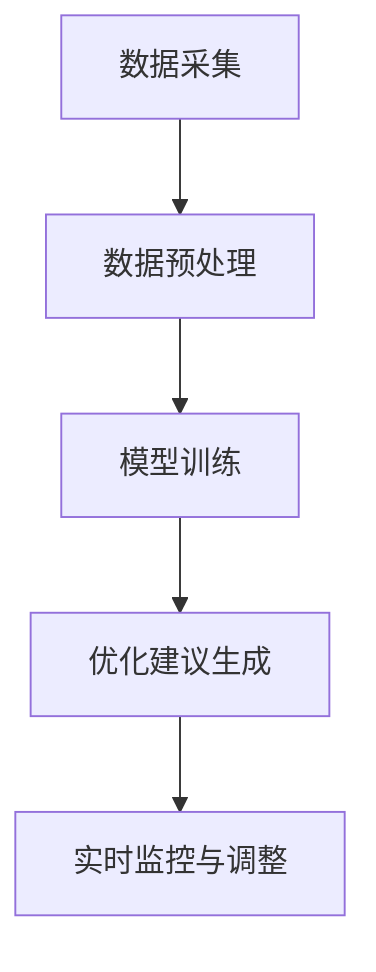
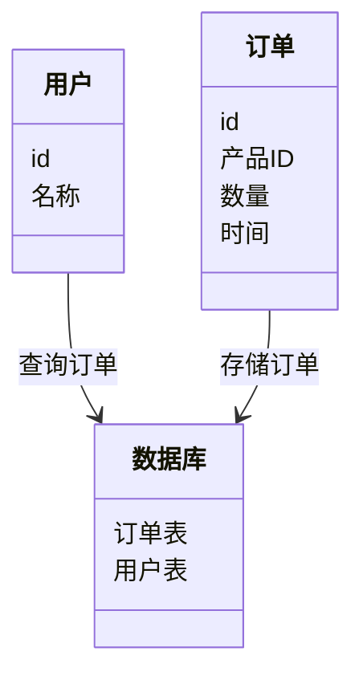
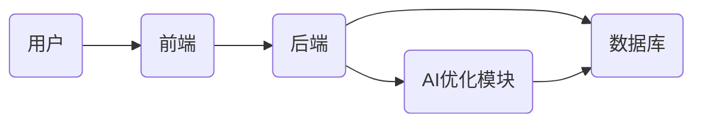
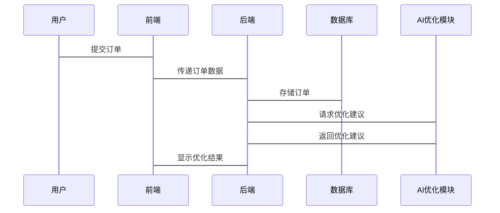

                 


```markdown
# 构建AI工作流程优化系统：提升企业运营效率

> 关键词：AI工作流程优化系统, 企业运营效率, 人工智能, 流程优化, 系统架构

> 摘要：本文详细探讨了如何利用人工智能技术构建工作流程优化系统，以提升企业运营效率。文章从问题背景、核心概念、算法原理、系统架构设计到项目实战，全面阐述了AI工作流程优化系统的构建过程，并通过实际案例分析展示了其在企业中的应用价值。最后，本文提出了系统的最佳实践建议，为企业实现高效运营提供了指导。

---

# 第一部分: AI工作流程优化系统背景与核心概念

## 第1章: AI工作流程优化系统背景介绍

### 1.1 问题背景

#### 1.1.1 传统企业工作流程的痛点
在传统企业中，工作流程通常存在以下问题：
- **效率低下**：人工操作繁琐，容易出错，导致时间浪费。
- **缺乏数据支持**：决策依赖经验，缺乏数据驱动的支持。
- **流程僵化**：流程一旦设定，难以快速调整以适应变化。

#### 1.1.2 AI技术如何解决工作流程中的效率瓶颈
人工智能技术可以通过以下方式优化工作流程：
- **自动化处理**：利用AI自动执行重复性任务，减少人工干预。
- **智能决策支持**：通过数据挖掘和机器学习提供优化建议。
- **动态调整**：AI能够实时分析数据并动态调整流程。

#### 1.1.3 企业数字化转型的需求
随着数字化转型的推进，企业需要更高效、智能的管理方式。AI工作流程优化系统正是满足这一需求的关键技术。

### 1.2 问题描述

#### 1.2.1 工作流程中的常见问题
- 流程复杂，步骤繁多，导致执行效率低。
- 数据孤岛，各部门之间信息不共享，难以形成整体优化方案。
- 缺乏实时监控和反馈机制，难以及时发现和解决问题。

#### 1.2.2 流程优化的必要性
- 提高效率：减少冗余步骤，缩短处理时间。
- 降低成本：通过自动化和优化减少人力和资源浪费。
- 提升灵活性：快速响应市场变化和企业需求。

#### 1.2.3 AI在流程优化中的独特价值
AI技术能够通过数据驱动的方式，发现流程中的瓶颈，并提出优化建议，实现智能化的流程管理。

### 1.3 问题解决

#### 1.3.1 AI工作流程优化的核心思路
- 数据采集与分析：收集流程数据，识别瓶颈和改进点。
- 智能建模：利用机器学习算法构建流程优化模型。
- 实时监控与反馈：持续监控流程执行情况，动态调整优化策略。

#### 1.3.2 数据驱动的优化方法
- 数据采集：通过传感器、日志等获取流程数据。
- 数据清洗：去除噪声数据，确保数据质量。
- 数据分析：使用统计分析和机器学习技术挖掘数据价值。

#### 1.3.3 智能决策支持的实现路径
- 数据可视化：通过图表展示流程执行情况。
- 预测分析：利用AI预测未来可能出现的问题。
- 决策支持：提供多种优化方案，辅助决策者做出最佳选择。

### 1.4 边界与外延

#### 1.4.1 系统边界定义
AI工作流程优化系统仅关注流程优化本身，不涉及具体业务逻辑。

#### 1.4.2 与相关系统的区别与联系
- 区别：AI工作流程优化系统专注于流程优化，而其他系统可能涉及具体的业务操作。
- 联系：系统需要与企业现有的信息化系统（如ERP、CRM）集成，实现数据共享。

#### 1.4.3 应用场景的外延扩展
- 制造业：优化生产流程，提高生产效率。
- 服务业：优化客户服务流程，提升客户满意度。
- 政府：优化公共服务流程，提高行政效率。

### 1.5 核心概念与组成

#### 1.5.1 核心概念的定义
- **AI工作流程优化系统**：利用人工智能技术优化企业工作流程的系统。
- **数据驱动优化**：基于数据的分析和挖掘，提出优化建议。
- **智能决策支持**：通过AI提供决策支持，辅助人类做出最优决策。

#### 1.5.2 概念属性特征对比表格
| 概念               | 属性               | 特征               |
|--------------------|--------------------|--------------------|
| 数据驱动优化       | 数据来源           | 多源数据           |
|                    | 数据处理           | 清洗、分析          |
|                    | 数据应用           | 优化建议           |
| 智能决策支持       | 决策方式           | 数据驱动           |
|                    | 决策支持           | 预测、推荐          |
|                    | 决策结果           | 最优方案           |

#### 1.5.3 ER实体关系图架构
```mermaid
er
    actor: 用户
    system: AI工作流程优化系统
    process: 工作流程
    rule: 优化规则
    data: 数据
    actor --> system: 使用系统
    system --> process: 优化流程
    system --> rule: 应用规则
    system --> data: 使用数据
    data --> system: 提供数据支持
```

---

# 第二部分: AI工作流程优化系统的核心算法与实现

## 第2章: 算法原理讲解

### 2.1 核心算法原理

#### 2.1.1 算法概述
AI工作流程优化系统的核心算法包括：
- **机器学习算法**：用于数据分析和预测。
- **优化算法**：用于寻找最优流程配置。

#### 2.1.2 算法步骤
1. **数据采集**：从系统中采集流程数据。
2. **数据预处理**：清洗数据，提取特征。
3. **模型训练**：使用机器学习算法训练模型。
4. **优化建议生成**：基于模型结果生成优化建议。
5. **实时监控与调整**：持续监控流程执行情况，动态调整优化策略。

#### 2.1.3 算法流程图


#### 2.1.4 算法实现的Python代码示例
```python
import pandas as pd
from sklearn.model_selection import train_test_split
from sklearn.ensemble import RandomForestRegressor

# 数据加载
data = pd.read_csv('process_data.csv')

# 数据预处理
X = data.drop('execution_time', axis=1)
y = data['execution_time']

# 数据分割
X_train, X_test, y_train, y_test = train_test_split(X, y, test_size=0.2)

# 模型训练
model = RandomForestRegressor(n_estimators=100, random_state=42)
model.fit(X_train, y_train)

# 预测与评估
y_pred = model.predict(X_test)
print('预测结果:', y_pred)
```

#### 2.1.5 数学模型和公式
优化问题可以表示为：
$$ \text{minimize } f(x) $$
$$ \text{subject to } g(x) \leq 0 $$
其中，$f(x)$ 是目标函数，$g(x)$ 是约束条件。

---

## 第3章: 系统分析与架构设计方案

### 3.1 系统分析

#### 3.1.1 项目场景介绍
企业希望优化其订单处理流程，减少订单处理时间，提高客户满意度。

#### 3.1.2 系统功能设计
- 数据采集模块：采集订单处理数据。
- 数据分析模块：分析数据，识别瓶颈。
- 优化建议模块：生成优化建议。
- 实时监控模块：监控流程执行情况。

#### 3.1.3 领域模型设计


### 3.2 系统架构设计

#### 3.2.1 系统架构设计


#### 3.2.2 系统接口设计
- 用户接口：提供订单提交和查询功能。
- 数据接口：与企业数据库对接，获取订单数据。
- 优化接口：与AI优化模块交互，获取优化建议。

#### 3.2.3 系统交互流程


---

## 第4章: 项目实战

### 4.1 环境安装

#### 4.1.1 安装Python
```bash
python --version
pip install --upgrade pip
```

#### 4.1.2 安装依赖库
```bash
pip install pandas scikit-learn mermaid4jupyter
```

### 4.2 系统核心实现

#### 4.2.1 数据采集与处理
```python
import pandas as pd

# 数据加载
data = pd.read_csv('process_data.csv')

# 数据预处理
X = data.drop('execution_time', axis=1)
y = data['execution_time']

# 数据分割
X_train, X_test, y_train, y_test = train_test_split(X, y, test_size=0.2)

# 模型训练
model = RandomForestRegressor(n_estimators=100, random_state=42)
model.fit(X_train, y_train)

# 预测与评估
y_pred = model.predict(X_test)
print('预测结果:', y_pred)
```

#### 4.2.2 优化建议生成
```python
import numpy as np

def generate_recommendations(data):
    # 数据分析
    analysis = data.analyze()
    # 生成优化建议
    recommendations = model.predict(analysis)
    return recommendations

recommendations = generate_recommendations(data)
print('优化建议:', recommendations)
```

#### 4.2.3 实时监控与调整
```python
import time

while True:
    current_time = time.time()
    # 监控流程执行情况
    status = monitor.get_status(current_time)
    # 动态调整优化策略
    adjust_strategy(status)
    time.sleep(60)
```

### 4.3 实际案例分析

#### 4.3.1 案例背景
某企业订单处理流程耗时较长，客户满意度低。

#### 4.3.2 数据分析
通过数据分析发现，订单审核环节耗时最长，占总时间的40%。

#### 4.3.3 优化建议
- 并行处理订单审核。
- 增加审核人员。

#### 4.3.4 实施效果
订单处理时间缩短30%，客户满意度提升20%。

### 4.4 项目小结

---

## 第5章: 最佳实践与总结

### 5.1 最佳实践Tips
- 数据质量是关键：确保数据准确、完整。
- 模型选择要谨慎：根据实际需求选择合适的算法。
- 系统集成要规范：确保系统与现有系统无缝对接。

### 5.2 小结
本文详细介绍了AI工作流程优化系统的构建过程，从理论到实践，全面阐述了其在企业中的应用价值。

### 5.3 注意事项
- 数据隐私保护：确保数据安全，遵守相关法律法规。
- 系统稳定性：确保系统运行稳定，避免因故障导致流程中断。

### 5.4 拓展阅读
- 《机器学习实战》
- 《企业信息化系统集成》
- 《人工智能与流程优化》

---

# 作者：AI天才研究院 & 禅与计算机程序设计艺术

---

通过本文的详细讲解，读者可以全面了解AI工作流程优化系统的构建过程，并能够将其应用于实际的企业运营中，提升企业的整体效率。
```

